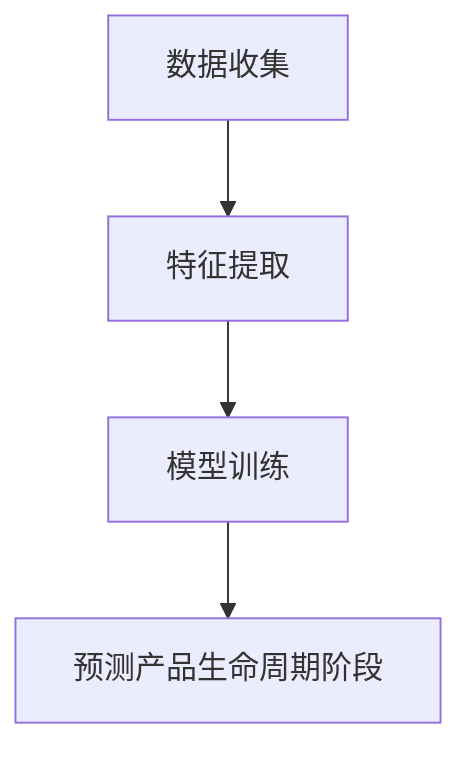
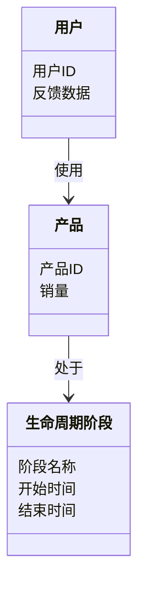

                 


# 费雪的产品生命周期分析：快速迭代时代的新思路

## 关键词：产品生命周期、快速迭代、数据分析、机器学习、系统架构、项目实战

## 摘要

在现代商业环境中，产品生命周期管理至关重要，特别是在快速迭代的时代。本文深入探讨费雪的产品生命周期分析方法，结合数据分析和机器学习技术，提出适应快速变化的新思路。文章涵盖产品生命周期的四个阶段、分析框架、算法原理、系统架构设计、项目实战及最佳实践，帮助读者全面理解和应用这些方法。

---

## 第一部分：产品生命周期概述

### 第1章：产品生命周期的基本概念

#### 1.1 产品生命周期的定义与重要性

产品生命周期（Product Life Cycle，PLC）指产品从引入市场到最终退出市场的全过程。快速迭代时代要求企业更高效地管理每个阶段，以适应市场变化。

#### 1.2 产品生命周期的四个阶段

- **引入期（Introduction）**：产品首次进入市场，目标是建立品牌认知。
- **成长期（Growth）**：销量增长迅速，市场占有率提升。
- **成熟期（Maturity）**：市场竞争激烈，销量稳定。
- **衰退期（Decline）**：销量下降，产品逐渐退出市场。

---

## 第二部分：产品生命周期分析的核心概念

### 第2章：产品生命周期分析的框架

#### 2.1 核心概念与联系

- **核心概念**：产品、市场、生命周期阶段、用户需求。
- **联系**：市场需求和竞争环境影响各阶段的策略调整。

#### 2.2 产品生命周期分析的ER实体关系图

```mermaid
er
  actor: 用户
  product: 产品
  lifecycle_stage: 生命周期阶段
  market: 市场
  relation1: 用户 -> 使用 产品
  relation2: 产品 -> 处于 lifecycle_stage
  relation3: 市场 -> 影响 lifecycle_stage
```

---

## 第三部分：产品生命周期分析的算法原理

### 第3章：基于机器学习的产品生命周期预测

#### 3.1 算法原理

- **数据收集与特征提取**：收集销售数据、用户反馈、市场趋势等。
- **模型训练**：使用决策树等算法训练模型。
- **生命周期阶段预测**：预测产品当前阶段，指导企业策略调整。

#### 3.2 产品生命周期预测的流程图



#### 3.3 Python实现代码

```python
import pandas as pd
from sklearn.tree import DecisionTreeClassifier
from sklearn.model_selection import train_test_split

# 示例数据加载
data = pd.DataFrame({
    '销量': [100, 200, 150, 50],
    '用户反馈': [5, 4, 3, 2],
    '市场竞争': [2, 3, 4, 5],
    '生命周期阶段': ['引入期', '成长期', '成熟期', '衰退期']
})

# 特征与目标变量分离
X = data[['销量', '用户反馈', '市场竞争']]
y = data['生命周期阶段']

# 数据分割
X_train, X_test, y_train, y_test = train_test_split(X, y, test_size=0.2, random_state=42)

# 模型训练
model = DecisionTreeClassifier()
model.fit(X_train, y_train)

# 预测
predicted = model.predict(X_test)
print(predicted)
```

---

## 第四部分：系统架构与项目实战

### 第4章：系统架构设计

#### 4.1 系统功能设计

- **功能模块**：数据采集、特征提取、模型预测、结果可视化。
- **领域模型类图**



#### 4.2 系统架构设计

```mermaid
archi
    客户端 --> 中间件 : 请求
    中间件 --> 数据库 : 查询
    数据库 --> 分析模块 : 分析
    分析模块 --> 返回结果
```

#### 4.3 系统接口设计

- **API接口**：RESTful API，提供数据采集、特征提取、模型预测功能。

#### 4.4 系统交互流程图

```mermaid
sequence
    用户 --> 中间件 : 发送数据
    中间件 --> 数据库 : 存储数据
    中间件 --> 分析模块 : 分析数据
    分析模块 --> 中间件 : 返回结果
    中间件 --> 用户 : 显示结果
```

### 第5章：项目实战

#### 5.1 智能家居产品案例

- **环境安装**：安装Python、Pandas、Scikit-learn。
- **核心代码实现**

```python
from sklearn.ensemble import RandomForestClassifier

# 数据加载与预处理
data = pd.read_csv('productLifecycle.csv')
X = data.drop(columns=['生命周期阶段'])
y = data['生命周期阶段']

# 模型训练
model = RandomForestClassifier()
model.fit(X_train, y_train)

# 性能评估
print(model.score(X_test, y_test))
```

- **结果解读**：根据模型输出，智能家居产品处于成熟期，建议优化市场策略。

---

## 第五部分：最佳实践与总结

### 第6章：总结与建议

#### 6.1 小结

产品生命周期分析在快速迭代时代至关重要，结合数据分析和机器学习技术，企业能更精准地制定策略。

#### 6.2 注意事项

- 数据质量影响分析结果。
- 定期更新模型，适应市场变化。
- 组合使用多种分析方法。

#### 6.3 拓展阅读

- 推荐书籍：《敏捷开发：产品管理的艺术》。
- 推荐工具：Python的Scikit-learn、TensorFlow。

---

## 作者：AI天才研究院 & 禅与计算机程序设计艺术

---

通过以上步骤，我们逐步构建了从概念到实践的完整分析框架，帮助读者在快速迭代的时代有效应用产品生命周期分析方法。

