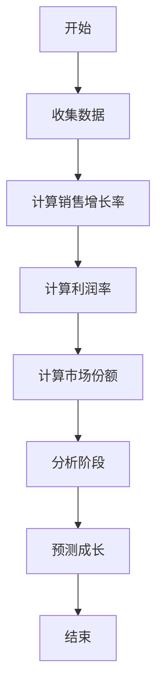
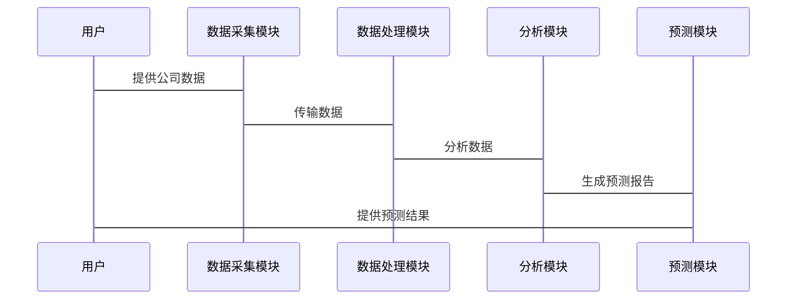

                 


# 费雪的产品生命周期分析：预测公司成长

## 关键词：费雪分析法、产品生命周期、公司成长预测、销售增长率、利润率、市场份额

## 摘要：费雪的产品生命周期分析是一种通过分析产品在其生命周期各阶段的表现，预测公司成长的有效方法。本文详细介绍了产品生命周期的四个阶段、费雪分析法的核心要素，包括销售增长率、利润率和市场份额，并通过数学模型和Python代码示例，展示了如何利用这些指标预测公司成长。文章还提供了系统架构设计和实际案例分析，帮助读者更好地理解和应用费雪分析法。

---

## 第一部分：产品生命周期分析基础

### 第1章：产品生命周期概述

#### 1.1 产品生命周期的定义与阶段划分

产品生命周期是指产品从进入市场到退出市场的整个过程。通常分为四个阶段：引入期、成长期、成熟期和衰退期。每个阶段具有不同的特征和挑战，影响公司的成长。

- **引入期**：产品刚进入市场，销售额低，增长潜力大，但利润可能为负。
- **成长期**：销售额快速增长，市场份额扩大，利润开始上升。
- **成熟期**：销售额稳定，增长放缓，利润稳定。
- **衰退期**：销售额下降，利润减少，公司可能需要转型或退出市场。

#### 1.2 费雪分析法的背景与意义

费雪分析法由Philip Fisher提出，专注于通过分析公司的产品生命周期来预测其成长潜力。该方法强调选择那些处于成长期且具备良好管理团队的公司。

---

## 第二部分：费雪分析法的核心概念

### 第2章：产品生命周期与公司成长的关系

#### 2.1 产品生命周期各阶段对公司的影响

- **引入期**：公司可能需要大量投资，但增长潜力大。
- **成长期**：公司销售额和利润快速增长，适合投资。
- **成熟期**：公司稳定，适合稳健投资者。
- **衰退期**：公司面临挑战，可能需要转型。

#### 2.2 费雪分析法的核心要素

- **销售增长率**：反映产品市场需求和公司扩张能力。
- **利润率**：衡量公司盈利能力和成本控制能力。
- **市场份额**：反映公司在行业中的竞争力。

---

### 第3章：费雪分析法的数学模型与算法

#### 3.1 销售增长率的计算公式

$$\text{销售增长率} = \frac{\text{当年销售额} - \text{前一年销售额}}{\text{前一年销售额}} \times 100\%$$

#### 3.2 利润率的计算公式

$$\text{利润率} = \frac{\text{净利润}}{\text{营业收入}} \times 100\%$$

#### 3.3 市场份额的计算公式

$$\text{市场份额} = \frac{\text{公司销售额}}{\text{行业总销售额}} \times 100\%$$

#### 3.4 费雪分析法的算法步骤

1. 收集公司过去几年的财务数据。
2. 计算销售增长率、利润率和市场份额。
3. 分析这些指标在产品生命周期各阶段的表现。
4. 预测公司的未来成长潜力。

#### 3.5 用mermaid绘制的算法流程图



#### 3.6 Python代码实现

```python
def calculate_growth_rate(current_sales, previous_sales):
    return ((current_sales - previous_sales) / previous_sales) * 100

def calculate_profitability(net_profit, revenue):
    return (net_profit / revenue) * 100

def calculate_market_share(company_sales, industry_sales):
    return (company_sales / industry_sales) * 100

# 示例数据
current_sales = 1000000
previous_sales = 800000
net_profit = 200000
revenue = 1000000
company_sales = 500000
industry_sales = 10000000

# 计算指标
growth_rate = calculate_growth_rate(current_sales, previous_sales)
profitability = calculate_profitability(net_profit, revenue)
market_share = calculate_market_share(company_sales, industry_sales)

print(f"销售增长率：{growth_rate}%")
print(f"利润率：{profitability}%")
print(f"市场份额：{market_share}%")
```

---

### 第4章：系统分析与架构设计

#### 4.1 系统功能设计

- 数据采集模块：收集公司财务数据和行业数据。
- 数据处理模块：计算销售增长率、利润率和市场份额。
- 分析模块：根据指标分析公司所处的产品生命周期阶段。
- 预测模块：基于分析结果预测公司成长潜力。

#### 4.2 系统架构图


#### 4.3 接口设计

- 数据输入接口：接收公司和行业的销售数据。
- 数据输出接口：提供分析结果和预测报告。

#### 4.4 系统交互流程图



---

## 第五部分：项目实战

### 第5章：项目实战与案例分析

#### 5.1 项目背景

假设我们有一个处于成长期的公司，需要预测其未来三年的成长潜力。

#### 5.2 环境安装

安装Python和必要的库（如pandas、numpy）。

#### 5.3 核心代码实现

```python
import pandas as pd

# 示例数据
data = {
    '年份': [2018, 2019, 2020, 2021],
    '销售额': [800000, 900000, 1000000, 1200000],
    '净利润': [150000, 180000, 200000, 240000],
    '行业总销售额': [5000000, 6000000, 7000000, 8000000]
}

df = pd.DataFrame(data)

# 计算销售增长率
df['销售增长率'] = df['销售额'].pct_change() * 100

# 计算利润率
df['利润率'] = df['净利润'] / df['销售额'] * 100

# 计算市场份额
df['市场份额'] = df['销售额'] / df['行业总销售额'] * 100

print(df)
```

#### 5.4 案例分析与结果解读

分析计算结果，预测公司未来三年的销售增长率和利润率，评估其在成长期的潜力。

#### 5.5 项目小结

通过实际案例，展示了如何应用费雪分析法预测公司成长。

---

## 第六部分：总结与展望

### 第6章：总结与展望

#### 6.1 最佳实践tips

- 数据准确性是关键，确保数据来源可靠。
- 定期更新数据，跟踪公司表现。
- 综合考虑其他因素，如行业趋势和竞争环境。

#### 6.2 小结

费雪分析法通过分析产品生命周期各阶段的销售增长率、利润率和市场份额，帮助投资者预测公司成长潜力。

#### 6.3 注意事项

- 该方法适用于成熟行业，新兴行业可能不适用。
- 需结合其他分析方法，如PE分析和SWOT分析，进行综合评估。

#### 6.4 拓展阅读

- 《Fisher's Investment Classic》
- 《The Analysis of Stock Investment Value》

---

## 作者：AI天才研究院/AI Genius Institute & 禅与计算机程序设计艺术 /Zen And The Art of Computer Programming

---

**注：** 由于篇幅限制，上述内容未完全展开，实际文章应包含更详细的解释和案例分析。

