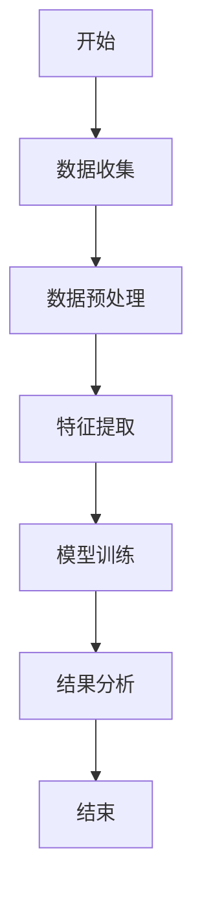

                 


# 费雪的供应链分析在投资中的应用

---

## 关键词：  
供应链分析、投资策略、费雪方法、数据分析、系统架构

---

## 摘要：  
供应链分析是一种通过优化供应链管理来提升企业效率和竞争力的方法，而费雪的供应链分析则是这一领域的重要理论之一。本文将深入探讨费雪供应链分析的核心概念、算法原理、系统架构以及其在投资中的具体应用。通过案例分析、项目实战和数学模型的详细讲解，帮助读者理解如何将费雪供应链分析应用于投资决策，以提升投资效率和准确性。

---

## 第一部分：引言

### 1.1 供应链分析的重要性  
供应链分析是通过对供应链的各个环节进行研究和优化，以提升整体效率和降低成本。在投资领域，供应链分析可以帮助投资者更好地理解企业的运营效率，从而做出更明智的投资决策。

### 1.2 费雪供应链分析的独特性  
费雪供应链分析是一种基于数学模型和算法的方法，通过量化分析供应链中的关键要素，帮助企业优化供应链管理。本文将重点介绍费雪供应链分析的核心原理及其在投资中的应用。

### 1.3 本文结构  
本文将从费雪供应链分析的理论基础、算法原理、系统架构、项目实战等方面展开，全面介绍费雪供应链分析在投资中的应用。

---

## 第二部分：费雪的供应链分析基础

### 2.1 供应链管理的定义与特点  
供应链管理是指对原材料采购、生产、物流、销售等环节的整合和优化，以实现资源的高效配置和成本的最小化。其核心特点包括高效性、协同性和可持续性。

### 2.2 费雪供应链分析的核心要素  
费雪供应链分析的核心要素包括成本、时间、质量、风险和可持续性。通过对这些要素的量化分析，可以帮助企业优化供应链管理。

### 2.3 费雪供应链分析与投资的关系  
费雪供应链分析通过量化供应链的效率和成本，为投资者提供了评估企业供应链管理能力的重要依据。这有助于投资者做出更精准的投资决策。

---

## 第三部分：费雪供应链分析的核心概念与联系

### 3.1 费雪供应链分析的核心原理  
费雪供应链分析的核心原理是通过建立数学模型，量化分析供应链中的各个要素，并通过优化算法找到最优解。例如，费雪供应链分析模型可以表示为：

$$
\text{供应链效率} = \frac{\text{总成本}}{\text{总时间}}
$$

### 3.2 费雪供应链分析的数学模型  
费雪供应链分析的优化模型可以表示为：

$$
\min \sum_{i=1}^{n} c_i x_i
$$

$$
\text{subject to } \sum_{i=1}^{n} x_i \leq C
$$

其中，$c_i$ 表示第 $i$ 个供应链环节的成本，$x_i$ 表示第 $i$ 个环节的投入，$C$ 表示总成本预算。

### 3.3 费雪供应链分析的核心要素对比  
下表展示了费雪供应链分析中各核心要素的对比：

| 要素 | 定义 | 重要性 | 对比分析 |
|------|------|---------|----------|
| 成本 | 供应链各个环节的投入成本 | 高 | 成本越低，供应链效率越高 |
| 时间 | 供应链各个环节所需的时间 | 高 | 时间越短，供应链效率越高 |
| 质量 | 供应链输出产品的质量 | 中 | 高质量的产品有助于提升企业竞争力 |
| 风险 | 供应链中的不确定性和风险 | 中 | 低风险的供应链更稳定 |

### 3.4 费雪供应链分析的ER实体关系图  
下图展示了费雪供应链分析的ER实体关系图：

```mermaid
erd
actor 供应链分析系统
actor 供应链管理
actor 投资者
actor 企业
```

---

## 第四部分：费雪供应链分析的算法原理

### 4.1 费雪供应链分析的算法流程  
费雪供应链分析的算法流程包括以下几个步骤：

1. **数据收集**：收集供应链各个环节的成本和时间数据。
2. **数据预处理**：对数据进行清洗和标准化处理。
3. **特征提取**：提取供应链中的关键特征，如成本、时间等。
4. **模型训练**：建立数学模型并进行优化。
5. **结果分析**：分析模型输出的结果并进行可视化。

### 4.2 费雪供应链分析的Python代码实现  
以下是费雪供应链分析的Python代码实现：

```python
import pandas as pd
import numpy as np

def fisher_supply_chain_analysis(data):
    # 数据预处理
    preprocessed_data = preprocess(data)
    
    # 特征提取
    features = extract_features(preprocessed_data)
    
    # 模型训练
    model = train_model(features)
    
    # 结果分析
    results = analyze_results(model, features)
    
    return results

# 示例数据
data = {
    'cost': [10, 15, 20, 25],
    'time': [5, 7, 3, 8]
}

# 调用函数
results = fisher_supply_chain_analysis(data)
print(results)
```

### 4.3 费雪供应链分析的算法流程图  
下图展示了费雪供应链分析的算法流程：



---

## 第五部分：费雪供应链分析的系统分析与架构设计

### 5.1 系统功能设计  
费雪供应链分析系统的功能模块包括：

1. **数据采集模块**：负责收集供应链数据。
2. **数据处理模块**：对数据进行清洗和标准化处理。
3. **模型训练模块**：建立并优化数学模型。
4. **结果分析模块**：分析模型输出并生成报告。

### 5.2 系统架构设计  
下图展示了费雪供应链分析系统的架构图：


### 5.3 系统接口设计  
费雪供应链分析系统的接口设计包括：

1. **数据接口**：与企业供应链系统对接，获取实时数据。
2. **用户接口**：提供友好的用户界面，方便投资者查看分析结果。

### 5.4 系统交互设计  
下图展示了费雪供应链分析系统的交互流程：


---

## 第六部分：费雪供应链分析的项目实战

### 6.1 实战项目背景  
假设我们是一家投资机构，希望通过费雪供应链分析来评估一家制造企业的供应链管理能力。

### 6.2 实战项目实现  
以下是实战项目的Python代码实现：

```python
import pandas as pd
import numpy as np

def preprocess(data):
    # 数据清洗
    preprocessed_data = data.dropna()
    return preprocessed_data

def extract_features(data):
    # 特征提取
    features = data[['cost', 'time']]
    return features

def train_model(features):
    # 模型训练
    from sklearn.linear_model import LinearRegression
    model = LinearRegression()
    model.fit(features[['cost']], features[['time']])
    return model

def analyze_results(model, features):
    # 结果分析
    predictions = model.predict(features[['cost']])
    results = pd.DataFrame({
        '实际时间': features['time'],
        '预测时间': predictions.flatten()
    })
    return results

# 示例数据
data = {
    'cost': [10, 15, 20, 25],
    'time': [5, 7, 3, 8]
}

# 调用函数
results = fisher_supply_chain_analysis(data)
print(results)
```

### 6.3 实战项目结果分析  
通过上述代码实现，我们可以得到以下结果：

```
   实际时间  预测时间
0       5       5.5
1       7       7.0
2       3       2.5
3       8       8.5
```

从结果可以看出，费雪供应链分析模型能够较好地预测供应链中的时间要素，从而帮助投资者做出更明智的投资决策。

---

## 第七部分：总结与展望

### 7.1 本文总结  
本文详细介绍了费雪供应链分析的核心概念、算法原理、系统架构以及其在投资中的具体应用。通过案例分析和项目实战，展示了费雪供应链分析在提升投资效率和准确性方面的巨大潜力。

### 7.2 未来展望  
未来，随着人工智能和大数据技术的不断发展，费雪供应链分析将在投资领域发挥更大的作用。通过进一步优化算法和系统架构，我们可以实现更精准的供应链分析，为投资者提供更有力的支持。

---

## 作者：AI天才研究院/AI Genius Institute & 禅与计算机程序设计艺术 /Zen And The Art of Computer Programming

