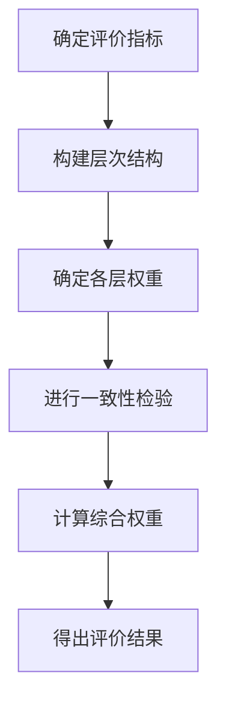
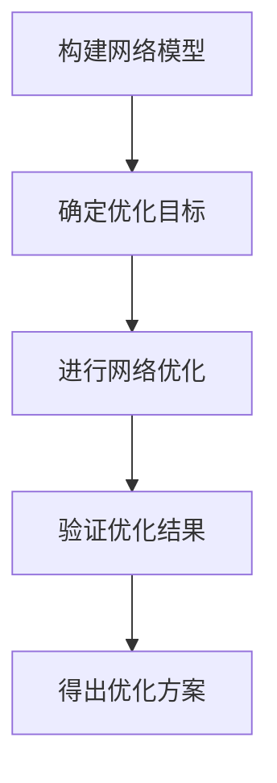

                 


---

# 费雪的供应链分析：了解公司在产业链中的地位

> 关键词：供应链分析，公司地位，产业链，费雪分析法，供应链优化，供应链系统设计

> 摘要：本文将详细探讨费雪的供应链分析方法，帮助读者了解公司在产业链中的地位。通过分析供应链的结构、关键绩效指标、算法原理、系统设计以及实际案例，我们将深入理解供应链优化的核心要素和实际应用。文章结合理论与实践，为读者提供系统化的供应链分析方法和工具。

---

# 第1章: 背景介绍

## 1.1 核心概念术语说明

### 1.1.1 供应链的定义与范围

供应链是指从原材料采购到最终产品交付给消费者的整个流程，包括供应商、制造商、分销商和消费者等多个环节。

### 1.1.2 费雪供应链分析法的定义

费雪供应链分析法是一种通过系统化的方法，帮助企业识别其在供应链中的位置，并优化供应链的整体效率和成本。

## 1.2 问题背景

### 1.2.1 供应链管理中的挑战

供应链管理涉及多个环节和参与者，复杂的协调和优化问题，例如库存积压、交货延迟等。

### 1.2.2 供应链分析的必要性

通过分析供应链，企业可以识别瓶颈、降低成本、提高效率，并增强供应链的弹性。

## 1.3 问题描述

### 1.3.1 什么是费雪供应链分析

费雪供应链分析是一种系统化的分析方法，旨在帮助企业在复杂的供应链中找到自身的位置，并优化供应链的整体表现。

### 1.3.2 供应链分析的目标

供应链分析的目标是通过优化供应链结构和流程，提高企业的竞争力和效率。

## 1.4 问题解决

### 1.4.1 费雪分析法的应用场景

费雪分析法适用于供应链优化、成本控制、效率提升等场景。

### 1.4.2 费雪分析法的优势

费雪分析法通过系统化的方法，能够帮助企业在复杂的供应链中找到优化点。

## 1.5 边界与外延

### 1.5.1 供应链分析的边界

供应链分析的边界包括从供应商到消费者的整个流程，但不涉及企业内部的具体生产过程。

### 1.5.2 供应链分析的外延

供应链分析的外延包括供应链优化、数字化转型、智能化管理等。

## 1.6 概念结构与核心要素组成

### 1.6.1 供应链的组成要素

1. 供应商
2. 制造商
3. 分销商
4. 消费者

### 1.6.2 供应链的核心要素

1. 信息流
2. 物流
3. 资金流

---

# 第2章: 核心概念与联系

## 2.1 核心概念原理

### 2.1.1 供应链的层次结构

供应链可以分为三个层次：采购层、生产层和销售层。

### 2.1.2 费雪分析法的原理

费雪分析法通过系统化的方法，分析供应链的各个环节，找到优化点。

## 2.2 概念属性特征对比表格

| 概念       | 特征         | 描述                                   |
|------------|--------------|--------------------------------------|
| 供应商     | 供应能力     | 供应商的生产能力、交货周期等           |
| 制造商     | 生产能力     | 制造商的生产效率、成本控制等           |
| 分销商     | 分销能力     | 分销商的销售网络、库存管理等           |
| 消费者     | 需求         | 消费者的需求量、需求变化等             |

## 2.3 ER实体关系图架构

```mermaid
erdiagram
actor 供应商 {
  key: 供应商ID
  attr: 供应商名称, 联系方式
}
actor 制造商 {
  key: 制造商ID
  attr: 制造商名称, 联系方式
}
actor 分销商 {
  key: 分销商ID
  attr: 分销商名称, 联系方式
}
actor 消费者 {
  key: 消费者ID
  attr: 消费者名称, 联系方式
}
```

---

# 第3章: 算法原理讲解

## 3.1 层次分析法（AHP）

### 3.1.1 层次分析法的定义

层次分析法是一种系统化的决策方法，适用于多目标决策问题。

### 3.1.2 层次分析法的步骤

1. 构建层次结构
2. 确定各层权重
3. 进行一致性检验
4. 计算综合权重

### 3.1.3 应用层次分析法进行供应链评价



### 3.1.4 层次分析法的数学公式

$$ A = \lambda_{max} \cdot A \cdot \text{一致性检验} $$

## 3.2 网络分析法

### 3.2.1 网络分析法的定义

网络分析法是一种通过分析网络结构来优化供应链的方法。

### 3.2.2 网络分析法的优化步骤

1. 构建供应链网络模型
2. 确定优化目标
3. 进行网络优化
4. 验证优化结果

### 3.2.3 应用网络分析法进行供应链优化



---

# 第4章: 系统分析与架构设计

## 4.1 系统功能设计

### 4.1.1 供应商信息管理系统

供应商信息管理系统用于管理供应商信息，包括供应商的生产能力、交货周期等。

### 4.1.2 生产过程监控系统

生产过程监控系统用于监控生产过程，包括生产效率、成本控制等。

### 4.1.3 分销网络分析系统

分销网络分析系统用于分析分销网络，包括分销商的销售网络、库存管理等。

## 4.2 系统架构设计

### 4.2.1 系统架构图


### 4.2.2 系统交互流程图


## 4.3 系统接口设计

### 4.3.1 供应商与制造商的接口

```plaintext
+---------------+     API     +---------------+
|  供应商       | <-------> | 制造商         |
+---------------+            +---------------+
```

### 4.3.2 制造商与分销商的接口

```plaintext
+---------------+     API     +---------------+
|  制造商       | <-------> | 分销商         |
+---------------+            +---------------+
```

### 4.3.3 分销商与消费者的接口

```plaintext
+---------------+     API     +---------------+
|  分销商       | <-------> | 消费者         |
+---------------+            +---------------+
```

---

# 第5章: 项目实战

## 5.1 环境安装

### 5.1.1 安装Python

```bash
python --version
pip install --upgrade pip
```

### 5.1.2 安装依赖库

```bash
pip install numpy
pip install pandas
pip install matplotlib
pip install pymermaid
```

## 5.2 核心实现源代码

### 5.2.1 层次分析法实现代码

```python
import numpy as np

def calculate_weights(matrix):
    # 计算权重向量
    pass

def consistency_check(matrix, weights):
    # 一致性检验
    pass

# 示例数据矩阵
matrix = np.array([[1, 2, 3],
                   [2, 1, 4],
                   [3, 4, 1]])

weights = calculate_weights(matrix)
is_consistent = consistency_check(matrix, weights)
print("一致性检验结果：", is_consistent)
```

### 5.2.2 网络分析法实现代码

```python
import networkx as nx

def optimize_network(matrix):
    # 网络优化算法
    pass

# 示例网络矩阵
matrix = np.array([[0, 1, 0],
                   [1, 0, 1],
                   [0, 1, 0]])

G = nx.from_matrix(matrix)
optimized_G = optimize_network(matrix)
nx.draw(optimized_G, with_labels=True)
plt.show()
```

## 5.3 代码应用解读与分析

### 5.3.1 层次分析法代码解读

```plaintext
# calculate_weights函数用于计算权重向量
# consistency_check函数用于进行一致性检验
```

### 5.3.2 网络分析法代码解读

```plaintext
# optimize_network函数用于优化网络结构
# 使用networkx库进行网络可视化
```

## 5.4 案例分析与详细讲解

### 5.4.1 案例背景

假设我们有一个包含供应商、制造商和分销商的供应链系统。

### 5.4.2 数据准备

```plaintext
# 示例数据矩阵表示各环节之间的关系
matrix = np.array([[0, 1, 0],
                   [0, 0, 1],
                   [0, 0, 0]])
```

### 5.4.3 代码实现

```python
import networkx as nx

def optimize_network(matrix):
    G = nx.from_matrix(matrix)
    return G

G = optimize_network(matrix)
nx.draw(G, with_labels=True)
plt.show()
```

### 5.4.4 结果解读

优化后的网络结构能够更高效地进行供应链管理。

---

# 第6章: 最佳实践

## 6.1 小结

通过本文的分析，我们了解了费雪供应链分析的核心概念和方法，并通过实际案例展示了如何应用这些方法进行供应链优化。

## 6.2 注意事项

1. 在进行供应链分析时，需要充分考虑各环节的实际情况。
2. 确保数据的准确性和完整性。
3. 在实际应用中，需要结合企业的具体需求进行调整。

## 6.3 拓展阅读

1. 《供应链管理：策略、实施与优化》
2. 《费雪供应链分析方法》

---

# 作者

作者：AI天才研究院/AI Genius Institute & 禅与计算机程序设计艺术 /Zen And The Art of Computer Programming

