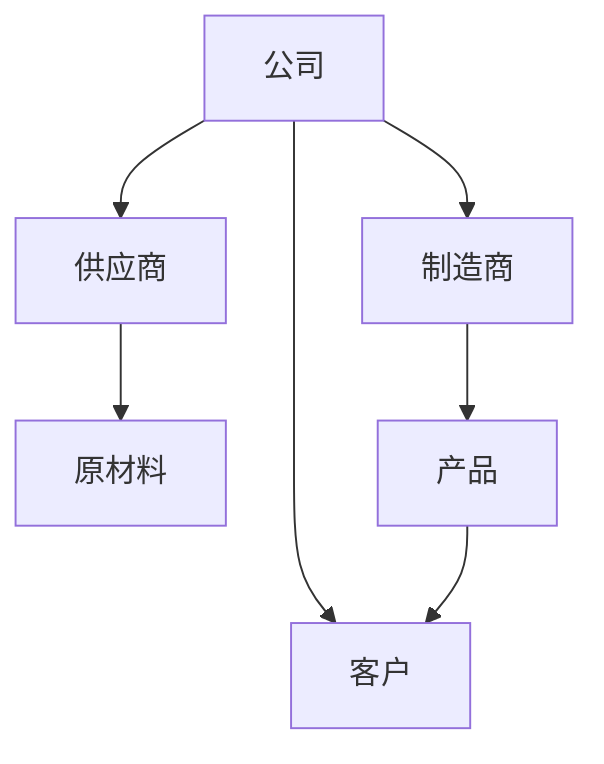
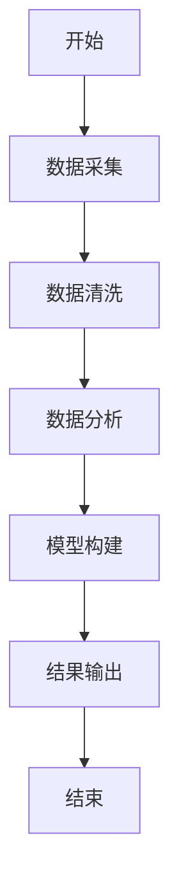
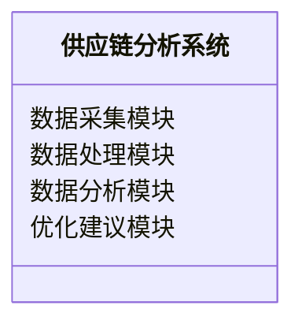
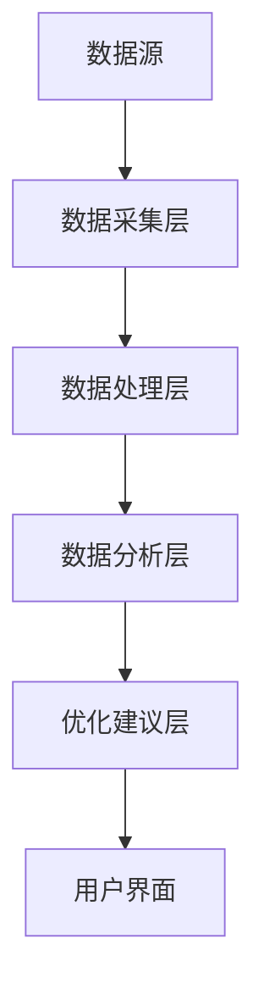
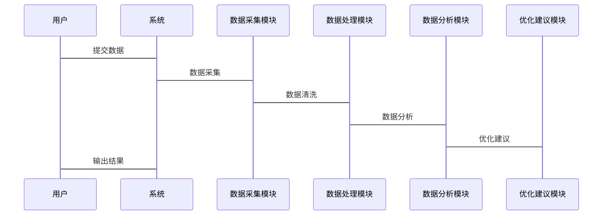

                 


# 费雪的供应链分析：了解公司的上下游

## 关键词：
供应链分析，费雪分析法，上下游关系，供应链优化，企业价值提升

## 摘要：
本文深入探讨费雪的供应链分析方法，从供应链的基本概念到其对企业的实际应用进行全面解析。通过详细分析供应链的核心要素、优化目标及上下游关系，结合数学模型和系统架构设计，为读者提供全面的理论指导和实践案例。本文旨在帮助读者理解如何通过费雪分析法提升企业供应链效率，优化企业价值。

---

# 第1章: 供应链分析的背景与概念

## 1.1 供应链的基本概念
### 1.1.1 供应链的定义与范围
供应链是指从原材料采购到最终产品交付给客户的一系列过程，涉及供应商、制造商、分销商、零售商和消费者等多个环节。供应链不仅包括物流和信息流，还包括资金流和价值流。其范围涵盖了从生产到交付的整个链条。

### 1.1.2 供应链的核心要素
供应链的核心要素包括：
1. **供应商**：提供原材料或服务的上游企业。
2. **制造商**：将原材料转化为产品的核心企业。
3. **分销商**：负责产品分发和物流的企业。
4. **零售商**：直接面向消费者的销售终端。
5. **消费者**：供应链的最终目标服务对象。

### 1.1.3 供应链的分类与特点
供应链可以根据不同的标准进行分类，常见的分类包括：
- **按行业**：制造型供应链、服务型供应链。
- **按复杂度**：简单供应链、复杂供应链。
- **按地理范围**：本地供应链、全球供应链。

供应链的特点包括高效性、协同性、动态性和可持续性。

---

## 1.2 费雪的供应链分析方法
### 1.2.1 费雪分析法的起源与发展
费雪分析法是由美国经济学家 Irving Fisher 提出的一种供应链分析方法，主要用于评估企业上下游的关系及其对整体供应链效率的影响。该方法通过量化分析，帮助企业识别供应链中的关键节点和瓶颈。

### 1.2.2 费雪分析法的核心思想
费雪分析法的核心思想是通过量化分析，评估供应链各环节的效率和成本，识别优化点。其核心步骤包括数据采集、数据分析和优化建议。

### 1.2.3 费雪分析法的应用领域
费雪分析法广泛应用于制造、零售、物流等多个行业，尤其适用于复杂供应链的优化和风险管理。

---

## 1.3 供应链分析的重要性
### 1.3.1 供应链分析对企业价值的影响
供应链分析可以帮助企业降低运营成本、提高效率、增强竞争力。

### 1.3.2 供应链分析对行业竞争的作用
通过供应链分析，企业可以识别行业趋势，制定更具竞争力的策略。

### 1.3.3 供应链分析对政策制定的意义
政府可以通过供应链分析制定更有效的产业政策，促进经济发展。

---

## 1.4 本章小结
本章介绍了供应链的基本概念、费雪分析法的核心思想及其应用领域。供应链分析在帮助企业优化运营、提升竞争力方面具有重要作用。

---

# 第2章: 供应链分析的核心概念与联系

## 2.1 核心概念原理
### 2.1.1 供应链的节点与流程
供应链的节点包括供应商、制造商、分销商和零售商。流程包括采购、生产、物流和销售。

### 2.1.2 供应链的驱动因素
供应链的驱动因素包括市场需求、成本、质量和交付时间。

### 2.1.3 供应链的优化目标
供应链的优化目标包括降低成本、提高效率、增强灵活性和可持续性。

---

## 2.2 核心概念对比分析
### 2.2.1 内部供应链与外部供应链对比
内部供应链是指企业内部的生产流程，外部供应链是指企业与供应商和客户的交互。

### 2.2.2 供应商与客户的关系分析
供应商与客户是供应链的两端，供应商提供原材料，客户购买最终产品。

### 2.2.3 产品流与资金流的关联
产品流是供应链的物理流动，资金流是供应链的资金流动。

---

## 2.3 供应链实体关系图


---

## 2.4 本章小结
本章详细讲解了供应链的核心概念及其相互关系，通过对比分析和实体关系图帮助读者更好地理解供应链的结构。

---

# 第3章: 费雪供应链分析法的算法原理

## 3.1 算法原理概述
### 3.1.1 费雪分析法的基本步骤
1. 数据采集：收集供应链各环节的数据。
2. 数据清洗：去除噪声数据。
3. 数据分析：计算各环节的成本和效率。
4. 模型构建：建立供应链优化模型。
5. 结果输出：提出优化建议。

### 3.1.2 数据采集与处理
数据采集可以通过ERP系统或API接口进行，数据清洗需要处理缺失值和异常值。

### 3.1.3 数据分析与建模
数据分析包括成本分析和效率分析，建模可以使用线性回归或网络流模型。

---

## 3.2 算法流程图


---

## 3.3 算法实现代码
```python
def fisher_supply_chain_analysis(data):
    # 数据清洗
    cleaned_data = data.dropna().replace({np.nan: 0})
    
    # 成本分析
    cost = cleaned_data['cost'].sum()
    
    # 效率分析
    efficiency = cleaned_data['efficiency'].mean()
    
    # 模型构建
    import numpy as np
    from sklearn.linear_model import LinearRegression
    model = LinearRegression()
    model.fit(cleaned_data[['cost', 'time']], cleaned_data['score'])
    
    return cost, efficiency, model
```

---

## 3.4 数学模型与公式
费雪分析法的数学模型包括成本函数和效率函数：
- 成本函数：$$C = \sum_{i=1}^{n} c_i$$，其中 $c_i$ 是第 $i$ 个环节的成本。
- 效率函数：$$E = \frac{\sum_{i=1}^{n} e_i}{n}$$，其中 $e_i$ 是第 $i$ 个环节的效率。

---

## 3.5 本章小结
本章详细讲解了费雪分析法的算法原理，包括数据处理、模型构建和结果输出，并通过代码和公式展示了其实现过程。

---

# 第4章: 供应链分析的系统架构设计

## 4.1 问题场景介绍
本文以某制造企业的供应链分析为例，设计一个基于费雪分析法的供应链优化系统。

---

## 4.2 系统功能设计
### 4.2.1 领域模型


---

## 4.3 系统架构设计


---

## 4.4 系统接口设计
系统接口包括数据接口（API）和用户接口（UI），数据接口用于与其他系统的数据交互，用户接口用于展示分析结果。

---

## 4.5 系统交互设计


---

## 4.6 本章小结
本章通过系统架构设计展示了如何将费雪分析法应用于实际场景，包括功能设计、架构设计和交互设计。

---

# 第5章: 项目实战

## 5.1 环境安装
安装Python和必要的库：
```bash
pip install numpy pandas scikit-learn mermaid4jupyter
```

---

## 5.2 核心代码实现
```python
import numpy as np
import pandas as pd
from sklearn.linear_model import LinearRegression
import matplotlib.pyplot as plt

# 数据加载
data = pd.read_csv('supply_chain.csv')

# 数据清洗
cleaned_data = data.dropna().replace({np.nan: 0})

# 成本分析
cost = cleaned_data['cost'].sum()
print(f"总成本: {cost}")

# 效率分析
efficiency = cleaned_data['efficiency'].mean()
print(f"平均效率: {efficiency}")

# 数据可视化
plt.figure(figsize=(10, 6))
plt.plot(cleaned_data['time'], cleaned_data['score'], 'ro')
plt.xlabel('时间')
plt.ylabel('得分')
plt.show()

# 模型构建
model = LinearRegression()
model.fit(cleaned_data[['cost', 'time']], cleaned_data['score'])

# 预测
new_data = pd.DataFrame({'cost': [100], 'time': [5]})
predicted_score = model.predict(new_data)
print(f"预测得分: {predicted_score}")
```

---

## 5.3 实际案例分析
以某制造企业的供应链分析为例，通过上述代码进行数据清洗、分析和预测，得出优化建议。

---

## 5.4 项目小结
本章通过实际案例展示了如何使用费雪分析法进行供应链优化，包括数据处理、分析和优化建议的全过程。

---

# 第6章: 最佳实践与小结

## 6.1 小结
费雪分析法是一种有效的供应链优化方法，通过数据采集、清洗、分析和建模，可以帮助企业降低运营成本、提高效率。

## 6.2 注意事项
- 数据质量是关键，需确保数据准确性和完整性。
- 模型选择需根据实际情况，避免过度复杂。

## 6.3 拓展阅读
建议进一步学习供应链管理的相关书籍和文献，如《供应链管理：战略、规划与运营》。

---

# 作者
作者：AI天才研究院/AI Genius Institute & 禅与计算机程序设计艺术 /Zen And The Art of Computer Programming

---

通过本文的详细讲解和实战案例，读者可以全面掌握费雪的供应链分析方法，并将其应用于实际工作中。

