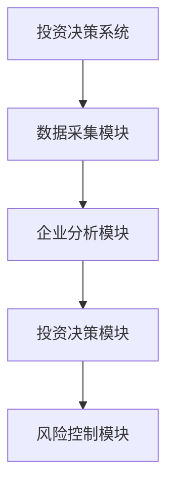
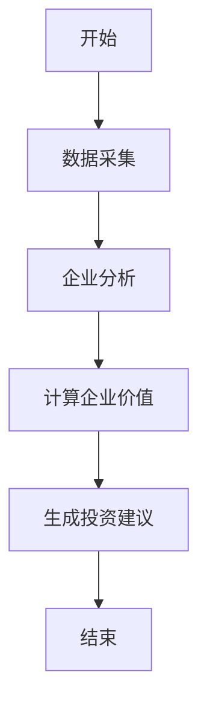

                 


# 费雪的全球化投资视角

> 关键词：费雪投资理念、全球化投资、系统分析、算法实现、项目实战

> 摘要：本文从费雪的投资理念出发，结合全球化背景，系统地分析了其投资策略的全球化视角。通过数学模型、算法实现、系统架构设计以及项目实战，深入探讨了费雪投资理论在现代投资环境中的应用。文章最后总结了全球化投资的策略与展望，并提出了投资实战中的注意事项与最佳实践。

---

## 第一部分: 全球化投资背景与费雪投资理念

### 第1章: 全球化投资的背景与重要性

#### 1.1 全球化投资的背景

##### 1.1.1 经济全球化的演进历程

经济全球化是20世纪末至21世纪初的重要经济现象，其核心是资本、技术、信息等生产要素的跨国流动。随着信息技术的发展，全球化进程加速，投资活动也随之跨越国界。费雪作为一位具有国际视野的投资专家，其理论在全球化背景下得到了新的发展。

##### 1.1.2 投资全球化的驱动因素

全球化投资的驱动因素包括技术进步、资本流动自由化、市场一体化以及企业国际化等。技术进步使得投资者能够更便捷地进行跨国投资，资本流动自由化降低了投资门槛，而市场一体化则为投资者提供了更广阔的投资机会。

##### 1.1.3 全球化对投资的影响

全球化使得投资市场的范围扩大，投资者可以跨越地域限制，寻找更优的投资机会。同时，全球化也带来了更多的风险，如汇率风险、政治风险等。费雪的投资理念在全球化背景下，强调了风险控制和市场选择的重要性。

#### 1.2 费雪投资理念的核心要素

##### 1.2.1 费雪投资理论的起源

费雪的投资理论起源于对市场行为和企业价值的深入研究。他强调长期投资和价值发现，认为投资的核心是寻找具有持续增长潜力的企业。

##### 1.2.2 费雪投资理念的核心观点

费雪的核心观点包括：

1. **长期投资**：投资不是短期交易，而是寻找具有长期增长潜力的企业。
2. **企业价值**：企业的内在价值是投资决策的核心，而非市场的短期波动。
3. **风险管理**：通过分散投资和选择优质企业，降低投资风险。

##### 1.2.3 费雪投资理念与现代投资理论的联系

费雪的投资理念与现代投资组合理论（MPT）有相似之处，尤其是在风险控制和资产配置方面。然而，费雪更强调个股选择，而现代投资理论更注重资产配置和分散化。

### 第2章: 费雪的全球化投资视角

#### 2.1 费雪投资理念的全球化扩展

##### 2.1.1 费雪投资理念的全球适用性

费雪的投资理念在不同国家和地区的市场中具有广泛的适用性。其核心是寻找具有持续增长潜力的企业，无论这些企业位于哪个国家。

##### 2.1.2 全球化背景下费雪理念的演变

随着全球化的深入，费雪的投资理念也在不断演变。他更加注重跨国公司的分析，尤其是那些具有全球竞争优势的企业。

##### 2.1.3 费雪理念在全球化投资中的优势

费雪理念的优势在于其长期性和价值导向。在全球化背景下，这种理念可以帮助投资者在全球范围内寻找优质企业，实现资产的最优配置。

#### 2.2 费雪投资策略的全球化应用

##### 2.2.1 费雪策略在全球化市场中的表现

费雪策略在跨国市场中的表现优异，尤其是在那些具有强大竞争优势和持续增长潜力的企业中。

##### 2.2.2 费雪策略在不同地区的适应性

费雪策略在不同地区的适应性取决于市场的成熟度和企业的竞争优势。在新兴市场，费雪策略需要结合当地市场的特点进行调整。

##### 2.2.3 费雪策略在全球化投资中的风险控制

通过分散投资和严格的风险管理，费雪策略在全球化投资中能够有效控制风险，确保投资的稳定性。

---

## 第二部分: 费雪投资策略的系统分析

### 第3章: 费雪投资策略的核心要素

#### 3.1 费雪投资策略的数学模型

##### 3.1.1 费雪模型的构建

费雪模型的核心是企业价值的评估，通过对企业未来现金流的折现来确定其内在价值。

##### 3.1.2 费雪模型的数学表达式

费雪模型的数学表达式如下：

$$ V = \frac{CF}{r - g} $$

其中：
- \( V \) 表示企业价值
- \( CF \) 表示未来现金流
- \( r \) 表示折现率
- \( g \) 表示现金流增长率

##### 3.1.3 费雪模型的变量与参数

- **现金流（CF）**：企业的未来现金流
- **折现率（r）**：基于风险的折现率
- **增长率（g）**：现金流的持续增长率

#### 3.2 费雪投资策略的系统架构

##### 3.2.1 系统功能设计

系统功能包括数据采集、企业分析、投资决策和风险控制。

##### 3.2.2 系统架构图（Mermaid）



##### 3.2.3 系统接口设计

系统接口包括数据输入、分析结果输出和投资建议生成。

### 第4章: 费雪投资策略的算法实现

#### 4.1 费雪投资策略的算法流程

##### 4.1.1 算法流程图（Mermaid）



##### 4.1.2 算法实现的Python代码

```python
def calculate_intrinsic_value(revenue, growth_rate, discount_rate):
    # 计算未来现金流
    CF = revenue * (1 + growth_rate)
    # 计算企业价值
    V = CF / (discount_rate - growth_rate)
    return V

# 示例计算
revenue = 1000000
growth_rate = 0.05
discount_rate = 0.10

intrinsic_value = calculate_intrinsic_value(revenue, growth_rate, discount_rate)
print(f"企业价值: {intrinsic_value}")
```

##### 4.1.3 算法实现的详细步骤

1. 数据采集：收集企业的财务数据，包括收入、增长率等。
2. 企业分析：计算未来现金流和折现率。
3. 计算企业价值：使用费雪模型公式计算企业价值。
4. 生成投资建议：基于企业价值和市场价值，提出投资建议。

#### 4.2 费雪投资策略的数学公式

##### 4.2.1 费雪模型的数学公式

$$ V = \frac{CF}{r - g} $$

其中：
- \( V \) 为企业的内在价值
- \( CF \) 为未来现金流
- \( r \) 为折现率
- \( g \) 为现金流增长率

---

## 第三部分: 全球化投资策略

### 第5章: 全球化投资策略

#### 5.1 跨国公司分析

##### 5.1.1 跨国公司的竞争优势

跨国公司的竞争优势包括规模经济、全球品牌影响力和技术优势。

##### 5.1.2 跨国公司评估模型

使用费雪模型对跨国公司进行评估，考虑其全球市场地位和竞争优势。

#### 5.2 投资风险管理

##### 5.2.1 全球化投资中的主要风险

全球化投资的主要风险包括汇率风险、政治风险和市场风险。

##### 5.2.2 风险管理策略

通过分散投资、使用金融衍生工具和风险评估模型来控制风险。

#### 5.3 投资组合的分散化

##### 5.3.1 分散化投资的重要性

分散化投资可以降低非系统性风险，提高投资组合的稳定性。

##### 5.3.2 全球化分散化策略

将投资组合分散到不同国家和行业，以降低整体风险。

---

## 第四部分: 数学模型与分析方法

### 第6章: 数学模型与分析方法

#### 6.1 资本资产定价模型（CAPM）

##### 6.1.1 CAPM的基本原理

CAPM用于计算资产的预期回报率，公式为：

$$ E(r) = r_f + \beta (r_m - r_f) $$

其中：
- \( E(r) \) 为资产的预期回报率
- \( r_f \) 为无风险利率
- \( \beta \) 为资产的贝塔系数
- \( r_m \) 为市场预期回报率

#### 6.2 现金流折现模型（DCF）

##### 6.2.1 DCF模型的基本原理

DCF模型通过折现未来现金流来评估企业价值，公式为：

$$ V = \sum_{t=1}^{n} \frac{CF_t}{(1 + r)^t} $$

其中：
- \( V \) 为企业价值
- \( CF_t \) 为第t年的现金流
- \( r \) 为折现率
- \( n \) 为现金流的期限

---

## 第五部分: 项目实战与总结

### 第7章: 项目实战

#### 7.1 环境安装

##### 7.1.1 安装Python和必要的库

安装Python和Pandas、NumPy等库，用于数据分析和计算。

#### 7.2 核心代码实现

##### 7.2.1 费雪模型的Python实现

```python
import pandas as pd
import numpy as np

def calculate_intrinsic_value(revenue, growth_rate, discount_rate):
    CF = revenue * (1 + growth_rate)
    V = CF / (discount_rate - growth_rate)
    return V

# 示例数据
data = {
    '公司': ['公司A', '公司B', '公司C'],
    '收入': [1000000, 1500000, 800000],
    '增长率': [0.05, 0.03, 0.07],
    '折现率': [0.10, 0.12, 0.08]
}

df = pd.DataFrame(data)
df['内在价值'] = df.apply(lambda x: calculate_intrinsic_value(x['收入'], x['增长率'], x['折现率']), axis=1)
print(df)
```

#### 7.3 案例分析与总结

##### 7.3.1 案例分析

以具体公司为例，分析其在全球化背景下的投资价值。

##### 7.3.2 总结

总结费雪投资理念在全球化投资中的应用，强调长期投资和风险控制的重要性。

### 第8章: 总结与展望

#### 8.1 费雪全球化投资策略的总结

费雪的投资理念在全球化背景下，强调了长期投资和价值发现，通过分散投资和严格的风险管理，实现投资的稳定增长。

#### 8.2 未来投资策略的展望

随着全球化的深入，未来投资策略将更加注重技术创新和可持续发展，投资者需要不断调整策略，以适应新的市场环境。

---

## 作者：AI天才研究院/AI Genius Institute & 禅与计算机程序设计艺术 /Zen And The Art of Computer Programming

