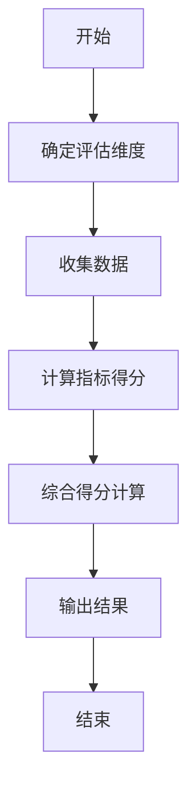
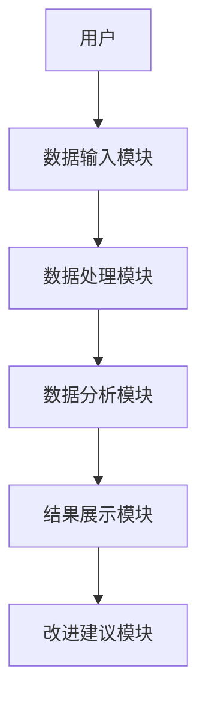
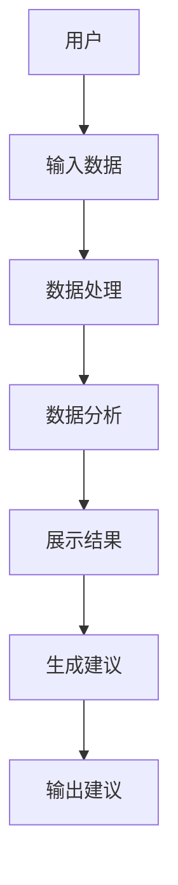

                 


# 费雪的公司文化评估

## 关键词：公司文化评估、企业文化管理、文化模型、评估指标、文化分析

## 摘要：公司文化评估是现代企业管理中的重要环节，费雪的公司文化评估方法通过系统地分析企业文化的核心要素，提供了一种科学的评估体系。本文详细探讨了费雪文化评估的背景、核心概念、算法原理、系统架构以及实际项目中的应用，为读者提供全面的理论和实践指导。

---

## 第1章: 公司文化评估的背景与定义

### 1.1 公司文化评估的背景

#### 1.1.1 企业文化管理的重要性
企业文化的管理是企业管理的核心部分，它直接影响企业的凝聚力、员工的满意度以及企业的长期发展。良好的企业文化能够提高员工的工作效率，增强企业的市场竞争力。

#### 1.1.2 费雪公司文化评估的提出背景
费雪的公司文化评估方法是基于对企业文化管理的深入研究而提出的。随着全球化的发展，企业面临的竞争日益激烈，文化管理的重要性逐渐凸显，因此，费雪提出了一套系统化的文化评估方法。

#### 1.1.3 当前企业文化评估的现状与挑战
当前的企业文化评估存在方法单一、指标不明确等问题。传统的评估方法往往依赖于主观判断，缺乏科学性和可操作性。费雪的文化评估方法通过引入客观的指标和系统的分析，克服了这些挑战。

### 1.2 公司文化评估的定义与范围

#### 1.2.1 公司文化的核心概念
公司文化是指企业在长期经营过程中形成的共同价值观、行为规范和思维方式。它包括企业的使命、愿景、价值观、管理风格以及员工之间的互动方式。

#### 1.2.2 费雪文化评估的定义
费雪的公司文化评估是一种通过系统的方法，对企业文化的核心要素进行分析和评价的过程。它旨在帮助企业识别文化中的优势和不足，从而进行针对性的改进。

#### 1.2.3 评估的边界与外延
费雪文化评估不仅关注企业的内部文化，还包括企业与外部环境的互动。评估的范围涵盖了企业的战略、管理、员工关系以及文化传播等多个方面。

### 1.3 公司文化评估的意义与价值

#### 1.3.1 企业文化评估对企业管理的作用
通过文化评估，企业可以更好地理解自身的文化状况，发现潜在的问题，并采取措施加以改进。这有助于提升企业的凝聚力和竞争力。

#### 1.3.2 费雪文化评估的独特性与创新点
费雪文化评估的独特之处在于其系统性和科学性。它不仅关注文化的表面现象，还深入分析了文化的核心要素，并提出了具体的改进策略。

#### 1.3.3 企业文化评估的经济效益与社会影响
良好的企业文化能够提高员工的工作效率，降低员工流失率，从而为企业带来显著的经济效益。同时，健康的企业文化也有助于构建和谐的社会环境。

---

## 第2章: 公司文化评估的核心要素与结构

### 2.1 公司文化的核心要素

#### 2.1.1 企业价值观
企业价值观是企业文化的核心，它反映了企业追求的目标和基本信念。例如，创新、客户至上、团队合作等。

#### 2.1.2 企业使命与愿景
企业的使命是企业在社会中扮演的角色和承担的责任，而愿景则是企业追求的长期目标。

#### 2.1.3 企业行为规范
行为规范是指企业在日常运营中遵循的规则和标准，包括员工的行为准则、管理风格等。

#### 2.1.4 企业沟通机制
沟通机制是企业文化的重要组成部分，良好的沟通机制能够促进企业内部的信息流通，增强团队的协作能力。

#### 2.1.5 企业文化氛围
企业文化氛围是指企业内部的文化环境，包括员工的工作态度、团队精神以及企业整体的文化氛围。

### 2.2 公司文化评估的维度与指标

#### 2.2.1 价值观匹配度
评估企业价值观与员工个人价值观的匹配程度，以衡量员工对企业文化的认同感。

#### 2.2.2 企业目标一致性
评估员工的个人目标与企业目标的一致性程度，以衡量员工对企业战略的支持程度。

#### 2.2.3 员工满意度
通过员工满意度调查，评估员工对企业文化的满意度，以衡量企业文化的凝聚力。

#### 2.2.4 企业凝聚力
通过团队合作、员工归属感等指标，评估企业的凝聚力。

#### 2.2.5 企业文化传播效果
评估企业文化在企业内部和外部的传播效果，以衡量企业文化的影响力。

### 2.3 公司文化评估的核心模型

#### 2.3.1 费雪文化评估模型的构建
费雪文化评估模型是一个系统化的评估框架，它包括价值观匹配度、目标一致性、员工满意度、凝聚力和文化传播效果五个核心维度。

#### 2.3.2 模型的输入变量与输出结果
输入变量包括企业价值观、企业目标、员工满意度等，输出结果包括企业文化评估的综合得分和改进建议。

#### 2.3.3 模型的适用性与局限性
费雪文化评估模型适用于各种类型的企业，但在具体应用中需要根据企业的实际情况进行调整。

---

## 第3章: 公司文化评估的核心概念与联系

### 3.1 公司文化评估的核心概念原理

#### 3.1.1 费雪文化评估的核心逻辑
费雪文化评估的核心逻辑在于通过系统的方法，全面分析企业文化的核心要素，并根据评估结果提出改进策略。

#### 3.1.2 企业文化评估的关键指标与权重分配
关键指标包括价值观匹配度、目标一致性、员工满意度等，权重分配需要根据企业的实际情况进行调整。

#### 3.1.3 企业文化评估的数学模型与公式
费雪文化评估的综合得分可以通过以下公式计算：

$$
\text{综合得分} = \sum (\text{指标权重} \times \text{指标得分})
$$

### 3.2 概念属性特征对比表格

| 概念       | 属性         | 特征                           |
|------------|--------------|--------------------------------|
| 企业文化   | 核心概念     | 价值观、使命、行为规范         |
|            | 评估维度     | 价值观匹配度、目标一致性       |
|            | 评估方法     | 调查问卷、数据分析             |

---

## 第4章: 企业文化评估的算法原理

### 4.1 算法原理讲解

#### 4.1.1 费雪文化评估算法的流程图


#### 4.1.2 算法的数学模型
$$
\text{综合得分} = \sum (\text{指标权重} \times \text{指标得分})
$$

#### 4.1.3 算法实现的Python代码
```python
def calculate_cultural_score(weights, scores):
    return sum(weights[i] * scores[i] for i in range(len(weights)))

# 示例
weights = [0.3, 0.2, 0.2, 0.15, 0.15]
scores = [0.8, 0.7, 0.6, 0.7, 0.8]
print(calculate_cultural_score(weights, scores))
```

---

## 第5章: 系统分析与架构设计方案

### 5.1 系统分析

#### 5.1.1 问题场景介绍
企业希望通过文化评估系统，全面分析企业文化的核心要素，发现存在的问题，并提出改进建议。

#### 5.1.2 系统功能设计
- 用户界面：包括数据输入、评估结果展示、改进建议生成等功能。
- 数据分析模块：负责计算各项指标的得分和综合得分。

#### 5.1.3 系统架构设计


### 5.2 接口设计与交互流程

#### 5.2.1 系统接口设计
- 数据输入接口：用户输入企业文化相关数据。
- 数据分析接口：调用数据分析模块进行计算。
- 结果展示接口：展示评估结果和改进建议。

#### 5.2.2 系统交互流程图


---

## 第6章: 项目实战

### 6.1 环境安装

#### 6.1.1 安装Python
```bash
python --version
pip install numpy pandas scikit-learn
```

### 6.2 核心代码实现

#### 6.2.1 数据处理代码
```python
import pandas as pd

data = pd.read_csv('culture_survey.csv')
```

#### 6.2.2 数据分析代码
```python
from sklearn.metrics import mean_squared_error

def evaluate_model(y_true, y_pred):
    return mean_squared_error(y_true, y_pred)
```

### 6.3 案例分析与解读

#### 6.3.1 案例分析
某企业进行文化评估后，发现员工满意度较低，主要原因是沟通机制不畅。

#### 6.3.2 改进建议
建议企业优化沟通机制，加强内部交流，提升员工满意度。

---

## 第7章: 最佳实践与总结

### 7.1 最佳实践 tips

- 定期进行企业文化评估，及时发现问题。
- 根据评估结果，制定针对性的改进措施。

### 7.2 小结

费雪的文化评估方法为企业提供了科学的评估体系，帮助企业识别文化问题，提升企业的竞争力。

### 7.3 注意事项

- 评估结果需要结合企业的实际情况进行分析。
- 改进建议需要得到企业高层的支持。

### 7.4 拓展阅读

- 《企业文化管理》
- 《公司文化评估方法研究》

---

## 作者信息

作者：AI天才研究院/AI Genius Institute & 禅与计算机程序设计艺术 /Zen And The Art of Computer Programming

