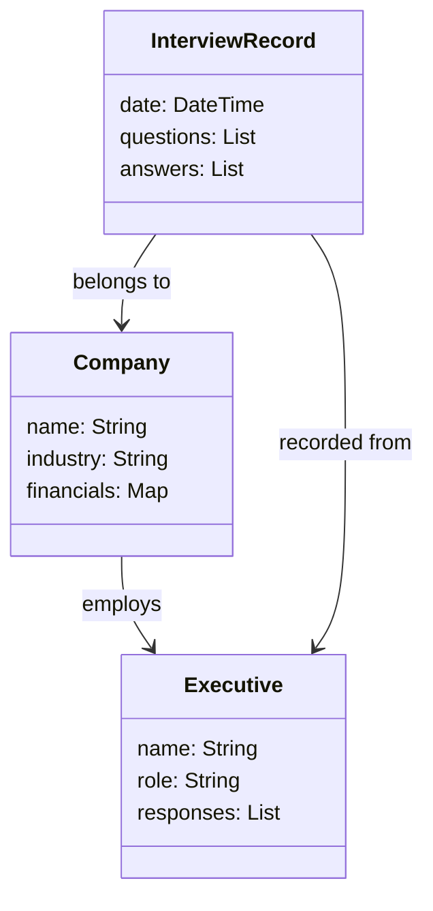
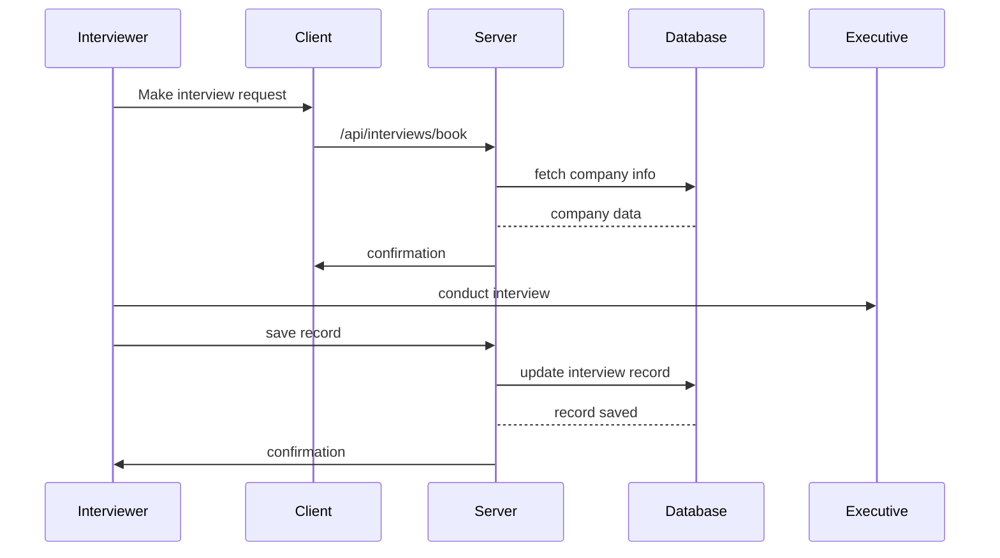

                 


# 费雪的公司访谈技巧

> 关键词：费雪投资方法、公司访谈技巧、投资分析、提问策略、非语言沟通、信任建立

> 摘要：本文深入探讨了费雪投资方法中的公司访谈技巧，分析了其核心概念、实施策略和实际应用，结合具体的背景介绍、算法原理和系统架构，提供了丰富的实战案例和最佳实践建议。

---

## 第一部分: 费雪投资方法的背景

### 第1章: 公司访谈的定义与背景

#### 1.1 公司访谈的定义
##### 1.1.1 公司访谈的定义与范围
公司访谈是投资者与公司高管或关键员工进行的面对面交流，旨在深入了解公司的财务状况、经营策略和市场前景。

##### 1.1.2 公司访谈的目的与意义
通过公司访谈，投资者可以验证财务数据的真实性，评估管理层的能力和诚信，发现潜在的风险和机会。

##### 1.1.3 公司访谈的核心要素
- **信息获取**：通过提问和倾听获取关键信息。
- **信任建立**：通过沟通技巧与受访者建立信任关系。
- **分析能力**：将获取的信息转化为投资决策依据。

#### 1.2 费雪投资方法的背景
##### 1.2.1 费雪投资方法的起源
彼得·费雪是巴菲特的导师，他的投资方法强调通过深入研究和访谈来评估公司的内在价值。

##### 1.2.2 费雪方法的核心理念
费雪认为，投资成功的关键在于找到那些具有强大竞争优势和优秀管理层的公司。

##### 1.2.3 费雪方法在现代投资中的应用
尽管时代变化，费雪的方法依然有效，尤其是在科技和数据分析领域，公司访谈依然是重要的评估手段。

---

## 第二部分: 公司访谈的核心技巧

### 第2章: 提问策略与技巧

#### 2.1 提问策略与技巧
##### 2.1.1 开放式问题与封闭式问题
- **开放式问题**：如“您如何评估公司的未来增长？”
- **封闭式问题**：如“公司在未来三年的计划是什么？”

##### 2.1.2 如何设计引导性问题
引导性问题旨在引导受访者展开讨论，例如：“您认为公司最大的竞争优势是什么？”

##### 2.1.3 提问中的逻辑与结构
提问应围绕公司财务、经营、市场和管理层能力展开，确保逻辑清晰。

#### 2.2 非语言沟通技巧
##### 2.2.1 身体语言的重要性
注意受访者的肢体语言，如眼神、手势和坐姿，判断其情绪和态度。

##### 2.2.2 面部表情与情绪识别
通过面部表情识别受访者的诚实度和情绪变化。

##### 2.2.3 声音语调的运用
注意声音的高低、速度和音调，判断受访者的自信程度和情绪状态。

#### 2.3 建立信任与 rapport 的技巧
##### 2.3.1 如何快速建立信任
通过尊重和理解建立信任，例如先倾听而非急于提问。

##### 2.3.2 情境中的同理心运用
站在受访者的角度思考，展现同理心。

##### 2.3.3 专业性与亲和力的平衡
在专业性与亲和力之间找到平衡，建立良好的沟通氛围。

---

### 第3章: 公司访谈的准备与计划

#### 3.1 访谈前的准备工作
##### 3.1.1 资料收集与研究
收集公司的财务报表、行业报告和竞争对手分析。

##### 3.1.2 访谈目标的设定
明确访谈的目标，例如评估公司财务状况或了解管理层战略。

##### 3.1.3 访谈计划的制定
制定详细的访谈计划，包括时间安排和问题清单。

#### 3.2 访谈提纲的设计
##### 3.2.1 核心问题的筛选
选择能够揭示公司核心竞争力和潜在风险的问题。

##### 3.2.2 问题的优先级排序
根据重要性排序问题，确保关键问题优先提出。

##### 3.2.3 备用问题的准备
准备备用问题以应对受访者的意外回答。

#### 3.3 访谈环境的选择与优化
##### 3.3.1 环境对访谈效果的影响
选择安静、私密的环境，避免干扰。

##### 3.3.2 如何选择合适的访谈地点
选择中立或公司内部的地点，根据情况决定。

##### 3.3.3 访谈环境的布置技巧
确保环境舒适，避免让受访者感到压力。

---

### 第4章: 公司访谈的实施与技巧

#### 4.1 访谈过程中的倾听技巧
##### 4.1.1 主动倾听与反馈
通过点头、眼神交流和简短反馈确认理解。

##### 4.1.2 如何捕捉关键信息
专注于核心问题，抓住受访者的重点回答。

##### 4.1.3 处理干扰与打断的技巧
礼貌地打断无关话题，保持访谈焦点。

#### 4.2 访谈中的反馈与确认
##### 4.2.1 反馈的及时性与准确性
及时反馈，确认理解正确。

##### 4.2.2 如何确认信息的准确性
通过重复和追问确认信息的真实性。

##### 4.2.3 处理歧义的技巧
当出现歧义时，重新提问或寻求澄清。

#### 4.3 访谈中的压力管理
##### 4.3.1 应对紧张情绪的方法
深呼吸、保持冷静，展现专业性。

##### 4.3.2 保持冷静与专注的技巧
集中注意力，避免分心。

##### 4.3.3 应对突发情况的策略
提前准备应急预案，灵活应对突发情况。

---

### 第5章: 公司访谈的分析与总结

#### 5.1 访谈记录的整理与分析
##### 5.1.1 记录的分类与整理
将记录按主题分类，便于后续分析。

##### 5.1.2 关键信息的提取与归纳
识别和提取关键信息，形成分析报告。

##### 5.1.3 信息的交叉验证
通过多个来源验证信息的准确性。

#### 5.2 访谈结果的评估与应用
##### 5.2.1 评估访谈的有效性
根据获取的信息量和质量评估访谈效果。

##### 5.2.2 访谈结果的应用场景
将结果应用于投资决策，如评估公司价值或调整投资策略。

##### 5.2.3 结果对决策的影响
基于访谈结果，调整投资组合或重新评估投资目标。

---

## 第三部分: 费雪投资方法的系统架构

### 第6章: 系统分析与架构设计

#### 6.1 问题场景介绍
公司访谈作为投资决策的关键环节，需要系统化的架构支持。

#### 6.2 系统功能设计
##### 6.2.1 领域模型设计
- **实体**：公司、高管、访谈记录。
- **关系**：公司与高管的关系，访谈记录与问题的关系。

##### 6.2.2 mermaid类图


#### 6.3 系统架构设计
##### 6.3.1 mermaid架构图


#### 6.4 系统接口设计
##### 6.4.1 访谈预约接口
- **API**: `/api/interviews/book`
- **Input**: companyID, executiveID, datetime
- **Output**: confirmation status

##### 6.4.2 访谈记录接口
- **API**: `/api/interviews/record`
- **Input**: interviewID, questions, answers
- **Output**: saved record status

#### 6.5 系统交互设计
##### 6.5.1 mermaid序列图


---

## 第四部分: 项目实战与最佳实践

### 第7章: 项目实战与经验总结

#### 7.1 环境安装与配置
##### 7.1.1 工具安装
- 安装必要的开发工具，如Postman、Git、Docker。

##### 7.1.2 系统配置
- 配置本地开发环境，确保API接口正常运行。

#### 7.2 核心实现与代码解读
##### 7.2.1 访谈预约功能实现
```python
from datetime import datetime

def book_interview(company_id, executive_id, datetime):
    # 验证输入参数
    if not company_id or not executive_id or not datetime:
        return "Missing parameters"
    # 检查时间冲突
    if check_conflict(company_id, datetime):
        return "Time conflict"
    # 记录预约
    record = {
        "company_id": company_id,
        "executive_id": executive_id,
        "datetime": datetime
    }
    save_record(record)
    return "Interview booked successfully"
```

##### 7.2.2 访谈记录管理
```python
def save_interview_record(interview_id, questions, answers):
    record = {
        "interview_id": interview_id,
        "questions": questions,
        "answers": answers
    }
    # 保存到数据库
    db.save(record)
    return "Record saved"
```

#### 7.3 案例分析与解读
##### 7.3.1 案例背景
某科技公司计划投资一家初创企业，通过公司访谈评估其市场潜力和团队能力。

##### 7.3.2 访谈过程
- **提问**：公司未来两年的计划是什么？
- **回答**：我们计划推出新产品并扩展市场份额。

##### 7.3.3 分析结果
通过访谈确认公司具有明确的战略目标和执行力，投资潜力较大。

#### 7.4 最佳实践与注意事项
##### 7.4.1 访谈前的准备
- 提前研究公司背景，制定详细的问题清单。

##### 7.4.2 访谈中的技巧
- 保持专注，灵活应对突发情况。

##### 7.4.3 访谈后的总结
- 及时整理记录，评估访谈效果。

---

## 第五部分: 结语与拓展阅读

### 第8章: 结语与拓展阅读

#### 8.1 结语
公司访谈是费雪投资方法中的重要环节，通过有效的提问和倾听，投资者可以做出更明智的决策。

#### 8.2 拓展阅读
建议进一步阅读《彼得·费雪的投资哲学》和《如何有效进行公司访谈》等书籍，深入理解投资分析的精髓。

#### 8.3 注意事项
- **持续学习**：投资环境不断变化，需持续更新知识和技巧。
- **风险控制**：即使通过访谈获取信息，仍需结合其他分析方法。

---

## 作者信息

作者：AI天才研究院/AI Genius Institute & 禅与计算机程序设计艺术 /Zen And The Art of Computer Programming

---

这篇文章系统地介绍了费雪的公司访谈技巧，从背景介绍到实际应用，结合了技术细节和实战案例，为投资者提供了深入的指导和实用建议。

