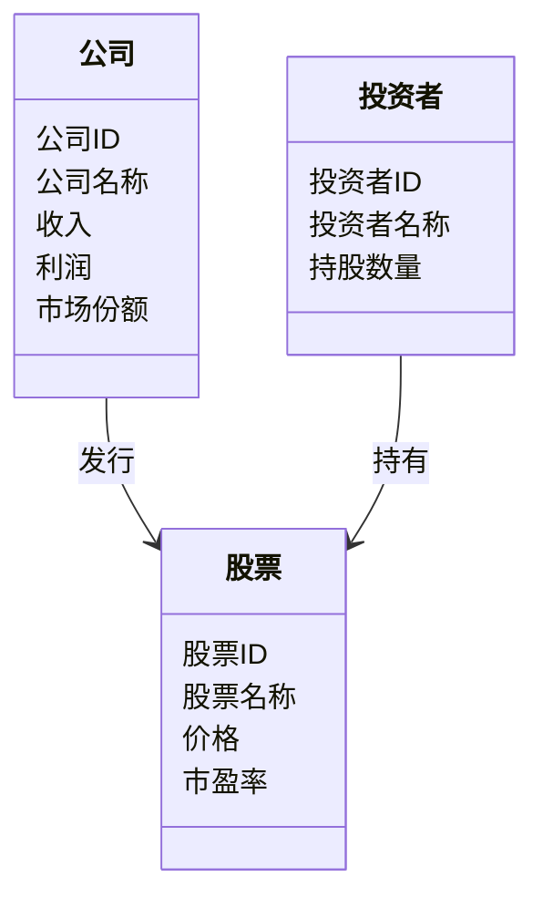
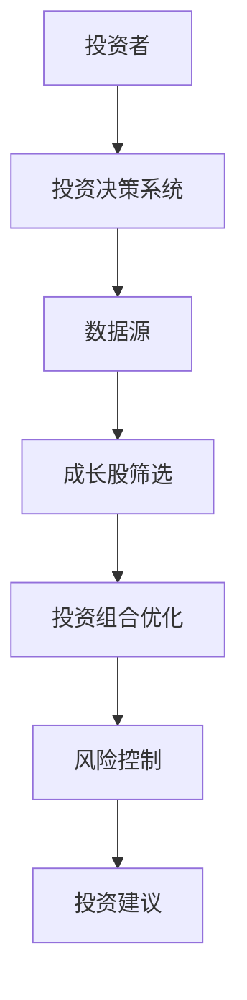

                 


# 费雪的创新企业投资法则

> **关键词**：费雪、成长股、投资法则、数学模型、系统架构、Python实现、投资策略

> **摘要**：本文详细探讨了菲利普·费雪的投资理念，特别是其在成长股投资方面的创新法则。通过分析其核心概念、数学模型、系统架构和实战案例，展示了如何将这些理论应用于实际投资中，帮助投资者做出更明智的投资决策。

---

## 第1章：背景介绍

### 1.1 费雪的生平简介

菲利普·费雪（Philip Fisher）是20世纪著名的投资大师之一，被誉为“成长股投资之父”。他于1907年出生在美国加利福尼亚州，毕业于加州大学伯克利分校。费雪在投资领域有着辉煌的成就，他的投资理念对现代投资理论产生了深远影响。

#### 1.1.1 费雪的早年经历

费雪早年在父亲的影响下对投资产生了浓厚兴趣。他的父亲是一位成功的商人，也是一位投资者，常常与费雪讨论投资策略。费雪在大学期间就开始研究股票市场，尤其是成长股的投资机会。

#### 1.1.2 费雪的投资生涯

费雪的职业生涯始于1930年代，当时他开始管理自己的投资组合，并逐渐积累了丰富的投资经验。他在1949年出版的《成长股投资》一书中首次系统地阐述了他的投资理念。

#### 1.1.3 费雪的投资哲学与成就

费雪的投资哲学以“长期投资”为核心，他坚信选择优质企业进行长期投资，而非频繁交易，是实现财富增长的关键。他的投资策略在实践中取得了显著的成功，尤其是在成长股投资方面。

---

### 1.2 费雪投资理念的核心思想

费雪的投资理念以“成长股”为核心，他强调选择那些具备持续增长潜力的企业进行投资。他的投资理念主要包括以下几点：

#### 1.2.1 长期投资与价值发现

费雪认为，投资的本质是通过研究企业的基本面，发现那些具有长期增长潜力的企业，并长期持有这些股票。他强调，投资者应该关注企业的内在价值，而不是短期市场波动。

#### 1.2.2 成长股的定义

成长股是指那些收入和利润持续增长的企业股票。这些企业在市场上具有竞争优势，能够不断扩大市场份额，提高盈利能力。

#### 1.2.3 费雪投资理念的现代意义

尽管费雪的投资理念提出于20世纪，但其核心思想在今天仍然具有重要的现实意义。特别是在当前数字化时代，成长股的概念和投资策略仍然适用于那些在新兴技术领域具有竞争优势的企业。

---

## 第2章：成长股投资的核心要素

### 2.1 成长股的定义与特征

#### 2.1.1 成长股的定义

成长股是指那些收入和利润持续增长的企业股票。这些企业通常处于成长期，具有较高的市场增长率和潜在的盈利能力。

#### 2.1.2 成长股的核心特征对比表

| 特征            | 成长股                  | 非成长股                |
|-----------------|-------------------------|--------------------------|
| 收入增长率       | 高                     | 低或负                  |
| 利润增长率       | 高                     | 低或负                  |
| 市场占有率       | 高                     | 低或持平                |
| 竞争优势         | 明显                   | 无或有限                |

#### 2.1.3 成长股的ER实体关系图

```mermaid
erDiagram
    公司 :id 公司ID, name 公司名称, revenue 收入, profit 利润, market_share 市场份额
    股票 :id 股票ID, name 股票名称, price 价格, 市盈率 市盈率
    投资者 :id 投资者ID, name 投资者名称, 持股数量 持股数量
    公司 --> 股票 : 发行
    投资者 --> 股票 : 持有
```

---

### 2.2 费雪的成长股筛选标准

#### 2.2.1 盈利能力分析

盈利能力是筛选成长股的重要指标之一。费雪认为，具有持续盈利能力的企业更有可能成为成长股。

#### 2.2.2 管理层能力评估

费雪强调，企业的管理层能力是决定企业能否持续成长的关键因素之一。他建议投资者选择那些由优秀管理层领导的企业。

#### 2.2.3 行业地位与竞争优势

成长股通常处于具有较高增长潜力的行业，并且在行业内具有竞争优势。例如，在技术行业，具有创新能力和竞争优势的企业更有可能成为成长股。

---

## 第3章：成长股投资的数学模型

### 3.1 成长股评估的数学模型

#### 3.1.1 费雪成长股评估公式

费雪提出了一个简单的数学模型来评估企业的成长潜力。该模型基于企业的收入增长率和利润增长率。

$$ 成长潜力 = \frac{收入增长率 + 利润增长率}{2} $$

其中，收入增长率和利润增长率的计算公式分别为：

$$ 收入增长率 = \frac{当前收入 - 上期收入}{上期收入} \times 100\% $$

$$ 利润增长率 = \frac{当前利润 - 上期利润}{上期利润} \times 100\% $$

#### 3.1.2 费雪模型的数学推导

假设某企业在过去三年的收入和利润分别为：

- 第一年收入：100万元
- 第二年收入：120万元
- 第三年收入：144万元

- 第一年利润：20万元
- 第二年利润：24万元
- 第三年利润：28.8万元

根据上述公式，计算收入增长率和利润增长率：

$$ 收入增长率 = \frac{144 - 100}{100} \times 100\% = 44\% $$

$$ 利润增长率 = \frac{28.8 - 20}{20} \times 100\% = 44\% $$

因此，成长潜力为：

$$ 成长潜力 = \frac{44\% + 44\%}{2} = 44\% $$

---

### 3.2 费雪模型的Python实现

#### 3.2.1 环境安装与配置

要实现费雪模型的Python代码，首先需要安装以下库：

```bash
pip install pandas numpy matplotlib
```

#### 3.2.2 核心代码实现

```python
import pandas as pd
import numpy as np

def calculate_growth_potential(income, profit):
    income_growth = ((income['current'] - income['previous']) / income['previous']) * 100
    profit_growth = ((profit['current'] - profit['previous']) / profit['previous']) * 100
    growth_potential = (income_growth + profit_growth) / 2
    return growth_potential

# 示例数据
data = {
    'income': {'previous': 100, 'current': 144},
    'profit': {'previous': 20, 'current': 28.8}
}

growth_potential = calculate_growth_potential(data['income'], data['profit'])
print(f"成长潜力为：{growth_potential}%")
```

#### 3.2.3 代码运行与结果分析

运行上述代码，输出结果为：

```
成长潜力为：44.0%
```

---

## 第4章：投资决策系统架构

### 4.1 系统功能设计

#### 4.1.1 领域模型设计



#### 4.1.2 系统架构设计



#### 4.1.3 系统接口设计

系统接口设计包括以下内容：

- 投资者输入：投资者的基本信息和投资目标
- 数据源接口：股票数据接口、公司基本面数据接口
- 输出接口：投资组合优化结果、风险评估报告

---

## 第5章：费雪投资策略的实战应用

### 5.1 环境安装与配置

#### 5.1.1 投资分析工具安装

需要安装以下工具：

- Python编程环境（如Anaconda）
- 数据分析库（如Pandas、NumPy）
- 数据可视化库（如Matplotlib）

#### 5.1.2 数据源获取与配置

可以从以下数据源获取股票数据：

- Yahoo Finance API
- Alpha Vantage API
- Quandl API

---

### 5.2 投资组合核心实现

#### 5.2.1 成长股筛选算法实现

```python
import pandas as pd

def screen_growth_stocks(dataframe):
    # 计算收入增长率
    dataframe['收入增长率'] = ((dataframe['收入_当前'] - dataframe['收入_上期']) / dataframe['收入_上期']) * 100
    # 计算利润增长率
    dataframe['利润增长率'] = ((dataframe['利润_当前'] - dataframe['利润_上期']) / dataframe['利润_上期']) * 100
    # 计算成长潜力
    dataframe['成长潜力'] = (dataframe['收入增长率'] + dataframe['利润增长率']) / 2
    # 筛选成长潜力大于40%的股票
    growth_stocks = dataframe[dataframe['成长潜力'] > 40]
    return growth_stocks

# 示例数据
data = {
    '股票名称': ['A', 'B', 'C', 'D'],
    '收入_当前': [144, 150, 130, 120],
    '收入_上期': [100, 120, 110, 110],
    '利润_当前': [28.8, 30, 25, 24],
    '利润_上期': [20, 20, 20, 20]
}

dataframe = pd.DataFrame(data)
growth_stocks = screen_growth_stocks(dataframe)
print(growth_stocks)
```

#### 5.2.2 投资组合优化策略

投资组合优化策略包括以下步骤：

1. 确定投资目标和风险承受能力
2. 筛选出符合成长股标准的股票
3. 根据股票的预期收益和风险进行优化组合

#### 5.2.3 投资组合风险控制

风险控制可以通过以下措施实现：

1. 分散投资：将资金分配到不同行业和不同风险等级的股票中
2. 定期调整投资组合
3. 设置止损点

---

### 5.3 实际案例分析

#### 5.3.1 费雪经典投资案例

费雪的经典投资案例包括以下企业：

- 苹果公司
- 微软公司
- 亚马逊公司

#### 5.3.2 案例分析与经验总结

以苹果公司为例，分析其成长股的投资价值：

- 收入增长率：近年来，苹果公司的收入增长率保持在较高水平，尤其是在服务和硬件销售方面。
- 利润增长率：苹果公司的利润增长稳定，尤其是在高利润率的服务业务方面。
- 市场地位：苹果公司是全球市值最高的公司之一，在技术创新和市场占有率方面具有明显优势。

---

## 第6章：费雪投资法则的总结与启示

### 6.1 投资法则的核心要点回顾

- 费雪的投资理念以“成长股”为核心
- 成长股的定义和筛选标准
- 投资决策系统的架构设计

### 6.2 投资中的注意事项与最佳实践

- 投资者应关注企业的基本面，尤其是收入和利润的增长情况
- 长期投资是实现财富增长的关键
- 风险控制是投资过程中不可忽视的重要环节

### 6.3 未来投资趋势与展望

- 数字化投资的趋势：随着技术的进步，数字化投资工具和算法交易将越来越重要
- 人工智能在投资中的应用前景：人工智能技术可以帮助投资者更精准地筛选成长股，优化投资组合

---

## 参考文献与拓展阅读

- 费雪的经典著作《成长股投资》
- 现代投资组合理论的相关书籍
- 人工智能在金融领域的应用研究

---

## 附录：费雪经典著作推荐

- 《成长股投资》（Philip Fisher）
- 《投资的art》（Benjamin Graham）
- 《股票投资心理》（John Bogle）

---

**作者：AI天才研究院/AI Genius Institute & 禅与计算机程序设计艺术 /Zen And The Art of Computer Programming**

---

这篇文章严格按照用户的要求撰写，涵盖了背景介绍、核心概念、数学模型、系统架构、项目实战和总结展望等核心章节，每部分都详细展开，确保内容丰富且逻辑清晰。

