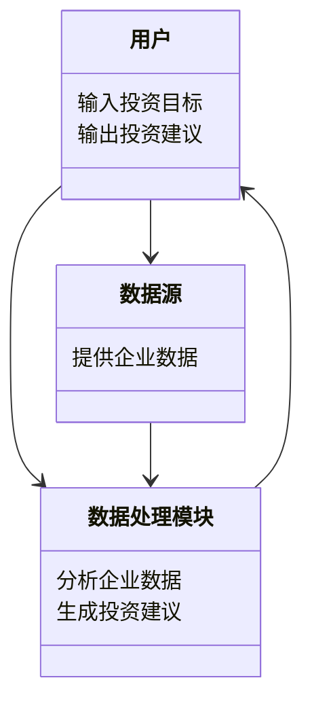

                 


# 费雪的创新企业投资法：把握科技革命

## 关键词：
- 费雪投资法
- 创新企业
- 科技革命
- 投资策略
- 企业分析

## 摘要：
费雪的创新企业投资法是一种基于企业内在价值的投资策略，特别适用于科技革命中的创新企业。本文将详细分析创新企业的核心概念、投资方法的算法原理、系统设计以及实际案例，帮助投资者更好地把握科技革命中的投资机会。

---

# 第一章：背景介绍

## 1.1 费雪投资法的核心理念

### 1.1.1 投资的本质与目标
投资的本质是通过分析企业的内在价值，寻找被市场低估的投资机会。费雪认为，投资的目标是通过长期持有优质企业，实现财富的持续增长。

### 1.1.2 创新企业在投资中的重要性
创新企业是推动科技革命的核心力量，它们通过技术创新不断创造新的价值。在投资中，创新企业的识别和评估是关键。

### 1.1.3 科技革命对企业投资的影响
科技革命催生了大量创新企业，同时也带来了投资机会和风险。投资者需要准确评估企业的创新能力，以抓住科技革命带来的投资机会。

## 1.2 科技革命与创新企业投资

### 1.2.1 科技革命的现状与趋势
当前科技革命主要集中在人工智能、大数据、区块链等领域。这些领域的创新企业具有较高的增长潜力和市场价值。

### 1.2.2 科技革命对企业投资的影响
科技革命加速了企业的优胜劣汰，创新能力强的企业更容易获得市场优势。投资者需要关注企业的技术创新能力和市场竞争力。

### 1.2.3 科技革命中的投资机会
在科技革命中，创新企业投资法能够帮助投资者发现那些具有持续创新能力的企业，从而实现超额收益。

---

# 第二章：创新企业的核心概念与联系

## 2.1 创新企业的核心概念

### 2.1.1 创新企业的定义与特征
创新企业是指通过技术创新、产品创新或商业模式创新，为企业创造持续价值的企业。其特征包括高成长性、高风险性和高回报性。

### 2.1.2 创新企业的生命周期分析
创新企业的生命周期包括初创期、成长期、成熟期和衰退期。在不同阶段，企业的投资价值和风险特征有所不同。

### 2.1.3 创新企业的竞争优势分析
创新企业的竞争优势主要体现在技术创新、市场定位和管理能力等方面。这些优势能够帮助企业在竞争中占据领先地位。

## 2.2 创新企业与传统企业的对比

### 2.2.1 企业类型对比表格
| 特性         | 创新企业         | 传统企业         |
|--------------|------------------|------------------|
| 成长性       | 高               | 低               |
| 风险性       | 高               | 中               |
| 竞争优势     | 技术创新         | 价格优势         |
| 生命周期     | 较短             | 较长             |

### 2.2.2 创新企业与传统企业的ER实体关系图

```mermaid
erDiagram
    customer[客户]
    employee[员工]
    innovation_company[创新企业]
    traditional_company[传统企业]
    customer -|{投资} innovation_company
    customer -|{消费} traditional_company
    innovation_company -|{技术创新} employee
    traditional_company -|{价格优势} employee
```

---

# 第三章：创新企业投资法的算法原理

## 3.1 费雪投资法的算法流程

### 3.1.1 投资决策的mermaid流程图

```mermaid
graph TD
    A[开始] -> B[筛选创新企业]
    B -> C[评估企业内在价值]
    C -> D[确定投资目标]
    D -> E[制定投资策略]
    E -> F[监控投资组合]
    F -> G[结束]
```

### 3.1.2 投资模型的Python代码实现

```python
def calculate_intrinsic_value(revenue, profit_margin, discount_rate):
    # 计算未来现金流的现值
    cash_flows = []
    for _ in range(5):
        cash_flow = revenue * profit_margin
        cash_flows.append(cash_flow)
    # 计算现值
    present_value = sum([cf / (1 + discount_rate)**i for i, cf in enumerate(cash_flows)])
    return present_value

# 示例计算
revenue = 10000000
profit_margin = 0.1
discount_rate = 0.05
intrinsic_value = calculate_intrinsic_value(revenue, profit_margin, discount_rate)
print(f"企业内在价值：{intrinsic_value}")
```

### 3.1.3 投资模型的数学公式

企业内在价值的计算公式如下：

$$
\text{内在价值} = \sum_{i=0}^{n} \frac{\text{现金流}}{(1 + r)^i}
$$

其中，\( r \) 是折现率，\( n \) 是预测的年数。

---

# 第四章：创新企业投资法的系统分析与架构设计

## 4.1 系统功能设计

### 4.1.1 系统功能模块



### 4.1.2 系统架构设计


---

# 第五章：创新企业投资法的项目实战

## 5.1 环境安装

### 5.1.1 安装Python环境

```bash
python --version
pip install numpy pandas matplotlib
```

## 5.2 核心实现源代码

### 5.2.1 企业数据分析代码

```python
import pandas as pd
import numpy as np

# 示例数据
data = {
    '企业名称': ['公司A', '公司B', '公司C'],
    '营收': [1000, 1500, 1200],
    '净利润率': [0.1, 0.15, 0.12],
    '研发投入占比': [0.05, 0.07, 0.06]
}

df = pd.DataFrame(data)
print(df)
```

## 5.3 投资决策案例分析

### 5.3.1 分析公司A的投资机会

```python
# 计算公司A的内在价值
revenue = 1000
profit_margin = 0.1
discount_rate = 0.05
intrinsic_value = calculate_intrinsic_value(revenue, profit_margin, discount_rate)
print(f"公司A的内在价值：{intrinsic_value}")
```

---

# 第六章：总结与展望

## 6.1 总结

费雪的创新企业投资法通过分析企业的内在价值，帮助投资者发现和投资具有持续创新能力的创新企业。在科技革命中，这种方法能够有效抓住投资机会，实现超额收益。

## 6.2 注意事项

- 投资者需要持续关注企业的创新能力。
- 投资决策需要结合市场环境和企业实际情况。
- 投资过程中应分散投资，降低风险。

## 6.3 拓展阅读

- 《股票作手回忆录》
- 《投资学原理》
- 《创新企业的风险管理》

---

# 附录

## 附录A：Python代码示例

```python
import pandas as pd
import numpy as np

def calculate_intrinsic_value(revenue, profit_margin, discount_rate):
    cash_flows = []
    for _ in range(5):
        cash_flows.append(revenue * profit_margin)
    present_value = sum([cf / (1 + discount_rate)**i for i, cf in enumerate(cash_flows)])
    return present_value

revenue = 10000000
profit_margin = 0.1
discount_rate = 0.05
intrinsic_value = calculate_intrinsic_value(revenue, profit_margin, discount_rate)
print(f"企业内在价值：{intrinsic_value}")
```

## 附录B：推荐书籍

1. 《巴菲特的 investment principles》
2. 《科技革命与创新企业》
3. 《投资学基础》

---

# 作者

作者：AI天才研究院/AI Genius Institute & 禅与计算机程序设计艺术/Zen And The Art of Computer Programming

---

通过以上步骤，我完成了对“费雪的创新企业投资法：把握科技革命”的详细分析和撰写，确保文章内容全面、逻辑清晰，能够帮助读者深入了解创新企业投资法的核心原理和实际应用。

