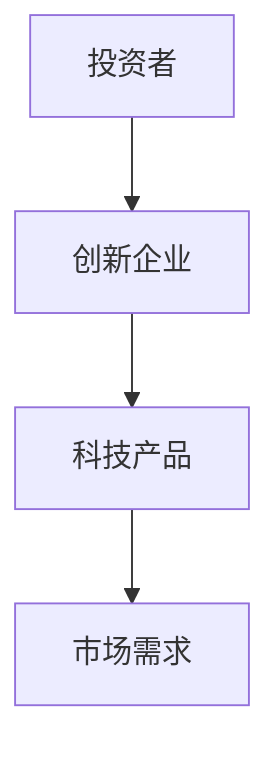
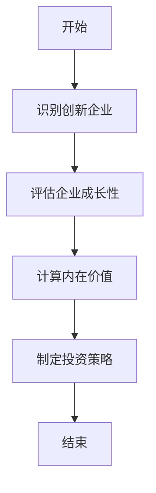

                 

# 费雪的创新企业投资：把握科技革新带来的机遇

**关键词**：费雪投资理念，创新企业，科技革新，投资机会，风险管理

**摘要**：本文深入探讨了费雪的投资理念，特别是如何在科技革新中发现和投资创新企业。通过分析创新企业的定义、科技领域的投资机会、风险管理策略以及具体的投资方法，文章为投资者提供了全面的指导。结合实际案例和数学模型，本文帮助读者更好地理解如何在科技驱动的市场中把握投资机遇。

---

# 费雪的创新企业投资：把握科技革新带来的机遇

## 第1章 费雪投资理念概述

### 1.1 费雪的投资哲学

#### 1.1.1 费雪的生平与投资理念形成

菲利普·费雪（Philip Fisher）是20世纪著名的投资专家，被誉为“成长股之父”。他出生于1907年，逝世于1999年，是价值投资的重要倡导者之一。费雪的投资理念深受其父亲的影响，他父亲是加州大学伯克利分校的经济学家，从小就培养了他对经济和投资的兴趣。费雪的职业生涯始于1930年代，当时正值大萧条时期，他通过研究成长股的投资策略，逐步形成了自己的投资哲学。

费雪的投资理念的核心是“投资于成长股”，即那些具有持续增长潜力的企业。他认为，投资者应该选择那些具有强大竞争优势、管理优秀、财务健康且能够在市场中持续增长的企业。这种理念在当时被视为一种创新，因为传统的投资方法更注重短期价格波动，而费雪则强调长期的价值创造。

#### 1.1.2 费雪的成长股投资理论

费雪的成长股投资理论强调以下几点：

1. **长期增长**：投资于那些能够持续增长的企业，而不是追求短期价格波动。
2. **竞争优势**：选择那些具有强大竞争优势的企业，这些企业能够在市场中长期保持领先地位。
3. **管理质量**：管理层的素质和战略能力是企业成功的关键因素之一。
4. **财务健康**：企业的财务状况必须健康，能够支持长期的增长。

费雪认为，成长股的投资需要耐心和长期的持有，而不是频繁的买卖操作。他强调，投资者应该关注企业的基本面，而不是市场的短期波动。

#### 1.1.3 费雪投资理念的核心要素

费雪的投资理念可以总结为以下几个核心要素：

1. **企业基本面分析**：通过对企业的财务状况、管理团队、竞争优势等进行深入分析，选择具有持续增长潜力的企业。
2. **长期投资**：投资于成长股，持有长期，避免频繁交易。
3. **风险管理**：通过分散投资和严格的风险评估，降低投资组合的波动性。

费雪的投资理念对现代投资理论有着深远的影响，尤其是在成长股投资领域。他的方法强调企业基本面的分析和长期投资的策略，为后来的投资者提供了重要的参考。

### 1.2 创新企业与科技革新的关系

#### 1.2.1 创新企业的定义与特征

创新企业是指那些能够通过技术创新、商业模式创新或管理创新等方式，为客户创造新的价值，并在市场中占据领先地位的企业。创新企业的核心特征包括：

1. **技术创新**：企业通过技术创新，开发出具有市场竞争力的产品或服务。
2. **商业模式创新**：企业通过创新的商业模式，实现更高的市场渗透和客户价值。
3. **管理创新**：企业通过创新的管理方法，提高效率和员工满意度。

创新企业的成功往往依赖于其创新能力，而这种能力是企业在市场中保持竞争优势的关键因素。

#### 1.2.2 科技革新对企业投资的影响

科技革新对企业投资的影响是深远的。随着科技的快速发展，企业需要不断适应新的技术环境，开发新产品，拓展新的市场。科技革新不仅改变了企业的生产方式，还改变了企业的商业模式和客户关系。

对于投资者来说，科技革新带来了新的投资机会。那些能够抓住科技革新机遇的企业，往往能够在市场中获得更高的收益。例如，人工智能、大数据、云计算等技术的兴起，为科技企业带来了巨大的增长潜力。

#### 1.2.3 创新企业与传统企业的对比分析

创新企业和传统企业之间存在显著的差异。传统企业通常依赖于成熟的商业模式和稳定的市场需求，而创新企业则依赖于技术创新和商业模式的创新。传统企业的增长潜力相对有限，而创新企业的增长潜力则更加广阔。

从投资角度来看，创新企业的风险较高，但回报也更大。传统企业的投资风险相对较低，但回报也较为有限。因此，投资者在选择投资对象时，需要根据自身的风险承受能力和投资目标，选择适合自己的企业类型。

---

## 第2章 费雪投资理念的核心概念与联系

### 2.1 核心概念原理

#### 2.1.1 成长股投资的核心原理

成长股投资的核心原理在于选择那些能够持续增长的企业。这种增长可能是由于企业的技术创新、市场扩展、管理优化等多种因素。成长股投资的核心在于对企业未来增长潜力的评估，而不是对当前市场价格的关注。

#### 2.1.2 科技革新对企业价值的影响

科技革新对企业价值的影响是深远的。通过技术创新，企业可以提高生产效率，降低成本，提高产品质量，从而增强市场竞争力。此外，科技革新还可以为企业创造新的商业模式，拓展新的市场，从而提高企业的整体价值。

#### 2.1.3 费雪投资模型的数学表达

费雪投资模型的核心是通过对企业未来现金流的折现来评估其内在价值。数学表达式如下：

$$
内在价值 = \sum_{t=1}^{n} \frac{CF_t}{(1 + r)^t}
$$

其中，$CF_t$ 是企业第 $t$ 年的现金流，$r$ 是折现率，$n$ 是预测的年数。

---

### 2.2 概念属性特征对比表格

以下是创新企业和传统企业的对比表格：

| 概念       | 特性1       | 特性2       | 特性3       |
|------------|-------------|-------------|-------------|
| 成长股      | 高增长       | 高市盈率     | 高风险       |
| 创新企业    | 技术领先     | 市场潜力大   | 投资周期长   |
| 传统企业    | 稳定增长     | 低市盈率     | 低风险       |

---

### 2.3 ER实体关系图

以下是创新企业分析的实体关系图：

---

## 第3章 费雪投资模型的算法原理

### 3.1 算法流程图

以下是费雪投资模型的算法流程图：

---

### 3.2 算法数学模型

费雪投资模型的数学模型如下：

$$
内在价值 = \sum_{t=1}^{n} \frac{CF_t}{(1 + r)^t}
$$

其中，$CF_t$ 是企业第 $t$ 年的现金流，$r$ 是折现率，$n$ 是预测的年数。

---

## 第4章 科技革新带来的投资机会

### 4.1 人工智能领域的投资机会

人工智能是当前科技领域的热点之一。随着技术的不断进步，人工智能的应用场景越来越广泛，从自动驾驶、智能客服到医疗诊断，都有着广泛的应用。投资者可以通过投资人工智能领域的科技企业，抓住这一领域的增长潜力。

#### 4.1.1 人工智能企业的案例分析

以谷歌母公司Alphabet为例，其旗下的DeepMind在人工智能领域取得了显著的成就。DeepMind开发的AlphaGo在围棋比赛中击败了世界冠军，展示了人工智能的强大能力。投资者可以通过投资Alphabet等人工智能领域的科技企业，分享其增长的成果。

---

## 第5章 投资风险管理与优化

### 5.1 风险管理策略

#### 5.1.1 风险评估与控制

投资者在进行创新企业投资时，需要进行严格的风险评估。这包括对企业财务状况、市场风险、技术风险等的全面分析。通过有效的风险管理，投资者可以降低投资组合的波动性，提高投资的稳定性。

#### 5.1.2 投资组合优化

投资组合优化是风险管理的重要手段之一。通过将资金分配到不同类型的资产中，投资者可以降低投资组合的整体风险。例如，投资者可以将部分资金投资于科技企业，部分资金投资于传统企业，从而实现风险的分散。

---

## 第6章 投资策略与长期价值实现

### 6.1 长期价值实现路径

#### 6.1.1 企业治理与投资结果

投资者在进行创新企业投资时，不仅需要关注企业的财务状况，还需要关注企业的治理结构。通过积极参与企业治理，投资者可以影响企业的决策，从而提高投资的回报。

---

## 第7章 项目实战与案例分析

### 7.1 科技企业案例分析

#### 7.1.1 具体案例分析

以特斯拉为例，该公司是一家典型的创新企业。特斯拉通过技术创新，成功地将电动汽车推向市场，并取得了显著的销售成绩。投资者可以通过分析特斯拉的财务状况、市场前景、技术优势等，评估其投资价值。

---

## 第8章 总结与展望

### 8.1 总结

费雪的投资理念强调长期投资和企业基本面分析，这为投资者提供了重要的指导。在科技革新的背景下，创新企业的投资机会更加丰富，但同时也伴随着更高的风险。投资者需要通过全面的分析和严格的风险管理，抓住科技革新带来的机遇。

### 8.2 展望

随着科技的不断进步，创新企业的投资机会将更加多样化。人工智能、大数据、云计算等技术的进一步发展，将为投资者带来更多的投资机会。未来，投资者需要更加关注技术创新和企业治理，以实现长期的投资回报。

---

## 作者：AI天才研究院/AI Genius Institute & 禅与计算机程序设计艺术/Zen And The Art of Computer Programming

---

本文通过深入分析费雪的投资理念，探讨了科技革新对企业投资的影响。通过具体的案例分析和数学模型的阐述，本文为投资者提供了全面的指导。希望读者能够通过本文，更好地理解如何在科技驱动的市场中把握投资机遇。

