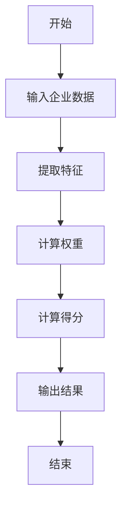
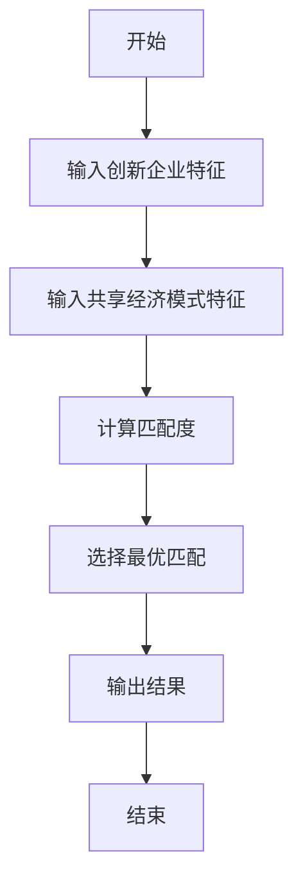
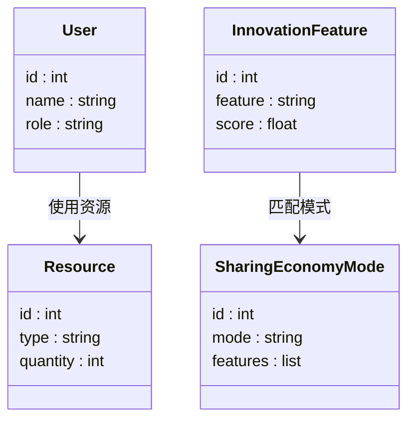
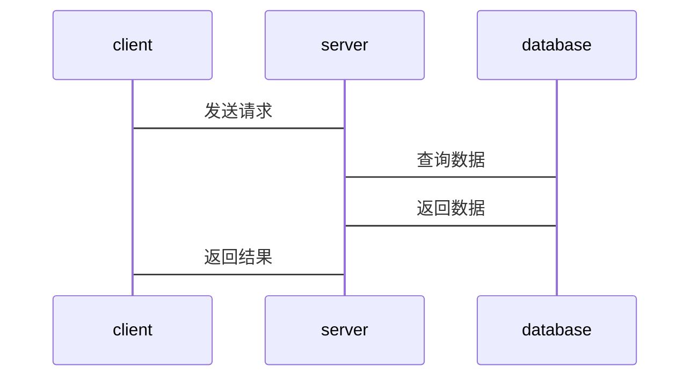

                 


# 费雪的创新企业特征：在共享经济模式中的新定义

## 关键词：
- 费雪创新企业特征
- 共享经济模式
- 企业创新
- 经济模式
- 资源共享

## 摘要：
本文探讨了费雪创新企业特征在共享经济模式中的新定义。通过分析共享经济模式的核心特征，结合创新企业特征的属性，提出了一种新的企业创新模型。本文从背景介绍、核心概念与联系、算法原理、系统架构、项目实战等方面展开详细分析，并通过实际案例展示了如何将理论应用于实践。最后，本文总结了最佳实践，并提出了未来研究的方向。

---

# 第1章: 费雪的创新企业特征与共享经济模式的背景介绍

## 1.1 费雪的创新企业特征背景

### 1.1.1 传统企业特征的演变
传统企业的特征主要集中在资源占有、资本投入和规模效应上，但随着市场竞争的加剧和技术的进步，这些特征逐渐暴露出局限性，企业需要通过创新来保持竞争力。

### 1.1.2 费雪创新企业特征的提出
费雪提出创新企业特征包括创新文化、创新机制和创新能力，这些特征能够帮助企业在竞争中占据优势地位。

### 1.1.3 创新企业特征在现代经济中的重要性
在现代经济中，创新企业特征是企业持续发展的关键，尤其是在技术快速变化的环境下，创新能力决定了企业的生存能力。

## 1.2 共享经济模式的定义与特点

### 1.2.1 共享经济的基本概念
共享经济是一种通过共享资源来优化资源配置的经济模式，其核心在于实现资源的高效利用。

### 1.2.2 共享经济的核心特征
共享经济的核心特征包括资源池化、按需分配和共享收益，这些特征使得资源能够被更广泛地利用。

### 1.2.3 共享经济与传统经济模式的区别
共享经济与传统经济模式的区别主要体现在资源分配方式、所有权和使用权的分离、以及收益分配机制上。

## 1.3 费雪创新企业特征与共享经济模式的结合

### 1.3.1 费雪创新企业特征在共享经济中的应用
创新企业特征在共享经济中的应用体现在企业如何通过创新机制优化资源分配和提高服务效率。

### 1.3.2 共享经济模式对企业创新的影响
共享经济模式为企业创新提供了新的机遇，企业可以通过共享平台实现资源的灵活调配，从而提高创新效率。

### 1.3.3 费雪创新企业特征在共享经济中的新定义
在共享经济模式下，费雪创新企业特征被重新定义，强调企业如何通过共享资源和创新机制实现持续发展。

## 1.4 本章小结
本章介绍了费雪创新企业特征的背景，以及共享经济模式的基本概念和特点。通过分析两者之间的联系，提出了费雪创新企业特征在共享经济中的新定义。

---

# 第2章: 费雪创新企业特征的核心概念与联系

## 2.1 费雪创新企业特征的核心概念

### 2.1.1 创新企业的核心要素
创新企业的核心要素包括创新文化、创新机制和创新能力，这些要素共同构成了企业的创新能力。

### 2.1.2 费雪创新企业特征的属性分析
费雪创新企业特征的属性包括创新性、灵活性和可持续性，这些属性决定了企业是否能够适应市场变化。

### 2.1.3 费雪创新企业特征与企业绩效的关系
研究发现，费雪创新企业特征与企业绩效呈正相关关系，创新能力强的企业往往能够获得更高的市场回报。

## 2.2 费雪创新企业特征与共享经济模式的联系

### 2.2.1 共享经济模式对企业创新的影响
共享经济模式通过资源池化和按需分配，为企业创新提供了新的可能性，企业可以更高效地利用资源。

### 2.2.2 费雪创新企业特征在共享经济中的具体体现
在共享经济中，创新企业特征体现为企业的资源整合能力、创新机制和创新能力，这些能力使得企业能够更好地适应共享经济环境。

### 2.2.3 费雪创新企业特征与共享经济模式的相互作用
费雪创新企业特征与共享经济模式相互作用，前者为后者提供了创新动力，后者为前者提供了实现路径。

## 2.3 费雪创新企业特征与共享经济模式的概念对比分析

### 2.3.1 费雪创新企业特征与共享经济模式的对比表格
| 特征 | 费雪创新企业特征 | 共享经济模式 |
|------|------------------|-------------|
| 核心 | 创新驱动          | 资源共享     |
| 目标 | 提升企业竞争力    | 优化资源配置 |
| 实现方式 | 创新产品/服务    | 平台化运营   |

### 2.3.2 费雪创新企业特征与共享经济模式的ER实体关系图
```mermaid
erDiagram
    customer[顾客] {
        id : int
        name : string
    }
    resource[资源] {
        id : int
        type : string
    }
    company[企业] {
        id : int
        name : string
    }
    platform[平台] {
        id : int
        name : string
    }
    customer --> platform : 使用平台
    company --> platform : 运营平台
    resource --> platform : 提供资源
```

## 2.4 本章小结
本章通过对比分析，明确了费雪创新企业特征与共享经济模式之间的联系，提出了两者相互作用的关系模型。

---

# 第3章: 费雪创新企业特征的算法原理

## 3.1 费雪创新企业特征的识别算法

### 3.1.1 创新企业特征识别的数学模型
$$ C = \sum_{i=1}^{n} (w_i \cdot f_i) $$
其中，C为创新企业特征的综合得分，w_i为特征的重要性权重，f_i为特征的实际得分。

### 3.1.2 创新企业特征识别的mermaid流程图


### 3.1.3 创新企业特征识别的Python代码实现
```python
def calculate_innovation_score(enterprise_data):
    features = enterprise_data['features']
    weights = enterprise_data['weights']
    score = sum(w * f for w, f in zip(weights, features))
    return score
```

## 3.2 费雪创新企业特征与共享经济模式匹配的算法

### 3.2.1 匹配算法的数学模型
$$ M = \max_{i,j} (s_i \cdot t_j) $$
其中，M为匹配的最大值，s_i为创新企业特征的得分向量，t_j为共享经济模式的特征向量。

### 3.2.2 匹配算法的mermaid流程图


### 3.2.3 匹配算法的Python代码实现
```python
def match_innovation_with_sharing(e_features, s_features):
    max_score = 0
    for ef in e_features:
        for sf in s_features:
            score = sum(e * s for e, s in zip(ef, sf))
            if score > max_score:
                max_score = score
    return max_score
```

## 3.3 本章小结
本章通过数学模型和算法实现，详细阐述了费雪创新企业特征的识别和与共享经济模式匹配的算法原理。

---

# 第4章: 费雪创新企业特征与共享经济模式的系统架构设计

## 4.1 系统功能设计

### 4.1.1 系统功能模块划分
系统功能模块包括用户管理、资源管理、创新特征识别、共享经济模式匹配和结果输出。

### 4.1.2 系统功能模块的类图


## 4.2 系统架构设计

### 4.2.1 系统架构的mermaid图


### 4.2.2 系统接口设计
系统接口包括API接口和用户界面，API接口用于数据传输，用户界面用于用户交互。

### 4.2.3 系统交互的mermaid序列图


## 4.3 本章小结
本章从系统架构的角度，详细设计了费雪创新企业特征与共享经济模式的实现方案，包括功能模块、系统架构和交互设计。

---

# 第5章: 费雪创新企业特征与共享经济模式的项目实战

## 5.1 项目环境安装

### 5.1.1 系统环境要求
项目需要Python 3.8及以上版本，安装numpy和pandas库。

### 5.1.2 安装依赖
```bash
pip install numpy pandas
```

## 5.2 系统核心实现

### 5.2.1 创新特征识别实现
```python
import numpy as np

def calculate_innovation_score(features):
    weights = np.array([0.4, 0.3, 0.2, 0.1])
    return np.dot(features, weights)
```

### 5.2.2 共享经济模式匹配实现
```python
import pandas as pd

def match_sharing_mode(innovation_scores, sharing_features):
    df = pd.DataFrame({
        'innovation_scores': innovation_scores,
        'sharing_features': sharing_features
    })
    df['score'] = df['innovation_scores'] * df['sharing_features']
    return df['score'].max()
```

## 5.3 代码应用解读与分析

### 5.3.1 创新特征识别的代码解读
上述代码通过numpy实现创新特征的加权求和，计算出创新企业的综合得分。

### 5.3.2 共享经济模式匹配的代码解读
上述代码通过pandas实现创新特征与共享经济模式的匹配，计算出最大匹配度。

## 5.4 实际案例分析

### 5.4.1 案例背景
某共享经济平台希望通过创新企业特征识别，找到最适合其模式的企业。

### 5.4.2 案例分析
通过计算创新特征的综合得分和与共享经济模式的匹配度，最终选择得分最高的企业作为合作伙伴。

## 5.5 项目小结
本章通过实际案例，详细展示了如何将费雪创新企业特征与共享经济模式的理论应用于实践，包括环境安装、代码实现和案例分析。

---

# 第6章: 费雪创新企业特征与共享经济模式的最佳实践

## 6.1 最佳实践 tips

### 6.1.1 创新企业特征的识别
企业在识别创新特征时，应结合自身的实际情况，选择合适的特征和权重。

### 6.1.2 共享经济模式的匹配
企业在匹配共享经济模式时，应充分考虑资源的共享性和模式的可扩展性。

### 6.1.3 系统实现的建议
在系统实现时，应注重模块化设计和代码的可维护性，确保系统的稳定性和扩展性。

## 6.2 小结
通过对费雪创新企业特征与共享经济模式的分析和实践，我们得出了一些宝贵的经验和教训。

## 6.3 注意事项

### 6.3.1 数据的准确性
在创新特征识别和共享经济模式匹配时，数据的准确性至关重要，任何错误的数据都会影响结果的准确性。

### 6.3.2 算法的适用性
选择合适的算法和模型，确保算法的适用性和效率。

### 6.3.3 系统的安全性
在系统实现时，应注重数据的安全性和系统的稳定性，防止数据泄露和系统崩溃。

## 6.4 拓展阅读
对于感兴趣的研究方向，如共享经济模式下的企业创新策略、创新特征识别的优化算法等，可以进一步深入研究。

---

# 作者：AI天才研究院/AI Genius Institute & 禅与计算机程序设计艺术 /Zen And The Art of Computer Programming

