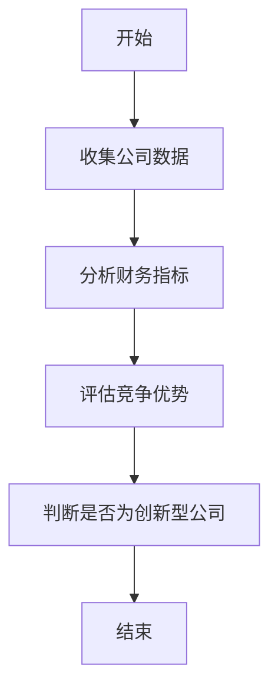
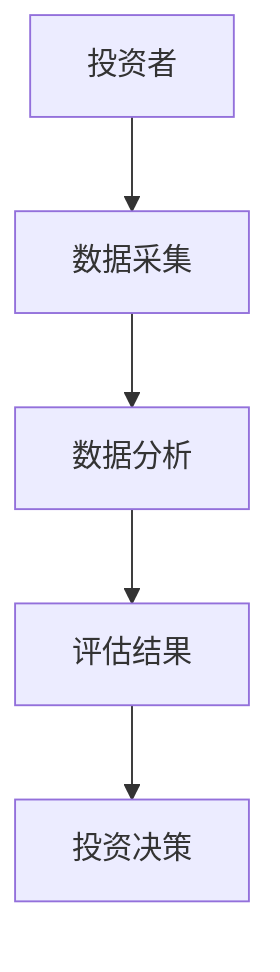

                 


# 费雪的创新型公司识别方法

> 关键词：费雪投资方法，创新型公司，成长股，企业识别，投资模型

> 摘要：本文深入分析了费雪的创新型公司识别方法，从理论基础、核心概念、算法原理、系统设计到项目实战，全面阐述了如何通过费雪的方法论识别具有成长性的创新型公司。文章内容涵盖背景介绍、核心概念、算法流程、系统架构、项目实战等多个方面，结合理论与实践，帮助读者全面理解并掌握这一经典投资方法。

---

# 第一部分: 费雪创新型公司识别方法的背景与核心概念

## 第1章: 投资背景与问题背景

### 1.1 现代投资学的核心问题
现代投资学的核心问题在于如何准确识别具有持续增长潜力的公司。传统估值方法往往基于历史数据和静态指标，而忽视了公司未来的成长性。费雪的成长股投资方法正是针对这一问题提出的一种解决方案。

### 1.2 费雪投资方法的提出背景
菲利普·费雪（Philip Fisher）是20世纪著名的投资学家，他提出了一种基于公司成长性的投资方法。这种方法的核心在于识别那些能够持续提高收益的创新型公司。

### 1.3 创新型公司的定义与特征
创新型公司是指那些能够在行业中持续创新，保持竞争优势，并且具有较高成长潜力的公司。其特征包括：高ROE（净资产收益率）、高利润率、持续的研发投入、强大的管理团队等。

---

## 第2章: 费雪创新型公司识别方法的核心要素

### 2.1 费雪的成长股投资理念
费雪认为，投资成功的前提是选择那些能够持续提高收益的公司。他强调，公司的成长性是决定投资价值的关键因素。

### 2.2 创新型公司的关键属性
创新型公司的关键属性包括：高ROE、高净利润率、持续的产品创新、强大的管理团队等。

### 2.3 费雪方法的核心要素
费雪方法的核心要素包括：公司基本面分析、成长性评估、竞争优势分析等。

---

# 第二部分: 费雪创新型公司识别方法的算法原理

## 第3章: 费雪方法的算法流程

### 3.1 算法流程图


### 3.2 算法实现步骤
1. 收集目标公司的财务数据和行业信息。
2. 计算关键财务指标，如ROE、净利润率等。
3. 评估公司的竞争优势，包括产品创新、管理团队等。
4. 判断是否为创新型公司。

---

## 第4章: 费雪方法的数学模型与公式

### 4.1 费雪模型的基本公式
$$
\text{公司价值} = \text{收益} \times \text{合理市盈率}
$$

### 4.2 费雪模型的扩展公式
$$
\text{公司价值} = \sum_{t=1}^{n} \frac{\text{收益}_t}{(1 + r)^t}
$$

---

# 第三部分: 费雪创新型公司识别方法的系统设计

## 第5章: 系统功能设计

### 5.1 系统功能模块
系统功能模块包括：数据收集模块、数据分析模块、评估模块等。

### 5.2 系统架构设计


---

# 第四部分: 费雪创新型公司识别方法的项目实战

## 第6章: 项目实战

### 6.1 环境安装
安装必要的数据分析工具，如Python、Pandas等。

### 6.2 核心代码实现
```python
import pandas as pd

def calculate_roe(company_data):
    return company_data['净利润'] / company_data['净资产']
```

### 6.3 实例分析
以某公司为例，分析其是否为创新型公司。

---

# 第五部分: 费雪创新型公司识别方法的总结与展望

## 第7章: 总结与展望

### 7.1 最佳实践
在实际投资中，建议结合费雪方法与其他投资方法，进行综合评估。

### 7.2 小结
费雪的创新型公司识别方法是一种基于公司成长性的投资方法，具有较高的实用价值。

### 7.3 注意事项
投资者在实际操作中，应结合市场环境和公司具体情况，灵活运用费雪方法。

### 7.4 拓展阅读
推荐阅读菲利普·费雪的《成长股投资》等书籍，深入理解其投资理念。

---

# 作者：AI天才研究院/AI Genius Institute & 禅与计算机程序设计艺术 /Zen And The Art of Computer Programming

