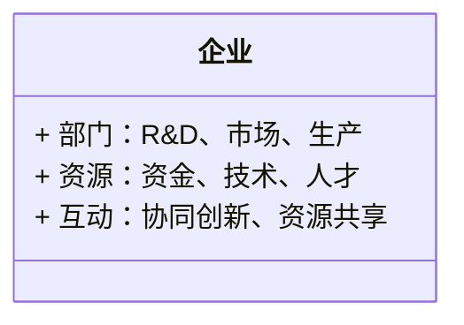
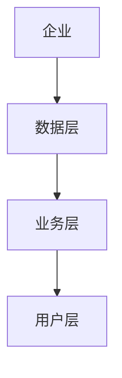

                 


# 费雪的创新生态系统分析：把握产业链机会

> **关键词**：创新生态系统、产业链分析、协同创新、生态系统设计、机会捕捉

> **摘要**：本文深入分析费雪的创新生态系统，探讨其在产业链中的应用。通过系统分析和实际案例，揭示协同创新的机制与生态系统设计的关键要素，帮助读者把握产业链中的创新机会，构建可持续的生态系统。

---

## 第一部分：引言

### 第1章：引言

#### 1.1 创新与生态系统的重要性

- **创新的重要性**：创新是推动社会进步和经济增长的核心动力，涵盖技术、商业模式、管理方法等多个方面。
- **生态系统概念的引入**：生态系统强调各要素的协同作用，而非孤立存在。在创新领域，生态系统包括企业、研究机构、政策制定者等多方参与者。
- **费雪创新生态系统的核心理念**：费雪提出的生态系统理论强调创新过程中的协同效应，认为成功创新依赖于系统内各要素的有效互动。

#### 1.2 本书的目标与结构

- **目标**：通过系统分析，帮助读者理解费雪的创新生态系统，并掌握其在产业链中的应用。
- **结构**：文章分为引言、创新生态系统理论、分析方法、系统架构、项目实战和结论六部分。

---

## 第二部分：创新生态系统

### 第2章：创新生态系统的基本概念

#### 2.1 创新生态系统的核心要素

| 要素 | 描述 |
|------|------|
| **创新主体** | 包括企业、研究机构和个人，负责推动创新活动。 |
| **创新环境** | 包括政策、市场和文化，影响创新活动的开展。 |
| **创新资源** | 包括资金、技术和人才，是创新活动的基础。 |

#### 2.2 生态系统中的互动关系

- **协同创新机制**：企业间通过合作实现资源互补，提高创新效率。
- **关键成功要素**：明确的目标、有效的沟通和信任、持续的投入是协同创新成功的关键。

---

### 第3章：产业链分析基础

#### 3.1 产业链的定义与结构

- **产业链的定义**：从原材料到最终产品的生产过程中的所有环节的集合。
- **产业链结构**：包括上游（原材料）、中游（生产）、下游（市场）三个主要部分。

#### 3.2 产业链中的关键环节

- **上游**：原材料和技术的提供者，影响产业链的成本和质量。
- **中游**：制造环节，连接技术和市场的桥梁。
- **下游**：直接面对用户的销售和服务业，决定市场需求。

---

## 第三部分：创新生态系统分析方法

### 第4章：生态系统分析方法论

#### 4.1 系统分析的基本步骤

- **步骤一：明确目标与范围**：确定分析的目标和范围，明确关键问题。
- **步骤二：收集数据与信息**：通过市场调研、数据分析等方式获取相关信息。
- **步骤三：建立分析模型**：构建生态系统模型，分析各要素的互动关系。
- **步骤四：得出结论与建议**：根据分析结果，提出可行的策略和建议。

#### 4.2 费雪创新生态系统分析模型

- **模型构建**：基于系统动力学，考虑各要素之间的相互作用。
- **模型输入与输出**：输入包括市场数据、企业战略等，输出包括创新机会评估和建议。
- **应用场景**：适用于企业战略规划、政策制定等领域。

---

### 第5章：产业链机会分析

#### 5.1 产业链机会的识别

- **技术突破点**：识别关键领域，如人工智能、区块链等。
- **市场需求预测**：分析消费者需求，预测未来趋势。
- **竞争对手分析**：研究竞争对手的策略和优势，寻找市场空缺。

#### 5.2 机会评估与选择

- **可行性分析**：评估技术、市场和资源的可行性。
- **成本效益分析**：计算投资回报，评估项目的经济可行性。
- **风险评估**：识别潜在风险，并制定应对策略。

---

### 第6章：创新生态系统中的协同效应

#### 6.1 协同创新的机制

- **协同创新机制**：企业间通过合作实现资源共享，提高创新能力。
- **协同创新的优势**：缩短研发周期、降低研发成本、提高成功率。

#### 6.2 协同效应的度量

- **指标体系**：包括合作项目的数量、成功率、收益增长等。
- **评估方法**：通过定量和定性分析，综合评估协同效应。

---

## 第四部分：系统架构与应用

### 第7章：系统架构设计

#### 7.1 问题场景介绍

- **场景描述**：某企业面临市场竞争压力，希望通过创新生态系统提升竞争力。
- **项目介绍**：构建企业内部的创新生态系统，促进各部门协同创新。

#### 7.2 系统功能设计

- **领域模型**：使用Mermaid类图，展示企业的各个部门及其互动关系。



#### 7.3 系统架构设计

- **架构图**：展示系统的整体架构，包括数据层、业务层、用户层。



---

## 第五部分：项目实战

### 第8章：项目实战

#### 8.1 环境配置

- **工具安装**：安装Python、Mermaid、Jupyter Notebook。
- **依赖管理**：使用pip安装所需库。

#### 8.2 核心实现

- **Python代码实现**：以下代码用于分析协同创新的成功率。

```python
import numpy as np
import matplotlib.pyplot as plt

# 生成随机数据
np.random.seed(42)
success = np.random.binomial(1, 0.7, 100)
plt.hist(success, bins=2)
plt.title('协同创新成功率分布')
plt.xlabel('成功/失败')
plt.ylabel('次数')
plt.show()
```

#### 8.3 案例分析

- **案例背景**：某企业通过内部协同创新，成功开发新产品。
- **分析结果**：协同创新显著提高了研发效率，缩短了产品上市时间。

---

## 第六部分：结论与展望

### 第9章：结论与展望

#### 9.1 全文总结

- **总结内容**：费雪的创新生态系统理论为产业链分析提供了新的视角，协同创新是提升竞争力的关键。
- **实践建议**：企业应构建开放的创新生态系统，促进内部和外部的协同创新。

#### 9.2 未来展望

- **研究方向**：进一步研究生态系统在数字化转型中的应用。
- **发展趋势**：协同创新将更加依赖数字工具和平台，生态系统将更加动态和智能化。

---

## 作者

**作者：AI天才研究院 & 禅与计算机程序设计艺术**

---

通过以上结构和内容，本文系统地介绍了费雪的创新生态系统理论，并结合实际案例，详细讲解了如何在产业链中应用这些理论，帮助读者掌握创新机会的捕捉和生态系统的设计方法。

