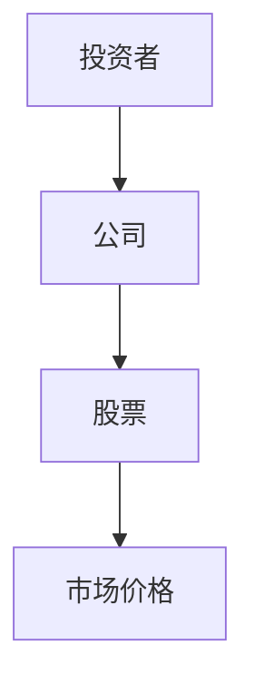
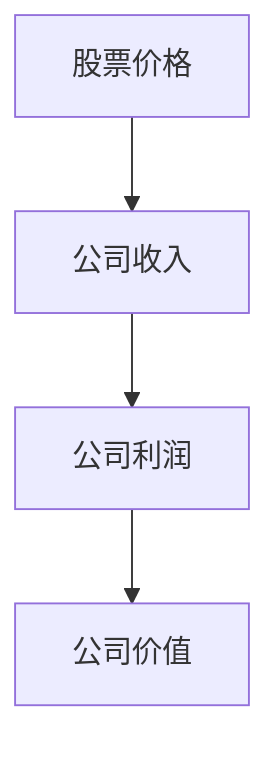
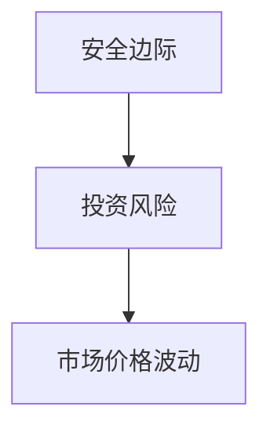
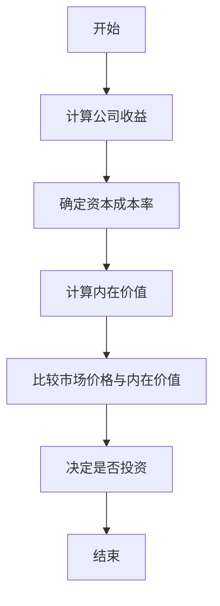
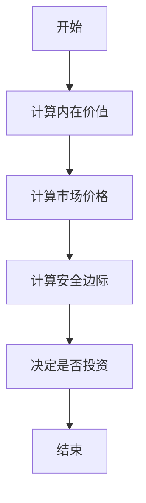
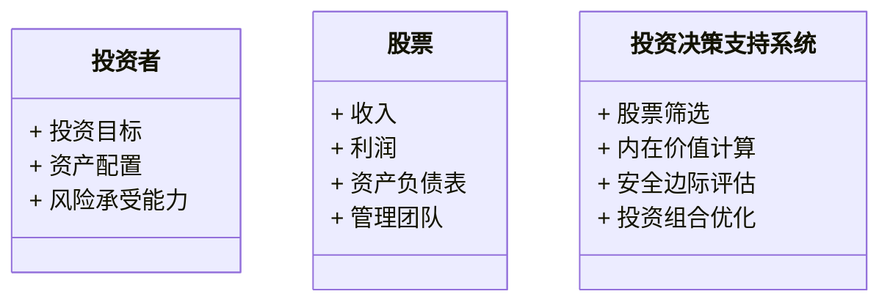
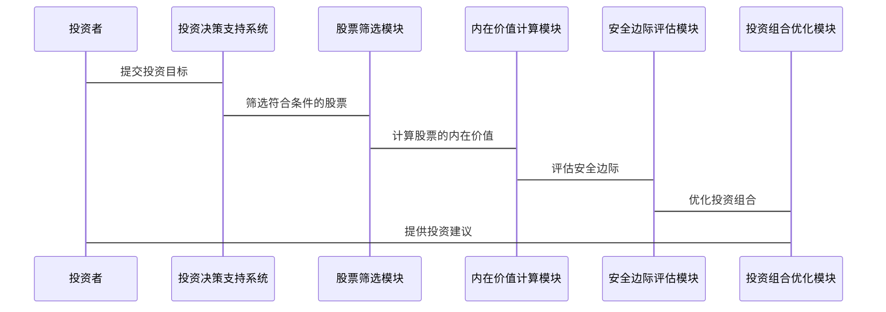

                 


# 费雪的十五个投资原则

## 关键词：投资原则，费雪，价值投资，成长股，安全边际

## 摘要：本文系统地阐述了费雪的十五个投资原则，分析了其核心理念、数学模型、算法流程以及在现代投资中的应用。通过详细讲解每个原则的核心概念、算法实现和系统架构，结合实际案例和代码示例，帮助读者全面理解和应用这些投资原则。

---

## 第一部分: 费雪投资原则的背景与核心理念

### 第1章: 费雪投资原则的背景与起源

#### 1.1 费雪的生平与投资理念

##### 1.1.1 费雪的生平简介
菲利普·费雪（Philip Fisher）是美国著名投资家，被誉为“成长股投资之父”。他出生于1907年，逝世于2004年，是投资界的重要人物。费雪的投资理念以“成长股”为核心，强调长期投资和对公司基本面的深入研究。

##### 1.1.2 费雪的投资理念与风格
费雪的投资理念可以概括为：寻找具有强大成长潜力的公司，并长期持有这些股票。他认为，投资者应该关注公司的管理团队、行业地位、财务状况以及未来的成长空间。他的投资风格以长期持有、价值发现为核心，强调安全边际和分散投资。

##### 1.1.3 费雪投资原则的历史背景
费雪的投资原则诞生于20世纪中叶，当时正值美国经济的快速发展期。他的投资理念在当时的价值投资和投机投资之间找到了一个平衡点，为后来的价值成长投资奠定了基础。

#### 1.2 费雪投资原则的核心概念

##### 1.2.1 投资的本质与目标
投资的本质是通过购买具有成长潜力的资产，实现财富的增值。费雪认为，投资的目标是找到那些能够持续增长的公司，并在合理的价格下买入。

##### 1.2.2 费雪原则的核心要素
费雪的核心原则包括：投资成长股、安全边际、分散投资、长期持有、深入研究等。这些原则共同构成了他的投资体系。

##### 1.2.3 费雪原则的边界与外延
费雪原则的边界在于其适用范围和局限性。例如，成长股投资在市场低迷时期可能表现不佳，因此需要结合市场环境进行调整。其外延则包括对管理团队的信任和对公司治理的关注。

#### 1.3 费雪投资原则与现代投资学的联系

##### 1.3.1 费雪原则与现代投资组合理论的异同
费雪原则与现代投资组合理论的共同点在于都强调分散投资和风险控制。不同点在于，费雪更注重个股的选择和长期成长，而现代投资组合理论更注重资产配置和风险分散。

##### 1.3.2 费雪原则与价值投资的联系
费雪的原则与价值投资有诸多相似之处，例如对安全边际的重视和对公司基本面的深入分析。不同点在于，费雪更注重成长性，而价值投资更注重价格与价值的对比。

##### 1.3.3 费雪原则在投资实践中的应用
费雪的原则在实践中被广泛应用于成长股投资和价值投资中。他的理念对后来的投资者，如彼得·林奇和沃伦·巴菲特，产生了深远影响。

#### 1.4 本章小结
本章通过对费雪的生平、投资理念和核心原则的分析，帮助读者理解其投资思想的背景和核心概念。下一章将详细分析费雪投资原则的核心要素和数学模型。

---

## 第二部分: 费雪投资原则的核心概念与联系

### 第2章: 费雪投资原则的核心要素

#### 2.1 费雪原则的核心要素分析

##### 2.1.1 投资成长股的核心要素
费雪认为，成长股的核心要素包括：公司具有持续的盈利增长能力、行业地位稳固、管理团队优秀、财务状况健康。

##### 2.1.2 公司基本面分析的核心要素
基本面分析的核心要素包括：收入、利润、现金流、资产负债表、管理团队等。

##### 2.1.3 费雪的“安全边际”概念
安全边际是指股票的市场价格低于其内在价值的部分。费雪认为，安全边际是保护投资者免受市场波动影响的重要因素。

#### 2.2 费雪投资原则的核心属性对比

##### 2.2.1 费雪原则与成长投资的对比
| 费雪原则 | 成长投资 |
|----------|----------|
| 强调长期持有 | 强调短期增长 |
| 注重公司基本面 | 注重公司成长性 |
| 重视安全边际 | 重视成长空间 |

##### 2.2.2 费雪原则与价值投资的对比
| 费雪原则 | 价值投资 |
|----------|----------|
| 强调成长性 | 强调价值低估 |
| 注重长期持有 | 注重安全边际 |
| 重视公司基本面 | 重视市场价格 |

##### 2.2.3 费雪原则与技术分析的对比
| 费雪原则 | 技术分析 |
|----------|----------|
| 强调公司基本面 | 强调价格走势 |
| 注重长期投资 | 注重短期波动 |
| 重视价值与成长 | 重视图表与指标 |

#### 2.3 费雪投资原则的ER实体关系图

##### 2.3.1 投资者与公司的关系


##### 2.3.2 股票价格与公司基本面的关系


##### 2.3.3 安全边际与投资风险的关系


---

### 第3章: 费雪投资原则的数学模型与公式

#### 3.1 费雪投资原则的数学模型

##### 3.1.1 股票内在价值的计算公式
股票的内在价值可以通过以下公式计算：
$$ V = \frac{E}{r} $$
其中，V为股票的内在价值，E为公司的预期收益，r为资本成本率。

##### 3.1.2 安全边际的计算公式
安全边际可以通过以下公式计算：
$$ \text{安全边际} = V_{\text{内在}} - V_{\text{市场}} $$
其中，$V_{\text{内在}}$为股票的内在价值，$V_{\text{市场}}$为股票的市场价格。

#### 3.2 费雪投资原则的算法流程

##### 3.2.1 股票内在价值的计算流程


##### 3.2.2 安全边际的计算流程


#### 3.3 费雪投资原则的Python实现

##### 3.3.1 股票内在价值的计算代码
```python
def calculate_intrinsic_value(revenue, capital_cost):
    intrinsic_value = revenue / capital_cost
    return intrinsic_value
```

##### 3.3.2 安全边际的计算代码
```python
def calculate_margin_of_safety(intrinsic_value, market_price):
    margin_of_safety = intrinsic_value - market_price
    return margin_of_safety
```

---

## 第三部分: 费雪投资原则的系统分析与架构设计

### 第4章: 费雪投资原则的系统架构设计

#### 4.1 投资决策支持系统的功能设计
投资决策支持系统的主要功能包括：股票筛选、内在价值计算、安全边际评估、投资组合优化等。

#### 4.2 系统功能的领域模型


#### 4.3 系统架构的交互流程


---

## 第四部分: 费雪投资原则的项目实战

### 第5章: 费雪投资原则的项目实战

#### 5.1 环境安装与配置
为了实现费雪投资原则的数学模型和算法，我们需要安装以下工具和库：
- Python 3.x
- NumPy
- Pandas
- Matplotlib
- Jupyter Notebook

#### 5.2 核心代码实现

##### 5.2.1 股票内在价值的计算
```python
import numpy as np

def calculate_intrinsic_value(revenue, capital_cost):
    return revenue / capital_cost

revenue = 1000000  # 假设公司年收入为100万美元
capital_cost = 0.1  # 资本成本率为10%
intrinsic_value = calculate_intrinsic_value(revenue, capital_cost)
print(f"股票的内在价值为：{intrinsic_value}")
```

##### 5.2.2 安全边际的计算
```python
def calculate_margin_of_safety(intrinsic_value, market_price):
    return intrinsic_value - market_price

intrinsic_value = 50  # 股票的内在价值
market_price = 40     # 股票的市场价格
margin_of_safety = calculate_margin_of_safety(intrinsic_value, market_price)
print(f"安全边际为：{margin_of_safety}")
```

#### 5.3 项目小结
通过本章的实战项目，我们实现了费雪投资原则中的股票内在价值计算和安全边际评估。这些代码可以帮助投资者更好地理解和应用费雪的投资理念。

---

## 第五部分: 费雪投资原则的最佳实践

### 第6章: 费雪投资原则的最佳实践

#### 6.1 本章小结
费雪的十五个投资原则为我们提供了一个系统的投资框架。通过深入理解这些原则，我们可以更好地进行投资决策。

#### 6.2 投资注意事项
- **分散投资**：避免将所有资金投入到单一股票中。
- **长期持有**：耐心持有优质股票，避免频繁交易。
- **深入研究**：对公司基本面进行充分的研究和分析。
- **关注管理团队**：优秀的管理团队是公司成长的关键。

#### 6.3 拓展阅读
- 《股票做短线的100个窍门》
- 《投资的真相》
- 《巴菲特投资策略》

---

## 作者：AI天才研究院/AI Genius Institute & 禅与计算机程序设计艺术 /Zen And The Art of Computer Programming

