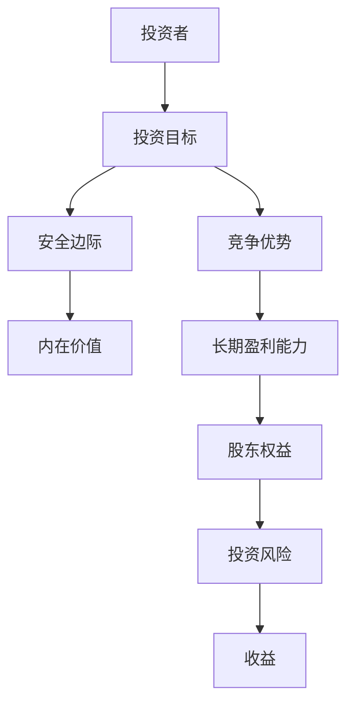
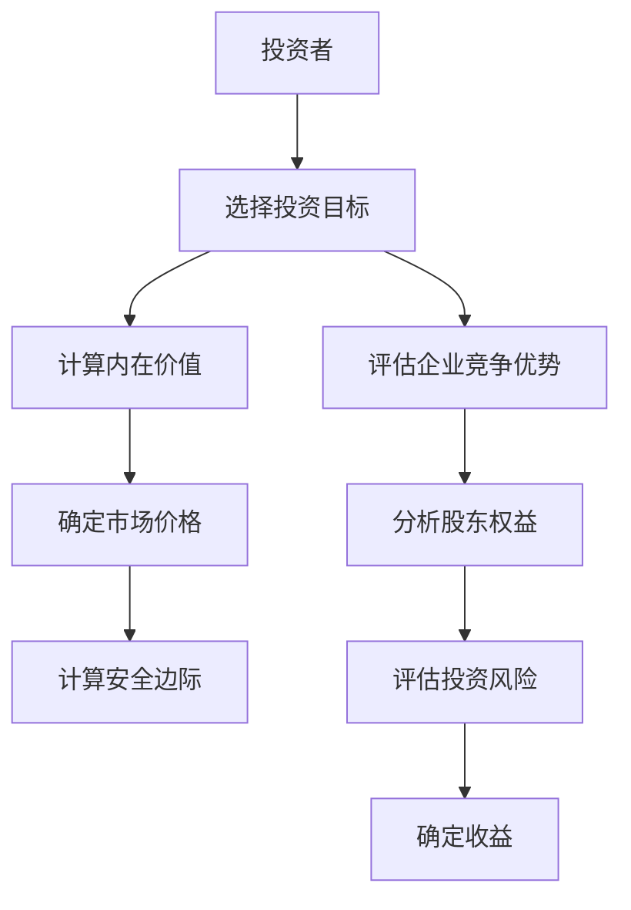
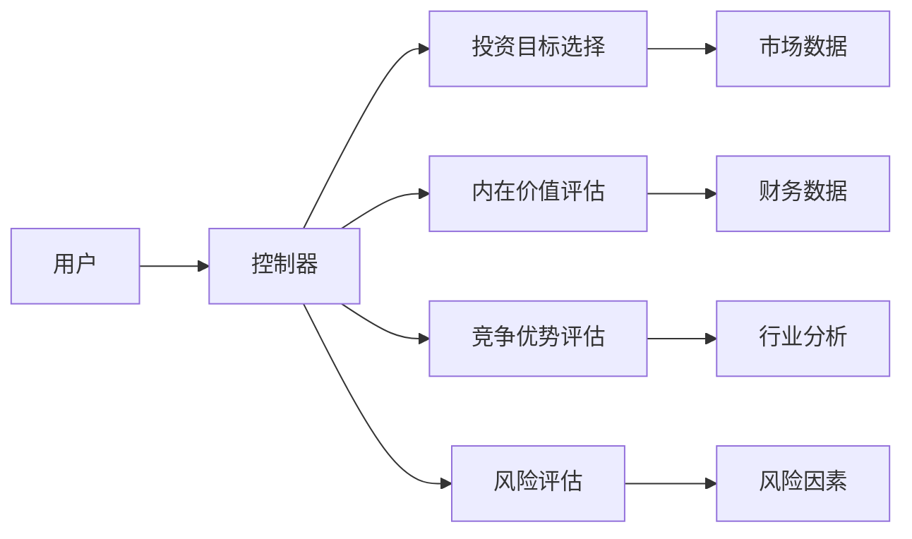

                 


# 费雪的十五个投资点：选股的黄金法则

> 关键词：投资学、选股法则、费雪投资理论、价值投资、投资策略、风险管理

> 摘要：本文深入分析了费雪的投资理论，探讨了其核心概念、算法原理、系统架构及实际应用。通过详细解读费雪的十五个投资点，结合数学模型、流程图和案例分析，为读者提供系统化、实用化的投资策略。

---

## 目录

### 第一部分：费雪投资点的背景与核心概念

#### 第1章：费雪投资点的背景介绍

##### 1.1 费雪投资理论的起源与发展
- 1.1.1 费雪投资理论的起源
- 1.1.2 费雪投资理论的核心思想
- 1.1.3 费雪投资理论的现代发展

##### 1.2 费雪投资点的定义与特点
- 1.2.1 费雪投资点的定义
- 1.2.2 费雪投资点的核心特点
- 1.2.3 费雪投资点与传统投资方法的区别

##### 1.3 费雪投资点的背景与问题背景
- 1.3.1 投资者面临的选股问题
- 1.3.2 费雪投资点的提出背景
- 1.3.3 费雪投资点的解决思路

##### 1.4 费雪投资点的边界与外延
- 1.4.1 费雪投资点的适用范围
- 1.4.2 费雪投资点的局限性
- 1.4.3 费雪投资点与其他投资理论的联系

##### 1.5 费雪投资点的概念结构与核心要素
- 1.5.1 费雪投资点的核心要素
- 1.5.2 费雪投资点的概念结构
- 1.5.3 费雪投资点的数学模型

#### 第2章：费雪投资点的核心概念与联系

##### 2.1 费雪投资点的核心概念
- 2.1.1 投资安全边际
- 2.1.2 企业竞争优势
- 2.1.3 股东权益
- 2.1.4 投资风险与收益

##### 2.2 费雪投资点的属性特征对比表格
| 投资点 | 定义 | 特点 | 适用场景 |
|--------|------|------|----------|
| 安全边际 | 投资价格低于内在价值 | 高风险承受能力 | 市场低迷时 |
| 竞争优势 | 企业独特优势 | 长期盈利能力 | 行业龙头 |
| 股东权益 | 股东的净值 | 企业价值核心 | 资产负债表分析 |
| 风险与收益 | 投资回报与风险 | 风险与收益匹配 | 投资者风险偏好 |

##### 2.3 费雪投资点的ER实体关系图


#### 第3章：费雪投资点的算法原理讲解

##### 3.1 费雪投资点的算法概述
- 3.1.1 投资安全边际计算
- 3.1.2 企业竞争优势评估
- 3.1.3 股东权益分析

##### 3.2 费雪投资点的数学模型与公式
- 3.2.1 安全边际计算公式
  $$ \text{安全边际} = \text{内在价值} - \text{市场价格} $$
- 3.2.2 企业竞争优势评估公式
  $$ \text{竞争优势} = \frac{\text{净利润增长率} + \text{ROE}}{2} $$
- 3.2.3 股东权益分析公式
  $$ \text{股东权益} = \text{资产} - \text{负债} $$`

##### 3.3 费雪投资点的算法流程图


#### 第4章：费雪投资点的系统分析与架构设计

##### 4.1 系统功能设计
- 4.1.1 投资目标选择模块
- 4.1.2 内在价值评估模块
- 4.1.3 安全边际计算模块
- 4.1.4 企业竞争优势评估模块

##### 4.2 系统架构设计


##### 4.3 系统接口设计
- 接口1：获取市场数据
- 接口2：计算内在价值
- 接口3：评估竞争优势
- 接口4：评估投资风险

#### 第5章：项目实战——基于费雪投资点的选股系统实现

##### 5.1 环境安装
- Python 3.8+
- 数据分析库（Pandas、NumPy）
- 绘图库（Matplotlib、Seaborn）
- 机器学习库（Scikit-learn）

##### 5.2 核心实现代码
```python
import pandas as pd
import numpy as np

def calculate_intrinsic_value(finance_data):
    # 示例：简单计算内在价值的方法
    return finance_data['Revenue'] * 0.5  # 简单假设，实际方法更复杂

def assess_competitive_edge(finance_data, industry_data):
    roe = finance_data['ROE']
    growth_rate = finance_data['NetProfitGrowthRate']
    industry_avg_roe = industry_data['AverageROE']
    industry_avg_growth = industry_data['AverageGrowthRate']
    competitive_edge = (roe > industry_avg_roe) & (growth_rate > industry_avg_growth)
    return competitive_edge

# 示例数据加载
finance_data = pd.read_csv('finance.csv')
industry_data = pd.read_csv('industry.csv')

# 核心计算
intrinsic_value = calculate_intrinsic_value(finance_data)
competitive_edge = assess_competitive_edge(finance_data, industry_data)
```

##### 5.3 实际案例分析与解读
- 案例1：分析某行业龙头公司的投资价值
- 案例2：评估新兴企业的竞争优势
- 案例3：计算安全边际并制定投资策略

##### 5.4 项目小结
- 项目实现的核心成果
- 实际应用中的注意事项
- 进一步优化的方向

#### 第6章：最佳实践与风险管理

##### 6.1 投资策略中的最佳实践
- 长期投资的重要性
- 分散投资的风险管理
- 定期复评估与调整

##### 6.2 费雪投资点的注意事项
- 数据质量的重要性
- 模型假设的局限性
- 市场波动的不可预测性

##### 6.3 风险管理策略
- 设置止损点
- 资产配置的优化
- 定期回顾与调整投资组合

#### 第7章：总结与拓展阅读

##### 7.1 本章总结
- 费雪投资点的核心思想
- 实际应用中的关键点
- 未来发展的潜力

##### 7.2 拓展阅读建议
- 推荐书籍：《价值投资：从格雷厄姆到巴菲特》
- 推荐博客：知名投资博主的分析文章
- 推荐工具：投资分析软件和数据平台

### 作者：AI天才研究院/AI Genius Institute & 禅与计算机程序设计艺术 /Zen And The Art of Computer Programming

