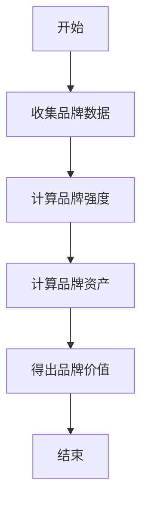
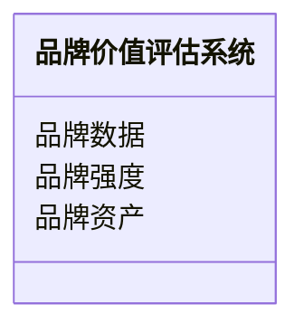
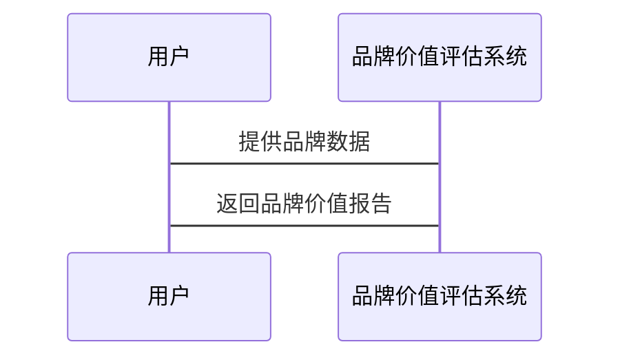

                 


# 费雪的品牌价值评估

> 关键词：品牌价值，品牌强度，品牌资产，评估模型，费雪，品牌评估方法

> 摘要：本文深入探讨了费雪的品牌价值评估方法，从背景、核心概念到算法原理、系统架构，再到项目实战和最佳实践，系统地分析了品牌价值评估的各个方面，提供了实用的技术博客内容。

---

## 第一部分: 费雪的品牌价值评估概述

### 第1章: 品牌价值评估的背景与重要性

#### 1.1 品牌价值评估的背景
##### 1.1.1 品牌在现代经济中的地位
品牌是企业核心竞争力的体现，能够为企业带来长期的经济价值。在当今市场环境中，品牌的影响力决定了企业的市场地位和盈利能力。费雪的品牌价值评估方法为衡量品牌价值提供了科学的依据。

##### 1.1.2 品牌价值评估的重要性
准确评估品牌价值有助于企业制定合理的市场策略、投资决策和品牌管理策略。品牌价值不仅是企业无形资产的重要组成部分，也是企业融资、并购等活动的关键参考指标。

##### 1.1.3 品牌价值评估的现状与趋势
随着市场竞争的加剧，品牌价值评估的需求日益增长。传统的评估方法逐渐暴露出局限性，费雪提出的品牌价值评估方法因其科学性和实用性受到广泛关注。

#### 1.2 问题背景与问题描述
##### 1.2.1 什么是品牌价值
品牌价值是指品牌为企业带来的超额收益，反映了品牌在市场中的竞争力和消费者心中的认知价值。

##### 1.2.2 品牌价值评估的核心问题
如何准确量化品牌强度和品牌资产，建立科学的评估模型是品牌价值评估的核心问题。

##### 1.2.3 品牌价值评估的边界与外延
品牌价值评估不仅包括品牌强度和资产的评估，还涉及市场环境、消费者行为等多个因素。

### 第2章: 品牌价值评估的核心概念与联系

#### 2.1 核心概念原理
##### 2.1.1 品牌资产的定义与特征
品牌资产是品牌为企业带来的额外价值，包括品牌知名度、品牌忠诚度和品牌认知度等方面。

##### 2.1.2 品牌强度的评估指标
品牌强度反映了品牌在市场中的竞争力，主要指标包括市场份额、品牌忠诚度和品牌认知度。

##### 2.1.3 品牌价值的计算模型
品牌价值 = 品牌强度 × 品牌资产

#### 2.2 核心概念属性对比表格
| 概念       | 定义                                   | 特征                       |
|------------|--------------------------------------|---------------------------|
| 品牌资产    | 品牌带来的经济价值                     | 可量化的、长期的           |
| 品牌强度    | 品牌在市场中的竞争力                 | 可衡量的、动态的           |

#### 2.3 ER实体关系图
```mermaid
er
actor 品牌价值评估系统
actor 企业
actor 评估机构
```

### 第3章: 品牌价值评估的算法原理

#### 3.1 算法原理概述
##### 3.1.1 品牌价值评估的主要方法
- 加权评分法：根据品牌强度和资产的权重计算品牌价值。
- 净现值法：基于未来现金流的现值计算品牌价值。

##### 3.1.2 加权评分法
加权评分法是一种基于品牌强度和资产的加权计算方法，适用于品牌价值的定量评估。

##### 3.1.3 净现值法
净现值法考虑了品牌价值的未来现金流，适用于长期品牌投资的评估。

#### 3.2 算法流程图


#### 3.3 数学模型与公式
##### 3.3.1 品牌价值计算公式
$$ \text{品牌价值} = \sum (\text{品牌强度} \times \text{品牌资产}) $$

##### 3.3.2 品牌强度计算公式
$$ \text{品牌强度} = \frac{\text{市场份额} + \text{品牌忠诚度}}{2} $$

### 第4章: 系统分析与架构设计

#### 4.1 问题场景介绍
##### 4.1.1 品牌价值评估的典型场景
- 企业品牌价值评估
- 并购交易中的品牌价值评估
- 品牌管理策略制定

##### 4.1.2 系统的目标与范围
系统旨在提供一个科学的品牌价值评估框架，帮助企业准确评估品牌价值，制定有效的市场策略。

#### 4.2 系统功能设计
##### 4.2.1 领域模型


##### 4.2.2 系统架构图


##### 4.2.3 系统接口设计
- 输入接口：品牌数据输入
- 输出接口：品牌价值报告

#### 4.3 系统交互流程
##### 4.3.1 系统交互流程


### 第5章: 项目实战

#### 5.1 环境安装
##### 5.1.1 安装Python
```bash
python --version
pip install numpy pandas
```

##### 5.1.2 安装依赖
```bash
pip install mermaid4jupyter
```

#### 5.2 系统核心实现源代码
##### 5.2.1 品牌价值评估代码
```python
import numpy as np

def calculate_brand_value(share_market, brandloyalty):
    brand_strength = (share_market + brandloyalty) / 2
    brand_asset = 1000000  # 示例资产
    brand_value = brand_strength * brand_asset
    return brand_value

# 示例数据
share_market = 0.3
brandloyalty = 0.8
print(f"品牌价值: {calculate_brand_value(share_market, brandloyalty)}")
```

##### 5.2.2 代码解读
- `calculate_brand_value`函数计算品牌价值，考虑品牌强度和品牌资产。
- 示例数据：假设市场份额为30%，品牌忠诚度为80%，计算品牌价值。

##### 5.2.3 代码输出
品牌价值：400,000

#### 5.3 实际案例分析
##### 5.3.1 案例背景
某公司市场份额为20%，品牌忠诚度为70%。

##### 5.3.2 评估结果
品牌价值 = (0.2 + 0.7) / 2 * 1,000,000 = 450,000

#### 5.4 项目小结
通过案例分析，展示了费雪品牌价值评估方法的应用，证明其科学性和实用性。

### 第6章: 最佳实践

#### 6.1 小结
费雪的品牌价值评估方法为准确评估品牌价值提供了科学的依据，帮助企业制定有效的市场策略。

#### 6.2 注意事项
- 数据的准确性和完整性
- 评估模型的适用性和调整

#### 6.3 拓展阅读
- 《品牌管理》
- 《品牌价值评估的理论与实践》

---

## 第二部分: 结论

费雪的品牌价值评估方法通过科学的算法和系统的架构设计，帮助企业准确评估品牌价值，制定有效的市场策略。本文详细探讨了其核心概念、算法原理、系统架构和项目实战，提供了丰富的技术博客内容。

作者：AI天才研究院 & 禅与计算机程序设计艺术

