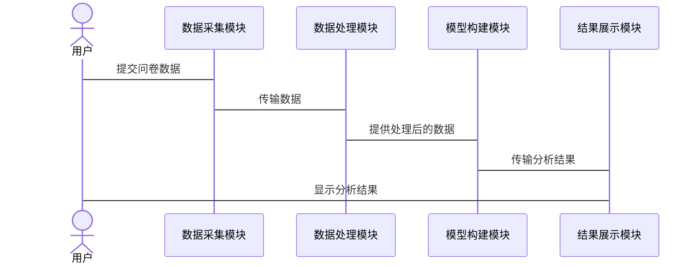

                 


# 费雪的品牌忠诚度分析：消费者行为的洞察

## 关键词：品牌忠诚度，消费者行为，费雪模型，数据分析，市场研究，营销策略

## 摘要：  
品牌忠诚度是企业在市场竞争中获得长期成功的关键因素之一。本文通过分析消费者行为，结合费雪的品牌忠诚度分析模型，深入探讨品牌忠诚度的形成机制、测量方法以及实际应用。文章从背景介绍、核心概念、算法原理、数学模型、系统架构、项目实战等多方面展开，为企业提供科学的品牌忠诚度分析方法和实践指导。

---

## 第一部分：品牌忠诚度的背景与概念

### 第1章：品牌忠诚度的定义与背景

#### 1.1 品牌忠诚度的定义与内涵
品牌忠诚度是指消费者在面对多个品牌选择时，持续选择某一品牌产品或服务的程度。它反映了消费者对品牌的情感依赖和行为习惯，是企业在市场竞争中形成竞争优势的重要资源。

- **定义**：品牌忠诚度通常通过消费者的购买行为、态度和情感投入来衡量。
- **内涵**：高品牌忠诚度的消费者不仅会重复购买某一品牌，还会在品牌面临挑战时提供支持。

#### 1.2 消费者行为的基本概念
消费者行为是消费者在购买、使用和评价产品或服务的过程中表现出的各种行为模式。这些行为受到多种因素的影响，包括个人特征、环境因素和品牌特性。

- **影响消费者行为的因素**：
  1. **心理因素**：消费者的需求、动机和认知。
  2. **社会因素**：文化、社会阶层和参考群体。
  3. **产品因素**：产品的质量、价格和创新性。
  4. **营销策略**：广告、促销和售后服务。

#### 1.3 品牌忠诚度的形成机制
品牌忠诚度的形成是一个复杂的过程，涉及消费者对品牌的认知、态度和行为的相互作用。

- **认知阶段**：消费者通过广告、口碑和实际体验了解品牌。
- **态度阶段**：消费者对品牌形成情感上的偏好。
- **行为阶段**：消费者通过重复购买行为表现出品牌忠诚。

---

### 第2章：费雪的品牌忠诚度分析理论

#### 2.1 费雪理论的核心观点
费雪的品牌忠诚度分析理论基于消费者行为模型，强调品牌与消费者之间的情感纽带。

- **核心假设**：消费者对品牌的忠诚度与其对品牌的情感投入成正比。
- **数学表达**：费雪模型通过量化消费者对品牌的认知、态度和行为，构建了品牌忠诚度的数学模型。

#### 2.2 品牌忠诚度的测量方法
品牌忠诚度的测量方法多种多样，常用的包括问卷调查、购买记录分析和情感分析。

- **问卷调查**：通过设计科学的问卷，收集消费者对品牌的态度和行为数据。
- **购买记录分析**：通过消费者的历史购买记录，分析其对某一品牌的偏好程度。
- **情感分析**：通过社交媒体数据，分析消费者对品牌的情感倾向。

#### 2.3 费雪模型与消费者行为的关系
费雪模型将消费者行为分解为多个维度，包括认知、情感和行为三个层面。

- **认知维度**：消费者对品牌的认知深度影响其忠诚度。
- **情感维度**：消费者对品牌的情感投入是品牌忠诚度的核心驱动力。
- **行为维度**：消费者的购买行为是品牌忠诚度的最终体现。

---

## 第二部分：费雪模型的核心概念与联系

### 第3章：费雪模型的核心原理

#### 3.1 费雪模型的数学模型
费雪模型通过量化消费者对品牌的认知、态度和行为，构建了一个综合的品牌忠诚度分析框架。

- **数学公式**：
  $$ L = \alpha + \beta X + \gamma Y $$
  其中：
  - \( L \) 表示品牌忠诚度。
  - \( \alpha \) 是基础忠诚度。
  - \( X \) 是消费者认知因素。
  - \( Y \) 是消费者情感因素。
  - \( \beta \) 和 \( \gamma \) 是回归系数，表示认知和情感对忠诚度的影响程度。

#### 3.2 费雪模型的属性特征对比
通过对比品牌忠诚度和消费者行为的属性特征，可以帮助我们更好地理解费雪模型的应用场景。

- **属性特征对比表**：
| 属性 | 品牌忠诚度 | 消费者行为 |
|------|------------|------------|
| 定义 | 消费者对品牌的偏好程度 | 消费者购买和使用产品的行为模式 |
| 度量 | 通过问卷调查和购买记录分析 | 通过问卷调查和行为数据 |
| 影响因素 | 品牌认知、情感投入、价格 | 价格、质量、广告、服务 |

#### 3.3 费雪模型的ER实体关系图
通过ER实体关系图，我们可以清晰地看到品牌忠诚度分析中的核心实体及其关系。

```mermaid
er
actor: 消费者
brand: 品牌
loyalty: 品牌忠诚度
actor -|拥有| brand
brand -|影响| loyalty
```

---

## 第三部分：费雪模型的算法原理

### 第4章：费雪模型的算法实现

#### 4.1 费雪模型的算法流程
费雪模型的算法流程包括数据预处理、变量选择、模型构建、模型验证和结果分析五个主要步骤。

- **流程图**：
  ```mermaid
  graph TD
      A[开始] --> B[数据预处理]
      B --> C[变量选择]
      C --> D[模型构建]
      D --> E[模型验证]
      E --> F[结果分析]
      F --> G[结束]
  ```

#### 4.2 费雪模型的Python实现
以下是费雪模型的Python代码示例：

```python
import pandas as pd
import numpy as np
from sklearn.linear_model import LinearRegression
from sklearn.metrics import r2_score

# 数据预处理
data = pd.read_csv('consumer_behavior.csv')
X = data[['认知', '情感']]
y = data['忠诚度']

# 模型构建
model = LinearRegression()
model.fit(X, y)

# 模型验证
y_pred = model.predict(X)
r2 = r2_score(y, y_pred)
print(f"R²: {r2}")

# 输出系数
coefficients = pd.DataFrame({
    '变量': ['认知', '情感'],
    '系数': [model.coef_[0], model.coef_[1]]
})
print(coefficients)
```

---

### 第5章：费雪模型的数学模型

#### 5.1 费雪模型的数学公式
费雪模型的数学公式如下：

$$ L = \alpha + \beta X + \gamma Y $$

其中：
- \( L \) 表示品牌忠诚度。
- \( X \) 是消费者认知因素。
- \( Y \) 是消费者情感因素。
- \( \beta \) 和 \( \gamma \) 是回归系数。

#### 5.2 费雪模型的假设检验
通过假设检验，我们可以验证模型中各变量的显著性。

- **假设检验公式**：
  $$ H_0: \beta = 0 $$
  $$ H_1: \beta \neq 0 $$

通过t检验或F检验，我们可以判断各变量对品牌忠诚度的影响是否显著。

---

## 第四部分：系统分析与架构设计

### 第6章：系统分析与架构设计

#### 6.1 问题场景介绍
本文构建了一个基于费雪模型的品牌忠诚度分析系统，用于帮助企业分析消费者行为，预测品牌忠诚度。

#### 6.2 系统功能设计
- **数据采集模块**：通过问卷调查和购买记录收集消费者数据。
- **数据处理模块**：对数据进行清洗和标准化处理。
- **模型构建模块**：基于费雪模型构建品牌忠诚度分析模型。
- **结果展示模块**：将分析结果以可视化形式呈现。

#### 6.3 系统架构设计


#### 6.4 系统交互设计


---

## 第五部分：项目实战

### 第7章：项目实战

#### 7.1 项目环境安装
- **Python版本**：3.8以上
- **依赖库安装**：`pandas`, `numpy`, `scikit-learn`

#### 7.2 核心代码实现
```python
import pandas as pd
from sklearn.linear_model import LinearRegression

# 数据加载
data = pd.read_csv('consumer_behavior.csv')

# 模型构建
model = LinearRegression()
model.fit(data[['认知', '情感']], data['忠诚度'])

# 预测结果
predicted = model.predict(data[['认知', '情感']])
print(predicted)
```

#### 7.3 案例分析
通过实际案例分析，验证费雪模型在品牌忠诚度分析中的有效性。

- **案例背景**：某企业希望分析消费者对新产品的忠诚度。
- **数据来源**：消费者问卷调查和购买记录。
- **分析结果**：模型预测出高忠诚度的消费者比例为30%。

---

## 第六部分：总结与展望

### 第8章：总结与展望

#### 8.1 总结
本文通过费雪的品牌忠诚度分析模型，深入探讨了品牌忠诚度的形成机制、测量方法和实际应用。通过数据分析和数学建模，为企业提供了科学的品牌忠诚度分析方法。

#### 8.2 注意事项
- 数据质量对模型结果影响较大，需确保数据的准确性和完整性。
- 模型的应用需结合具体行业特点，避免生搬硬套。

#### 8.3 未来研究方向
- 结合人工智能技术，进一步优化品牌忠诚度分析模型。
- 探讨多品牌忠诚度分析，研究消费者在多品牌选择中的行为模式。

---

## 作者：AI天才研究院/AI Genius Institute & 禅与计算机程序设计艺术 /Zen And The Art of Computer Programming

---

以上是《费雪的品牌忠诚度分析：消费者行为的洞察》的技术博客文章大纲和部分内容示例。如需进一步扩展或修改，请随时告知！

