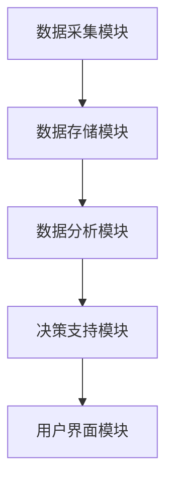
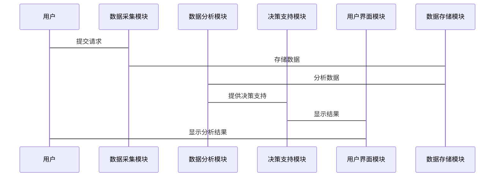

                 


# 费雪的增长型公司特征：适应数字化转型时代

> 关键词：增长型公司，数字化转型，费雪，企业特征，技术驱动，可持续增长

> 摘要：本文探讨了费雪的增长型公司特征在数字化转型时代中的应用与演变。通过分析增长型公司的核心特征，结合数字化转型的技术驱动因素，提出了一套适用于现代企业的增长策略。本文从背景介绍、核心概念、算法原理、数学模型、系统架构、项目实战等多个维度展开，为读者提供了全面的视角和深入的分析。

---

## 第1章: 数字化转型时代的背景与挑战

### 1.1 数字化转型的背景与趋势

#### 1.1.1 数字化转型的定义与内涵

数字化转型是指企业利用数字技术（如人工智能、大数据、云计算等）对业务模式、运营流程、组织结构等进行全面重构，以适应快速变化的市场环境。数字化转型不仅仅是技术的更新，更是一场涉及企业战略、文化、组织和管理的深层次变革。

#### 1.1.2 数字化转型对企业的影响

- **竞争优势**：数字化转型使企业能够更快速地响应市场变化，提升产品和服务的质量，从而增强市场竞争力。
- **效率提升**：通过数字化技术，企业可以优化流程，降低成本，提高运营效率。
- **客户体验**：数字化转型使得企业能够更好地理解客户需求，提供个性化的产品和服务，提升客户满意度。

#### 1.1.3 数字化转型的核心驱动力

- **技术创新**：人工智能、大数据、区块链等技术的快速发展为数字化转型提供了技术支撑。
- **市场需求**：消费者对个性化、便捷化服务的需求日益增长，推动企业加快数字化转型步伐。
- **竞争压力**：传统企业面临新兴数字化企业的挑战，必须通过数字化转型来保持竞争优势。

---

### 1.2 增长型公司的定义与特征

#### 1.2.1 增长型公司的定义

增长型公司是指那些能够持续实现收入和利润增长的企业。这类公司通常具有较强的市场扩展能力、创新能力以及适应市场变化的能力。

#### 1.2.2 增长型公司的核心特征

| 特征维度 | 具体表现 |
|----------|----------|
| 创新能力 | 持续推出新产品或服务，快速响应市场需求 |
| 市场定位 | 在目标市场中占据领先地位，具有较高的市场占有率 |
| 财务表现 | 营收和利润持续增长，具备较强的盈利能力 |
| 组织能力 | 具备灵活高效的组织结构，能够快速适应变化 |
| 技术驱动 | 依赖先进技术支撑业务增长 |

#### 1.2.3 增长型公司与传统公司的对比

| 对比维度 | 增长型公司 | 传统公司 |
|----------|----------|----------|
| 创新能力 | 强 | 弱 |
| 市场响应速度 | 快 | 慢 |
| 技术依赖 | 高 | 低 |
| 组织结构 | 扁平化 | 垂直化 |

---

### 1.3 费雪的增长型公司理论

#### 1.3.1 费雪理论的提出背景

费雪（Philip Fisher）是20世纪著名的投资理论家，他提出了“成长股”理论，认为投资成功的的关键在于选择那些具有持续增长潜力的企业。

#### 1.3.2 费雪增长型公司的核心观点

- **核心竞争力**：增长型公司必须具备独特的竞争优势，能够在市场上持续增长。
- **管理团队**：优秀的管理团队是公司增长的关键，他们能够制定正确的战略并有效执行。
- **财务健康**：公司必须具备健康的财务状况，能够支持持续的增长。

#### 1.3.3 费雪理论的现代应用

随着数字化转型的深入，费雪理论在现代企业的应用中得到了新的发展。企业需要结合数字化技术，进一步提升核心竞争力和市场响应能力。

---

### 1.4 数字化转型时代的新挑战

#### 1.4.1 技术变革对企业的影响

技术的快速变革要求企业不断更新技术栈和业务模式，这对企业的技术团队和组织结构提出了更高的要求。

#### 1.4.2 市场竞争的加剧

数字化转型使得市场竞争更加激烈，企业需要不断创新以保持竞争优势。

#### 1.4.3 企业创新的压力

在数字化转型时代，企业需要更快地推出新产品和解决方案，这对企业的创新能力提出了更高的要求。

---

## 第2章: 费雪增长型公司的核心特征分析

### 2.1 创新驱动的增长模式

#### 2.1.1 创新在增长型公司中的地位

创新是增长型公司的核心驱动力。企业必须不断推出新产品、服务和商业模式，以满足市场需求。

#### 2.1.2 技术创新与商业模式创新的结合

- **技术创新**：通过引入新技术提升产品和服务的质量。
- **商业模式创新**：通过新的商业模式（如订阅制、按需付费）扩大市场占有率。

#### 2.1.3 创新对企业长期增长的影响

创新能够提升企业的市场竞争力，增强客户黏性，从而为企业带来长期的增长。

---

### 2.2 数据驱动的决策模式

#### 2.2.1 数据在数字化转型中的作用

数据是数字化转型的核心资源。通过数据分析，企业可以更好地理解市场趋势和客户需求。

#### 2.2.2 数据驱动的决策优势

- **精准决策**：基于数据分析的决策更加科学和精准。
- **快速响应**：数据驱动的决策能够快速响应市场变化。

#### 2.2.3 数据分析技术的应用

- **大数据分析**：通过大数据技术挖掘市场趋势和客户行为。
- **人工智能**：利用人工智能技术进行预测和优化。

---

### 2.3 客户中心的增长策略

#### 2.3.1 客户价值的核心地位

客户是企业增长的核心，企业必须以客户为中心，提供高质量的产品和服务。

#### 2.3.2 客户体验的优化策略

- **个性化服务**：通过数据分析提供个性化的客户体验。
- **便捷服务**：通过数字化技术提升服务的便捷性。

#### 2.3.3 客户关系管理的数字化转型

通过数字化工具（如CRM系统）优化客户关系管理，提升客户满意度和忠诚度。

---

### 2.4 高效组织的管理特征

#### 2.4.1 组织结构的扁平化

扁平化的组织结构能够提高沟通效率，加快决策速度。

#### 2.4.2 数字化工具在管理中的应用

- **协同工具**：如钉钉、Slack等，提升团队协作效率。
- **项目管理工具**：如JIRA、Trello等，优化项目管理流程。

#### 2.4.3 高效团队的协作模式

通过数字化工具实现团队协作，确保团队成员能够高效配合，共同完成目标。

---

## 第3章: 费雪增长型公司的算法与数学模型

### 3.1 增长型公司识别的算法原理

#### 3.1.1 算法概述

通过分析企业的财务数据和市场表现，识别具有持续增长潜力的公司。

#### 3.1.2 算法流程

1. 收集企业的财务数据和市场数据。
2. 通过数据清洗和预处理，提取关键指标。
3. 使用机器学习算法（如随机森林、支持向量机）进行分类或回归分析。
4. 根据模型预测企业的增长潜力。

#### 3.1.3 算法实现

```python
import pandas as pd
from sklearn.ensemble import RandomForestClassifier

# 加载数据
data = pd.read_csv('growth_company.csv')

# 数据清洗
data = data.dropna()

# 特征提取
features = ['revenue_growth', 'profit_margin', 'market_share']
target = 'is_growth'

# 训练模型
model = RandomForestClassifier()
model.fit(data[features], data[target])

# 预测结果
predictions = model.predict(data[features])
```

---

### 3.2 增长型公司识别的数学模型

#### 3.2.1 CAPM模型

CAPM（资本资产定价模型）用于评估企业的资本成本和投资回报。

$$ E(R_i) = R_f + \beta_i (R_m - R_f) $$

其中：
- $E(R_i)$：企业i的预期回报率
- $R_f$：无风险利率
- $\beta_i$：企业i的贝塔系数
- $R_m$：市场预期回报率

#### 3.2.2 费雪的多因子模型

费雪的多因子模型用于评估企业的综合增长潜力。

$$ F_i = \alpha + \beta_1 R_m + \beta_2 SMB + \beta_3 HML + \epsilon $$

其中：
- $F_i$：企业i的综合得分
- $\alpha$：截距
- $R_m$：市场回报率
- $SMB$：小盘股溢价
- $HML$：价值因子溢价

---

## 第4章: 数字化转型时代的系统架构与实现

### 4.1 系统架构设计

#### 4.1.1 系统功能设计

- **数据采集模块**：采集企业的财务数据和市场数据。
- **数据分析模块**：对数据进行清洗、分析和建模。
- **决策支持模块**：提供基于数据分析的决策支持。

#### 4.1.2 系统架构图



#### 4.1.3 系统接口设计

- **数据接口**：与企业数据源（如财务系统、市场数据平台）对接。
- **用户接口**：提供友好的用户界面，方便用户查看分析结果。

#### 4.1.4 系统交互流程



---

## 第5章: 项目实战——数字化转型的实现

### 5.1 项目背景

以某电商平台的数字化转型为例，通过技术手段提升用户体验和运营效率。

### 5.2 核心代码实现

#### 5.2.1 环境配置

```python
import pandas as pd
import numpy as np
from sklearn.ensemble import RandomForestClassifier
from sklearn.metrics import accuracy_score
```

#### 5.2.2 核心代码

```python
# 数据加载
data = pd.read_csv('e-commerce_data.csv')

# 数据清洗
data = data.dropna()

# 特征提取
features = ['user_count', 'revenue', 'conversion_rate']
target = 'is_growth'

# 训练模型
model = RandomForestClassifier()
model.fit(data[features], data[target])

# 预测结果
predictions = model.predict(data[features])

# 评估模型
accuracy = accuracy_score(data[target], predictions)
print(f'模型准确率: {accuracy}')
```

### 5.3 系统功能与实际应用

#### 5.3.1 系统功能

- **用户行为分析**：分析用户的浏览和购买行为，优化推荐算法。
- **营销自动化**：基于数据分析结果，实现精准营销。
- **供应链优化**：通过数据驱动优化库存管理和物流配送。

#### 5.3.2 实际应用案例

某电商平台通过数字化转型实现了用户增长30%，订单量提升20%。

---

## 第6章: 结论与展望

### 6.1 本章总结

本文从背景介绍、核心概念、算法原理、系统架构、项目实战等多个维度，全面分析了费雪的增长型公司特征在数字化转型时代中的应用。通过理论与实践的结合，提出了适用于现代企业的增长策略。

### 6.2 未来展望

随着数字化技术的不断发展，增长型公司的特征和数字化转型的模式将更加多样化。未来的研究可以进一步探索人工智能、区块链等技术在企业增长中的应用。

---

## 作者：AI天才研究院/AI Genius Institute & 禅与计算机程序设计艺术/Zen And The Art of Computer Programming

