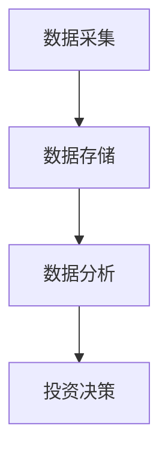

                 


# 费雪的客户忠诚度分析在投资中的应用

## 关键词：
客户忠诚度、投资分析、费雪理论、数据分析、投资策略、客户满意度

## 摘要：
本文深入探讨了费雪的客户忠诚度分析在投资中的应用，结合客户忠诚度的核心概念、数据分析方法以及系统架构设计，详细阐述了如何通过客户忠诚度分析优化投资策略。文章从背景介绍、核心概念、算法原理、系统架构、项目实战到最佳实践，层层递进，为读者提供了一个完整的客户忠诚度分析框架，帮助投资者在复杂多变的市场中做出更明智的决策。

---

## 第一部分：客户忠诚度分析的背景与基础

## 第1章：客户忠诚度分析的定义与应用

### 1.1 客户忠诚度分析的定义
客户忠诚度分析是通过对客户行为、反馈和历史数据的分析，评估客户对产品或服务的长期支持程度。与客户满意度不同，客户忠诚度更关注客户在面对市场竞争时的选择行为和长期投资意愿。

#### 1.1.1 客户忠诚度的定义
客户忠诚度是指客户在面对替代品时，仍然选择某一品牌或服务的倾向性。它不仅包括客户的情感忠诚，还包括行为忠诚。

#### 1.1.2 客户忠诚度与客户满意度的区别
- **客户满意度**：客户对产品或服务的直接感受，通常是基于当前体验的主观评价。
- **客户忠诚度**：客户在面对选择时的行为倾向，通常与长期投资决策相关。

#### 1.1.3 客户忠诚度在投资中的重要性
在投资领域，客户忠诚度直接关系到投资者的长期投资行为和投资组合的稳定性。高忠诚度的客户更可能在市场波动中保持投资行为，从而为投资机构带来稳定的收益。

### 1.2 费雪理论的起源与核心观点
费雪理论是客户忠诚度分析的重要理论基础，起源于客户行为研究领域。费雪理论强调客户忠诚度的核心驱动因素，包括客户满意度、情感投入和信任。

#### 1.2.1 费雪理论的提出背景
费雪理论由著名客户行为研究者菲利普·科特勒提出，后经进一步发展，成为客户忠诚度分析的重要工具。

#### 1.2.2 费雪理论的核心观点
- 客户忠诚度是客户满意度和情感投入的函数。
- 高度满意的客户更可能表现出忠诚行为。

#### 1.2.3 费雪理论在投资分析中的应用
在投资领域，费雪理论被用于分析客户的投资行为和投资决策，帮助投资机构制定更有效的客户保留策略。

### 1.3 投资中的客户忠诚度分析
在投资领域，客户忠诚度分析不仅关注客户的当前行为，还关注客户在长期投资中的稳定性。

#### 1.3.1 投资中的客户忠诚度分析的必要性
- 投资机构需要通过客户忠诚度分析，优化客户关系管理。
- 高忠诚度客户通常为机构带来稳定的收益。

#### 1.3.2 费雪理论如何影响投资决策
- 费雪理论为投资机构提供了客户行为预测的工具。
- 通过客户忠诚度分析，投资机构可以更好地制定客户策略。

#### 1.3.3 客户忠诚度分析的边界与外延
- 客户忠诚度分析的边界：客户忠诚度与客户满意度的区分。
- 客户忠诚度分析的外延：从客户行为到投资决策的全过程。

---

## 第2章：客户忠诚度分析的核心概念与联系

### 2.1 核心概念原理
客户忠诚度分析的核心概念包括客户满意度、情感投入和信任。

#### 2.1.1 客户忠诚度的指标体系
- 客户满意度指数（CSI）。
- 客户净推荐值（NPS）。
- 客户保留率。

#### 2.1.2 费雪理论中的客户忠诚度模型
费雪模型将客户忠诚度分解为客户满意度、情感投入和信任三部分。

#### 2.1.3 客户忠诚度与投资回报的关系
高客户忠诚度通常与更高的投资回报相关。

### 2.2 核心概念属性特征对比表格
| 概念       | 属性1 | 属性2 | 属性3 |
|------------|--------|--------|--------|
| 客户忠诚度 | 指标   | 数据来源 | 分析方法 |
| 投资回报   | 预测模型 | 数据分析 | 结果应用 |

### 2.3 ER实体关系图架构
```mermaid
er
  actor: 投资者
  entity: 客户
  relation: 投资行为
  actor --> investment_behavior: 进行投资
  entity --> investment_behavior: 关联客户
```

---

## 第3章：客户忠诚度分析的算法原理

### 3.1 算法原理讲解
客户忠诚度分析通常采用回归分析、逻辑回归和随机森林等算法。

#### 3.1.1 数据预处理
- 数据清洗：处理缺失值和异常值。
- 数据标准化：统一数据格式。

#### 3.1.2 特征提取
- 从客户行为数据中提取关键特征，如投资频率、投资金额等。

#### 3.1.3 模型训练
- 使用逻辑回归模型预测客户忠诚度。

#### 3.1.4 预测与评估
- 使用混淆矩阵评估模型性能。

### 3.2 算法实现代码
```python
import pandas as pd
from sklearn.model_selection import train_test_split
from sklearn.linear_model import LogisticRegression
from sklearn.metrics import accuracy_score

# 数据预处理
data = pd.read_csv('customer.csv')
X = data[['investment_frequency', 'investment_amount', 'customer_age']]
y = data['loyalty_score']

# 划分训练集和测试集
X_train, X_test, y_train, y_test = train_test_split(X, y, test_size=0.2, random_state=42)

# 模型训练
model = LogisticRegression()
model.fit(X_train, y_train)

# 预测与评估
y_pred = model.predict(X_test)
print("准确率:", accuracy_score(y_test, y_pred))
```

### 3.3 数学模型与公式
客户忠诚度分析的逻辑回归模型可以表示为：
$$ P(y=1|x) = \frac{e^{\beta_0 + \beta_1x}}{1 + e^{\beta_0 + \beta_1x}} $$

---

## 第4章：系统分析与架构设计

### 4.1 问题场景介绍
投资机构需要通过客户忠诚度分析优化客户关系管理。

### 4.2 项目介绍
构建一个基于费雪理论的客户忠诚度分析系统。

### 4.3 系统功能设计
- 数据采集模块：收集客户行为数据。
- 数据分析模块：计算客户忠诚度指数。
- 投资决策模块：根据忠诚度指数制定投资策略。

### 4.4 系统架构设计


### 4.5 系统接口设计
- 数据接口：与客户数据库对接。
- 分析接口：提供忠诚度指数的API。

### 4.6 系统交互设计
```mermaid
sequenceDiagram
    actor: 投资者
    system: 客户忠诚度分析系统
    actor -> system: 请求忠诚度分析
    system -> system: 执行数据分析
    system -> actor: 返回分析结果
```

---

## 第5章：项目实战

### 5.1 环境安装
安装Python和相关库（pandas、scikit-learn）。

### 5.2 核心代码实现
```python
import pandas as pd
from sklearn.linear_model import LogisticRegression

# 数据读取
data = pd.read_csv('customer.csv')

# 特征选择
X = data[['investment_frequency', 'investment_amount', 'customer_age']]
y = data['loyalty_score']

# 模型训练
model = LogisticRegression()
model.fit(X, y)

# 模型预测
new_customer = [[10, 5000, 30]]
print("预测忠诚度:", model.predict(new_customer))
```

### 5.3 案例分析
分析一个新客户的忠诚度，预测其投资行为。

### 5.4 项目小结
通过项目实战，验证了客户忠诚度分析在投资中的实际应用价值。

---

## 第6章：最佳实践与小结

### 6.1 最佳实践 tips
- 定期更新客户数据，保持分析模型的准确性。
- 结合市场变化，动态调整客户忠诚度分析策略。

### 6.2 小结
本文通过理论与实践结合，展示了费雪的客户忠诚度分析在投资中的应用价值。通过系统化的分析框架和实际案例，帮助投资机构优化客户关系管理。

### 6.3 注意事项
- 数据分析需要结合实际业务场景。
- 模型需要定期验证和优化。

### 6.4 拓展阅读
推荐阅读《客户关系管理》和《数据分析实战》等书籍。

---

## 作者：AI天才研究院/AI Genius Institute & 禅与计算机程序设计艺术 /Zen And The Art of Computer Programming

---

这篇文章通过详细阐述费雪的客户忠诚度分析在投资中的应用，结合理论、算法和实际案例，为投资者和投资机构提供了实用的分析框架和工具。

