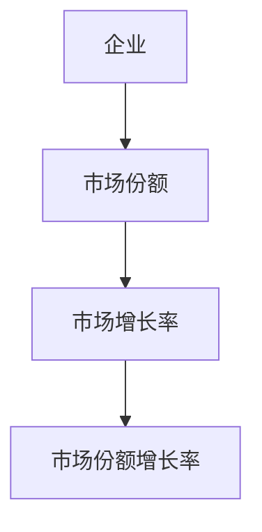
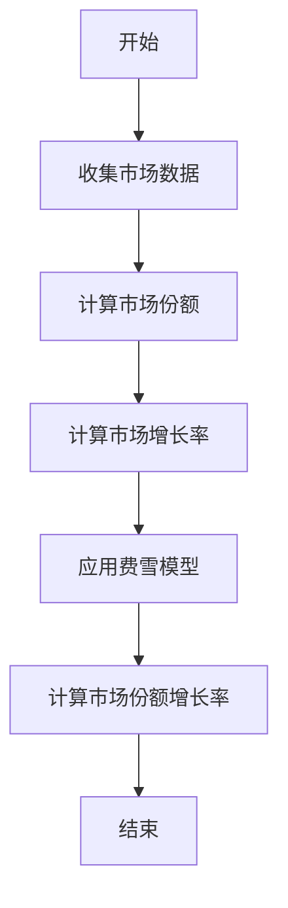

                 


# 费雪的市场份额增长分析方法

> 关键词：市场份额增长分析，费雪分析方法，市场增长率，市场份额计算，费雪模型

> 摘要：本文深入探讨了费雪的市场份额增长分析方法，从核心概念、数学模型、算法原理到系统架构设计、项目实战，全面解析了如何利用该方法分析企业市场份额增长情况。通过具体案例分析，展示了该方法在实际应用中的效果和价值。

---

# {{ 费雪的市场份额增长分析方法 }}

## 1. 费雪的市场份额增长分析方法概述

### 1.1 核心概念术语说明

- **市场份额（Market Share）**：企业产品在某一市场中的销售比例，通常以百分比表示。
- **市场增长率（Market Growth Rate）**：市场整体销售额或用户数量的增长速度。
- **市场份额增长率（Market Share Growth Rate）**：企业在市场中份额的变化速度，反映企业在竞争中的表现。

### 1.2 问题背景与问题描述

在商业竞争中，市场份额是衡量企业市场地位的重要指标。企业通过分析市场份额增长情况，可以评估自身在市场中的竞争力，预测未来的发展趋势。然而，如何科学地分析市场份额增长，一直是企业管理者和分析师关注的重点。

费雪的市场份额增长分析方法是一种基于市场份额和市场增长率的分析模型，旨在帮助企业预测未来市场份额的变化趋势，评估企业的市场表现。

### 1.3 费雪分析方法的核心思想

费雪的市场份额增长分析方法认为，企业的市场份额增长率不仅与市场整体增长率有关，还与企业在市场中的竞争地位和市场份额的变化密切相关。具体来说，企业的市场份额增长可以通过以下公式计算：

$$ \text{市场份额增长率} = \text{市场份额} \times \text{市场增长率} $$

### 1.4 边界与外延

- **边界**：市场份额增长分析仅适用于市场数据可获取的行业，且假设市场数据准确可靠。
- **外延**：该方法可以扩展应用于多个行业的市场份额分析，但需要结合具体行业特点进行调整。

### 1.5 核心要素组成

- **市场份额**：企业的销售量与行业总销售量的比值。
- **市场增长率**：行业整体销售额的增长速度。
- **市场份额增长率**：企业在市场中的份额变化速度。

---

## 2. 费雪分析方法的核心概念与联系

### 2.1 核心概念对比表

| 概念       | 定义与特征                     |
|------------|-------------------------------|
| 市场份额   | 企业产品在市场中的占比         |
| 市场增长率 | 市场整体销售额的增长速度       |
| 市场份额增长率 | 企业在市场中的份额变化速度 |

### 2.2 实体关系图



---

## 3. 费雪分析方法的算法原理

### 3.1 算法流程图



### 3.2 算法实现

以下是费雪分析方法的Python实现代码：

```python
import pandas as pd

# 假设市场数据存储在Excel文件中
data = pd.read_excel('market_data.xlsx')

# 计算市场份额
market_share = data['企业销售额'] / data['行业总销售额']

# 计算市场增长率
market_growth_rate = (data['当前市场份额'] - data['上一期市场份额']) / data['上一期市场份额']

# 应用费雪模型计算市场份额增长率
market_share_growth_rate = market_share * market_growth_rate
```

### 3.3 数学模型与公式

- **市场份额计算公式**：
  $$ \text{市场份额} = \frac{\text{企业销售额}}{\text{行业总销售额}} $$

- **市场增长率计算公式**：
  $$ \text{市场增长率} = \frac{\text{当前市场份额} - \text{上一期市场份额}}{\text{上一期市场份额}} $$

- **费雪模型公式**：
  $$ \text{市场份额增长率} = \text{市场份额} \times \text{市场增长率} $$

---

## 4. 费雪分析方法的系统架构设计

### 4.1 系统功能设计

- **数据收集模块**：收集企业的销售数据和行业数据。
- **数据处理模块**：计算市场份额和市场增长率。
- **分析模块**：应用费雪模型预测市场份额增长率。
- **可视化模块**：将分析结果以图表形式展示。

### 4.2 系统架构图


### 4.3 系统接口设计

- **输入接口**：企业销售数据和行业数据。
- **输出接口**：市场份额增长率报告。

---

## 5. 项目实战：费雪分析方法的行业应用

### 5.1 项目背景

以智能音箱行业为例，假设我们有以下市场数据：

| 企业名称 | 销售额（万元） | 行业总销售额（万元） |
|----------|----------------|-----------------------|
| 企业A    | 50             | 200                  |
| 企业B    | 70             | 200                  |
| 企业C    | 30             | 200                  |

### 5.2 数据处理

```python
import pandas as pd

# 创建数据框
data = pd.DataFrame({
    '企业名称': ['企业A', '企业B', '企业C'],
    '销售额': [50, 70, 30],
    '行业总销售额': [200, 200, 200]
})

# 计算市场份额
data['市场份额'] = data['销售额'] / data['行业总销售额']

# 计算市场增长率
data['市场增长率'] = (data['销售额'] - data['销售额'].shift(1)) / data['销售额'].shift(1)
```

### 5.3 分析与解读

- 企业A的市场份额为 $50/200 = 0.25$，即25%。
- 假设市场增长率为10%，则企业A的市场份额增长率为 $0.25 \times 0.1 = 0.025$，即2.5%。

---

## 6. 总结与扩展

### 6.1 总结

费雪的市场份额增长分析方法是一种简单而有效的工具，可以帮助企业预测市场份额的变化趋势。通过分析市场份额和市场增长率，企业可以更好地制定市场策略。

### 6.2 最佳实践 tips

- 确保市场数据的准确性和完整性。
- 定期更新市场数据，以反映最新的市场变化。
- 结合其他分析方法，如SWOT分析，进行综合评估。

### 6.3 小结

本文详细介绍了费雪的市场份额增长分析方法，从核心概念到算法实现，再到项目实战，全面解析了该方法的应用过程。希望本文能够为企业的市场分析提供有价值的参考。

---

## 作者

作者：AI天才研究院/AI Genius Institute & 禅与计算机程序设计艺术 /Zen And The Art of Computer Programming

