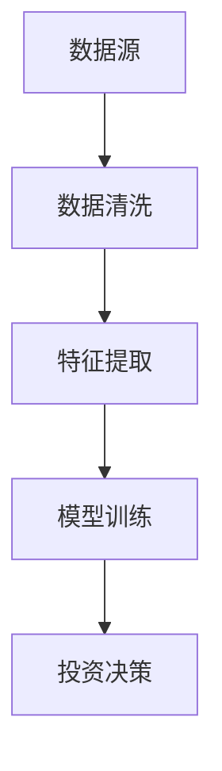
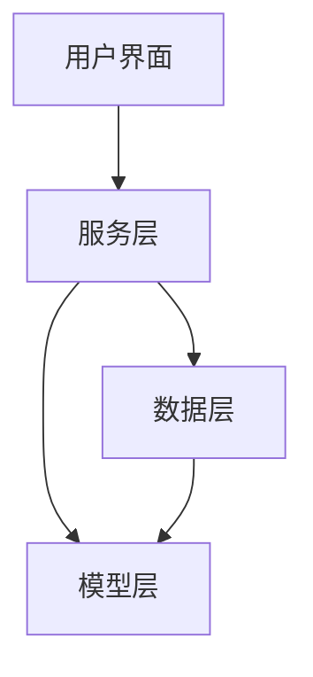
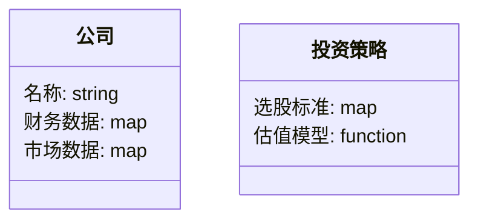

                 


# 费雪的成长型价值投资vs格雷厄姆的深度价值投资

关键词：费雪成长型投资、格雷厄姆深度价值投资、投资策略对比、数学模型分析、系统架构设计

摘要：本文将详细对比费雪的成长型价值投资和格雷厄姆的深度价值投资，从背景、核心理念、投资策略、数学模型分析、系统架构设计等多个维度进行深入探讨。通过对比分析，帮助读者理解这两种投资策略的异同点，并提供实际应用的最佳实践建议。

---

## 第一章 费雪的成长型价值投资

### 1.1 费雪的成长型价值投资背景

#### 1.1.1 费雪成长型投资的起源
菲利普·费雪（Philip Fisher）是20世纪著名的投资家，被誉为“成长型投资之父”。他在20世纪30年代提出了成长型投资的理念，强调选择那些具有持续增长潜力的公司进行投资。

#### 1.1.2 费雪成长型投资的核心理念
费雪认为，投资的成功不仅仅取决于价格的波动，而是取决于公司未来能否实现持续的增长。他提出“投资于成长股”，即选择那些具有高增长潜力的公司。

#### 1.1.3 费雪成长型投资与传统投资的区别
与传统的价值投资不同，费雪的成长型投资更注重公司的成长性和未来潜力，而非仅仅关注当前的估值。

---

### 1.2 费雪的成长型价值投资策略

#### 1.2.1 费雪成长型投资的选股标准
费雪提出了“10倍好公司”的概念，即选择那些未来几年内有潜力增长10倍的公司。他关注公司的管理团队、产品创新能力、市场地位等因素。

#### 1.2.2 费雪成长型投资的买入时机
费雪认为，买入时机并不是决定性的因素，重要的是选择正确的公司。他建议在市场低迷时买入优质成长股。

#### 1.2.3 费雪成长型投资的长期持有策略
费雪主张长期持有优质成长股，避免频繁交易，以享受公司成长带来的复利效应。

---

## 第二章 格雷厄姆的深度价值投资

### 2.1 格雷厄姆深度价值投资的背景

#### 2.1.1 格雷厄姆深度价值投资的起源
本杰明·格雷厄姆（Benjamin Graham）是价值投资的鼻祖，他在20世纪20年代提出了深度价值投资的理念。他的投资策略强调安全边际和内在价值。

#### 2.1.2 格雷厄姆深度价值投资的核心理念
格雷厄姆认为，市场先生是情绪化的，投资者应该利用市场的非理性来寻找被低估的股票。他强调安全边际，即买入价格远低于内在价值的股票。

#### 2.1.3 格雷厄姆深度价值投资与传统投资的区别
与成长型投资不同，深度价值投资更注重股票的估值，而非公司的成长性。

---

### 2.2 格雷厄姆深度价值投资策略

#### 2.2.1 格雷厄姆深度价值投资的选股标准
格雷厄姆提出“烟屁股”理论，即选择那些市场估值极低、接近破产边缘的公司，以确保安全边际。

#### 2.2.2 格雷厄姆深度价值投资的买入时机
格雷厄姆认为，市场恐慌时是买入的好时机，因为此时许多股票被低估。

#### 2.2.3 格雷厄姆深度价值投资的长期持有策略
格雷厄姆主张分散投资，避免将所有资金投入一只股票，以降低风险。

---

## 第三章 费雪成长型投资与格雷厄姆深度价值投资的比较

### 3.1 两者的核心理念对比

#### 3.1.1 费雪成长型投资的核心理念
- 侧重公司成长性
- 寻找具有持续增长潜力的公司

#### 3.1.2 格雷厄姆深度价值投资的核心理念
- 侧重股票估值
- 寻找被市场低估的股票

#### 3.1.3 两者的核心理念对比与总结
- 费雪的成长型投资更注重未来，而格雷厄姆的深度价值投资更注重现在。
- 两者在选股标准上有明显区别，但都强调长期投资。

---

### 3.2 两者的投资策略对比

#### 3.2.1 费雪成长型投资的投资策略
- 选股标准：成长性、管理团队、市场地位
- 买入时机：市场低迷时买入
- 持有策略：长期持有

#### 3.2.2 格雷厄姆深度价值投资的投资策略
- 选股标准：估值、安全边际
- 买入时机：市场恐慌时买入
- 持有策略：分散投资

#### 3.2.3 两者投资策略的优缺点对比
- 费雪的成长型投资优点是能够获得更高的长期收益，缺点是风险较高。
- 格雷厄姆的深度价值投资优点是风险较低，缺点是收益相对有限。

---

## 第四章 费雪成长型投资与格雷厄姆深度价值投资的数学模型分析

### 4.1 费雪成长型投资的数学模型

#### 4.1.1 费雪成长型投资的内在价值公式
$$ V = \text{未来现金流的现值} $$
其中，未来现金流的增长率由公司成长性决定。

#### 4.1.2 费雪成长型投资的股票增长率模型
$$ g = \text{公司年均增长率} $$

#### 4.1.3 费雪成长型投资的股票估值公式
$$ P = \sum_{t=1}^{n} \frac{C_t}{(1 + r)^t} $$
其中，$C_t$ 是第t年的现金流，$r$ 是折现率。

---

### 4.2 格雷厄姆深度价值投资的数学模型

#### 4.2.1 格雷厄姆深度价值投资的内在价值公式
$$ V = \text{资产净值} + \text{盈余公积} + \text{未分配利润} $$

#### 4.2.2 格雷厄姆深度价值投资的股票安全边际模型
$$ \text{安全边际} = \text{内在价值} - \text{市场价格} $$

#### 4.2.3 格雷厄姆深度价值投资的股票估值公式
$$ P \leq \frac{V}{2} $$
其中，$V$ 是股票的内在价值。

---

## 第五章 费雪成长型投资与格雷厄姆深度价值投资的系统分析与架构设计

### 5.1 投资系统的整体架构

#### 5.1.1 投资系统的功能模块划分
- 数据采集模块：收集公司财务数据和市场数据。
- 估值模块：计算股票的内在价值和安全边际。
- 投资决策模块：根据策略生成买入或卖出信号。
- 风险管理模块：监控投资组合的风险。

#### 5.1.2 投资系统的数据流图


#### 5.1.3 投资系统的系统架构图


### 5.2 投资系统的详细设计

#### 5.2.1 投资系统的数据模型设计


---

## 第六章 项目实战

### 6.1 环境安装
- 数据库：MySQL
- 语言：Python
- 工具：Pandas、NumPy、Matplotlib

### 6.2 核心实现

#### 6.2.1 费雪成长型投资的核心代码
```python
def fisher_growth_strategy(financial_data):
    # 计算公司增长率
    growth_rate = (financial_data['收入'].pct_change().mean() * 100).round(2)
    # 选择成长率高于行业平均水平的公司
    if growth_rate > industry_average:
        return "买入"
    else:
        return "卖出"
```

#### 6.2.2 格雷厄姆深度价值投资的核心代码
```python
def graham_value_strategy(financial_data):
    # 计算内在价值
    intrinsic_value = financial_data['资产净值'] / 2
    # 计算安全边际
    margin_of_safety = intrinsic_value - financial_data['股价']
    if margin_of_safety > 0:
        return "买入"
    else:
        return "卖出"
```

---

## 第七章 总结与展望

### 7.1 总结
- 费雪的成长型投资和格雷厄姆的深度价值投资各有优缺点。
- 费雪的成长型投资适合长期看好公司未来增长的投资者。
- 格雷厄姆的深度价值投资适合注重安全边际、厌恶风险的投资者。

### 7.2 展望
- 结合两者策略，制定更加灵活的投资策略。
- 进一步优化投资模型，提高投资收益。

---

作者：AI天才研究院/AI Genius Institute & 禅与计算机程序设计艺术 /Zen And The Art of Computer Programming

