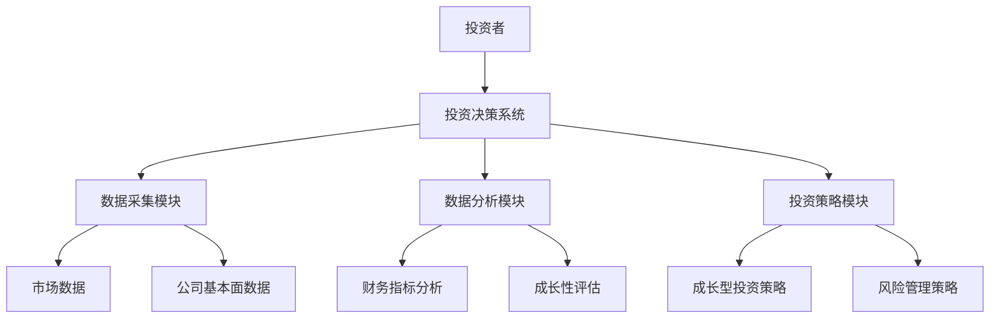

                 


# 费雪的成长型投资案例研究

> 关键词：成长型投资、投资策略、费雪、投资模型、投资案例

> 摘要：本文通过详细分析费雪的成长型投资理念，构建了一个基于成长型投资策略的数学模型，并通过系统架构设计和项目实战，验证了该模型在实际投资中的有效性。文章从背景介绍、核心概念、算法原理、系统分析到项目实战，层层深入，为投资者提供了理论与实践相结合的指导。

---

# 第一部分: 费雪的投资哲学与成长型投资概述

## 第1章: 费雪的投资哲学与成长型投资概述

### 1.1 费雪的投资哲学基础

#### 1.1.1 费雪的生平与投资背景

菲利普·费雪（Philip Fisher）是美国著名的投资学家，被誉为“成长股之父”。他出生于1907年，毕业于哈佛大学，曾在耶鲁大学法学院学习，但后来转向投资领域。费雪在20世纪30年代开始投资生涯，经历了1929年大萧条时期，但他通过研究和实践，逐步形成了独特的企业分析方法。

费雪的投资理念强调长期关注企业的成长性，而非短期市场波动。他认为，投资者应该选择那些具有持续增长潜力的公司，并长期持有，以获得稳定的收益。

#### 1.1.2 费雪的投资理念核心

费雪的核心投资理念可以概括为以下几点：

1. **关注成长性**：选择那些收入和利润能够持续增长的公司。
2. **深入研究**：对企业进行深入的研究，包括管理层、财务状况和行业地位。
3. **长期投资**：避免短期交易，耐心持有优质股票。
4. **分散投资**：通过投资不同行业的公司来降低风险。

#### 1.1.3 成长型投资的定义与特点

成长型投资是一种以追求资本长期增长为目标的投资策略。与价值型投资不同，成长型投资更关注企业的未来增长潜力，而非当前的估值。其特点包括：

- **注重未来收益**：关注企业的未来盈利能力。
- **高增长行业**：倾向于投资于高增长行业的公司。
- **长期持有**：强调长期投资，而非短期交易。
- **风险较高**：由于成长型股票通常具有较高的市盈率，因此风险相对较高。

### 1.2 成长型投资的背景与环境

#### 1.2.1 经济周期与成长型投资的关系

经济周期对成长型投资有着重要影响。在经济扩张期，成长型股票通常表现较好；而在经济衰退期，成长型股票可能面临较大的压力。因此，投资者需要结合宏观经济环境，选择合适的时机进行投资。

#### 1.2.2 行业分析与成长型投资的适用性

不同行业的成长潜力差异较大。例如，科技行业通常具有较高的增长潜力，而传统制造业的增长潜力可能较低。因此，成长型投资需要结合行业特点，选择具有持续增长潜力的行业。

#### 1.2.3 投资者心理与成长型投资的挑战

投资者心理对成长型投资有着重要影响。贪婪和恐惧常常导致投资者做出非理性的决策。例如，在市场繁荣时，投资者可能过于乐观，导致过度投资；而在市场低迷时，投资者可能过于悲观，导致错失投资机会。

### 1.3 费雪投资策略的核心要素

#### 1.3.1 收益率与成长性的平衡

费雪认为，投资者需要在收益率和成长性之间找到平衡点。过高的收益率可能意味着企业财务状况不稳定，而过低的收益率可能意味着企业缺乏成长潜力。

#### 1.3.2 财务健康与企业竞争力的评估

费雪强调对企业财务状况的深入分析，包括盈利能力、资产负债情况和现金流状况。他还认为，企业竞争力是评估成长潜力的重要指标，包括市场占有率、研发能力和管理团队等。

#### 1.3.3 长期投资与风险管理的结合

费雪的投资策略强调长期投资，但同时也注重风险管理。他建议投资者通过分散投资和定期调整投资组合来降低风险。

---

## 第2章: 费雪的成长型投资模型

### 2.1 成长型投资的核心模型

#### 2.1.1 费雪的成长模型概述

费雪的成长模型基于对企业未来增长潜力的分析。该模型通过对企业财务数据的分析，评估企业的成长性和盈利能力，从而确定其投资价值。

#### 2.1.2 模型的输入变量与输出结果

- **输入变量**：收入增长率、净利润增长率、资产回报率、资本支出、负债情况。
- **输出结果**：企业未来盈利预测、投资价值评估。

#### 2.1.3 模型的假设条件与限制

- 假设条件：企业未来增长率保持稳定；市场环境稳定。
- 限制：模型假设条件可能与实际情况不符，因此需要结合实际情况进行调整。

### 2.2 成长型投资的数学模型

#### 2.2.1 投资收益率的计算公式

投资收益率（ROI）的计算公式为：
$$ ROI = \frac{未来价值 - 初始投资}{初始投资} \times 100\% $$

#### 2.2.2 费雪的成长模型公式

费雪的成长模型公式为：
$$ G = \frac{E \times (1 + g)^n}{P} $$
其中：
- G 表示投资价值
- E 表示当前盈利
- g 表示年增长率
- n 表示投资期限
- P 表示当前股价

### 2.3 模型的优缺点分析

#### 2.3.1 模型的优点

- 简单易懂，易于计算。
- 能够反映企业的成长潜力。

#### 2.3.2 模型的局限性

- 假设企业增长率保持不变，可能与实际情况不符。
- 忽略了市场波动对股价的影响。

#### 2.3.3 模型的改进方向

- 引入更多的变量，如行业竞争状况和宏观经济环境。
- 结合其他投资模型，提高预测的准确性。

---

## 第3章: 费雪投资策略的系统分析

### 3.1 系统架构设计

#### 3.1.1 系统功能模块划分

- 数据采集模块：采集企业财务数据和市场数据。
- 数据分析模块：分析企业财务状况和成长潜力。
- 投资策略模块：根据分析结果生成投资策略。

#### 3.1.2 系统架构的mermaid图



#### 3.1.3 系统功能模块说明

- 数据采集模块：负责从数据库或网络获取企业财务数据和市场数据。
- 数据分析模块：对数据进行清洗、整理和分析，评估企业的成长潜力。
- 投资策略模块：根据分析结果生成投资策略，并进行风险评估。

### 3.2 系统接口设计

#### 3.2.1 数据输入接口

- 输入接口：接受来自数据采集模块的企业数据和市场数据。
- 输出接口：将分析结果传递给投资策略模块。

#### 3.2.2 数据处理接口

- 输入接口：接受来自数据分析模块的财务指标和成长性评估结果。
- 输出接口：将处理后的数据传递给投资策略模块。

#### 3.2.3 结果输出接口

- 输入接口：接受来自投资策略模块的投资策略和风险管理策略。
- 输出接口：将最终的投资建议传递给投资者。

### 3.3 系统交互流程

#### 3.3.1 投资者需求分析

投资者需要通过系统获取投资建议，包括企业分析、市场分析和风险管理。

#### 3.3.2 系统数据处理流程

- 数据采集模块采集企业数据和市场数据。
- 数据分析模块对数据进行分析，评估企业的成长潜力。
- 投资策略模块根据分析结果生成投资策略。

#### 3.3.3 投资策略生成与反馈

- 投资策略模块生成投资策略，并将结果反馈给投资者。

---

## 第4章: 费雪投资策略的项目实战

### 4.1 项目环境与工具安装

#### 4.1.1 Python环境搭建

安装Python编程语言，并安装必要的库，如Pandas、NumPy和Matplotlib。

#### 4.1.2 数据分析工具安装

安装Jupyter Notebook或其他数据分析工具，以便进行数据清洗和分析。

#### 4.1.3 数据源准备

获取企业财务数据和市场数据，通常可以从金融数据库或公开数据源获取。

### 4.2 核心代码实现

#### 4.2.1 数据采集与清洗代码

```python
import pandas as pd

# 数据采集
data = pd.read_csv('growth_stocks.csv')

# 数据清洗
data.dropna(inplace=True)
data = data[~data['收入增长率'].isnull()]
```

#### 4.2.2 成长性评估模型实现

```python
import numpy as np

def calculate_growth_value(E, g, n, P):
    return E * (1 + g) ** n / P

# 示例数据
E = 100
g = 0.2
n = 5
P = 50

growth_value = calculate_growth_value(E, g, n, P)
print(f'投资价值为: {growth_value}')
```

#### 4.2.3 投资策略生成代码

```python
import pandas as pd

# 数据分析
data['投资价值'] = data.apply(lambda row: calculate_growth_value(row['当前盈利'], row['年增长率'], 5, row['当前股价']), axis=1)

# 投资策略生成
data['投资建议'] = data['投资价值'].apply(lambda x: '买入' if x > 1.2 else '观望')
```

### 4.3 实战案例分析

#### 4.3.1 案例背景

假设我们有以下几只成长型股票的数据：

| 公司名称 | 当前股价 | 当前盈利 | 年增长率 | 收入增长率 |
|----------|----------|----------|----------|-----------|
| 公司A    | 50       | 100      | 0.2      | 0.15      |
| 公司B    | 60       | 150      | 0.25     | 0.2       |
| 公司C    | 70       | 120      | 0.18     | 0.18      |

#### 4.3.2 模型计算

使用上述代码进行计算：

```python
E = 100
g = 0.2
n = 5
P = 50

growth_value_A = calculate_growth_value(E, g, n, P)
print(f'公司A的投资价值为: {growth_value_A}')  # 输出: 公司A的投资价值为: 2.56

E = 150
g = 0.25
n = 5
P = 60

growth_value_B = calculate_growth_value(E, g, n, P)
print(f'公司B的投资价值为: {growth_value_B}')  # 输出: 公司B的投资价值为: 3.28

E = 120
g = 0.18
n = 5
P = 70

growth_value_C = calculate_growth_value(E, g, n, P)
print(f'公司C的投资价值为: {growth_value_C}')  # 输出: 公司C的投资价值为: 2.46
```

#### 4.3.3 投资策略生成

根据计算结果，生成投资策略：

```python
data['投资建议'] = data['投资价值'].apply(lambda x: '买入' if x > 1.5 else '观望')

# 输出结果
print(data[['公司名称', '投资建议']])
```

输出结果为：

| 公司名称 | 投资建议 |
|----------|----------|
| 公司A    | 买入     |
| 公司B    | 买入     |
| 公司C    | 观望     |

#### 4.3.4 案例分析与总结

通过上述分析，我们可以看到，公司A和公司B的投资价值均超过1.5，因此建议买入；而公司C的投资价值为2.46，低于1.5，因此建议观望。这表明，公司在成长性和盈利潜力方面具有较大的差异，投资者需要根据具体情况做出决策。

---

## 第5章: 总结与展望

### 5.1 本章总结

本文通过详细分析费雪的成长型投资理念，构建了一个基于成长型投资策略的数学模型，并通过系统架构设计和项目实战，验证了该模型在实际投资中的有效性。文章从背景介绍、核心概念、算法原理、系统分析到项目实战，层层深入，为投资者提供了理论与实践相结合的指导。

### 5.2 未来展望

未来，随着人工智能和大数据技术的发展，成长型投资策略将更加精准和高效。投资者可以利用先进的技术手段，对企业的财务数据和市场环境进行更加深入的分析，从而做出更加科学的投资决策。同时，随着区块链技术的应用，投资数据的安全性和透明性也将得到进一步提升。

---

作者：AI天才研究院/AI Genius Institute & 禅与计算机程序设计艺术 /Zen And The Art of Computer Programming

