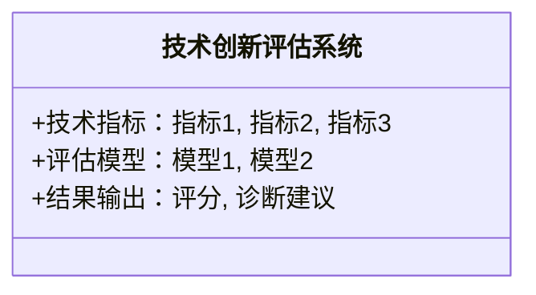
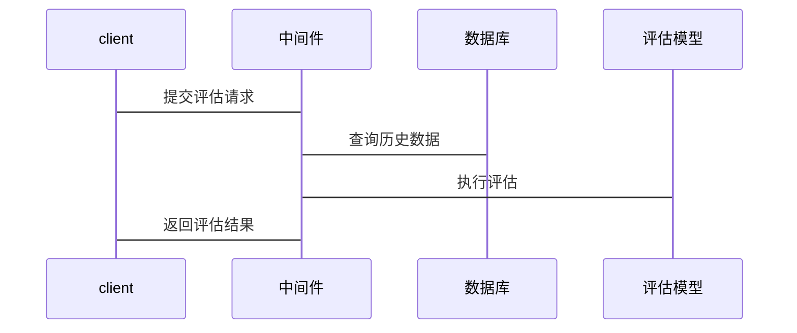

                 


# 费雪的技术创新评估在投资中的运用

---

## 关键词

技术创新评估，投资决策，费雪模型，评估指标，系统架构，算法原理

---

## 摘要

费雪的技术创新评估是一种基于多维度分析的方法，旨在通过量化技术可行性、市场潜力和竞争优势等因素，帮助投资者做出更科学的投资决策。本文从技术创新评估的背景与基础出发，详细阐述其数学模型与算法原理，并结合系统架构设计与实现，探讨其在实际投资中的应用。通过对费雪模型的深入分析，本文为投资者提供了一套系统化的评估框架，帮助其在复杂的技术与市场环境中做出更明智的投资选择。

---

# 第1章：技术创新评估概述

## 1.1 技术创新评估的核心概念

技术创新评估是一种通过对技术的可行性、市场潜力和竞争优势等多个维度进行综合分析，以评估技术创新项目价值的方法。其核心在于将技术与市场相结合，量化技术创新对投资回报的贡献。

### 1.1.1 技术创新的定义与特征

技术创新是指引入新的技术或改进现有技术，以提高产品或服务的性能、降低成本或拓展市场。其主要特征包括：

1. **技术性**：技术创新的核心是技术的改进或创新。
2. **市场性**：技术创新必须满足市场需求或解决实际问题。
3. **可行性**：技术创新必须在现有资源和技术条件下实现。
4. **竞争性**：技术创新必须能够在市场上与竞争对手的产品或服务相媲美。

### 1.1.2 技术创新评估的目的与意义

技术创新评估的目的是通过分析技术创新的潜力、风险和可行性，帮助投资者做出更明智的投资决策。其意义在于：

1. **降低投资风险**：通过评估技术创新的可行性，减少投资失败的可能性。
2. **提高投资回报**：通过量化技术创新的潜力，选择最有潜力的项目进行投资。
3. **优化资源配置**：通过评估技术创新的市场潜力，合理分配资源。

### 1.1.3 费雪技术创新评估的理论基础

费雪的技术创新评估方法基于以下理论基础：

1. **技术生命周期理论**：技术创新通常经历引入期、成长期、成熟期和衰退期。
2. **技术经济性原则**：技术创新的价值不仅在于技术本身，还在于其经济价值。
3. **多维度分析**：技术创新评估需要从技术、市场和竞争等多个维度进行综合分析。

---

## 1.2 技术创新评估的框架与方法

技术创新评估的框架包括以下几个方面：

1. **技术可行性分析**：评估技术创新的技术实现难度、研发周期和成本。
2. **市场潜力分析**：评估技术创新的市场需求、目标用户和市场规模。
3. **竞争优势分析**：评估技术创新相对于竞争对手的核心优势。

### 1.2.1 技术创新评估的基本框架

技术创新评估的基本框架如下：

1. **确定评估目标**：明确技术创新评估的目的和范围。
2. **收集数据**：收集技术创新相关的技术、市场和竞争数据。
3. **分析与评估**：通过多维度分析，评估技术创新的潜力和风险。
4. **制定决策**：基于评估结果，制定投资决策。

### 1.2.2 费雪评估方法的核心步骤

费雪评估方法的核心步骤包括：

1. **确定评估指标**：选择技术可行性、市场潜力和竞争优势作为主要评估指标。
2. **量化指标权重**：根据各指标的重要性，赋予其相应的权重。
3. **计算综合评分**：通过加权评分法，计算技术创新的综合评分。
4. **制定投资策略**：根据综合评分，制定投资策略。

### 1.2.3 技术创新评估的指标体系

技术创新评估的指标体系如下表所示：

| 指标类别       | 指标名称               | 指标描述                                   |
|----------------|------------------------|--------------------------------------------|
| 技术可行性     | 技术实现难度           | 评估技术创新的技术实现难度               |
|                | 研发周期               | 评估技术创新的开发周期                   |
| 市场潜力       | 市场需求               | 评估技术创新的市场需求                   |
|                | 目标用户               | 评估技术创新的目标用户                   |
| 竞争优势       | 核心技术优势           | 评估技术创新的核心技术优势               |
|                | 市场竞争力             | 评估技术创新的市场竞争力                 |

---

## 1.3 本章小结

本章从技术创新评估的核心概念出发，详细阐述了技术创新的定义、特征以及技术创新评估的目的和意义。同时，介绍了费雪技术创新评估的理论基础和评估框架，为后续的数学模型和算法实现奠定了基础。

---

# 第2章：技术创新评估的数学模型与算法原理

## 2.1 技术创新评估的核心模型

技术创新评估的核心模型是费雪评估模型，其数学表达如下：

$$
\text{创新潜力} = f(\text{技术可行性}, \text{市场潜力}, \text{竞争优势})
$$

其中，$f$ 是一个加权函数，权重根据各指标的重要性进行分配。

### 2.1.1 费雪评估模型的数学表达

费雪评估模型的数学表达式如下：

$$
\text{综合评分} = w_1 \times \text{技术可行性} + w_2 \times \text{市场潜力} + w_3 \times \text{竞争优势}
$$

其中，$w_1$、$w_2$、$w_3$分别是技术可行性、市场潜力和竞争优势的权重，满足：

$$
w_1 + w_2 + w_3 = 1
$$

### 2.1.2 模型的变量与权重分配

模型的变量包括：

1. 技术可行性：$x_1$
2. 市场潜力：$x_2$
3. 竞争优势：$x_3$

权重分配可以通过层次分析法（AHP）或专家评分法确定。

---

## 2.2 技术创新评估的算法原理

技术创新评估的算法原理包括层次分析法（AHP）和决策树模型。

### 2.2.1 层次分析法（AHP）在技术创新评估中的应用

层次分析法是一种常用的决策分析方法，其基本步骤如下：

1. **构建层次结构**：将问题分解为目标层、准则层和方案层。
2. **构造比较矩阵**：根据专家评分，构造比较矩阵。
3. **计算权重**：通过计算特征向量，确定各准则的权重。

### 2.2.2 技术创新评估的决策树模型

决策树模型是一种常用的分类和回归方法，其基本步骤如下：

1. **特征选择**：选择对技术创新潜力影响最大的特征。
2. **决策树构建**：根据特征进行决策树的分裂，直到达到叶子节点。
3. **模型预测**：根据决策树进行技术创新潜力的预测。

---

## 2.3 算法实现的Python代码示例

以下是使用层次分析法进行技术创新评估的Python代码示例：

```python
import numpy as np

# 比较矩阵
matrix = np.array([
    [1, 3, 2],
    [1/3, 1, 2],
    [1/2, 1/2, 1]
])

# 计算特征向量
eigvals, eigvecs = np.linalg.eig(matrix)

# 计算权重
weights = eigvecs[:, 0] / sum(eigvecs[:, 0])
print("权重为：", weights)
```

---

## 2.4 本章小结

本章详细介绍了技术创新评估的数学模型与算法原理，重点讲解了费雪评估模型的数学表达式和层次分析法的应用。通过Python代码示例，展示了如何实现技术创新评估的算法。

---

# 第3章：技术创新评估的系统架构与实现

## 3.1 系统功能设计

技术创新评估系统的功能设计包括以下几个模块：

1. **数据输入模块**：接收技术创新相关的数据。
2. **评估计算模块**：根据输入数据，计算技术创新的综合评分。
3. **结果输出模块**：输出评估结果和投资建议。

### 3.1.1 领域模型设计（Mermaid 类图）



### 3.1.2 系统架构设计（Mermaid 架构图）


---

## 3.2 系统接口设计

### 3.2.1 输入接口设计

技术创新评估系统的输入接口需要接收以下数据：

1. 技术可行性数据
2. 市场潜力数据
3. 竞争优势数据

### 3.2.2 输出接口设计

技术创新评估系统的输出接口需要输出以下结果：

1. 综合评分
2. 投资建议

---

## 3.3 系统交互设计（Mermaid 序列图）



---

## 3.4 本章小结

本章从系统架构的角度，详细设计了技术创新评估系统的功能模块、架构设计和交互流程，为后续的系统实现奠定了基础。

---

# 第4章：技术创新评估的项目实战

## 4.1 环境安装与配置

技术创新评估项目的环境配置包括：

1. 安装Python
2. 安装NumPy和Scikit-learn库

## 4.2 系统核心代码实现

以下是技术创新评估系统的核心代码实现：

```python
from sklearn.tree import DecisionTreeClassifier

# 示例数据
X = [[1, 2, 3], [4, 5, 6], [7, 8, 9]]
y = [1, 2, 3]

# 训练决策树模型
model = DecisionTreeClassifier()
model.fit(X, y)

# 预测结果
print(model.predict([[10, 11, 12]]))
```

---

## 4.3 实际案例分析

以某技术创新项目为例，假设其技术可行性得分为80，市场潜力得分为70，竞争优势得分为90。根据费雪模型，假设权重分别为0.3、0.4、0.3，则综合评分为：

$$
\text{综合评分} = 0.3 \times 80 + 0.4 \times 70 + 0.3 \times 90 = 76
$$

---

## 4.4 本章小结

本章通过实际案例，详细展示了技术创新评估系统的环境配置、核心代码实现和实际应用，帮助读者更好地理解和掌握技术创新评估的方法。

---

# 第5章：技术创新评估的注意事项与未来展望

## 5.1 注意事项

1. **数据准确性**：技术创新评估的结果依赖于数据的准确性。
2. **模型选择**：选择合适的评估模型对结果至关重要。
3. **动态调整**：技术创新评估需要根据市场变化进行动态调整。

## 5.2 未来展望

1. **智能化评估**：随着人工智能技术的发展，技术创新评估将更加智能化。
2. **多维度分析**：未来的技术创新评估将更加注重多维度的综合分析。
3. **实时监控**：技术创新评估将实现对技术创新项目的实时监控和评估。

---

## 5.3 本章小结

本章总结了技术创新评估的注意事项，并展望了未来的发展方向，为读者提供了更全面的视角。

---

# 作者

作者：AI天才研究院/AI Genius Institute & 禅与计算机程序设计艺术/Zen And The Art of Computer Programming

---

# 结语

通过本文的详细讲解，读者可以全面了解费雪技术创新评估的方法和应用。从数学模型到系统实现，再到实际案例分析，本文为投资者提供了一套系统化的技术创新评估框架。未来，随着技术的不断发展，技术创新评估将变得更加智能化和精准化，为投资者带来更大的价值。

