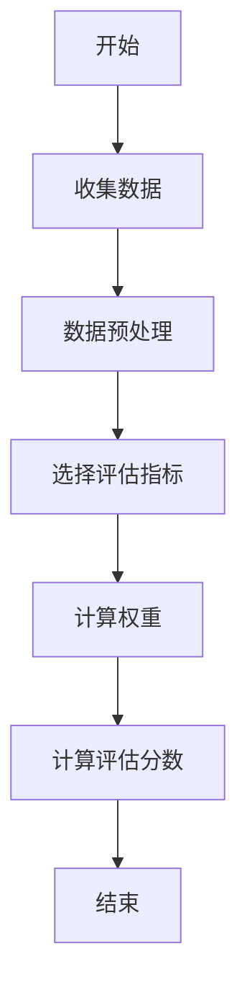
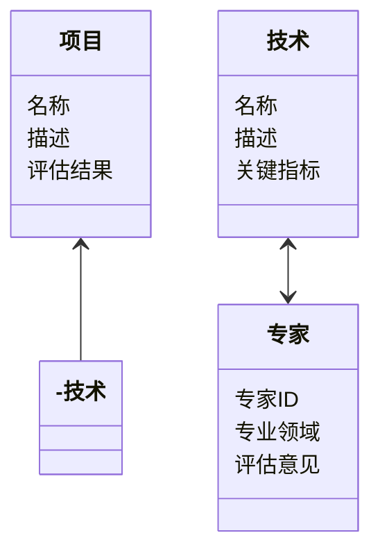
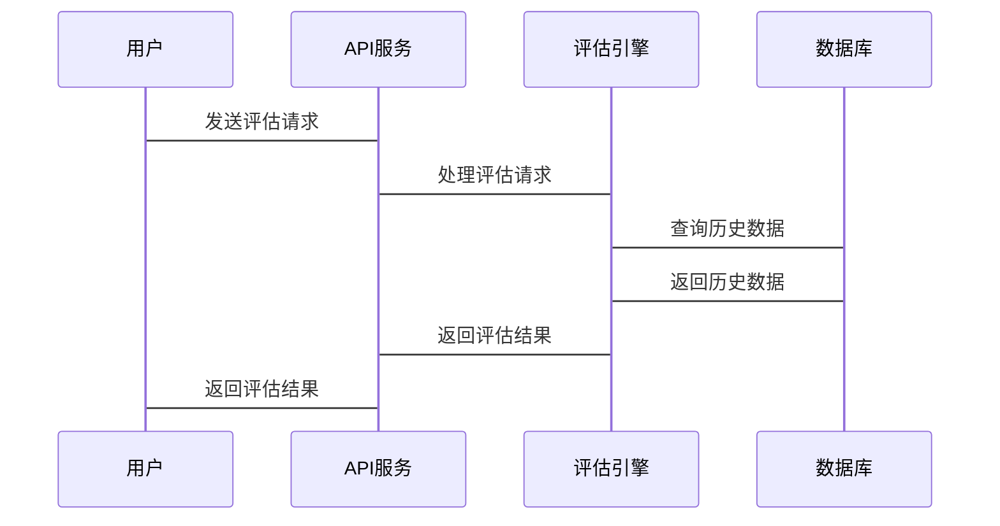

                 


# 费雪的技术创新评估：区分真正的突破

## 关键词：技术创新评估，费雪，技术突破，评估模型，创新管理

## 摘要：技术创新评估是区分真正技术突破的关键方法，本文通过费雪的视角，详细探讨了技术创新评估的核心概念、算法原理、系统架构及项目实战，帮助读者掌握如何有效评估技术创新。

---

# 第一部分: 费雪技术创新评估的背景与核心概念

## 第1章: 技术创新评估的背景与问题背景

### 1.1 技术创新评估的背景

#### 1.1.1 技术创新的重要性
技术创新是推动社会进步的核心动力。在当今快速变化的科技环境中，准确识别和评估真正的技术突破至关重要。费雪通过其独特的视角，提出了一个系统化的方法来评估技术创新，从而帮助企业做出更明智的投资决策。

#### 1.1.2 技术创新评估的必要性
在风险投资领域，技术创新评估是区分真正突破与平庸创新的关键。许多技术看似创新，但实际上可能缺乏实际应用价值或市场潜力。通过科学的评估方法，投资者可以更准确地识别出具有潜力的技术。

#### 1.1.3 费雪在技术创新评估中的角色
费雪以其在风险投资领域的丰富经验，开发了一套独特的技术创新评估方法。这种方法结合了定量分析和定性判断，能够更全面地评估技术的潜力和可行性。

### 1.2 技术创新评估的核心概念

#### 1.2.1 技术创新的定义与特征
技术创新是指在现有技术基础上，通过引入新的概念、方法或工具，实现技术性能或功能的显著提升。其核心特征包括创新性、实用性和可扩展性。

#### 1.2.2 技术创新评估的定义与目标
技术创新评估是对技术的创新性、可行性和潜在价值进行全面分析的过程。其目标是通过系统化的方法，识别出具有真正突破性的技术。

#### 1.2.3 技术创新评估的边界与外延
技术创新评估的边界包括技术本身的性能、市场应用潜力和团队能力。其外延则涉及技术的商业化路径和长期影响。

## 第2章: 技术创新评估的核心概念与联系

### 2.1 技术创新评估的原理

#### 2.1.1 技术创新评估的基本原理
技术创新评估基于对技术的多维度分析，包括技术的创新性、可行性和市场潜力。通过综合评估这些维度，可以得出技术的总体价值。

#### 2.1.2 技术创新评估的关键要素
- 技术的创新性：技术是否引入了新的概念或方法。
- 技术的可行性：技术是否能够在实际中实现。
- 市场潜力：技术是否具有商业价值。

#### 2.1.3 技术创新评估的流程与方法
技术创新评估的流程包括数据收集、分析、评估和决策。其方法包括定量分析和定性判断。

### 2.2 技术创新评估的核心概念对比

#### 2.2.1 技术创新与商业创新的对比
技术创新注重技术本身的突破，而商业创新则关注商业模式和市场策略的创新。两者相辅相成，共同推动企业的成功。

#### 2.2.2 技术突破与技术改进的对比
技术突破是指在技术性能上实现质的飞跃，而技术改进则是对现有技术的优化。两者都需要创新，但其影响和难度不同。

#### 2.2.3 技术创新评估与技术转移的对比
技术创新评估关注技术的潜在价值，而技术转移则关注技术的实际应用和传播。两者都需要技术创新评估的支持。

### 2.3 技术创新评估的ER实体关系图

```mermaid
er
    项目
    技术
    评估指标
    专家
    评估结果
    项目-技术: 实现
    技术-评估指标: 属于
    专家-评估指标: 负责
    项目-评估结果: 得出
```

---

# 第二部分: 技术创新评估的算法与数学模型

## 第3章: 技术创新评估的算法原理

### 3.1 技术创新评估的算法概述

#### 3.1.1 基于概率的评估模型
基于概率的评估模型通过分析技术的市场潜力和可行性，计算其成功的概率。例如，可以使用贝叶斯概率模型来预测技术成功的可能性。

#### 3.1.2 基于权重的评估模型
基于权重的评估模型通过给每个评估维度分配权重，计算技术的综合评分。例如，技术创新性占40%，可行性占30%，市场潜力占30%。

#### 3.1.3 基于层次分析法的评估模型
层次分析法（AHP）是一种常用的评估方法，通过构建层次结构，分析各维度的权重，最终得出技术的综合评分。

### 3.2 技术创新评估的算法流程



### 3.3 技术创新评估的Python实现

```python
import pandas as pd
from sklearn.metrics import pairwise_distances

# 示例数据
data = {
    '技术指标': ['技术A', '技术B', '技术C'],
    '评分': [0.8, 0.6, 0.7]
}

df = pd.DataFrame(data)

# 计算技术间的相似性
similarity_matrix = pairwise_distances(df['评分'].values.reshape(-1, 1))

print(similarity_matrix)
```

### 3.4 技术创新评估的数学模型与公式

#### 3.4.1 基于概率的评估模型
技术成功的概率可以表示为：
$$ P(\text{成功}) = \frac{\text{成功案例数}}{\text{总案例数}} $$

#### 3.4.2 基于权重的评估模型
技术的综合评分可以表示为：
$$ \text{综合评分} = \sum (\text{权重}_i \times \text{评分}_i) $$

---

# 第三部分: 技术创新评估的系统分析与架构设计

## 第4章: 技术创新评估的系统分析与架构设计

### 4.1 问题场景介绍

技术创新评估系统需要解决的主要问题包括：
- 如何高效收集和处理技术创新数据？
- 如何构建和维护评估模型？
- 如何确保评估结果的准确性和可解释性？

### 4.2 系统功能设计

#### 4.2.1 领域模型类图



#### 4.2.2 系统架构设计


#### 4.2.3 系统接口设计

- API接口：用于前端与后端的数据交互。
- 数据库接口：用于存储和检索评估数据。

### 4.3 系统交互设计

#### 4.3.1 系统交互序列图



---

# 第四部分: 技术创新评估的项目实战

## 第5章: 技术创新评估的项目实战

### 5.1 环境安装

#### 5.1.1 安装Python和必要的库
```bash
pip install numpy pandas scikit-learn
```

#### 5.1.2 安装Mermaid和LaTeX工具
根据需求安装Mermaid和LaTeX编译器。

### 5.2 系统核心实现源代码

#### 5.2.1 技术创新评估模型的实现

```python
from sklearn.metrics.pairwise import cosine_similarity

# 示例数据
technologies = ['技术A', '技术B', '技术C']
scores = [0.8, 0.6, 0.7]

# 计算相似性
similarity = cosine_similarity([scores])
print(similarity)
```

#### 5.2.2 评估结果的可视化

```python
import matplotlib.pyplot as plt

technologies = ['技术A', '技术B', '技术C']
scores = [0.8, 0.6, 0.7]

plt.bar(technologies, scores)
plt.title('技术创新评估结果')
plt.show()
```

### 5.3 案例分析与详细解读

#### 5.3.1 案例背景
假设我们有三项技术创新：技术A、技术B和C。我们需要评估它们的创新性和市场潜力。

#### 5.3.2 数据分析
通过对市场数据和专家意见的分析，我们得出各项技术的评分。

#### 5.3.3 评估结果
技术A的综合评分为0.8，技术B为0.6，技术C为0.7。因此，技术A是最具潜力的技术。

### 5.4 项目小结

技术创新评估是一个复杂但重要的过程。通过系统化的方法和工具，我们可以更准确地识别出真正具有潜力的技术。

---

# 第五部分: 技术创新评估的最佳实践与总结

## 第6章: 技术创新评估的最佳实践

### 6.1 小结

技术创新评估是区分真正技术突破的关键方法。通过系统化的评估过程，我们可以更准确地识别出具有潜力的技术。

### 6.2 最佳实践 Tips

- 结合定量分析和定性判断，确保评估结果的全面性。
- 定期更新评估模型，以适应市场和技术的变化。
- 与行业专家合作，确保评估的准确性和可解释性。

### 6.3 注意事项

- 避免过度依赖单一指标，确保评估的全面性。
- 在评估过程中，充分考虑技术的可行性和市场潜力。

### 6.4 拓展阅读

- 《技术创新评估方法论》
- 《风险投资中的技术创新评估》

---

# 结语

技术创新评估是区分真正技术突破的关键方法。通过系统化的评估过程，我们可以更准确地识别出具有潜力的技术，从而做出更明智的投资决策。

---

**作者：AI天才研究院/AI Genius Institute & 禅与计算机程序设计艺术 /Zen And The Art of Computer Programming**

