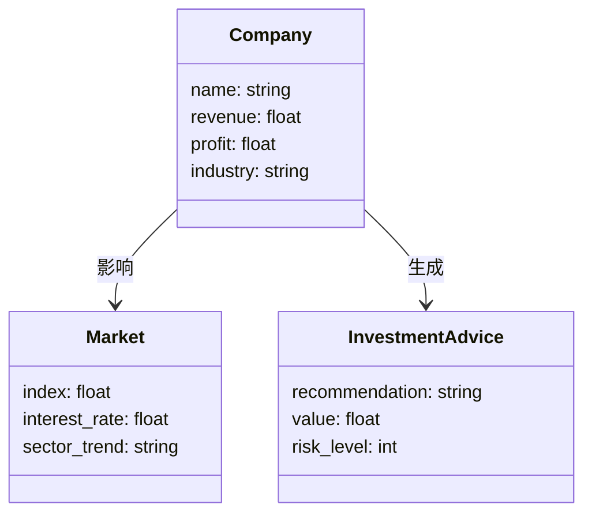
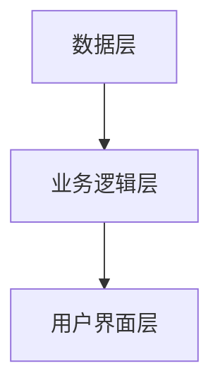
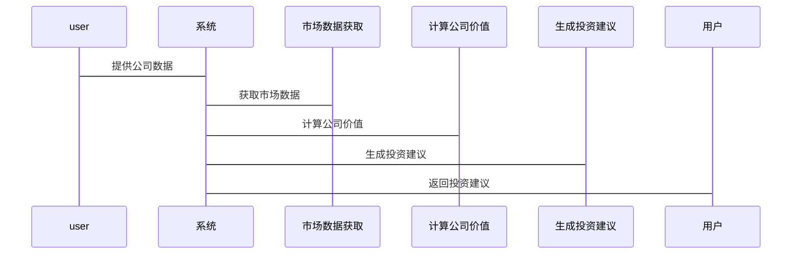

                 


# 费雪的探照灯理论：深入研究公司的方法

## 关键词：费雪，探照灯理论，公司分析，投资策略，价值评估，系统架构，投资组合优化

## 摘要：本文深入探讨费雪的探照灯理论，分析其在公司研究和投资决策中的应用。通过数学模型、系统架构和项目实战，详细讲解探照灯理论的原理、算法和实际操作。

---

# 第一部分: 费雪的探照灯理论概述

## 第1章: 探照灯理论的背景与起源

### 1.1 探照灯理论的起源
- **费雪投资理论的起源**：费雪的探照灯理论起源于20世纪，旨在通过深入分析公司基本面来评估其投资价值。
- **核心思想**：强调公司内在价值的重要性，通过分析公司的财务数据和市场环境，预测其未来表现。
- **与其他理论的对比**：与基本面分析和价值投资理论的联系，突出探照灯理论的独特性。

### 1.2 探照灯理论的核心概念
- **公司分析的核心要素**：包括财务数据、行业地位、管理团队等。
- **探照灯理论的基本假设**：公司价值可以通过基本面分析准确评估。
- **理论与实践的联系**：探讨如何将理论应用于实际投资决策。

### 1.3 理论的应用现状
- **投资实践中的应用**：许多投资者采用探照灯理论进行股票筛选。
- **局限性与改进方向**：指出理论的不足，并提出改进措施。
- **研究热点**：当前学术界和实践中的研究趋势。

## 第2章: 探照灯理论的核心概念与联系

### 2.1 探照灯理论的核心原理
- **公司价值计算公式**：介绍探照灯理论的核心数学模型，例如$$V = \frac{E}{1 - g}$$，其中V是公司价值，E是企业收益，g是增长率。
- **数学推导**：详细解释公式的推导过程，确保读者理解其逻辑。

### 2.2 核心概念的属性特征对比
- **表格对比**：列出公司基本面与市场情绪的对比，分析各自的影响因素。
- **ER实体关系图**：展示公司、市场、财务数据之间的关系，帮助读者理解理论结构。

## 第3章: 探照灯理论的算法原理

### 3.1 探照灯理论的数学模型
- **公式解释**：详细说明每个变量的含义，例如$$E = EBIT \times (1 - t)$$，其中EBIT是息税前利润，t是税率。
- **算法流程图**：展示从数据输入到投资建议的整个过程。

### 3.2 算法实现的Python代码
- **代码示例**：提供计算公司价值的Python代码，解释每一步的作用。

```python
def calculate_company_value(EBIT, tax_rate, growth_rate):
    E = EBIT * (1 - tax_rate)
    V = E / (1 - growth_rate)
    return V

EBIT = 1000000
tax_rate = 0.2
growth_rate = 0.05
value = calculate_company_value(EBIT, tax_rate, growth_rate)
print(f"公司价值为：{value:.2f}")
```

### 3.3 算法原理的数学推导
- **详细推导**：从基本假设出发，逐步推导出公司价值的计算公式，确保逻辑严谨。

---

# 第二部分: 探照灯理论的系统分析与架构设计

## 第4章: 系统功能设计

### 4.1 问题场景介绍
- **目标**：构建一个基于探照灯理论的投资分析系统。
- **核心功能**：包括数据采集、公司分析、投资建议生成。

### 4.2 领域模型设计
- **Mermaid类图**：展示公司、市场、投资建议之间的关系。



## 第4.3 系统架构设计
- **分层架构**：数据层、业务逻辑层、用户界面层。
- **Mermaid架构图**：展示各层之间的关系。



## 第4.4 接口设计
- **API接口**：定义数据输入和输出接口，确保系统可扩展性。

## 第4.5 交互设计
- **Mermaid序列图**：展示用户与系统之间的交互流程。



---

# 第三部分: 项目实战

## 第5章: 项目实战

### 5.1 环境安装
- **工具安装**：安装Python、数据处理库（如Pandas）和可视化库（如Matplotlib）。
- **数据获取**：从可靠来源获取公司数据和市场数据。

### 5.2 核心实现
- **数据清洗**：处理缺失值和异常值。
- **特征工程**：提取关键特征，如EBIT、税率等。
- **模型训练**：使用探照灯理论模型进行预测。
- **代码实现**：提供完整的Python代码，解释每一步的作用。

### 5.3 案例分析
- **实际案例**：分析一家公司的数据，展示如何应用探照灯理论进行投资决策。
- **结果解读**：解释计算结果，说明其投资价值。

### 5.4 项目小结
- **经验总结**：总结项目实施过程中的经验教训。
- **改进建议**：提出优化系统架构的建议。

---

# 第四部分: 最佳实践与总结

## 第6章: 最佳实践

### 6.1 投资策略优化
- **动态调整**：根据市场变化动态调整投资组合。
- **风险管理**：制定风险管理策略，降低投资风险。

### 6.2 系统优化建议
- **数据源扩展**：引入更多数据源，提高分析准确性。
- **模型优化**：优化数学模型，提高计算效率。

### 6.3 小结
- **理论总结**：总结探照灯理论的核心内容。
- **实践总结**：总结项目实施的经验和教训。

## 第7章: 总结与展望

### 7.1 总结
- **理论回顾**：回顾探照灯理论的主要内容。
- **实践回顾**：回顾项目实施的主要成果。

### 7.2 展望
- **未来研究方向**：探讨探照灯理论的未来研究方向。
- **技术发展趋势**：分析相关技术的发展趋势。

---

# 作者：AI天才研究院 & 禅与计算机程序设计艺术

