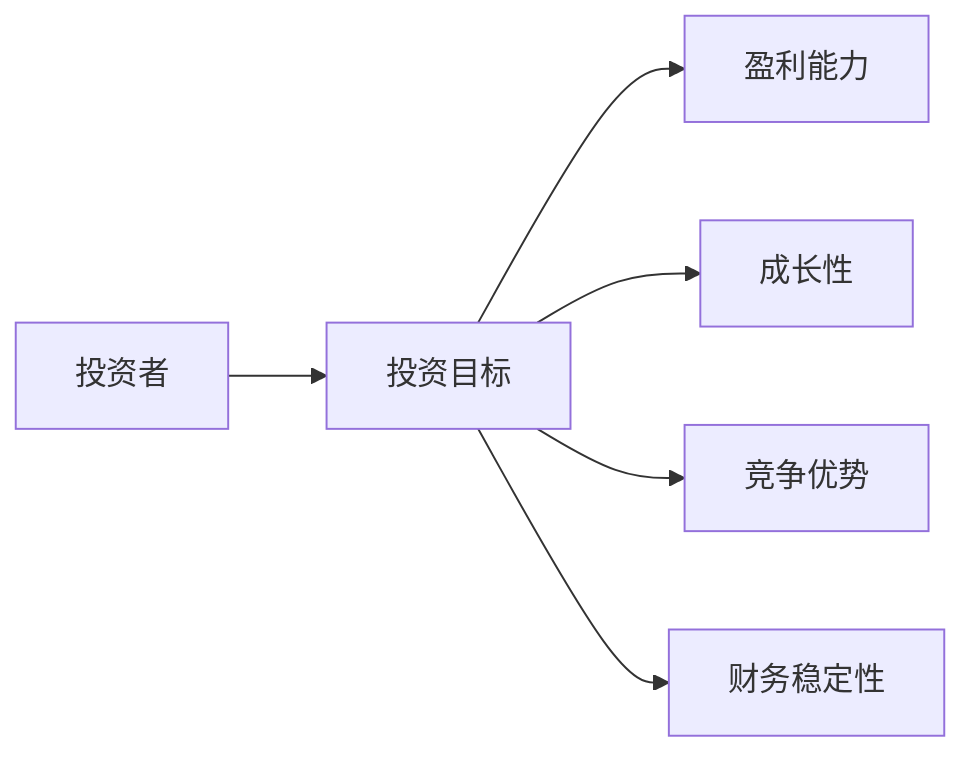
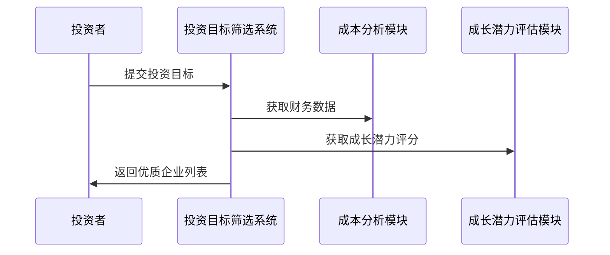

                 


# 费雪的探路者投资法：寻找未来的赢家

## 关键词：
1. 投资策略
2. 成长股投资
3. 长期价值
4. 费雪投资法
5. 探路者投资法
6. 股票筛选

## 摘要：
本文深入探讨了费雪的探路者投资法，这是一种以长期价值为导向的投资策略，专注于寻找具有持续成长潜力的优秀企业。文章从探路者投资法的背景、核心理念、算法原理、数学模型、系统架构等多个维度展开分析，结合实际案例，详细解读如何通过这一方法筛选出未来的赢家。通过本文的阐述，读者将能够全面理解探路者投资法的核心思想，并掌握其在实际投资中的应用方法。

---

# 第一部分: 探路者投资法的背景与核心理念

## 第1章: 投资的基本概念与方法论

### 1.1 投资的基本概念
- **1.1.1 资产与投资的定义**  
  投资是指将资金分配到不同的资产类别中，以实现财富增值的过程。资产可以是股票、债券、房地产、现金等多种形式。投资的核心目标是通过科学的方法选择具有较高收益潜力的资产。

- **1.1.2 投资的分类与特点**  
  投资可以分为短期投资和长期投资。短期投资注重市场波动和交易机会，而长期投资则关注企业的基本面和持续成长潜力。长期投资更注重资产的内在价值，而非短期价格波动。

- **1.1.3 投资的目标与风险**  
  投资的目标是实现资产的保值与增值，但投资过程中也伴随着风险。风险主要来源于市场的不确定性、企业的经营状况以及宏观经济的变化。投资者需要在风险与收益之间找到平衡点。

### 1.2 费雪的投资理念
- **1.2.1 费雪的投资哲学**  
  费雪（Philip A. Fisher）是20世纪著名的价值投资者，他的投资理念以“成长股投资”为核心。他认为，投资的成功取决于对企业基本面的深入研究，尤其是企业的成长潜力和竞争优势。

- **1.2.2 费雪的投资策略**  
  费雪提出了“探路者投资法”，这种方法强调选择那些具有强大竞争优势、稳定的财务状况和持续成长潜力的企业。他主张长期持有优质资产，避免频繁交易。

- **1.2.3 费雪的投资成功案例**  
  费雪的投资理念在实践中取得了显著成功。他通过长期持有像英特尔、可口可乐等优质企业的股票，实现了资产的大幅增值。

## 第2章: 探路者投资法的起源与发展

### 2.1 探路者投资法的定义
- **2.1.1 探路者投资法的核心概念**  
  探路者投资法是一种以长期价值为导向的投资策略，专注于寻找那些具有持续成长潜力的企业。这种方法强调对企业基本面的深入分析，尤其是企业的盈利能力、成长性和竞争优势。

- **2.1.2 探路者投资法的起源**  
  探路者投资法由费雪提出，源于他对投资市场的深刻洞察。他认为，市场的短期波动不应该影响长期投资者的决策，真正决定资产价值的是企业的内在价值。

- **2.1.3 探路者投资法的发展历程**  
  自费雪提出探路者投资法以来，这一方法在全球投资领域得到了广泛应用。随着金融市场的不断发展，探路者投资法也在实践中不断完善和优化。

### 2.2 探路者投资法与其他投资方法的对比
- **2.2.1 价值投资与成长投资的区别**  
  价值投资注重企业的内在价值，寻找市场低估的资产；而探路者投资法则更关注企业的成长潜力和竞争优势。

- **2.2.2 技术分析与基本面分析的结合**  
  技术分析侧重于市场的价格波动和交易信号，而探路者投资法则强调基本面分析，尤其是企业的财务状况和成长潜力。

- **2.2.3 探路者投资法的独特性**  
  探路者投资法的独特性在于其对企业的长期成长潜力的关注，以及对竞争优势的深入分析。这种方法不仅注重企业的当前表现，更关注其未来的成长空间。

---

# 第二部分: 探路者投资法的核心概念与联系

## 第3章: 探路者投资法的核心原理

### 3.1 探路者投资法的原理
- **3.1.1 探路者投资法的基本假设**  
  探路者投资法的基本假设是：企业的长期成长潜力是决定其资产价值的核心因素。通过深入分析企业的财务状况、行业地位和竞争优势，可以筛选出具有持续成长潜力的优质企业。

- **3.1.2 探路者投资法的理论基础**  
  探路者投资法的理论基础是费雪的成长股投资理念，即选择那些具有强大竞争优势、稳定的财务状况和持续成长潜力的企业。

- **3.1.3 探路者投资法的核心要素**  
  探路者投资法的核心要素包括：企业的盈利能力、成长性、竞争优势和财务稳定性。这些要素共同决定了企业的长期成长潜力。

### 3.2 探路者投资法的属性特征对比
- **3.2.1 投资周期与风险特征对比**  
  探路者投资法是一种长期投资策略，注重企业的长期成长潜力，因此具有较高的风险承受能力。

- **3.2.2 收益与成长性的对比**  
  探路者投资法注重企业的成长性，因此其收益主要来自于企业的长期成长，而非短期价格波动。

- **3.2.3 市场波动与投资策略的对比**  
  探路者投资法强调长期持有优质资产，因此不受短期市场波动的影响，注重企业的内在价值。

## 第4章: 探路者投资法的实体关系架构

### 4.1 实体关系图


---

# 第三部分: 探路者投资法的算法原理与数学模型

## 第5章: 探路者投资法的算法流程

### 5.1 探路者投资法的算法步骤


### 5.2 探路者投资法的Python实现
```python
def fisher_investor_analysis(stock_data):
    # 1. 筛选目标行业
    industries = stock_data['industry'].unique()
    
    # 2. 分析公司基本面
    financial_ratios = stock_data[['profit_margin', 'revenue_growth', 'return_on_equity']]
    
    # 3. 评估成长潜力
    growth_potential = financial_ratios[financial_ratios['revenue_growth'] > industry_growth_average]
    
    # 4. 选择优质企业
    selected_stocks = growth_potential[financial_ratios['return_on_equity'] > industry_roe_average]
    
    return selected_stocks
```

## 第6章: 探路者投资法的数学模型与公式

### 6.1 财务比率分析
- 净利润增长率：
  $$ \text{净利润增长率} = \frac{\text{本期净利润} - \text{上期净利润}}{\text{上期净利润}} \times 100\% $$
- 每股收益（EPS）：
  $$ \text{EPS} = \frac{\text{净利润}}{\text{发行在外的普通股数量}} $$
- 资产回报率（ROA）：
  $$ \text{ROA} = \frac{\text{净利润}}{\text{总资产}} \times 100\% $$

### 6.2 成长潜力评估
- 成长潜力评分：
  $$ \text{成长潜力评分} = 0.4 \times \text{净利润增长率} + 0.3 \times \text{ revenue\_growth} + 0.3 \times \text{ROE} $$

---

# 第四部分: 探路者投资法的系统分析与架构设计

## 第7章: 探路者投资法的系统架构设计

### 7.1 系统功能设计


### 7.2 系统架构设计


### 7.3 接口设计与交互流程


---

# 第五部分: 探路者投资法的项目实战

## 第8章: 探路者投资法的实际应用

### 8.1 项目环境与工具配置
- 数据来源：历史股票数据、财务报表
- 工具：Python、Pandas、Matplotlib、Seaborn

### 8.2 核心代码实现
```python
import pandas as pd
import matplotlib.pyplot as plt

# 数据加载
stock_data = pd.read_csv('stock.csv')

# 筛选目标行业
selected_industries = stock_data[stock_data['industry'] == '科技']

# 基本面分析
financial_ratios = selected_industries[['profit_margin', 'revenue_growth', 'return_on_equity']]

# 成长潜力评估
financial_ratios['成长潜力评分'] = 0.4 * financial_ratios['profit_margin'] + 0.3 * financial_ratios['revenue_growth'] + 0.3 * financial_ratios['return_on_equity']

# 选择优质企业
selected_stocks = financial_ratios[financial_ratios['成长潜力评分'] > financial_ratios['成长潜力评分'].mean()]

# 可视化
selected_stocks.plot.bar(y='成长潜力评分')
plt.title('成长潜力评分')
plt.show()
```

### 8.3 实际案例分析
以谷歌为例：
- 行业：科技
- 财务数据：净利润增长率为20%，营收增长率为15%，ROE为25%
- 成长潜力评分：
  $$ \text{成长潜力评分} = 0.4 \times 20\% + 0.3 \times 15\% + 0.3 \times 25\% = 16.5\% $$
- 结论：谷歌的成长潜力评分为16.5%，高于行业平均水平，符合探路者投资法的筛选标准。

### 8.4 项目小结
通过实际案例分析，我们可以看到探路者投资法的有效性。这种方法能够帮助投资者筛选出具有持续成长潜力的优质企业，从而实现长期的财富增值。

---

# 第六部分: 探路者投资法的最佳实践

## 第9章: 探路者投资法的实战技巧

### 9.1 投资策略的关键点
- 选择具有强大竞争优势的企业
- 长期持有优质资产
- 定期评估企业的成长潜力

### 9.2 投资策略的注意事项
- 避免短期市场波动的干扰
- 保持对市场的持续学习和研究
- 分散投资风险，避免过度集中

### 9.3 拓展阅读与学习
- 费雪的《成长股投资》
- 巴菲特的《巴菲特投资准则》
- 彼得·林奇的《彼得·林奇投资指南》

---

# 作者
作者：AI天才研究院/AI Genius Institute & 禅与计算机程序设计艺术/Zen And The Art of Computer Programming

