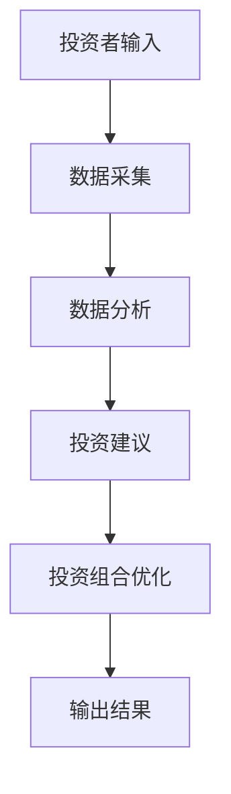
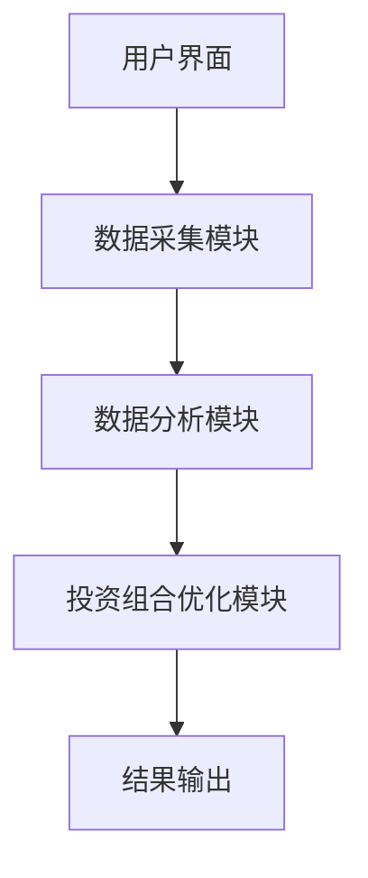

                 


# 费雪的新兴市场投资观点：把握全球机遇

## 关键词：费雪投资理论、新兴市场、投资策略、风险管理、全球投资

## 摘要：本文深入探讨了费雪的投资理论及其在新兴市场的应用，分析了新兴市场的特点和投资机会，结合数学模型和系统设计，展示了如何在新兴市场中把握全球投资机遇。

---

## 第1章: 费雪投资理论的核心理念

### 1.1 费雪投资理论的起源与背景

费雪（Philip Fisher）的投资理论是20世纪最具影响力的理论之一。他的观点基于长期投资和价值发现，强调选择具有强大增长潜力的公司。费雪的投资理念在20世纪50年代首次提出，至今仍对全球投资者产生深远影响。

#### 1.1.1 费雪投资理论的提出背景
费雪的投资理论起源于20世纪初的美国，当时市场经历了多次波动，投资者急需一种稳定的投资策略。费雪通过分析企业的基本面，提出了“成长股”概念，即选择那些具有持续增长潜力的公司进行投资。

#### 1.1.2 费雪投资理论的核心思想
费雪的核心思想是长期投资和价值发现。他认为，成功的投资不仅依赖于市场的短期波动，更取决于企业未来的增长潜力。投资者应关注公司的基本面，如盈利能力、成长性和管理团队。

#### 1.1.3 费雪投资理论的演变与发展
随着市场的变化，费雪理论不断演变，但仍保留其核心观点。现代投资者将费雪的理论与技术分析相结合，进一步优化投资策略。

---

### 1.2 新兴市场的定义与特点

#### 1.2.1 新兴市场的定义
新兴市场是指那些经济快速增长、产业结构正在转型的国家。这些市场通常具有较高的增长潜力，但也伴随着较高的风险。

#### 1.2.2 新兴市场的基本特征
新兴市场通常具有以下特征：经济快速增长、市场规模较小、行业集中度低、政策环境不稳定等。

#### 1.2.3 新兴市场的分类与分布
新兴市场可以分为亚洲、拉丁美洲、中东欧等多个区域。每个区域的市场特点有所不同，投资者需要根据具体情况制定投资策略。

---

## 第2章: 费雪投资理论与新兴市场的关系

### 2.1 费雪投资理论的核心观点

#### 2.1.1 费雪的长期投资理念
费雪强调长期投资，认为短期市场波动不应影响投资决策。他建议投资者选择那些具有持续增长潜力的公司。

#### 2.1.2 费雪的内在价值理论
内在价值是公司未来现金流的现值。费雪认为，投资者应关注公司的内在价值，而不是市场的短期波动。

#### 2.1.3 费雪的成长股投资策略
成长股是指那些具有持续增长潜力的公司。费雪认为，成长股的投资回报最高，但也伴随着较高的风险。

---

### 2.2 新兴市场的投资机会

#### 2.2.1 新兴市场的增长潜力
新兴市场的经济增长速度通常高于发达市场，这为投资者提供了更多的投资机会。

#### 2.2.2 新兴市场的行业分布
新兴市场的行业分布较为分散，投资者可以通过多元化投资降低风险。

#### 2.2.3 新兴市场的风险与收益
新兴市场的风险较高，但潜在收益也更大。投资者需要在风险和收益之间找到平衡点。

---

## 第3章: 费雪投资理论在新兴市场的应用

### 3.1 费雪投资理论的适用性分析

#### 3.1.1 费雪理论在新兴市场的可行性
费雪理论的核心观点在新兴市场中同样适用，但需要根据具体情况进行调整。

#### 3.1.2 费雪理论与新兴市场特点的契合点
新兴市场的增长潜力和行业分布为费雪理论的应用提供了良好的环境。

#### 3.1.3 费雪理论在新兴市场的局限性
新兴市场的政策环境和市场波动较大，这可能影响费雪理论的应用效果。

---

### 3.2 费雪投资理论在新兴市场的具体应用

#### 3.2.1 新兴市场的行业选择
投资者应选择那些具有持续增长潜力的行业，如科技、消费和金融等。

#### 3.2.2 新兴市场的公司分析
投资者需要对公司的基本面进行深入分析，包括盈利能力、管理团队和行业地位等。

#### 3.2.3 新兴市场的投资组合构建
投资者应根据市场情况调整投资组合，以分散风险并捕捉增长机会。

---

## 第4章: 费雪投资理论的数学模型与算法

### 4.1 费雪投资理论的数学模型

#### 4.1.1 内在价值的计算公式
$$\text{内在价值} = \sum_{t=1}^{\infty} \frac{\text{现金流}_t}{(1 + r)^t}$$
其中，$r$ 是折现率，$\text{现金流}_t$ 是第$t$年的现金流。

#### 4.1.2 股票估值的数学模型
$$\text{股票价值} = \frac{\text{每股收益} \times (1 + g)}{r - g}$$
其中，$g$ 是每股收益的年增长率。

#### 4.1.3 投资组合优化的数学公式
$$\text{收益最大化} = \text{权重}_i \times \text{收益}_i$$
$$\text{风险最小化} = \text{权重}_i \times \text{风险}_i$$

---

### 4.2 费雪投资理论的算法实现

#### 4.2.1 投资组合优化算法
```python
def optimize_portfolio(weights, returns):
    # 定义目标函数
    def objective(x):
        return -sum(x * returns * x.T)
    
    # 定义约束条件
    constraints = [{'type': 'eq', 'fun': lambda x: sum(x) - 1}]
    
    # 使用 scipy 优化
    from scipy.optimize import minimize
    result = minimize(objective, weights, constraints=constraints)
    return result.x
```

#### 4.2.2 风险调整收益的计算代码
```python
def calculate_sharpe_ratio(returns, risk_free_rate):
    import numpy as np
    excess_returns = returns - risk_free_rate
    return np.mean(excess_returns) / np.std(excess_returns)
```

---

## 第5章: 系统分析与架构设计方案

### 5.1 问题场景介绍

#### 5.1.1 新兴市场投资分析的复杂性
新兴市场的投资分析涉及多个因素，如经济指标、政策环境和市场情绪等。

#### 5.1.2 投资者面临的挑战
投资者需要应对新兴市场的高风险和不确定性。

#### 5.1.3 系统设计的目标
设计一个能够分析新兴市场投资机会的系统，帮助投资者制定有效的投资策略。

---

### 5.2 系统功能设计

#### 5.2.1 系统功能模块划分
- 数据采集模块：收集新兴市场的相关数据。
- 数据分析模块：分析数据并生成投资建议。
- 投资组合优化模块：根据分析结果优化投资组合。

#### 5.2.2 系统功能流程图


---

### 5.3 系统架构设计

#### 5.3.1 系统架构图


---

## 第6章: 项目实战与案例分析

### 6.1 环境安装与配置

#### 6.1.1 投资分析工具的安装
安装Python和相关库，如Pandas和NumPy。

#### 6.1.2 数据源的获取与处理
从可靠的数据源获取新兴市场的相关数据，并进行清洗和预处理。

---

### 6.2 核心算法实现

#### 6.2.1 投资组合优化的代码实现
```python
import numpy as np
import pandas as pd

# 假设returns是一个数据框，其中包含各资产的收益率
def sharpe_ratio(weights, returns, risk_free_rate):
    excess_returns = returns - risk_free_rate
    return (weights @ excess_returns.mean()) / (weights @ excess_returns.std())

# 使用优化算法寻找最优权重
def find_optimal_weights(returns, risk_free_rate):
    n = returns.shape[1]
    initial_weights = np.array([1/n] * n)
    result = optimize_portfolio(initial_weights, returns.values)
    return result.x
```

---

### 6.3 案例分析

#### 6.3.1 新兴市场的行业分布
分析新兴市场的行业分布，选择具有增长潜力的行业进行投资。

#### 6.3.2 投资组合构建
根据分析结果，构建投资组合并进行风险调整，以最大化收益。

---

## 第7章: 小结与展望

通过本文的分析，我们可以看到，费雪的投资理论在新兴市场中具有重要的应用价值。新兴市场的高增长潜力为投资者提供了更多的机会，但同时也带来了更高的风险。投资者需要结合费雪理论和现代投资工具，制定有效的投资策略。

未来，随着技术的进步和市场的变化，费雪理论在新兴市场中的应用将更加广泛和深入。投资者需要不断学习和适应，以把握全球投资机遇。

---

## 作者：AI天才研究院/AI Genius Institute & 禅与计算机程序设计艺术 /Zen And The Art of Computer Programming

