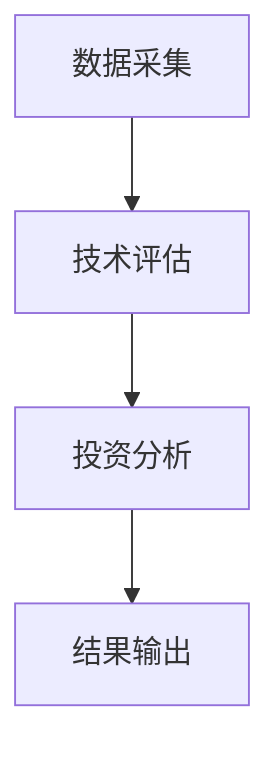

                 


# 费雪的未来增长评估：预测颠覆性技术的影响

## 关键词：费雪、成长股、颠覆性技术、技术预测、投资评估、增长模型

## 摘要：  
本文探讨了如何利用费雪的成长股理论来预测和评估颠覆性技术对市场增长的影响。通过对费雪理论的深入分析和颠覆性技术的特征研究，结合数学模型和算法，提出了一种结合技术分析和投资策略的方法，为投资者提供新的视角和工具。通过实际案例分析，展示了如何在实际投资中应用这些理论和方法，为未来的投资决策提供参考。

---

## 第一部分：背景介绍

### 第1章：引言

#### 1.1 研究背景与问题提出  
随着科技的快速发展，颠覆性技术（如人工智能、区块链、量子计算等）不断涌现，这些技术不仅改变了 industries 的运作方式，还可能彻底颠覆传统的商业模式和市场结构。在这种背景下，投资者需要一种有效的工具来评估这些技术对市场增长的潜在影响，从而做出更明智的投资决策。费雪的成长股理论作为一种经典的股票估值方法，提供了从公司成长角度评估投资价值的框架。然而，如何将这一理论与颠覆性技术的影响相结合，仍然是一个亟待解决的问题。

#### 1.2 研究意义与目标  
本文旨在探讨如何将费雪的成长股理论与颠覆性技术评估相结合，提出一种新的投资分析框架，帮助投资者更好地预测和评估颠覆性技术对市场增长的影响。通过结合技术分析和财务分析，本文试图为投资者提供一个更加全面和动态的决策工具。

#### 1.3 内容框架  
本文将从以下几个方面展开：  
1. 费雪成长股理论的核心思想与应用。  
2. 颠覆性技术的定义、特征及其对市场增长的影响。  
3. 费雪理论与颠覆性技术评估的结合方法。  
4. 数学模型与算法在技术评估中的应用。  
5. 系统架构与实现方案。  
6. 项目实战与案例分析。  
7. 总结与展望。

### 第2章：费雪的成长股理论

#### 2.1 费雪成长股理论的核心思想  
费雪的成长股理论认为，股票的价值不仅仅取决于其当前的盈利能力，更取决于其未来的增长潜力。他强调，投资者应该关注那些具有可持续增长潜力的公司，尤其是那些在行业内具有领先地位且能够不断创新的公司。

#### 2.2 费雪投资分析方法  
费雪提出了一种系统化的投资分析方法，包括以下几个步骤：  
1. **行业分析**：选择具有增长潜力的行业。  
2. **公司分析**：筛选具有竞争优势的公司。  
3. **财务分析**：评估公司的财务健康状况。  
4. **成长性评估**：预测公司的未来增长潜力。  

#### 2.3 费雪理论的现代应用  
随着人工智能和大数据技术的发展，费雪理论也在不断演变。现代投资者可以通过数据分析和模型构建，更精准地预测公司的未来增长潜力。

### 第3章：颠覆性技术的定义与特征

#### 3.1 颠覆性技术的定义  
颠覆性技术是指那些能够从根本上改变现有市场格局、商业模式或技术路径的新技术。与渐进式创新不同，颠覆性技术往往会对现有市场产生革命性影响。

#### 3.2 颠覆性技术的特征  
1. **创新性**：颠覆性技术往往具有创新性，能够突破现有技术的局限性。  
2. **破坏性**：颠覆性技术可能对传统产业造成冲击，甚至导致其衰退。  
3. **扩散性**：颠覆性技术一旦成熟，往往能够快速扩散，改变整个市场格局。  

#### 3.3 颠覆性技术对市场增长的影响  
1. **行业结构的改变**：颠覆性技术可能导致行业集中度的变化，新兴企业可能取代传统企业成为市场主导者。  
2. **竞争格局的改变**：颠覆性技术可能打破现有的竞争格局，创造新的竞争优势。  
3. **市场需求的变化**：颠覆性技术可能催生新的市场需求，推动市场的增长。

---

## 第二部分：核心概念与联系

### 第4章：费雪理论与颠覆性技术的结合

#### 4.1 颠覆性技术对成长股的影响  
颠覆性技术可能对成长股产生双重影响：一方面，它可能为成长股公司带来新的增长机会；另一方面，它也可能对传统成长股公司构成威胁。

#### 4.2 技术颠覆性对投资决策的影响  
1. **投资机会的识别**：投资者需要识别那些能够从颠覆性技术中受益的公司。  
2. **投资风险的控制**：投资者需要评估颠覆性技术可能带来的风险，并制定相应的风险管理策略。

#### 4.3 颠覆性技术的经济影响分析  
1. **经济增长的推动作用**：颠覆性技术可以通过提高生产效率和创造新的市场需求来推动经济增长。  
2. **传统产业的冲击**：颠覆性技术可能对传统产业造成冲击，导致其市场份额的下降。  
3. **新兴产业的促进作用**：颠覆性技术可以为新兴产业提供新的增长点。

### 第5章：颠覆性技术的数学模型与算法

#### 5.1 技术颠覆性潜力的数学模型  
为了评估颠覆性技术的潜力，我们可以构建一个数学模型，考虑以下因素：  
- 技术的创新性  
- 技术的扩散速度  
- 技术的市场接受度  

#### 5.2 技术颠覆性风险的数学模型  
为了评估颠覆性技术的风险，我们可以构建一个风险评估模型，考虑以下因素：  
- 技术的不确定性  
- 市场的接受度  
- 竞争的激烈程度  

#### 5.3 技术颠覆性潜力的算法实现  
通过算法实现技术颠覆性潜力的评估，我们可以使用以下步骤：  
1. 数据收集与预处理  
2. 模型构建与训练  
3. 模型验证与优化  
4. 结果分析与解读  

---

## 第三部分：系统架构与实现方案

### 第6章：系统架构设计

#### 6.1 问题场景介绍  
本文构建了一个基于费雪理论的颠覆性技术评估系统，旨在帮助投资者评估技术的颠覆性潜力及其对市场增长的影响。

#### 6.2 系统功能设计  
1. 数据采集模块：采集公司财务数据、行业数据和技术数据。  
2. 技术评估模块：评估技术的颠覆性潜力。  
3. 投资分析模块：基于费雪理论进行投资分析。  

#### 6.3 系统架构图  


#### 6.4 系统接口设计  
1. 数据接口：提供数据输入和输出的接口。  
2. 用户界面：提供用户友好的操作界面。  
3. 报告生成接口：生成评估报告。  

---

## 第四部分：项目实战与案例分析

### 第7章：项目实战

#### 7.1 项目环境与数据准备  
1. 安装必要的软件和库（如Python、Pandas、Scikit-learn）。  
2. 数据收集：收集相关公司的财务数据和技术数据。  

#### 7.2 核心代码实现  
```python
import pandas as pd
from sklearn.linear_model import LinearRegression

# 数据预处理
data = pd.read_csv('data.csv')
X = data[['收入', '利润', '研发投入']]
y = data['股价']

# 模型训练
model = LinearRegression()
model.fit(X, y)

# 模型预测
new_company = [[100, 20, 30]]
print(model.predict(new_company))
```

#### 7.3 案例分析  
以人工智能技术为例，分析其对科技行业的颠覆性影响。通过代码实现模型预测，解读结果并提出投资建议。

---

## 第五部分：总结与展望

### 第8章：总结

#### 8.1 核心观点回顾  
本文通过结合费雪的成长股理论和颠覆性技术评估，提出了一种新的投资分析框架，为投资者提供了新的视角和工具。

#### 8.2 最佳实践 tips  
1. 在投资决策中，应综合考虑技术和财务因素。  
2. 应及时跟踪颠覆性技术的最新动态。  
3. 应合理控制投资风险，避免过度集中。

### 第9章：展望

#### 9.1 未来研究方向  
1. 探讨更多颠覆性技术对市场增长的影响。  
2. 研究不同行业的技术颠覆性潜力。  
3. 探索更复杂的数学模型和算法。  

#### 9.2 注意事项  
投资者在实际操作中应结合市场实际情况，谨慎决策。

---

## 作者：AI天才研究院 & 禅与计算机程序设计艺术

---

以上是文章的完整目录和内容框架，希望对您有所帮助！

