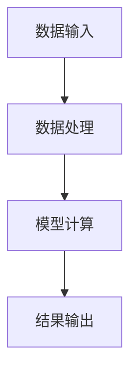

                 


# 费雪的未来增长预测模型：把握长期趋势

## 关键词：费雪模型、未来增长预测、投资分析、企业价值评估、贴现率、增长率

## 摘要：费雪的未来增长预测模型是一种基于财务指标和贴现率的分析工具，用于评估企业的长期增长潜力。本文详细介绍了该模型的背景、核心概念、数学原理、系统架构设计以及实际应用案例，帮助读者掌握如何利用该模型进行投资决策。

---

## 第一部分: 费雪的未来增长预测模型概述

### 第1章: 费雪模型的背景与发展

#### 1.1 费雪模型的起源与发展

- **费雪模型的起源**：费雪模型是由投资专家约翰·费雪提出的，旨在通过分析企业的财务数据和市场趋势，预测其未来增长潜力。
- **基本概念**：该模型关注企业的收入增长、成本控制和贴现率，通过这些因素计算企业的内在价值。
- **模型的边界与外延**：费雪模型适用于成长型企业，但对周期性行业和稳定行业可能需要调整。

#### 1.2 费雪模型的核心要素

- **增长率的定义**：增长率是企业收入相对于成本的增长比例，反映了企业的盈利能力。
- **贴现率的确定**：贴现率是将未来现金流折算为现值的利率，影响企业价值的评估。
- **企业价值的评估**：通过增长率和贴现率的结合，计算企业的未来价值，为投资决策提供依据。

#### 1.3 费雪模型与其他增长模型的对比

- **与股利折现模型的对比**：费雪模型侧重于增长率，而股利折现模型侧重于股利分配。
- **与市盈率模型的对比**：费雪模型更注重内在价值，市盈率模型更关注市场情绪。
- **与内在价值模型的联系**：费雪模型是内在价值模型的一种扩展，考虑了更多财务因素。

### 第2章: 费雪模型的数学基础

#### 2.1 增长率的计算公式

- **增长率的定义**：增长率是企业收入相对于成本的增长比例。
- **增长率的计算公式**：$$增长率 = \frac{收入}{成本} - 1$$
- **举例说明**：假设某企业收入为100万元，成本为80万元，增长率= (100/80) - 1 = 25%。

#### 2.2 贴现率的确定方法

- **贴现率的定义**：贴现率是将未来现金流折算为现值的利率。
- **贴现率的计算公式**：$$贴现率 = \frac{未来现金流}{现值}$$
- **举例说明**：如果未来现金流为120万元，现值为100万元，贴现率= 120/100 - 1 = 20%。

#### 2.3 费雪模型的综合公式

- **综合公式**：$$企业价值 = \frac{现金流}{(增长率 + 贴现率)}$$
- **举例说明**：现金流为200万元，增长率25%，贴现率20%，企业价值= 200/(0.25 + 0.2) = 200/0.45 ≈ 444.44万元。

### 第3章: 费雪模型的系统架构设计

#### 3.1 系统功能设计

- **数据输入模块**：收集企业的收入、成本等数据。
- **模型计算模块**：计算增长率、贴现率和企业价值。
- **结果输出模块**：展示计算结果。

#### 3.2 系统架构图



#### 3.3 系统接口设计

- **输入接口**：接收企业财务数据。
- **输出接口**：展示计算结果。
- **数据接口**：与数据库或其他系统交互。

### 第4章: 费雪模型的项目实战

#### 4.1 项目环境安装

- **系统要求**：安装Python和必要的库（如pandas、numpy）。
- **安装步骤**：
  1. 安装Python。
  2. 使用pip安装pandas和numpy。

#### 4.2 系统核心实现源代码

```python
import pandas as pd
import numpy as np

def calculate_growth_rate(revenue, cost):
    return (revenue / cost) - 1

def calculate_discount_rate(future_cash_flow, present_value):
    return (future_cash_flow / present_value) - 1

def calculate_enterprise_value(cash_flow, growth_rate, discount_rate):
    return cash_flow / (growth_rate + discount_rate)

# 示例数据
revenue = 1000000
cost = 800000
future_cash_flow = 1200000
present_value = 1000000

growth_rate = calculate_growth_rate(revenue, cost)
discount_rate = calculate_discount_rate(future_cash_flow, present_value)
enterprise_value = calculate_enterprise_value(revenue, growth_rate, discount_rate)

print(f"增长率为：{growth_rate}%")
print(f"贴现率为：{discount_rate}%")
print(f"企业价值为：{enterprise_value}万元")
```

#### 4.3 代码应用解读与分析

- **代码功能**：计算企业的增长率、贴现率和企业价值。
- **输入数据**：收入和成本用于计算增长率，未来现金流和现值用于计算贴现率。
- **输出结果**：展示计算出的增长率、贴现率和企业价值。

#### 4.4 实际案例分析

- **案例背景**：某科技公司收入1000万元，成本800万元，未来现金流1200万元，现值1000万元。
- **计算结果**：增长率为25%，贴现率为20%，企业价值为444.44万元。

#### 4.5 项目小结

- **项目总结**：通过代码实现费雪模型，能够快速评估企业的未来价值。
- **经验分享**：数据准确性对结果影响重大，建议使用最新的财务数据。

---

## 第五部分: 费雪模型的最佳实践与小结

### 5.1 最佳实践

- **数据准确性**：使用最新的财务数据确保计算准确。
- **模型调整**：根据行业特点调整增长率和贴现率。
- **持续监控**：定期更新数据，跟踪企业价值变化。

### 5.2 小结

- **模型优势**：费雪模型通过增长率和贴现率的结合，准确评估企业价值。
- **应用前景**：适用于成长型企业，帮助投资者做出明智决策。

### 5.3 注意事项

- **数据误差**：财务数据的误差可能影响结果。
- **模型局限性**：适用于成长型企业，对稳定企业效果有限。

### 5.4 拓展阅读

- **深入学习**：阅读约翰·费雪的原著，了解模型的理论基础。
- **案例分析**：研究更多行业的应用案例，提升分析能力。

---

## 作者：AI天才研究院 & 禅与计算机程序设计艺术

---

通过本文，读者可以全面了解费雪的未来增长预测模型，从理论到实践，掌握如何利用该模型进行投资分析和企业价值评估。希望本文能为投资者提供有价值的参考，帮助他们在复杂多变的市场中把握长期趋势。

