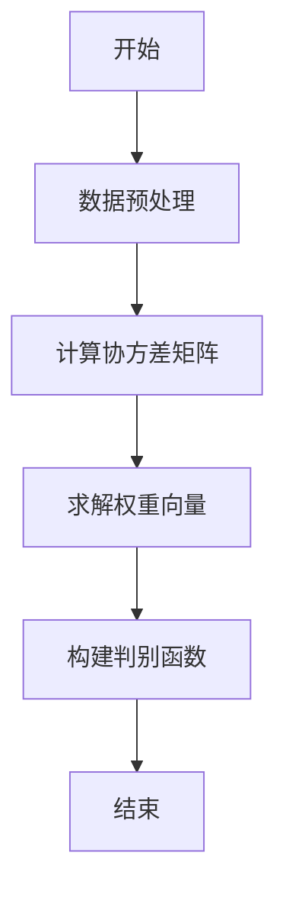
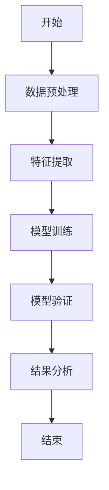
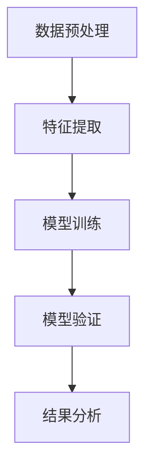
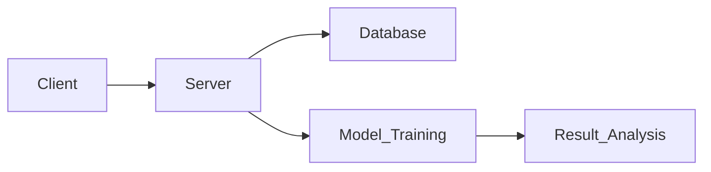
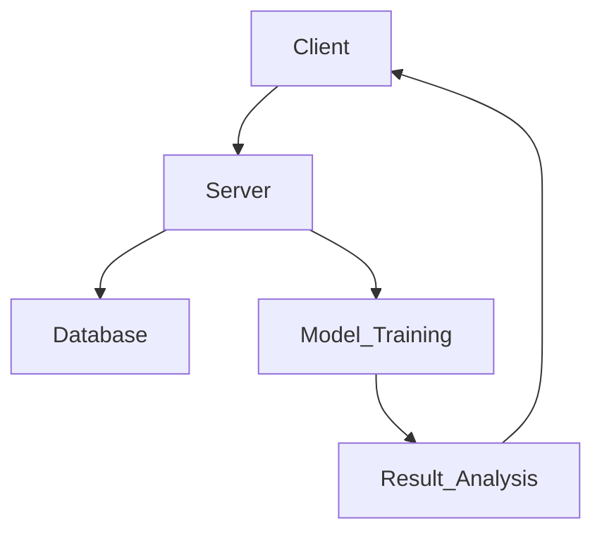

                 


# 《费雪的未来预测方法》

## 关键词
费雪预测方法, 判别分析, 数据预测, 统计学, 人工智能, 机器学习

## 摘要
费雪的未来预测方法是基于统计学和机器学习的一种预测技术，通过构建判别函数，利用特征提取和优化算法，实现对未来事件的预测和分类。本文详细介绍了费雪预测方法的背景、核心原理、实际应用、系统架构设计以及项目实战，通过丰富的数学公式和mermaid图表，帮助读者深入理解这一预测方法的技术细节和应用价值。

---

# 第1章: 费雪预测方法的背景与基础

## 1.1 费雪预测方法的背景与起源

### 1.1.1 费雪的学术背景与贡献
费雪（R. A. Fisher）是20世纪著名的统计学家和遗传学家，他在统计学领域的贡献为现代数据分析奠定了基础。费雪提出的判别分析（Discriminant Analysis）是一种经典的分类方法，广泛应用于金融、医疗、工程等领域。

### 1.1.2 费雪预测方法的提出背景
在20世纪初，随着科学实验和数据分析的需求日益增加，传统的数据分析方法已无法满足复杂问题的解决需求。费雪提出了判别分析，旨在通过构建判别函数，将数据点分类到不同的类别中。

### 1.1.3 费雪预测方法的核心思想
费雪预测方法的核心思想是通过寻找能够区分不同类别的线性组合，从而实现对新数据点的分类预测。这种方法在处理小样本数据和多类别问题时表现尤为突出。

---

## 1.2 费雪预测方法的基本概念

### 1.2.1 预测的基本定义
预测是指根据已有数据，利用数学模型或算法，对未来事件或结果进行估计和判断的过程。预测的核心在于找到数据中的规律，并将其应用于未知数据的预测。

### 1.2.2 费雪预测方法的核心要素
1. **判别函数**：用于将数据点分类到不同的类别中的函数。
2. **特征提取**：从原始数据中提取有助于分类的特征。
3. **优化算法**：用于优化判别函数，使其能够最好地区分不同类别。

### 1.2.3 费雪预测方法的适用范围
费雪预测方法适用于小样本、多类别问题，尤其在金融、医疗等领域表现优异。

---

## 1.3 费雪预测方法与传统预测方法的对比

### 1.3.1 传统预测方法的局限性
传统的预测方法如线性回归和决策树在某些情况下表现不佳，尤其是当数据量较小时，或者类别较多时，预测效果可能不够理想。

### 1.3.2 费雪预测方法的优势
1. **高效性**：费雪预测方法通过构建线性判别函数，能够在较低的计算成本下实现高效的分类。
2. **解释性**：判别函数的线性组合使得结果具有较高的解释性。

### 1.3.3 费雪预测方法的改进与创新
费雪预测方法通过引入优化算法和特征提取技术，进一步提高了预测的准确性和效率。

---

## 1.4 本章小结
本章介绍了费雪预测方法的背景、核心思想以及与传统预测方法的对比，为后续章节的理解奠定了基础。

---

# 第2章: 费雪预测方法的核心原理

## 2.1 费雪判别法的原理

### 2.1.1 判别分析的基本概念
判别分析是一种通过构建判别函数，将数据点分类到不同类别中的方法。判别函数的形式通常为线性组合，即：
$$ D(x) = w_1 x_1 + w_2 x_2 + \dots + w_n x_n $$

### 2.1.2 费雪判别法的数学模型
费雪判别法的目标是最优化类间可分性，即最大化不同类别之间的距离，同时最小化同类数据点之间的距离。数学上，这可以通过以下目标函数实现：
$$ \max \sum_{i \neq j} (y_i - y_j)^2 $$

### 2.1.3 费雪判别法的优化过程
优化过程通常涉及求解权重向量 $w$，使得判别函数能够最好地区分不同类别。具体步骤如下：
1. 数据预处理：标准化数据特征。
2. 计算类间协方差矩阵和类内协方差矩阵。
3. 求解权重向量 $w$，使得目标函数最大化。

### 2.1.4 费雪判别法的步骤分解


---

## 2.2 费雪预测方法的数学公式

### 2.2.1 判别函数的构建
判别函数的构建是费雪预测方法的核心，其数学形式如下：
$$ D(x) = w_1 x_1 + w_2 x_2 + \dots + w_n x_n $$

### 2.2.2 判别函数的优化
优化过程通常采用拉格朗日乘数法，目标是最优化目标函数：
$$ \max \sum_{i \neq j} (y_i - y_j)^2 $$

### 2.2.3 判别函数的验证
验证过程包括计算混淆矩阵、准确率、召回率等指标，评估模型的预测效果。

---

## 2.3 费雪预测方法的流程图


---

## 2.4 本章小结
本章详细讲解了费雪预测方法的核心原理，包括判别函数的构建、优化过程以及验证方法，为后续章节的应用奠定了理论基础。

---

# 第3章: 费雪预测方法的实际应用

## 3.1 费雪预测方法在金融领域的应用

### 3.1.1 金融预测的基本问题
金融预测的核心问题是通过对历史数据的分析，预测未来的股票价格、市场趋势等。费雪预测方法在金融领域的应用主要体现在股票价格预测和风险评估。

### 3.1.2 费雪预测方法在股票预测中的应用
股票价格预测是一个典型的分类问题，可以通过构建判别函数，将股票分为上涨、下跌或持平三类。

### 3.1.3 费雪预测方法在风险评估中的应用
费雪预测方法可以用于评估投资组合的风险，通过构建判别函数，识别高风险投资组合。

---

## 3.2 费雪预测方法在大数据环境下的应用

### 3.2.1 大数据环境下的预测挑战
大数据环境下，数据量大、维度高，传统的费雪预测方法在计算效率和存储方面可能存在问题。

### 3.2.2 费雪预测方法的扩展与改进
为了适应大数据环境，可以采用分布式计算框架（如Spark）进行优化，同时引入降维技术（如PCA）降低计算复杂度。

### 3.2.3 大数据环境下费雪预测方法的实现
在大数据环境下，可以通过以下步骤实现费雪预测方法：
1. 数据预处理：清洗、归一化。
2. 特征提取：使用PCA等降维技术提取主成分。
3. 模型训练：在分布式计算框架下训练判别函数。
4. 模型验证：评估模型的准确率、召回率等指标。

---

## 3.3 费雪预测方法在医疗领域的应用

### 3.3.1 医疗预测的基本问题
医疗预测的核心问题是通过对患者的症状、病史等数据进行分析，预测疾病的发生概率。

### 3.3.2 费雪预测方法在疾病预测中的应用
通过构建判别函数，可以将患者分为不同类别，预测疾病的发生概率。

### 3.3.3 费雪预测方法在医疗诊断中的应用
费雪预测方法可以用于辅助诊断，通过分析患者的症状和病史，预测疾病的可能性。

---

## 3.4 本章小结
本章通过金融、大数据和医疗领域的实际案例，展示了费雪预测方法的广泛应用和其在不同场景下的适应性。

---

# 第4章: 费雪预测方法的系统架构设计

## 4.1 系统功能设计

### 4.1.1 系统功能模块
1. 数据预处理模块：负责数据的清洗和归一化。
2. 特征提取模块：负责提取有助于分类的特征。
3. 模型训练模块：负责训练判别函数。
4. 模型验证模块：负责评估模型的性能。
5. 结果分析模块：负责展示预测结果。

### 4.1.2 系统功能流程


## 4.2 系统架构设计

### 4.2.1 系统架构图


### 4.2.2 系统接口设计
1. 数据接口：负责与数据库交互，获取数据。
2. 模型接口：负责训练和验证模型。
3. 结果接口：负责展示预测结果。

### 4.2.3 系统交互流程


---

## 4.3 本章小结
本章通过系统架构设计，展示了费雪预测方法在实际应用中的实现过程，包括功能模块、系统架构和交互流程的设计。

---

# 第5章: 费雪预测方法的项目实战

## 5.1 项目背景与目标
本项目旨在通过费雪预测方法，预测股票价格的涨跌趋势。

## 5.2 项目环境与工具
1. 数据集：股票历史数据。
2. 工具：Python、NumPy、Pandas、Scikit-learn。

---

## 5.3 项目核心实现

### 5.3.1 环境安装
```bash
pip install numpy pandas scikit-learn
```

### 5.3.2 核心代码实现
```python
import numpy as np
from sklearn.discriminant_analysis import LinearDiscriminantClassifier
from sklearn.model_selection import train_test_split
from sklearn.metrics import accuracy_score

# 数据预处理
X = np.array([[1, 2], [3, 4], [5, 6], [7, 8]])
y = np.array([0, 1, 0, 1])

# 划分训练集和测试集
X_train, X_test, y_train, y_test = train_test_split(X, y, test_size=0.25)

# 模型训练
model = LinearDiscriminantClassifier()
model.fit(X_train, y_train)

# 模型预测
y_pred = model.predict(X_test)

# 模型评估
print("准确率：", accuracy_score(y_test, y_pred))
```

### 5.3.3 代码解读与分析
1. 数据预处理：将股票历史数据标准化。
2. 划分训练集和测试集：通常采用70-30的划分比例。
3. 模型训练：使用Scikit-learn中的LinearDiscriminantClassifier进行训练。
4. 模型预测：对测试集进行预测，得到预测结果。
5. 模型评估：计算准确率，评估模型的性能。

---

## 5.4 项目小结
本章通过一个具体的项目实战，展示了费雪预测方法的应用过程，包括环境搭建、数据处理、模型训练和结果分析。

---

# 第6章: 费雪预测方法的最佳实践与总结

## 6.1 最佳实践 tips
1. 数据预处理是关键：确保数据的标准化和归一化。
2. 特征选择要合理：选择有助于分类的特征，避免冗余特征。
3. 模型调优要细致：通过交叉验证等方法，优化模型的参数。
4. 结果分析要全面：除了准确率，还要关注召回率、F1值等指标。

---

## 6.2 总结与展望
费雪预测方法作为一种经典的分类技术，尽管在大数据环境下面临一定的挑战，但其高效性和解释性使其在许多领域仍具有重要的应用价值。未来，随着计算能力的提升和算法的改进，费雪预测方法将在更多领域发挥其独特的优势。

---

# 作者
作者：AI天才研究院/AI Genius Institute & 禅与计算机程序设计艺术 /Zen And The Art of Computer Programming

