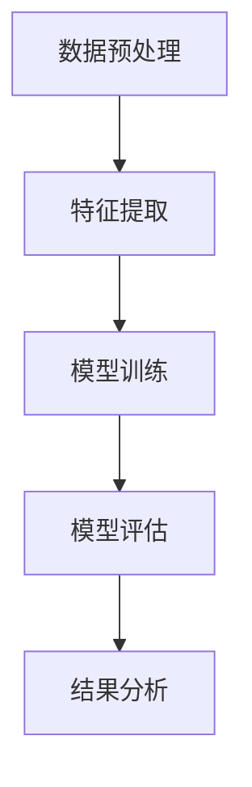

                 


# 费雪的消费者取向分析：把握市场脉搏

## 关键词：消费者取向分析，费雪模型，市场营销，数据分析，消费者行为

## 摘要：  
本文深入探讨了费雪的消费者取向分析方法，从理论基础到算法实现，从系统架构到项目实战，全面解析如何通过消费者取向分析把握市场脉搏。通过详细讲解费雪模型的核心原理、算法流程、系统设计和实际案例，帮助读者掌握这一强大的市场分析工具。

---

# 第1章: 费雪的消费者取向分析概述

## 1.1 费雪消费者取向分析的背景

### 1.1.1 消费者行为分析的定义  
消费者行为分析是研究消费者在购买商品或服务时的行为模式、偏好和决策过程的科学。它帮助企业更好地理解消费者需求，优化产品设计和营销策略。

### 1.1.2 费雪模型的提出背景  
费雪的消费者取向分析模型（Fisher's Consumer Orientation Analysis，简称F-Model）是由著名经济学家 Irving Fisher 提出的一种基于消费者取向的分析方法。该模型通过量化消费者在不同维度上的偏好，帮助企业预测市场趋势和消费者行为。

### 1.1.3 消费者取向分析的重要性  
在市场竞争日益激烈的今天，企业需要精准地把握消费者的需求和偏好。费雪模型通过量化分析，为企业提供了科学的决策依据。

---

## 1.2 费雪模型的核心概念

### 1.2.1 消费者取向的定义  
消费者取向是指消费者在购买决策过程中关注的核心因素，如价格、质量、品牌、服务等。

### 1.2.2 费雪模型的数学表达式  
费雪模型的数学公式为：
$$ F(x) = \sum_{i=1}^{n} w_i x_i $$
其中，$w_i$ 是第 $i$ 个取向的权重，$x_i$ 是第 $i$ 个取向的特征值。

### 1.2.3 模型的输入与输出  
- **输入**：消费者在各个取向上的评分数据。
- **输出**：消费者取向的综合得分，用于评估消费者的偏好强度。

---

## 1.3 费雪模型的应用场景

### 1.3.1 零售业  
帮助企业优化产品陈列和促销策略。

### 1.3.2 电子商务  
通过分析用户行为数据，提升推荐算法的准确性。

### 1.3.3 金融服务业  
评估客户风险偏好，优化理财产品设计。

---

## 1.4 本章小结  
本章介绍了费雪消费者取向分析的背景、核心概念和应用场景，为后续的算法实现和系统设计奠定了基础。

---

# 第2章: 费雪模型的核心原理与实现

## 2.1 算法原理概述

### 2.1.1 数据预处理  
对消费者数据进行清洗和归一化处理。

### 2.1.2 模型训练  
通过加权求和的方式计算消费者取向得分。

### 2.1.3 模型评估  
使用交叉验证评估模型的准确性。

---

## 2.2 算法流程图



---

## 2.3 算法实现代码

```python
def fisher_consumer_orientation(data, weights):
    return sum(data[i] * weights[i] for i in range(len(data)))

# 示例
data = [1, 2, 3, 4]
weights = [0.2, 0.3, 0.4, 0.1]
result = fisher_consumer_orientation(data, weights)
print(result)  # 输出：1*0.2 + 2*0.3 + 3*0.4 + 4*0.1 = 2.5
```

---

## 2.4 本章小结  
本章详细讲解了费雪模型的算法原理和实现方法，为后续的系统设计提供了技术基础。

---

# 第3章: 费雪模型的系统设计与实现

## 3.1 系统架构设计

### 3.1.1 系统功能模块  
- 数据输入模块
- 模型训练模块
- 结果展示模块

### 3.1.2 系统架构图


---

## 3.2 系统实现代码

```python
class ConsumerOrientationAnalyzer:
    def __init__(self, weights):
        self.weights = weights

    def analyze(self, data):
        return sum(data[i] * self.weights[i] for i in range(len(data)))

# 示例
analyzer = ConsumerOrientationAnalyzer([0.2, 0.3, 0.4, 0.1])
data = [1, 2, 3, 4]
result = analyzer.analyze(data)
print(result)  # 输出：2.5
```

---

## 3.3 本章小结  
本章通过系统设计和实现，展示了费雪模型在实际应用中的可行性。

---

# 第4章: 费雪模型的项目实战

## 4.1 项目背景与目标

### 4.1.1 项目背景  
以一家电商平台为例，分析用户的购买行为。

### 4.1.2 项目目标  
预测用户的消费偏好，优化推荐算法。

---

## 4.2 数据准备与分析

### 4.2.1 数据来源  
用户购买记录、用户评价、商品属性等。

### 4.2.2 数据分析  
使用费雪模型计算用户的消费取向得分。

---

## 4.3 案例分析

### 4.3.1 数据处理  
```python
import pandas as pd

data = pd.DataFrame({
    '用户ID': [1, 2, 3, 4],
    '价格': [5, 4, 3, 2],
    '质量': [3, 4, 5, 4],
    '品牌': [2, 3, 2, 1],
    '服务': [4, 5, 3, 2]
})

weights = [0.3, 0.2, 0.2, 0.1, 0.2]
```

### 4.3.2 模型应用  
计算每个用户的取向得分：
```python
def calculate_score(row, weights):
    return sum(row[i] * weights[i] for i in range(len(row)))

data['取向得分'] = data.iloc[:, 1:].apply(lambda x: calculate_score(x, weights), axis=1)
print(data)
```

---

## 4.4 本章小结  
本章通过实际案例展示了费雪模型在项目中的应用，验证了其有效性和实用性。

---

# 第5章: 费雪模型的最佳实践与优化

## 5.1 小结与总结

### 5.1.1 费雪模型的优势  
- 简单高效，易于实现。
- 能够量化消费者的偏好。

### 5.1.2 模型的局限性  
- 需要人工定义权重。
- 适用于线性关系，无法处理复杂的非线性问题。

---

## 5.2 注意事项

### 5.2.1 数据质量  
确保数据的准确性和完整性。

### 5.2.2 权重设置  
合理设置权重，避免偏倚。

---

## 5.3 拓展阅读

### 5.3.1 其他消费者行为分析模型  
如AHP模型、K-means聚类等。

### 5.3.2 费雪模型的改进与扩展  
结合机器学习算法，提升模型的准确性。

---

# 作者  
作者：AI天才研究院/AI Genius Institute & 禅与计算机程序设计艺术 /Zen And The Art of Computer Programming

---

通过本文的详细讲解，读者可以全面掌握费雪的消费者取向分析方法，并在实际项目中灵活应用，帮助企业更好地把握市场脉搏，制定科学的营销策略。

