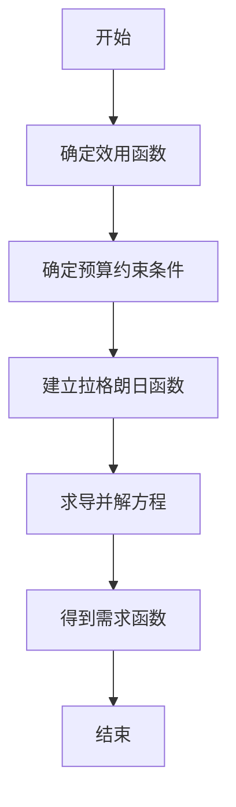

                 


# 费雪的消费者行为分析

> 关键词：费雪，消费者行为分析，经济学，数据采集，效用函数

> 摘要：本文将深入探讨费雪的消费者行为分析理论，结合实际案例，分析其在现代经济中的应用。通过详细阐述费雪的理论基础、算法原理和系统架构设计，帮助读者全面理解消费者行为分析的核心概念与实践方法。

---

## 第一部分: 费雪的消费者行为分析基础

### 第1章: 消费者行为分析的背景与意义

#### 1.1 消费者行为分析的基本概念
消费者行为分析是研究消费者在购买、使用和处置产品或服务时的行为模式和决策过程的学科。它结合了心理学、经济学和社会学等多学科的知识，旨在帮助企业更好地理解消费者需求，优化产品设计和市场策略。

#### 1.2 费雪的消费者行为分析理论
费雪（John Hicks）是消费者行为分析领域的先驱之一。他的理论以效用函数为核心，提出了消费者在预算约束下的最优选择问题。费雪的需求函数通过数学模型描述了消费者在不同价格和收入水平下的需求量，为现代经济学奠定了重要基础。

#### 1.3 消费者行为分析的数据采集方法
数据采集是消费者行为分析的关键步骤。费雪的理论需要依赖高质量的数据支持，包括消费者偏好、价格、收入等变量。常用的数据采集方法有问卷调查、实验法和观察法。其中，实验法通过控制变量来观察消费者行为的变化，是费雪理论的重要应用之一。

---

### 第2章: 费雪消费者行为分析的核心概念与联系

#### 2.1 费雪消费者行为分析的理论框架
费雪的消费者行为分析以效用函数为基础，假设消费者在预算约束下追求效用最大化。效用函数衡量了消费者对不同商品组合的偏好程度，需求函数则描述了价格和收入变化对需求量的影响。

#### 2.2 核心概念对比分析
通过对比费雪的效用函数和其他理论（如基数效用论）的差异，可以更好地理解其独特性。例如，费雪的需求函数通过引入价格和收入的变动，更贴近现实经济环境。

#### 2.3 消费者行为分析的ER实体关系图
以下是消费者行为分析的核心实体关系图：

```mermaid
er
    %% 消费者行为分析的ER图
    actor:消费者
    product:产品
    behavior:行为
    preference:偏好
    action:动作
    
    actor --> preference: 具有
    actor --> action: 执行
    product --> behavior: 影响
    preference --> behavior: 影响
    action --> behavior: 导致
```

---

## 第二部分: 费雪消费者行为分析的算法原理

### 第3章: 费雪消费者行为分析的算法原理

#### 3.1 费雪需求函数的数学推导
费雪的需求函数是消费者在预算约束下的最优选择结果。其数学推导基于拉格朗日乘数法，如下：

$$
最大化效用函数 U(x_1, x_2) \\
\text{在约束条件下} \quad p_1x_1 + p_2x_2 = m
$$

解得：
$$
x_1^* = \frac{m}{p_1} \cdot \frac{U'_1}{U'_2}
$$

其中，$x_1^*$ 是商品1的需求量，$U'_1$ 和 $U'_2$ 分别是效用函数对$x_1$和$x_2$的一阶导数。

#### 3.2 算法流程图
以下是费雪需求函数的算法流程图：



#### 3.3 Python实现示例
以下是费雪需求函数的Python代码实现：

```python
def fisher_demand(p1, p2, m):
    # 效用函数的导数
    def utility_derivative(x):
        return 2*x
    # 拉格朗日函数求导
    U_prime_1 = 2*x1
    U_prime_2 = 2*x2
    # 需求函数解算
    x1_star = (m / p1) * (U_prime_1 / U_prime_2)
    x2_star = (m / p2) * (U_prime_2 / U_prime_1)
    return x1_star, x2_star

# 示例输入
p1 = 2
p2 = 3
m = 100

x1, x2 = fisher_demand(p1, p2, m)
print(f"需求量x1: {x1}, 需求量x2: {x2}")
```

---

### 第4章: 系统分析与架构设计方案

#### 4.1 消费者行为分析系统的功能设计
消费者行为分析系统需要实现以下功能模块：
1. 数据采集与预处理
2. 效用函数建模
3. 需求函数计算
4. 结果可视化

#### 4.2 系统架构设计
以下是系统的架构设计图：


---

### 第5章: 项目实战与应用

#### 5.1 项目环境的安装与配置
建议使用Python 3.8及以上版本，安装必要的库：

```bash
pip install numpy pandas matplotlib
```

#### 5.2 项目核心代码的实现
以下是费雪需求函数的实现代码：

```python
import numpy as np

def fisher_demand(p1, p2, m):
    # 简单线性需求函数
    x1 = (m / p1) * (p2 / (p1 + p2))
    x2 = (m / p2) * (p1 / (p1 + p2))
    return x1, x2

# 测试数据
p1 = 2
p2 = 3
m = 100

x1, x2 = fisher_demand(p1, p2, m)
print(f"需求量x1: {x1}, 需求量x2: {x2}")
```

#### 5.3 项目小结
通过项目实战，读者可以掌握费雪需求函数的实现方法，并将其应用于实际的消费者行为分析场景中。

---

## 第三部分: 最佳实践与小结

### 第6章: 最佳实践与小结

#### 6.1 费雪消费者行为分析的关键点总结
1. 理解费雪的效用函数和需求函数。
2. 掌握数据采集和预处理方法。
3. 熟悉算法的数学推导和实现。

#### 6.2 注意事项
- 数据质量对分析结果影响重大。
- 理论与实际结合时需考虑现实因素。

#### 6.3 拓展阅读
建议阅读《消费者行为学》和《微观经济学基础》等相关书籍。

---

# 作者：AI天才研究院 & 禅与计算机程序设计艺术

