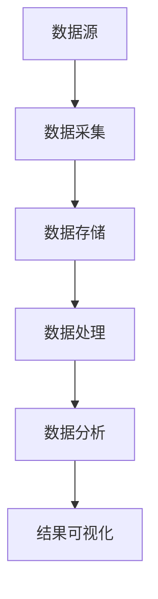
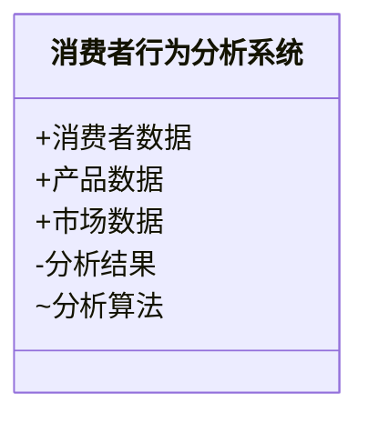
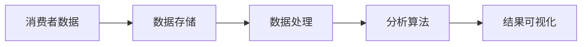
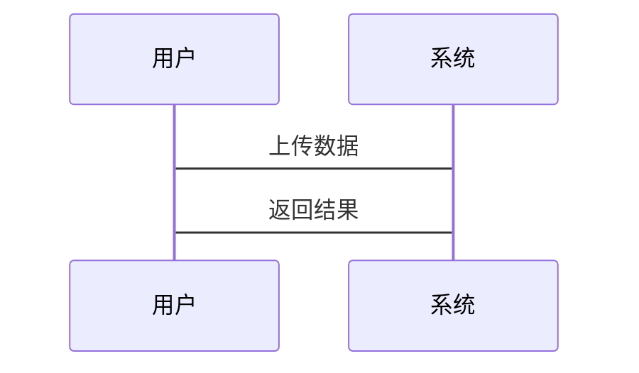

                 


# 费雪的消费者行为分析：大数据时代的新方法

## 关键词：消费者行为分析、大数据、费雪模型、数据挖掘、机器学习

## 摘要：本文探讨了费雪的消费者行为分析理论在大数据时代的应用与创新，结合大数据技术的新方法，分析消费者行为的深度与广度，提出结合传统理论与现代技术的解决方案，为商业决策提供科学依据。

---

# 第1章: 费雪的消费者行为分析概述

## 1.1 费雪的消费者行为分析背景

### 1.1.1 消费者行为分析的定义与范围
消费者行为分析是研究消费者如何做出购买决策的过程，涉及心理学、经济学和社会学等多个领域。传统的消费者行为分析依赖于问卷调查和焦点小组，但随着大数据技术的发展，分析方法和手段发生了革命性的变化。

### 1.1.2 费雪的消费者行为分析理论发展
费雪（John Maynard Keynes）提出的消费者行为理论是经济学的重要组成部分，其核心是效用最大化和需求函数。费雪的需求理论指出，消费者的需求不仅受价格和收入的影响，还与心理因素密切相关。

### 1.1.3 大数据时代对消费者行为分析的影响
大数据技术的出现，使得消费者行为分析可以从传统的样本数据扩展到全量数据，分析维度和深度都得到了极大的提升。通过实时数据采集和分析，企业可以更精准地预测消费者行为，优化营销策略。

## 1.2 费雪的消费者行为分析的核心概念

### 1.2.1 消费者决策过程
消费者决策过程包括需求识别、信息收集、评估比较、购买决策和购后行为五个阶段。大数据技术可以捕捉到消费者在各个阶段的行为特征，帮助企业更好地理解消费者需求。

### 1.2.2 费雪的需求理论
费雪的需求理论强调价格和收入对需求的影响，需求函数为：
$$ Q_d = \frac{M}{P} $$
其中，\( Q_d \) 是需求量，\( M \) 是收入，\( P \) 是价格。

### 1.2.3 消费者行为分析的边界与外延
消费者行为分析的边界包括消费者的行为数据、市场环境和产品特性。外延则涉及消费者情绪分析、行为预测和个性化推荐。

## 1.3 费雪消费者行为分析的框架

### 1.3.1 分析框架的核心要素
费雪的消费者行为分析框架包括消费者特征、产品属性、市场环境和行为结果四个核心要素。

### 1.3.2 费雪模型的结构与功能
费雪模型通过需求函数和效用函数，预测消费者的购买行为。模型结构分为需求分析、效用评估和行为预测三个部分。

### 1.3.3 框架的适用性与局限性
费雪模型适用于价格和收入敏感性分析，但对消费者心理因素的分析较为有限。

## 1.4 本章小结
本章介绍了费雪消费者行为分析的背景、核心概念和框架，为后续分析奠定了理论基础。

---

# 第2章: 费雪消费者行为分析的理论基础

## 2.1 费雪需求理论的数学模型

### 2.1.1 需求函数的定义
需求函数描述了价格、收入和需求量之间的关系。费雪的需求函数为：
$$ Q_d = \frac{M}{P} $$

### 2.1.2 费雪需求函数的公式推导
通过消费者效用最大化原则，可以推导出需求函数。假设效用函数为：
$$ U = x_1 + \ln x_2 $$
在预算约束下，\( M = P_1 x_1 + P_2 x_2 \)，解得：
$$ x_1 = \frac{M}{P_1} $$
$$ x_2 = \frac{M}{P_2} $$

### 2.1.3 需求函数的属性分析
需求函数具有价格弹性和收入弹性，可以通过导数计算。

## 2.2 消费者效用函数的构建

### 2.2.1 效用函数的定义
效用函数衡量消费者从商品或服务中获得的满足程度。常用的形式包括线性效用函数和凹性效用函数。

### 2.2.2 费雪效用函数的构建
假设消费者购买两种商品，效用函数为：
$$ U = x_1 + x_2 $$

### 2.2.3 效用函数的优化方法
通过拉格朗日乘数法，求解效用函数在预算约束下的最大值。

## 2.3 费雪需求与供给的均衡分析

### 2.3.1 市场均衡的定义
市场均衡是指供给量等于需求量时的价格和数量。

### 2.3.2 费雪模型中的均衡条件
均衡时，供给价格等于需求价格：
$$ P = \frac{M}{Q_d} $$

### 2.3.3 均衡分析的数学推导
通过联立供给函数和需求函数，求解均衡价格和数量。

## 2.4 本章小结
本章通过数学模型详细阐述了费雪的需求理论和效用函数，为后续分析提供了理论支持。

---

# 第3章: 大数据时代消费者行为分析的新方法

## 3.1 大数据技术在消费者行为分析中的应用

### 3.1.1 数据采集技术
大数据技术包括结构化数据采集（SQL）和非结构化数据采集（NLP）。

### 3.1.2 数据处理与清洗方法
数据清洗包括去重、去噪和填补缺失值。

### 3.1.3 数据分析与挖掘工具
常用工具包括Python的pandas和机器学习库scikit-learn。

## 3.2 基于大数据的消费者行为分析流程

### 3.2.1 数据流图


## 3.3 费雪模型与大数据技术的结合

### 3.3.1 费雪模型的数字化重构
通过大数据技术，将费雪的需求函数转化为数据驱动的模型。

### 3.3.2 大数据技术对费雪模型的增强
利用机器学习算法，提升需求预测的准确性和实时性。

## 3.4 本章小结
本章探讨了大数据技术如何增强费雪的消费者行为分析模型，为后续分析提供了新思路。

---

# 第4章: 费雪消费者行为分析的算法实现

## 4.1 数据预处理

### 4.1.1 数据清洗
使用Python代码清洗数据：
```python
import pandas as pd
data = pd.read_csv('data.csv')
data.dropna()  # 删除缺失值
```

### 4.1.2 数据转换
将分类变量转换为数值变量，例如使用独热编码。

## 4.2 特征工程

### 4.2.1 特征选择
使用LASSO回归选择重要特征。

### 4.2.2 特征构建
构建交互特征，例如购买频率与价格的乘积。

## 4.3 模型训练

### 4.3.1 机器学习算法
使用随机森林模型预测消费者行为。

### 4.3.2 模型调优
通过网格搜索优化模型参数。

## 4.4 结果分析

### 4.4.1 模型评估
使用混淆矩阵和ROC曲线评估模型性能。

### 4.4.2 可视化展示
绘制特征重要性图，展示关键影响因素。

## 4.5 本章小结
本章通过机器学习算法实现费雪模型的优化，提高了消费者行为分析的精度。

---

# 第5章: 系统架构设计与实现

## 5.1 系统功能设计

### 5.1.1 领域模型


### 5.1.2 系统架构图


## 5.2 接口设计

### 5.2.1 API接口
定义RESTful API，提供数据上传和结果查询接口。

### 5.2.2 接口交互流程
使用序列图展示系统交互过程：


## 5.3 本章小结
本章详细设计了系统的架构和接口，为后续实现提供了指导。

---

# 第6章: 项目实战与结果分析

## 6.1 环境搭建

### 6.1.1 安装Python
安装Anaconda，配置Jupyter Notebook。

## 6.2 数据获取

### 6.2.1 数据源
使用公开数据集，例如Kaggle上的消费者行为数据。

## 6.3 数据预处理

### 6.3.1 清洗数据
删除重复和缺失值。

### 6.3.2 转换数据
将日期格式统一。

## 6.4 特征工程

### 6.4.1 选择特征
使用相关性分析选择重要特征。

## 6.5 模型训练

### 6.5.1 训练随机森林模型
```python
from sklearn.ensemble import RandomForestClassifier
model = RandomForestClassifier()
model.fit(X_train, y_train)
```

### 6.5.2 评估模型
计算准确率、召回率和F1分数。

## 6.6 结果分析

### 6.6.1 可视化展示
绘制混淆矩阵和特征重要性图。

### 6.6.2 结果解读
分析模型预测的准确性，优化特征选择。

## 6.7 本章小结
本章通过项目实战，验证了大数据分析方法的有效性。

---

# 第7章: 总结与展望

## 7.1 研究总结
本文结合费雪的消费者行为分析理论和大数据技术，提出了新的分析方法，提高了分析精度。

## 7.2 研究的局限性
本文的分析主要基于结构化数据，对非结构化数据的分析较为有限。

## 7.3 未来研究方向
未来可以研究更复杂的行为模型，结合深度学习技术，提升分析能力。

## 7.4 本章小结
总结全文，指出研究的意义和未来的发展方向。

---

# 作者

作者：AI天才研究院/AI Genius Institute & 禅与计算机程序设计艺术 /Zen And The Art of Computer Programming

