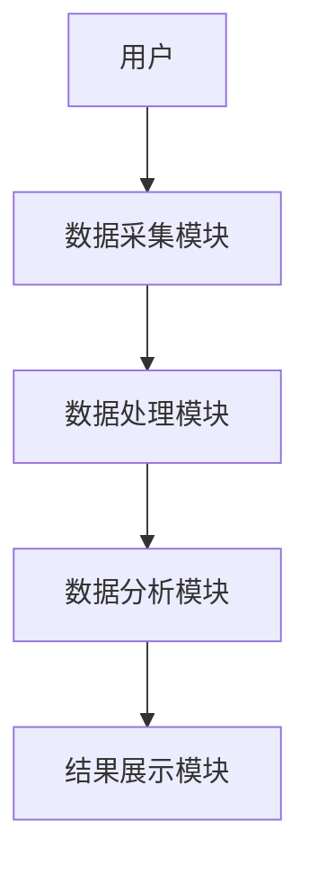
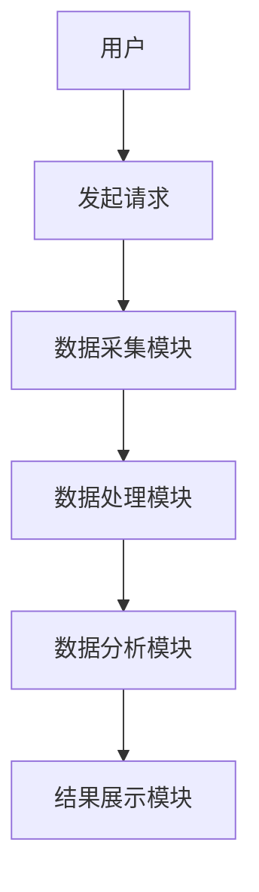

                 


# 费雪的消费者行为研究：社交媒体时代的新方法

## 关键词：费雪消费者行为理论、社交媒体、消费者行为分析、数据挖掘、机器学习、用户画像

## 摘要：  
本文探讨了费雪消费者行为理论在社交媒体时代的应用与创新。通过分析社交媒体对消费者行为的影响，结合数据挖掘和机器学习技术，提出了一种新的消费者行为研究方法。文章详细介绍了费雪理论的核心概念、社交媒体环境下的消费者行为特征、基于大数据的消费者行为分析方法，以及如何通过系统架构设计和项目实战实现消费者行为的精准预测与应用。文章还提供了具体的Python代码示例和实际案例分析，为读者提供了全面的技术指导和实践参考。

---

# 第一部分: 费雪的消费者行为研究背景与理论基础

## 第1章: 费雪的消费者行为理论概述

### 1.1 费雪的消费者行为理论背景

#### 1.1.1 费雪的理论起源与核心思想  
费雪的消费者行为理论起源于20世纪初，由英国经济学家约翰·R·费雪提出。该理论主要关注消费者在购买决策过程中的心理和行为特征，强调消费者需求的多层次性和复杂性。费雪认为，消费者的行为是由多种因素驱动的，包括动机、认知、情感和社会环境等。这些因素共同作用，决定了消费者的购买决策和行为模式。

#### 1.1.2 消费者行为研究的演变历程  
消费者行为研究经历了从传统营销学的“4P理论”到现代大数据时代的“精准营销”的演变。传统研究主要关注消费者的理性决策过程，而现代研究则更加注重消费者行为的情感驱动和社交影响。社交媒体的兴起进一步推动了消费者行为研究的深化，数据技术的进步使其更加精准化和动态化。

#### 1.1.3 费雪理论在现代的应用价值  
尽管费雪的理论提出较早，但其核心思想在社交媒体时代仍然具有重要的应用价值。费雪理论强调消费者行为的复杂性和多层次性，这与社交媒体环境下消费者行为的多样性和互动性高度契合。通过结合大数据技术，费雪理论能够帮助企业在社交媒体时代更好地理解消费者需求，优化营销策略。

---

### 1.2 社交媒体时代的消费者行为变化

#### 1.2.1 社交媒体对消费者行为的影响  
社交媒体的兴起彻底改变了消费者的行为模式。消费者不再只是被动接受信息，而是通过社交媒体积极参与内容的创造、传播和互动。社交媒体使得消费者的决策过程更加透明化，同时也增强了消费者的社交影响力。

#### 1.2.2 新媒体环境下消费者行为的特点  
社交媒体时代，消费者行为表现出以下特点：  
1. **社交化**：消费者通过社交媒体与品牌、产品以及其他消费者互动。  
2. **个性化**：消费者行为越来越个性化，社交媒体使得消费者能够根据自身需求选择性地获取信息。  
3. **即时性**：社交媒体的即时性使得消费者行为更加迅速和动态化。  
4. **数据化**：社交媒体产生了海量数据，为消费者行为分析提供了丰富的数据源。

#### 1.2.3 费雪理论与社交媒体时代的结合  
费雪理论的核心思想与社交媒体时代的消费者行为特征高度契合。社交媒体环境下的消费者行为更加复杂，需要从动机、认知、情感等多个维度进行分析。通过结合费雪理论，可以更好地理解社交媒体时代消费者的决策过程。

---

### 1.3 费雪理论的核心概念与框架

#### 1.3.1 消费者决策过程的五个阶段  
费雪理论将消费者决策过程分为五个阶段：  
1. **问题识别**：消费者意识到某种需求。  
2. **信息搜索**：消费者主动搜索与产品或服务相关的信息。  
3. **评估与选择**：消费者对多个选项进行评估并做出选择。  
4. **购买决策**：消费者完成购买行为。  
5. **购后行为**：消费者对购买行为的反馈和评价。

#### 1.3.2 动机、认知与情感的交互作用  
费雪理论强调动机、认知和情感三者的交互作用。动机是消费者行为的驱动力，认知是消费者对信息的处理方式，情感是消费者行为的情感驱动。三者共同作用，决定了消费者的最终决策。

#### 1.3.3 费雪理论的边界与外延  
费雪理论的边界主要在于其假设消费者行为是理性的，而社交媒体时代消费者的感性行为可能超出这一假设。因此，需要结合实际情况对费雪理论进行扩展和调整。

---

## 第2章: 费雪消费者行为理论与社交媒体的结合

### 2.1 费雪理论在社交媒体环境中的应用

#### 2.1.1 社交媒体如何影响消费者认知  
社交媒体通过信息的快速传播和互动性，影响消费者的认知过程。消费者可以通过社交媒体获取更多的信息，并与其他消费者互动，从而影响其对产品或服务的认知。

#### 2.1.2 费雪理论在社交媒体传播中的作用  
费雪理论为社交媒体传播提供了理论基础。通过理解消费者的动机、认知和情感，企业可以更好地设计社交媒体传播策略，提高传播效果。

#### 2.1.3 社交媒体时代消费者行为的新模式  
社交媒体时代，消费者行为呈现出新的模式，例如从单纯的购买行为到参与品牌共创的转变。费雪理论可以帮助企业更好地理解这些新模式，并制定相应的策略。

---

### 2.2 社交媒体数据与消费者行为分析

#### 2.2.1 社交媒体数据的类型与特点  
社交媒体数据主要包括文本数据（如评论、帖子）、图像数据（如图片、视频）和行为数据（如点击、点赞、分享）。这些数据具有实时性、多样性和社会化的特点。

#### 2.2.2 数据挖掘在消费者行为分析中的应用  
通过数据挖掘技术，可以从社交媒体数据中提取消费者行为特征，例如消费者的兴趣、偏好和情感倾向。这些特征可以帮助企业更好地理解消费者需求。

#### 2.2.3 费雪理论与大数据分析的结合  
通过结合费雪理论和大数据分析，可以更全面地理解消费者行为。大数据分析提供了消费者行为的量化指标，而费雪理论提供了行为分析的理论框架。

---

### 2.3 费雪理论在社交媒体营销中的实践

#### 2.3.1 费雪理论指导社交媒体营销策略  
费雪理论可以帮助企业制定更具针对性的社交媒体营销策略。例如，通过理解消费者的动机和情感，企业可以设计更有吸引力的社交媒体内容。

#### 2.3.2 社交媒体环境下消费者行为预测  
通过结合费雪理论和机器学习技术，可以对消费者的购买行为进行预测。这有助于企业提前规划营销活动，提高营销效果。

#### 2.3.3 费雪理论在社交媒体品牌建设中的应用  
费雪理论强调消费者的认知和情感，这在品牌建设中尤为重要。通过理解消费者的认知和情感，企业可以更好地塑造品牌形象，增强消费者对品牌的忠诚度。

---

## 第3章: 费雪消费者行为理论的扩展与创新

### 3.1 社交媒体时代费雪理论的扩展

#### 3.1.1 从个体行为到群体行为的扩展  
社交媒体时代的消费者行为具有明显的群体性特征。通过费雪理论的扩展，可以更好地理解群体行为对个体行为的影响。

#### 3.1.2 费雪理论与社交媒体网络的关系  
费雪理论与社交媒体网络密切相关。社交媒体网络为消费者行为提供了新的互动场景，而费雪理论为理解这些互动提供了理论框架。

#### 3.1.3 费雪理论与社交媒体情感分析的结合  
通过结合费雪理论和情感分析技术，可以更好地理解消费者的情感需求，并制定更具针对性的营销策略。

---

### 3.2 费雪消费者行为分析的创新方法

#### 3.2.1 基于社交媒体数据的情感分析  
通过情感分析技术，可以量化消费者在社交媒体上的情感倾向，从而更好地理解消费者的情感需求。

#### 3.2.2 基于机器学习的消费者行为预测  
通过机器学习技术，可以对消费者的购买行为进行预测。这需要结合费雪理论中的消费者行为模型和机器学习算法，构建预测模型。

#### 3.2.3 费雪理论与社交媒体内容营销的结合  
通过结合费雪理论和内容营销策略，可以更好地吸引消费者关注，并增强消费者的参与感和忠诚度。

---

## 第4章: 费雪消费者行为分析的系统架构设计

### 4.1 系统功能设计

#### 4.1.1 数据采集模块  
数据采集模块负责从社交媒体平台获取消费者行为数据。这些数据包括用户的评论、点赞、分享等行为。

#### 4.1.2 数据处理模块  
数据处理模块负责对获取的数据进行清洗、转换和存储。这一步骤是后续分析的基础。

#### 4.1.3 数据分析模块  
数据分析模块负责对数据进行挖掘和分析，提取消费者行为特征。这一步骤需要结合费雪理论，设计相应的分析模型。

#### 4.1.4 结果展示模块  
结果展示模块负责将分析结果以可视化的方式展示出来，便于企业理解和应用。

---

### 4.2 系统架构设计

#### 4.2.1 系统架构图  
以下是系统架构的mermaid图：



#### 4.2.2 接口设计  
系统接口设计包括数据采集接口、数据处理接口和数据分析接口。每个接口都需要定义明确的输入和输出格式。

#### 4.2.3 交互流程图  
以下是交互流程的mermaid图：



---

## 第5章: 项目实战与代码实现

### 5.1 环境安装与配置

#### 5.1.1 安装Python环境  
需要安装Python 3.8及以上版本。可以通过Anaconda或Pyenv进行安装。

#### 5.1.2 安装必要的库  
需要安装的库包括：  
- `pandas`  
- `numpy`  
- `scikit-learn`  
- `matplotlib`  
- `tweepy`

安装命令：  
```bash
pip install pandas numpy scikit-learn matplotlib twepy
```

---

### 5.2 核心代码实现

#### 5.2.1 数据采集模块  
以下是一个简单的Twitter数据采集代码：

```python
import tweepy

# 设置API密钥
auth = tweepy.OAuth1UserHandler(consumer_key, consumer_secret, access_token, access_token_secret)

# 初始化API
api = tweepy.API(auth)

# 获取推文
tweets = api.search(q="消费体验", count=100)

# 存储数据
import pandas as pd
df = pd.DataFrame({'tweet': [tweet.text for tweet in tweets]})
df.to_csv('consumer_behavior.csv', index=False)
```

#### 5.2.2 数据分析模块  
以下是一个基于机器学习的消费者行为预测代码：

```python
from sklearn.model

