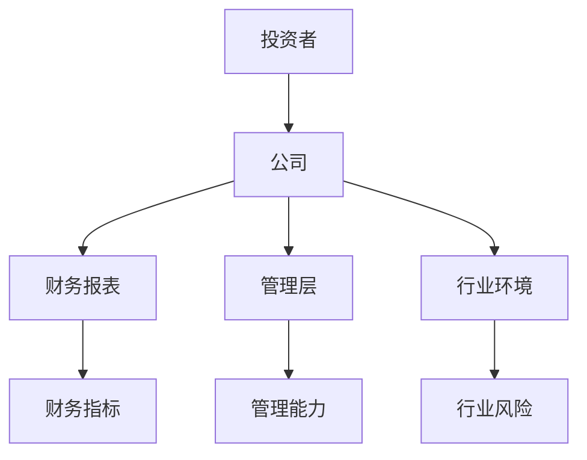

                 


# 费雪的深度研究方法：了解公司内部

> 关键词：费雪投资方法, 深度公司分析, 价值投资, 股票分析, 投资策略

> 摘要：本文将深入探讨费雪的深度研究方法，分析其如何通过深入研究公司内部情况来做出投资决策。文章将从费雪投资方法的背景与核心概念出发，逐步揭示其算法原理、系统架构设计，结合实际案例进行详细分析，并总结最佳实践，帮助读者全面理解和掌握这一经典投资方法。

---

## 第一部分: 费雪的深度研究方法概述

### 第1章: 费雪深度研究方法的背景与核心概念

#### 1.1 费雪深度研究方法的起源与演变

##### 1.1.1 价值投资的起源与发展

价值投资是一种长期投资策略，其核心在于寻找那些市场价格低于其内在价值的证券。这种投资理念起源于20世纪初，由本杰明·格雷厄姆和戴维·多德共同提出。他们认为，市场的短期波动是不可预测的，但长期来看，证券的价值是由其内在基本面决定的。费雪在继承了格雷厄姆的价值投资理念的基础上，进一步发展出一套独特的投资分析方法。

##### 1.1.2 费雪投资理念的形成

菲利普·费雪（Philip Fisher）是价值投资领域的另一位重要人物，他提出了“成长型投资”的概念。他认为，投资不仅仅是寻找便宜的股票，更重要的是寻找那些具有持续增长潜力的公司。费雪的方法强调对公司基本面的深入研究，尤其是对公司管理层、行业地位、财务状况和竞争优势的分析。

##### 1.1.3 费雪方法在现代投资中的地位

尽管现代投资理论和技术分析得到了广泛应用，但费雪的方法依然在投资领域占据重要地位。他的方法强调对公司内部情况的深入理解，尤其是在识别具有长期增长潜力的企业方面，提供了独特的视角。这种方法在长期投资策略中仍然具有不可替代的价值。

#### 1.2 费雪深度研究方法的核心概念

##### 1.2.1 公司内部研究的定义与特点

公司内部研究是指通过分析公司的财务报表、管理层决策、行业地位、竞争优势等因素，来评估公司的内在价值和未来增长潜力。与技术分析不同，内部研究更注重公司的基本面和长期发展潜力。

##### 1.2.2 费雪方法的核心要素

费雪方法的核心要素包括：
1. **管理层质量**：管理层的诚信和能力是公司成功的关键。
2. **行业地位**：公司是否在行业中占据领先地位。
3. **财务健康状况**：公司是否具备健康的财务状况和盈利能力。
4. **竞争优势**：公司是否具备独特的竞争优势，如专利、品牌、技术等。

##### 1.2.3 公司内部研究的边界与外延

公司内部研究的边界在于公司本身，但其外延则包括公司所处的行业环境、宏观经济因素和政策环境等。这些外部因素也会影响公司的内在价值和投资潜力。

#### 1.3 费雪方法与其他投资方法的对比

##### 1.3.1 基本面分析与技术分析的差异

基本面分析关注公司的内在价值，而技术分析关注市场的价格走势和交易量。费雪的方法更接近基本面分析，但更注重公司内部的长期增长潜力。

##### 1.3.2 费雪方法与格雷厄姆价值投资的区别

格雷厄姆的价值投资注重寻找市场价格低于内在价值的证券，而费雪的方法更注重寻找具有长期增长潜力的公司。格雷厄姆的方法更偏向于短期投资，而费雪的方法更注重长期投资。

##### 1.3.3 费雪方法的优缺点分析

**优点**：
- 更注重公司的长期增长潜力。
- 适合长期投资者。

**缺点**：
- 分析过程较为复杂，需要大量的时间和精力。
- 短期市场波动可能会影响投资决策。

---

### 第2章: 费雪深度研究方法的核心概念与联系

#### 2.1 费雪方法的核心原理

##### 2.1.1 投资的三要素：安全、盈利与成长

费雪认为，成功的投资需要满足三个要素：
1. **安全**：公司的财务状况健康，不会因短期波动而倒闭。
2. **盈利**：公司具备持续的盈利能力。
3. **成长**：公司具备长期的增长潜力。

##### 2.1.2 公司竞争优势的分析框架

费雪提出了一个分析框架，包括以下几个方面：
1. **管理层**：管理层的诚信和能力。
2. **行业地位**：公司在行业中的地位。
3. **财务状况**：公司的财务健康状况。
4. **竞争优势**：公司的竞争优势，如技术、品牌、专利等。

##### 2.1.3 费雪的“投资检查清单”

费雪提出了一套“投资检查清单”，用于评估公司的内在价值。清单包括以下几个方面：
1. **管理层**：管理层是否诚信、有能力。
2. **行业地位**：公司是否在行业中占据领先地位。
3. **财务状况**：公司是否具备健康的财务状况。
4. **竞争优势**：公司是否具备独特的竞争优势。

#### 2.2 费雪方法的核心概念对比

##### 2.2.1 主动投资者与被动投资者的对比

| 对比维度 | 主动投资者 | 被动投资者 |
|----------|------------|------------|
| 投资策略 | 寻找被低估的证券 | 通过指数基金投资 |
| 分析方法 | 基于基本面分析 | 基于市场趋势分析 |
| 风险控制 | 高 | 低 |

##### 2.2.2 长期投资与短期投资的对比

| 对比维度 | 长期投资 | 短期投资 |
|----------|------------|------------|
| 投资期限 | 长期 | 短期 |
| 分析重点 | 公司内在价值 | 市场波动 |
| 风险控制 | 较低 | 较高 |

##### 2.2.3 费雪方法与其他价值投资方法的对比

| 对比维度 | 费雪方法 | 格雷厄姆方法 |
|----------|------------|------------|
| 投资理念 | 寻找具有长期增长潜力的公司 | 寻找市场价格低于内在价值的证券 |
| 分析重点 | 公司内部研究 | 公司内在价值评估 |
| 投资策略 | 长期投资 | 短期投资 |

#### 2.3 费雪方法的ER实体关系图



---

### 第3章: 费雪深度研究方法的算法原理

#### 3.1 费雪方法的算法框架

##### 3.1.1 投资决策树的构建

费雪方法的算法框架可以看作是一个投资决策树。以下是决策树的简化流程：

1. **评估公司管理层**：检查管理层的诚信和能力。
2. **评估公司行业地位**：检查公司在行业中的地位。
3. **评估公司财务状况**：检查公司的财务健康状况。
4. **评估公司竞争优势**：检查公司是否具备竞争优势。
5. **综合评估**：根据以上评估结果，综合评估公司的内在价值。

##### 3.1.2 费雪检查清单的算法实现

以下是费雪检查清单的算法实现：

```python
def fisher_checklist(company):
    # 管理层评估
    if not assess_management(company):
        return False
    # 行业地位评估
    if not assess_industry_position(company):
        return False
    # 财务状况评估
    if not assess_financial_health(company):
        return False
    # 竞争优势评估
    if not assess Competitive_advantages(company):
        return False
    return True
```

##### 3.1.3 费雪方法的数学模型

费雪方法的数学模型可以通过以下公式表示：

$$
\text{内在价值} = \text{公司基本面} \times \text{行业地位} \times \text{管理层质量} \times \text{竞争优势}
$$

---

## 结论

费雪的深度研究方法是一种基于公司内部研究的价值投资方法。它通过深入分析公司的管理层、行业地位、财务状况和竞争优势，来评估公司的内在价值和长期增长潜力。尽管现代投资理论和技术分析得到了广泛应用，但费雪的方法在长期投资策略中仍然具有不可替代的价值。

---

## 作者

作者：AI天才研究院/AI Genius Institute & 禅与计算机程序设计艺术 /Zen And The Art of Computer Programming

