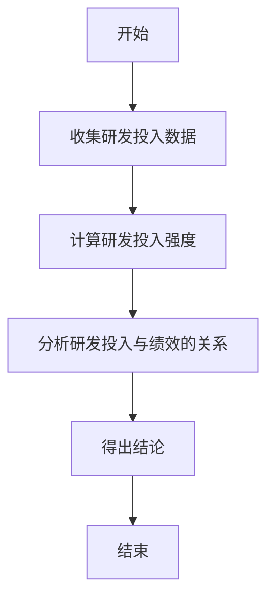

                 


# 费雪的研发投入分析方法

> 关键词：研发投入分析，费雪方法，企业绩效，数据分析，算法原理

> 摘要：本文系统介绍了费雪的研发投入分析方法，从背景、核心概念到算法原理、系统分析、项目实战，再到最佳实践，详细阐述了该方法的理论基础和实际应用。通过本文，读者将能够全面理解如何利用费雪方法进行研发投入分析，从而为企业决策提供科学依据。

---

# 第一部分: 费雪的研发投入分析方法概述

## 第1章: 研发投入分析的背景与意义

### 1.1 研发投入分析的背景

#### 1.1.1 研发投入在企业中的重要性

在当今竞争激烈的市场环境中，研发投入已成为企业核心竞争力的重要来源。企业通过研发投入可以开发新技术、新产品，从而在市场中占据领先地位。然而，研发投入并非一蹴而就，它需要长期的资金投入和资源规划。

#### 1.1.2 研发投入分析的定义与范围

研发投入分析是指对企业在研发活动中投入的资金、资源和时间进行系统化分析，以评估这些投入对企业绩效的影响。其范围包括研发项目的立项、执行、成果评估等多个环节。

#### 1.1.3 研发投入分析的目的与意义

- **目的**：通过分析研发投入，帮助企业优化资源配置，提高研发效率，降低研发风险。
- **意义**：帮助企业更好地理解研发投入与企业绩效之间的关系，为管理层制定科学的研发战略提供依据。

### 1.2 研发投入分析的核心概念

#### 1.2.1 研发投入的分类与特征

- **分类**：
  - 按时间维度：短期、中期、长期。
  - 按资金来源：内部资金、外部资金。
  - 按投资领域：产品开发、技术研究。

- **特征**：
  - 时间性：研发投入通常需要较长时间才能见效。
  - 风险性：研发投入存在失败的可能性。
  - 战略性：研发投入是企业长期发展的关键因素。

#### 1.2.2 研发投入与企业绩效的关系

- 研发投入是企业绩效的核心驱动因素之一。
- 高研发投入通常意味着企业具有更强的技术创新能力，从而在市场竞争中占据优势。

#### 1.2.3 研发投入分析的边界与外延

- **边界**：仅限于研发活动本身，不包括其他业务活动。
- **外延**：包括研发项目的立项、执行、评估和总结等全过程。

### 1.3 费雪研发投入分析方法的介绍

#### 1.3.1 费雪方法的基本原理

费雪方法是一种基于数据分析的研发投入评估方法，其核心在于通过统计学方法分析研发投入与企业绩效之间的关系。

#### 1.3.2 费雪方法与其他分析方法的对比

| 方法 | 核心思想 | 适用场景 |
|------|----------|----------|
| 费雪方法 | 统计分析 | 研发绩效评估 |
| SWOT分析 | 优势劣势分析 | 战略规划 |
| PEST分析 | 宏观环境分析 | 行业分析 |

#### 1.3.3 费雪方法的应用场景与优势

- **应用场景**：适用于科技企业、制造企业等需要长期研发投入的行业。
- **优势**：通过统计分析，能够量化研发投入对企业绩效的影响，为企业制定研发战略提供科学依据。

---

## 第2章: 研发投入分析的核心概念与联系

### 2.1 核心概念原理

#### 2.1.1 研发投入的构成要素

- **资金投入**：研发项目所需的资金。
- **人力资源**：研发团队的规模和能力。
- **技术资源**：研发项目所依赖的技术和知识。

#### 2.1.2 研发投入与企业价值的关系

- 研发投入是企业价值的重要组成部分，直接影响企业的市场竞争力和盈利能力。

#### 2.1.3 研发投入的周期性与波动性

- 研发投入通常具有周期性，企业在不同阶段的研发投入会有所不同。

### 2.2 核心概念属性特征对比表

| 概念 | 属性 | 特征 |
|------|------|------|
| 研发投入 | 时间维度 | 短期、中期、长期 |
|       | 资金来源 | 内部资金、外部资金 |
|       | 投资领域 | 产品开发、技术研究 |

### 2.3 ER实体关系图

```mermaid
er
  R1 研发投入分析
  entity 研发项目
  entity 研发团队
  entity 研发资金
  entity 研发成果
  R1.1 研发项目 -[1..n]-> 研发团队
  R1.2 研发团队 -[1..n]-> 研发资金
  R1.3 研发资金 -[1..n]-> 研发成果
```

---

## 第3章: 费雪研发投入分析方法的算法原理

### 3.1 算法原理概述

#### 3.1.1 费雪方法的基本流程

1. 数据收集：收集企业的研发投入数据和绩效数据。
2. 数据清洗：对数据进行预处理，剔除异常值。
3. 数据分析：通过统计学方法分析研发投入与绩效的关系。
4. 结果解读：根据分析结果制定研发战略。

#### 3.1.2 费雪方法的数学模型

$$ R = a \cdot D + b $$

其中：
- \( R \) 表示企业绩效。
- \( D \) 表示研发投入。
- \( a \) 和 \( b \) 是回归系数。

#### 3.1.3 费雪方法的适用条件

- 数据完整性：需要完整的历史数据。
- 数据相关性：研发投入与绩效之间应存在一定的相关性。

### 3.2 算法流程图



---

## 第4章: 系统分析与架构设计方案

### 4.1 系统分析

#### 4.1.1 问题场景介绍

企业需要分析过去几年的研发投入情况，评估其对绩效的影响。

#### 4.1.2 项目介绍

开发一个研发

