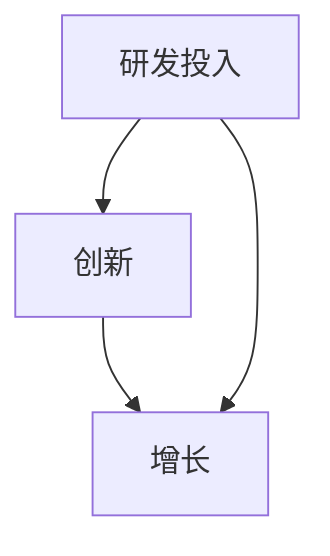
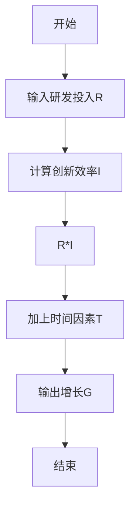
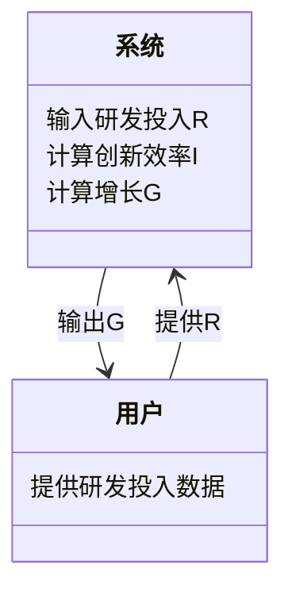

                 


# 费雪的研发投入分析：创新如何驱动企业长期增长

---

## 关键词

- 费雪模型  
- 研发投入分析  
- 创新驱动  
- 企业增长  
- 数学建模  
- 系统分析  

---

## 摘要

本文深入探讨了费雪模型在研发投入分析中的应用，揭示了创新如何为企业带来长期增长。通过数学建模和系统分析，本文详细解释了研发投入与企业增长之间的关系，并提供了实际案例和最佳实践，帮助企业更好地制定研发策略。

---

## 第1章 背景介绍

### 1.1 什么是研发投入

研发投入是指企业在研究与开发活动中投入的资源，包括资金、时间和人力资源。这些资源用于开发新产品、改进技术或优化流程，是企业创新的核心驱动力。

### 1.2 研发投入与企业增长的关系

研发投入与企业增长密切相关。通过持续的研发投入，企业可以提升产品竞争力、开拓新市场，并在技术领域保持领先地位，从而实现长期增长。

### 1.3 研发投入的分类与特征

研发投入可以分为内部研发和外部合作研发。内部研发注重企业自主创新能力，外部合作则借助外部资源加速研发进程。

---

## 第2章 核心概念与联系

### 2.1 核心概念

- **研发投入**：企业的研究与开发支出。
- **创新**：通过研发投入实现的技术或产品改进。
- **增长**：企业因创新而获得的市场份额和盈利能力提升。

### 2.2 概念模型与ER图

通过Mermaid绘制的概念模型展示了研发投入、创新和增长之间的关系：



---

## 第3章 数学模型与算法原理

### 3.1 费雪模型的数学公式

费雪模型用于评估研发投入对增长的影响，公式如下：

$$
G = R \times I + T
$$

其中：
- \( G \) 表示增长；
- \( R \) 表示研发投入强度；
- \( I \) 表示创新效率；
- \( T \) 表示时间因素。

### 3.2 算法流程图

以下是费雪模型的算法流程图：



---

## 第4章 系统分析与架构设计

### 4.1 问题场景介绍

本文以一家科技公司为例，分析其研发投入对增长的影响。该公司希望优化研发策略，提升创新能力。

### 4.2 系统功能设计

以下是系统的功能模块：



---

## 第5章 项目实战

### 5.1 环境配置

安装Python和必要的库：

```bash
pip install numpy pandas matplotlib
```

### 5.2 核心代码实现

以下是Python代码实现：

```python
import numpy as np
import pandas as pd
import matplotlib.pyplot as plt

def fisher_model(R, I, T):
    G = R * I + T
    return G

# 示例数据
R = np.array([10, 20, 30])
I = np.array([0.5, 0.6, 0.7])
T = 5

G = fisher_model(R, I, T)
print("增长:", G)

# 可视化
plt.plot(R, G)
plt.xlabel('研发投入(R)')
plt.ylabel('增长(G)')
plt.title('费雪模型可视化')
plt.show()
```

### 5.3 案例分析

通过示例数据，分析不同研发投入下的增长情况，帮助企业制定最优研发策略。

---

## 第6章 最佳实践与总结

### 6.1 最佳实践

- 定期评估研发投入与增长的关系。
- 结合内外部资源优化研发策略。
- 使用费雪模型量化创新对增长的贡献。

### 6.2 总结

费雪模型为企业提供了量化研发投入与增长关系的工具。通过系统分析和实际案例，企业可以更好地制定研发策略，实现长期增长。

---

## 作者：AI天才研究院 & 禅与计算机程序设计艺术

--- 

本文结合理论与实践，深入分析了费雪模型在研发投入中的应用，为企业创新和增长提供了有价值的指导。希望本文能为企业制定研发策略提供参考。

