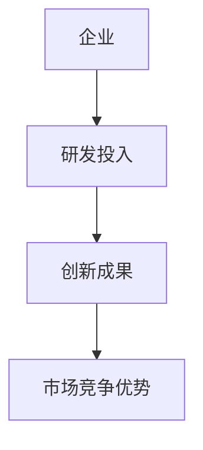
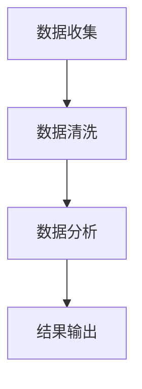
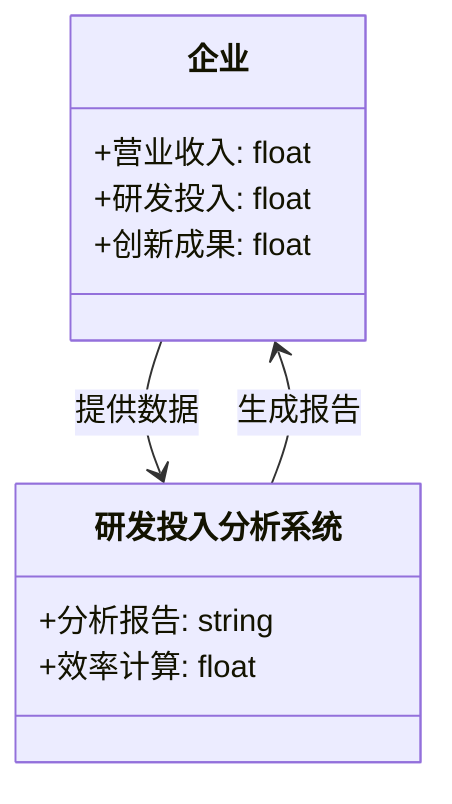
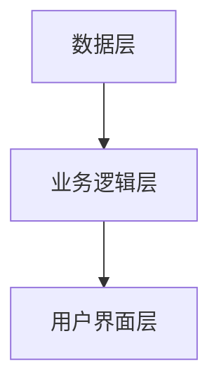

                 


# 费雪的研发投入分析：创新能力的指标

> 关键词：研发投入分析、创新能力、费雪模型、企业研发效率、技术经济指标

> 摘要：本文系统地探讨了费雪的研发投入分析方法，从背景、概念、原理到实战应用，全面解析了如何通过研发投入分析来衡量企业的创新能力。通过数学模型、算法实现和系统架构设计，深入分析了研发投入与企业绩效的关系，为企业优化研发资源配置提供了理论依据和实践指导。

---

# 第一部分: 费雪的研发投入分析基础

## 第1章: 研发投入分析的背景与概念

### 1.1 研发投入分析的背景

#### 1.1.1 研发投入的重要性
研发投入（R&D，Research and Development）是企业创新能力的核心驱动力。在当今竞争激烈的市场环境中，企业必须不断投入资源进行技术创新和产品开发，以保持竞争优势。研发投入不仅包括资金的投入，还包括时间和人力的投入。

#### 1.1.2 研发投入在企业中的地位
研发投入是企业财务报表中的一个重要组成部分，通常被视为企业未来增长的源泉。通过分析研发投入，可以评估企业是否在正确的方向上进行投资，以及这些投资是否能够转化为实际的收益。

#### 1.1.3 研发投入与企业创新的关系
研发投入与企业创新能力呈正相关关系。企业通过加大研发投入，可以提升技术水平，开发新产品，拓展市场，从而增强企业的竞争力。然而，研发投入的效率和方向同样重要，单纯的资金投入并不一定能带来预期的创新成果。

---

### 1.2 研发投入分析的核心概念

#### 1.2.1 研发投入的定义
研发投入是指企业在研发活动中所投入的全部资源，包括资金、人力、时间和技术资源。这些资源用于新产品开发、技术改进和知识积累。

#### 1.2.2 研发投入的分类
研发投入可以分为以下几个类别：
- **基础研究**：旨在探索新的科学原理和知识。
- **应用研究**：将基础研究成果转化为实际应用。
- **产品开发**：针对具体产品的设计和测试。

#### 1.2.3 研发投入与创新能力的关系
研发投入是创新能力的必要条件，但并非充分条件。只有通过高效的管理、合理的人力资源配置和创新的文化氛围，才能确保研发投入转化为实际的创新能力。

---

### 1.3 研发投入分析的边界与外延

#### 1.3.1 研发投入的边界
研发投入分析需要明确其边界，避免将其他类型的支出误计入研发投入。例如，广告费用和培训费用通常不应计入研发投入。

#### 1.3.2 研发投入的外延
研发投入的外延包括与创新相关的活动，例如技术合作、专利申请和知识产权保护。

#### 1.3.3 研发投入与其他财务指标的区别
与净利润、资产回报率等财务指标相比，研发投入更注重未来增长潜力，而不仅仅是当前的盈利能力。

---

### 1.4 研发投入分析的概念结构

#### 1.4.1 研发投入的构成要素
研发投入的构成要素包括：
- 资金投入
- 人力资源
- 时间投入
- 技术资源

#### 1.4.2 研发投入的分析框架
投入分析框架通常包括以下几个方面：
- 投入规模
- 投入结构
- 投入效率
- 投入产出

#### 1.4.3 研发投入的核心要素组成
研发投入的核心要素包括：
- 技术创新
- 产品开发
- 知识积累

---

## 第2章: 研发投入分析的核心概念与联系

### 2.1 研发投入的原理

#### 2.1.1 研发投入的基本原理
研发投入的基本原理是通过投入资源来推动技术创新和产品开发，从而实现企业的长期增长目标。

#### 2.1.2 研发投入的驱动因素
研发投入的驱动因素包括市场需求、技术进步、竞争压力和企业战略。

#### 2.1.3 研发投入与企业绩效的关系
研发投入与企业绩效呈正相关关系，但需要考虑投入的效率和方向。

---

### 2.2 研发投入的核心概念对比

#### 2.2.1 研发投入与净利润的对比
| 指标 | 研发投入 | 净利润 |
|------|----------|--------|
| 定义 | 投入资源用于创新 | 经营成果 |
| 目的 | 推动增长 | 反映盈利能力 |

#### 2.2.2 研发投入与资产回报率的对比
| 指标 | 研发投入 | 资产回报率 |
|------|----------|-----------|
| 定义 | 投入资源用于创新 | 资产的盈利能力 |
| 目的 | 推动增长 | 评估资产效率 |

#### 2.2.3 研发投入与市场占有率的对比
| 指标 | 研发投入 | 市场占有率 |
|------|----------|-----------|
| 定义 | 投入资源用于创新 | 产品在市场中的份额 |
| 目的 | 推动增长 | 反映市场竞争力 |

---

### 2.3 研发投入的ER实体关系图



---

## 第3章: 研发投入分析的算法原理

### 3.1 研发投入效率评估算法



### 3.2 算法实现代码

```python
def calculate_r_d_efficiency(revenue, r_d_expense):
    efficiency = (revenue - r_d_expense) / revenue
    return efficiency

revenue = 1000000
r_d_expense = 200000
efficiency = calculate_r_d_efficiency(revenue, r_d_expense)
print(f"研发投入效率: {efficiency}")
```

---

### 3.3 算法的数学模型

#### 研发投入回报率公式
$$
\text{研发投入回报率} = \frac{\text{营业收入} - \text{研发投入}}{\text{营业收入}}
$$

---

## 第4章: 研发投入分析的系统架构设计

### 4.1 问题场景介绍

#### 4.1.1 问题描述
企业希望通过优化研发投入结构和提高研发投入效率，来提升创新能力。

---

### 4.2 系统功能设计

#### 4.2.1 领域模型


---

### 4.3 系统架构设计



---

## 第5章: 研发投入分析的项目实战

### 5.1 项目环境安装

#### 5.1.1 安装Python和相关库
```bash
pip install numpy pandas matplotlib
```

### 5.2 核心代码实现

#### 5.2.1 数据清洗代码
```python
import pandas as pd

data = pd.read_csv('input.csv')
cleaned_data = data.dropna()
cleaned_data.to_csv('output.csv', index=False)
```

#### 5.2.2 数据分析代码
```python
import matplotlib.pyplot as plt

data = pd.read_csv('output.csv')
plt.plot(data['年份'], data['研发投入'], label='研发投入')
plt.xlabel('年份')
plt.ylabel('研发投入')
plt.title('研发投入趋势分析')
plt.legend()
plt.show()
```

---

## 第6章: 最佳实践与小结

### 6.1 小结
研发投入分析是衡量企业创新能力的重要指标，通过科学的方法和工具，可以有效评估研发投入的效率和效果。

### 6.2 注意事项
- 确保数据的准确性和完整性。
- 考虑研发投入的多样性和复杂性。
- 定期更新和优化分析模型。

### 6.3 拓展阅读
- 《技术创新管理》
- 《企业研发策略》
- 《数据分析与可视化》

---

作者：AI天才研究院/AI Genius Institute & 禅与计算机程序设计艺术 /Zen And The Art of Computer Programming

