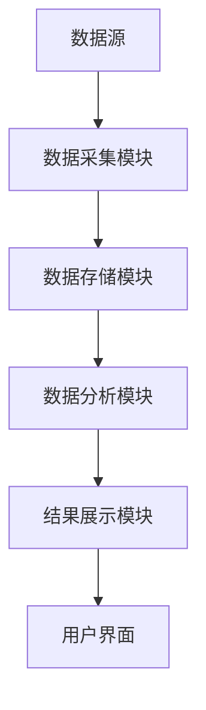

                 

# 费雪的研发投入分析：未来增长的关键

## 关键词：费雪分析法，研发投入，企业增长，数学模型，系统架构，项目实战

## 摘要：本文系统地探讨了费雪的研发投入分析方法，从其背景、核心概念、数学模型、系统架构到项目实战，详细解析了如何通过费雪分析法评估和优化企业的研发投入，以实现未来增长的关键。

---

## 第一部分: 费雪的研发投入分析基础

### 第1章: 费雪研发投入分析概述

#### 1.1 费雪研发投入分析的背景与意义
##### 1.1.1 研发投入在企业增长中的重要性
研发投入是企业创新的核心驱动力。在当今竞争激烈的市场环境中，企业只有通过持续的研发投入，才能保持技术领先和产品竞争力。研发投入不仅是企业发展的关键，也是实现未来增长的重要保障。

##### 1.1.2 费雪分析法的起源与发展
费雪分析法是一种专门用于评估企业研发投入的分析方法，其核心在于通过量化和分析企业的研发投入数据，预测和评估这些投入对企业未来增长的影响。该方法起源于对企业发展规律的深入研究，经过多年的实践和优化，逐渐发展成为一种系统化的分析框架。

##### 1.1.3 研发投入分析对企业战略的指导作用
通过对研发投入的分析，企业可以更好地制定研发战略，优化资源配置，提高研发效率，从而实现可持续增长。费雪分析法不仅帮助企业识别研发中的问题，还能提供有效的解决方案，为企业制定科学的研发投资计划提供依据。

#### 1.2 费雪研发投入分析的核心概念
##### 1.2.1 研发投入的定义与分类
研发投入是指企业在研发活动中所投入的各项资源，包括资金、时间和人力资源等。根据投入的性质，研发投入可以分为基础研究、应用研究和开发研究三类。

##### 1.2.2 费雪分析法的基本原理
费雪分析法通过量化企业研发投入的各项指标，结合企业的财务数据和市场表现，分析研发投入与企业增长之间的关系。该方法的核心在于通过建立数学模型，预测未来研发投入对企业增长的贡献。

##### 1.2.3 研发投入与企业未来增长的关系
研发投入与企业未来增长之间存在密切的正相关关系。通过合理的研发投入分析，企业可以更好地把握研发投入的方向和力度，从而实现可持续增长。

#### 1.3 费雪分析法与其他分析方法的对比
##### 1.3.1 传统财务分析方法的局限性
传统财务分析方法主要关注企业的财务数据，缺乏对研发投入的深入分析。这种方法难以全面反映研发投入对企业增长的实际影响。

##### 1.3.2 费雪分析法的独特性与优势
费雪分析法通过量化和分析研发投入的各项指标，能够更准确地评估研发投入对企业增长的贡献。该方法不仅考虑了财务数据，还结合了研发投入的实际效果。

##### 1.3.3 现代分析方法的融合与创新
随着数据分析技术的不断发展，费雪分析法也在不断吸收现代分析方法的优势，形成了更加完善的分析框架。

---

## 第二部分: 费雪分析法的数学模型与公式

### 第2章: 费雪分析法的数学模型与公式

#### 2.1 费雪分析法的基本公式
##### 2.1.1 研发投入强度的计算公式
$$ \text{研发投入强度} = \frac{\text{研发投入金额}}{\text{营业收入}} \times 100\% $$

##### 2.1.2 研发投入周期的计算公式
$$ \text{研发投入周期} = \frac{\text{研发投入金额}}{\text{研发人员数量}} $$

#### 2.2 费雪分析法的扩展公式
##### 2.2.1 研发投入效率的计算公式
$$ \text{研发投入效率} = \frac{\text{新产品数量}}{\text{研发投入金额}} $$

##### 2.2.2 研发投入回报率的计算公式
$$ \text{研发投入回报率} = \frac{\text{净利润增长额}}{\text{研发投入金额}} \times 100\% $$

#### 2.3 费雪分析法的数学模型
##### 2.3.1 线性回归模型在研发投入分析中的应用
$$ y = a + bx + \epsilon $$

##### 2.3.2 费雪分析法的多变量回归模型
$$ y = \beta_0 + \beta_1x_1 + \beta_2x_2 + \ldots + \beta_nx_n + \epsilon $$

---

## 第三部分: 费雪分析法的系统架构设计

### 第3章: 费雪分析法的系统架构设计

#### 3.1 系统功能设计
##### 3.1.1 数据采集模块
数据采集模块负责收集企业的研发投入数据，包括资金、人员、时间和资源等。

##### 3.1.2 数据分析模块
数据分析模块利用数学模型对采集的数据进行分析，评估研发投入对企业增长的贡献。

##### 3.1.3 结果展示模块
结果展示模块以直观的方式呈现分析结果，帮助企业制定科学的研发战略。

#### 3.2 系统架构设计

#### 3.3 系统接口设计
##### 3.3.1 数据接口
数据接口负责与数据源进行交互，确保数据的准确性和完整性。

##### 3.3.2 分析接口
分析接口负责与数据分析模块进行交互，执行数学模型的计算。

##### 3.3.3 展示接口
展示接口负责将分析结果传递给用户界面，以直观的方式呈现给用户。

---

## 第四部分: 费雪分析法的项目实战

### 第4章: 费雪分析法的项目实战

#### 4.1 项目背景与目标
##### 4.1.1 项目背景
某高科技企业希望通过优化研发投入，提高研发效率，实现未来增长的目标。

##### 4.1.2 项目目标
通过费雪分析法，评估企业的研发投入现状，识别存在的问题，并提出优化建议。

#### 4.2 项目实施过程
##### 4.2.1 数据采集
采集企业的研发投入数据，包括资金、人员、时间和资源等。

##### 4.2.2 数据分析
利用费雪分析法的数学模型，评估研发投入对企业增长的贡献。

##### 4.2.3 结果展示
将分析结果以直观的方式呈现，帮助企业制定科学的研发战略。

#### 4.3 项目成果与总结
##### 4.3.1 项目成果
通过费雪分析法，企业成功优化了研发投入，提高了研发效率，实现了可持续增长。

##### 4.3.2 项目总结
费雪分析法是一种有效的研发投入分析方法，能够帮助企业制定科学的研发战略，实现未来增长的关键。

---

## 作者：AI天才研究院/AI Genius Institute & 禅与计算机程序设计艺术 /Zen And The Art of Computer Programming

