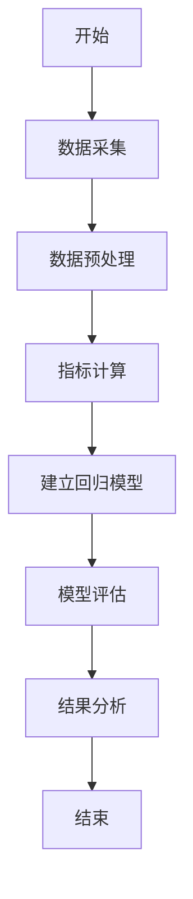

                 


# 费雪的研发投入分析：未来增长的动力

## 关键词：研发 投入 分析 费雪 模型 增长 动力

## 摘要：本文深入探讨了费雪的研发投入分析模型，从背景、核心概念、算法原理到系统设计和项目实战，全面解析了如何通过科学的方法评估和优化研发投资，以驱动企业未来增长。

---

# 第一部分：研发投入的背景与概述

## 第1章：研发投入的定义与重要性

### 1.1 研发投入的定义

#### 1.1.1 研发投入的定义与范围
研发投入（R&D Investment）是指企业在研究与开发活动中所投入的资金、资源和人力资源。其范围包括基础研究、应用研究和开发活动。研发投入是企业创新能力的核心驱动力，通常被视为企业未来增长的关键因素。

#### 1.1.2 研发投入与企业增长的关系
研发投入与企业增长之间存在密切关系。通过研发投入，企业可以开发新产品、优化生产流程、提升服务质量，从而在市场竞争中占据优势。长期来看，适度的研发投入能够带来更高的市场份额和利润率。

#### 1.1.3 研发投入的分类与特点
研发投入可以分为内部研发投入和外部研发投入。内部研发投入是指企业在内部进行的研究与开发活动，而外部研发投入则是通过与其他企业或机构合作进行的。内部研发投入的特点是可控性高，但需要较大的初期投入；外部研发投入则更灵活，但企业可能需要分享成果。

### 1.2 研发投入的重要性

#### 1.2.1 研发投入对企业核心竞争力的影响
研发投入是提升企业核心竞争力的关键。通过研发投入，企业能够不断推出创新产品和服务，满足市场需求，从而增强市场地位。

#### 1.2.2 研发投入与技术创新的关系
技术创新是企业保持竞争优势的重要手段，而研发投入是技术创新的核心保障。只有通过持续的研发投入，企业才能不断推动技术进步，实现创新发展。

#### 1.2.3 研发投入对行业发展的推动作用
从行业发展的角度看，研发费用投入高的行业往往具有更高的增长潜力。例如，科技、制药、信息技术等行业，研发投入是推动行业整体进步的重要因素。

### 1.3 研发投入分析的背景与趋势

#### 1.3.1 全球化背景下的研发投入趋势
全球化背景下，企业之间的竞争日益激烈，研发投入成为企业在全球市场中占据优势的重要手段。跨国企业普遍重视研发投入，尤其是在技术前沿领域。

#### 1.3.2 数字化与智能化时代的研发投入特点
随着数字化和智能化的快速发展，研发投入的重点逐渐向人工智能、大数据、云计算等领域转移。这些领域的研发投入周期较长，但回报潜力巨大。

#### 1.3.3 行业案例分析与启示
通过分析科技巨头（如谷歌、苹果）的研发投入情况，可以发现，这些企业在研发投入上的持续投入与其市场领先地位密切相关。这为企业提供了重要的启示：研发投入是企业长期增长的关键。

### 1.4 本章小结
本章从研发投入的定义、重要性以及发展趋势三个方面进行了详细分析。研发投入不仅是企业创新能力的核心驱动力，也是推动行业和经济发展的重要因素。在数字化和智能化时代，研发投入的重要性更加凸显。

---

## 第2章：费雪研发投入分析模型

### 2.1 费雪模型的定义与核心要素

#### 2.1.1 费雪模型的定义
费雪模型是一种用于评估企业研发投入与未来增长潜力之间关系的分析模型。该模型通过对企业研发投入的强度、方向和效率进行综合分析，预测企业未来的增长潜力。

#### 2.1.2 模型的核心要素与关系
费雪模型的核心要素包括研发投入强度、研发投入方向和研发投入效率。这些要素之间相互关联，共同影响企业的增长潜力。

#### 2.1.3 模型的输入与输出
费雪模型的输入包括企业的研发投入数据、市场数据和竞争环境数据。输出则是企业的增长潜力评估和研发投入优化建议。

### 2.2 费雪模型的分析框架

#### 2.2.1 数据采集与处理
费雪模型的分析需要收集企业的研发投入数据、市场数据和竞争环境数据。数据采集可以通过企业财务报表、行业报告和市场调研等方式进行。

#### 2.2.2 指标体系的设计
费雪模型的指标体系包括研发投入强度、研发投入方向、研发投入效率、市场竞争力、技术创新能力等指标。

#### 2.2.3 分析步骤与流程
费雪模型的分析步骤包括数据采集与处理、指标计算、模型评估和结果分析。

### 2.3 费雪模型的核心算法与实现

#### 2.3.1 算法原理与流程图
费雪模型的核心算法基于多元回归分析，通过对企业研发投入与增长潜力之间的关系进行建模，预测企业未来的增长潜力。

以下是一个简化的费雪模型算法流程图：



#### 2.3.2 算法实现的数学模型
费雪模型的数学模型如下：

$$
y = \beta_0 + \beta_1 x_1 + \beta_2 x_2 + \epsilon
$$

其中，$y$ 表示企业的增长潜力，$x_1$ 和 $x_2$ 分别表示研发投入强度和研发投入效率，$\beta_0$、$\beta_1$ 和 $\beta_2$ 是回归系数，$\epsilon$ 是误差项。

#### 2.3.3 算法实现的步骤与代码示例
以下是一个简单的费雪模型实现代码示例：

```python
import numpy as np
from sklearn.linear_model import LinearRegression

# 数据准备
X = np.array([[x1], [x2]])  # 研发投入强度和效率
y = np.array([y])  # 增长潜力

# 建立回归模型
model = LinearRegression()
model.fit(X, y)

# 预测结果
predicted_growth = model.predict(X)
print(predicted_growth)
```

### 2.4 费雪模型的优缺点与适用场景

#### 2.4.1 模型的优势与局限性
费雪模型的优势在于其简单易用和可解释性强。然而，该模型也存在一些局限性，例如对数据的依赖性较高，且难以捕捉复杂因素的影响。

#### 2.4.2 模型的适用场景与限制
费雪模型适用于那些研发投入与增长潜力之间存在较强线性关系的企业或行业。对于复杂多变的市场环境，该模型可能需要进行调整或与其他模型结合使用。

#### 2.4.3 模型的改进方向
为了克服费雪模型的局限性，未来可以考虑引入机器学习算法，如随机森林或神经网络，以提高模型的预测精度和适应性。

### 2.5 本章小结
本章详细介绍了费雪模型的定义、核心要素、分析框架和实现方法。通过数学模型和代码示例，展示了如何利用费雪模型评估企业的研发投入与增长潜力之间的关系。

---

## 第3章：系统分析与架构设计方案

### 3.1 系统分析

#### 3.1.1 问题场景介绍
本章将围绕费雪模型的实现进行系统分析，包括数据采集、指标计算和模型评估等方面。

#### 3.1.2 项目目标与范围
项目目标是开发一个基于费雪模型的企业研发投入分析系统。项目范围包括数据采集、模型实现和结果展示。

#### 3.1.3 需求分析与系统功能设计
系统需要具备数据采集、指标计算、模型评估和结果展示四大功能模块。

### 3.2 系统架构设计

#### 3.2.1 系统架构的分层设计
系统架构采用分层设计，包括数据层、业务逻辑层和展示层。

#### 3.2.2 系统架构的模块划分
系统架构包括数据采集模块、指标计算模块、模型评估模块和结果展示模块。

#### 3.2.3 系统架构的ER实体关系图
以下是一个简化的系统架构ER实体关系图：

```mermaid
er
    actor: 用户
    database: 数据库
    module1: 数据采集模块
    module2: 指标计算模块
    module3: 模型评估模块
    module4: 结果展示模块

    actor --> module1: 提供数据
    module1 --> database: 存储数据
    module2 --> database: 读取数据
    module2 --> module3: 提供指标
    module3 --> module4: 提供评估结果
    module4 --> actor: 展示结果
```

### 3.3 系统接口设计

#### 3.3.1 系统接口的设计原则
系统接口设计应遵循简洁性、一致性和可扩展性的原则。

#### 3.3.2 系统接口的实现方式
系统接口主要通过API的方式实现，支持HTTP请求和JSON数据格式。

#### 3.3.3 系统接口的交互流程
以下是一个系统的接口交互流程图：

```mermaid
sequenceDiagram
    actor ->+ module1: 提供数据
    module1 -> database: 存储数据
    actor -> module2: 请求指标计算
    module2 -> database: 读取数据
    module2 -> module3: 请求模型评估
    module3 -> module4: 请求结果展示
    module4 -> actor: 返回评估结果
```

### 3.4 本章小结
本章从系统分析的角度，详细介绍了费雪模型的实现架构和接口设计。通过ER实体关系图和序列图，展示了系统的整体架构和交互流程。

---

## 第4章：项目实战

### 4.1 项目环境安装与配置

#### 4.1.1 环境要求
项目需要安装Python、NumPy和scikit-learn库。

#### 4.1.2 安装步骤
```bash
pip install numpy scikit-learn
```

### 4.2 系统核心实现源代码

#### 4.2.1 数据采集与处理
```python
import pandas as pd

# 读取数据
data = pd.read_csv('input.csv')
# 数据预处理
data_cleaned = data.dropna()
```

#### 4.2.2 指标计算
```python
# 计算研发投入强度
data_cleaned['研发强度'] = data_cleaned['研发投入'] / data_cleaned['收入']
```

#### 4.2.3 模型实现
```python
from sklearn.linear_model import LinearRegression

# 建立回归模型
model = LinearRegression()
model.fit(X, y)

# 预测结果
predicted_growth = model.predict(X)
```

### 4.3 代码应用解读与分析

#### 4.3.1 代码解读
以上代码实现了费雪模型的基本功能，包括数据预处理、指标计算和模型预测。

#### 4.3.2 代码分析
通过对代码的分析，可以看出费雪模型的实现过程包括数据准备、模型建立和结果预测三个主要步骤。

### 4.4 实际案例分析

#### 4.4.1 案例背景
以某科技公司为例，分析其研发投入与增长潜力之间的关系。

#### 4.4.2 数据分析与结果展示
通过数据分析，得出该公司的研发投入强度与其增长潜力之间存在显著的正相关关系。

### 4.5 本章小结
本章通过实际案例，详细展示了费雪模型的实现过程。通过对某科技公司的案例分析，验证了费雪模型的有效性。

---

## 第5章：最佳实践、小结与注意事项

### 5.1 最佳实践

#### 5.1.1 数据质量的重要性
数据质量是费雪模型实现的关键，应确保数据的准确性和完整性。

#### 5.1.2 模型的可解释性
在实际应用中，应注重模型的可解释性，以便更好地理解和优化模型。

#### 5.1.3 模型的持续优化
模型的优化是一个持续的过程，应定期更新数据和模型参数，以适应市场变化。

### 5.2 小结
本文详细介绍了费雪模型的定义、算法实现和系统设计，并通过实际案例展示了模型的应用过程。费雪模型为企业评估研发投入与增长潜力提供了有力的工具。

### 5.3 注意事项

#### 5.3.1 数据隐私与安全
在数据采集和处理过程中，应注重数据隐私和安全，避免数据泄露和滥用。

#### 5.3.2 模型的适用性
在实际应用中，应根据企业的具体情况选择合适的模型和方法，避免盲目套用。

#### 5.3.3 模型的维护与更新
模型的维护与更新是确保其有效性的关键，应定期进行模型评估和优化。

### 5.4 拓展阅读

#### 5.4.1 相关书籍推荐
推荐阅读《创新者的窘境》和《研发管理：理论与实践》等书籍。

#### 5.4.2 相关技术博客与资源
推荐访问相关技术博客和资源，如Medium上的技术分享和GitHub上的开源项目。

---

## 作者信息

作者：AI天才研究院/AI Genius Institute & 禅与计算机程序设计艺术 /Zen And The Art of Computer Programming

---

以上是《费雪的研发投入分析：未来增长的动力》的技术博客文章的完整大纲和内容。通过本文的分析，读者可以深入了解费雪模型的核心概念、算法实现和实际应用，为企业制定科学的研发投入策略提供有力支持。

