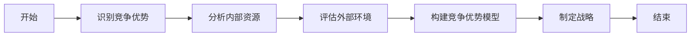
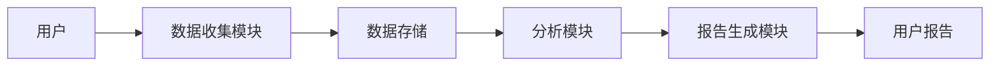

                 


# 费雪的竞争优势分析框架

## 关键词：竞争优势分析，费雪框架，企业战略，核心竞争力，Python分析

## 摘要：  
本文深入探讨了费雪的竞争优势分析框架，从理论基础到实际应用，结合技术语言和专业方法，分析企业如何识别和构建可持续的竞争优势。通过算法、数学模型和系统设计，提供详细的步骤和代码示例，帮助读者掌握竞争优势分析的核心方法。

---

## 目录大纲：《费雪的竞争优势分析框架》

### 第一部分：竞争优势分析的背景与重要性

#### 第1章：竞争优势分析概述

##### 1.1 竞争优势的基本概念
- 1.1.1 竞争优势的定义
  - 竞争优势是指企业在市场中相对于竞争对手的有利条件，包括资源、能力、品牌等。
- 1.1.2 竞争优势的重要性
  - 企业通过竞争优势提高市场份额、利润和客户忠诚度。
- 1.1.3 费雪框架的独特性
  - 费雪框架专注于内部资源和能力的分析，强调持续竞争优势的构建。

##### 1.2 竞争优势的类型
- 1.2.1 内部优势
  - 资源优势：技术、资金、人才等。
  - 能力优势：研发能力、创新能力等。
- 1.2.2 外部优势
  - 市场定位：独特的市场位置。
  - 客户关系：强大的客户网络。
- 1.2.3 可持续性分析
  - 竞争优势是否能在长期持续，关键在于其核心竞争力和资源的独特性。

### 第二部分：费雪竞争优势分析框架的核心概念

#### 第2章：费雪框架的原理与应用

##### 2.1 费雪框架的理论基础
- 2.1.1 内部因素分析
  - 分析企业的内部资源和能力，识别核心竞争力。
- 2.1.2 外部因素分析
  - 评估市场需求、竞争环境和行业趋势。
- 2.1.3 核心竞争力的构建
  - 将内部资源与外部需求结合，形成独特的竞争优势。

##### 2.2 竞争优势的来源
- 2.2.1 资源优势
  - 技术专利、品牌价值等。
- 2.2.2 能力优势
  - 创新能力、成本优势等。
- 2.2.3 市场定位
  - 针对特定客户群体或市场细分。

### 第三部分：费雪框架的算法与数学模型

#### 第3章：竞争优势分析的算法原理

##### 3.1 竞争优势识别流程图
- 使用Mermaid绘制从识别到策略制定的流程图。



##### 3.2 竞争优势评估的Python代码
- 示例代码：读取企业数据，计算竞争优势指数。

```python
import pandas as pd

def calculate_competitive_edge(data):
    # 计算竞争优势指数
    weights = data['权重']
    scores = data['评分']
    ce_index = sum(weights[i] * scores[i] for i in range(len(weights)))
    return ce_index

# 示例数据
data = {
    '权重': [0.4, 0.3, 0.2, 0.1],
    '评分': [90, 80, 85, 95]
}
df = pd.DataFrame(data)
ce_index = calculate_competitive_edge(df)
print(f"竞争优势指数: {ce_index}")
```

#### 第4章：数学模型与公式

##### 4.1 竞争优势指数模型
- 公式：$$ 竞争优势指数 = \sum (w_i \times s_i) $$
  - 其中，$w_i$ 是权重，$s_i$ 是评分。
  - 例如，如果 $w_1=0.4$，$s_1=90$，则贡献为 $0.4 \times 90 = 36$。

### 第四部分：系统分析与架构设计

#### 第5章：系统分析与设计

##### 5.1 项目介绍
- 项目目标：开发一个竞争优势分析系统，帮助企业识别和评估竞争优势。

##### 5.2 功能设计
- 数据收集模块：收集企业内部资源和外部环境数据。
- 分析模块：应用费雪框架进行分析，生成竞争优势报告。
- 报告生成模块：输出可操作的策略建议。

##### 5.3 系统架构设计



##### 5.4 系统接口设计
- 数据接口：REST API用于数据交互。
- 报告接口：生成PDF或HTML格式的报告。

### 第五部分：项目实战

#### 第6章：项目实战

##### 6.1 环境安装
- 安装Python和必要的库（如pandas、numpy）。

##### 6.2 核心代码实现

```python
import pandas as pd
import numpy as np

def competitive_edge_analysis(data_frame):
    # 计算加权评分
    weighted_scores = data_frame['权重'] * data_frame['评分']
    total = weighted_scores.sum()
    return total

# 数据准备
data = {
    '因素': ['技术', '成本', '品牌', '服务'],
    '权重': [0.3, 0.4, 0.2, 0.1],
    '评分': [85, 90, 80, 95]
}
df = pd.DataFrame(data)

# 计算竞争优势指数
ce = competitive_edge_analysis(df)
print(f"竞争优势指数: {ce}")
```

##### 6.3 案例分析
- 分析一家科技公司的数据，展示如何识别其竞争优势，并制定相应的战略。

### 第六部分：最佳实践

#### 第7章：最佳实践

##### 7.1 小结
- 费雪框架提供了一套系统的方法，帮助企业识别和构建可持续的竞争优势。

##### 7.2 注意事项
- 定期评估竞争优势，确保其持续性。
- 结合其他分析工具（如SWOT分析）进行综合评估。

##### 7.3 扩展阅读
- 推荐阅读迈克尔·波特的《竞争优势》。

---

## 作者：AI天才研究院/AI Genius Institute & 禅与计算机程序设计艺术 /Zen And The Art of Computer Programming

