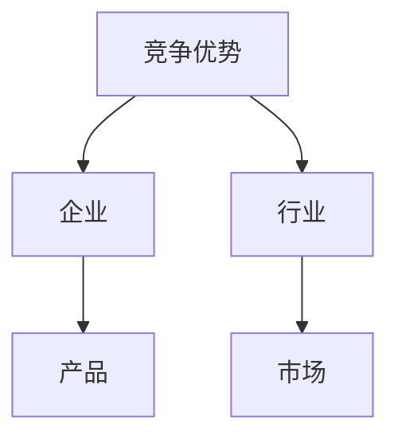
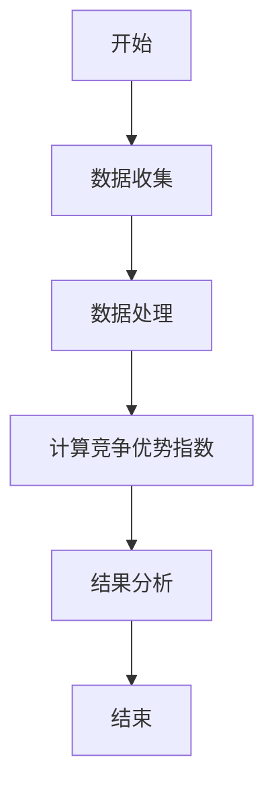
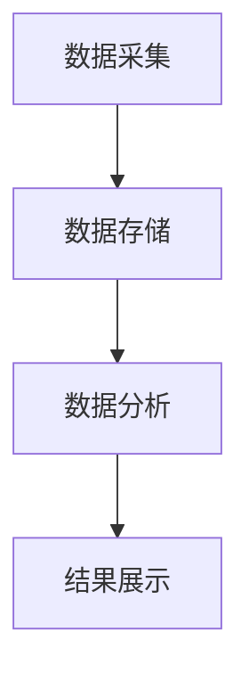

                 


# 费雪的竞争优势分析：寻找行业领导者

## 关键词：
- 竞争优势分析
- 投资学
- 费雪理论
- 行业领导者
- 企业绩效

## 摘要：
本文深入探讨了费雪的竞争优势分析方法，从理论基础到实际应用，系统地阐述了如何通过竞争优势分析寻找行业领导者。文章结合了背景介绍、核心概念、算法原理、系统架构设计、项目实战以及最佳实践，帮助读者全面理解和掌握竞争优势分析的精髓。通过本文，读者将能够掌握如何在投资决策中识别和评估企业的竞争优势，从而在竞争激烈的市场中找到真正的行业领导者。

---

## 第一部分：费雪的竞争优势分析背景

### 第1章：投资学的基本概念

#### 1.1.1 什么是投资
投资是指将资源（如资金、时间、精力等）投入到某个项目或企业中，以期望在未来获得更大的回报。投资的核心目标是通过资源的优化配置，实现价值的增值。

#### 1.1.2 投资的基本原则
1. **风险与收益的平衡**：高风险通常意味着高收益，但并非所有高风险投资都能带来高回报。
2. **长期视角**：投资需要着眼于长期，而非短期波动。
3. **分散投资**：通过分散投资降低风险，避免将所有资金投入到单一项目或企业中。

#### 1.1.3 费雪的生平与投资理念
菲利普·费雪（Philip Fisher）是20世纪著名的投资学家，他提出了“成长股投资”理论，强调投资于具有强大竞争优势和持续增长潜力的企业。费雪认为，投资的核心在于识别那些能够长期维持竞争优势并实现持续增长的企业。

---

### 第2章：竞争优势的基本概念

#### 2.1.1 什么是竞争优势
竞争优势是指企业在市场中相对于竞争对手的有利地位。这种优势可以是成本优势、技术优势、品牌优势、市场占有率等，能够使企业在竞争中占据优势地位。

#### 2.1.2 竞争优势的分类
1. **成本优势**：企业通过更低的成本生产产品或提供服务。
2. **品牌优势**：强大的品牌认知度和客户忠诚度。
3. **技术优势**：拥有独特的技术或专利。
4. **市场优势**：占据较大的市场份额或拥有独特的市场定位。
5. **资源优势**：拥有独特的资源或供应链优势。

#### 2.1.3 竞争优势与企业绩效的关系
竞争优势是企业绩效的核心驱动力。拥有强大竞争优势的企业通常能够实现更高的利润率、更强的市场地位和更持续的增长。

---

## 第二部分：费雪竞争优势分析的核心概念

### 第3章：竞争优势分析的理论基础

#### 3.1.1 费雪竞争优势分析的定义
费雪竞争优势分析是一种通过评估企业在市场中的竞争优势，识别具有长期增长潜力和投资价值的企业的方法。

#### 3.1.2 费雪竞争优势分析的核心要素
1. **市场地位**：企业在市场中的占有率和影响力。
2. **竞争优势的可持续性**：竞争优势是否能够长期维持。
3. **管理团队**：管理团队的能力和战略眼光。
4. **财务表现**：企业的财务健康状况和盈利能力。

#### 3.1.3 费雪竞争优势分析的边界与外延
竞争优势分析的边界在于企业的内部资源和外部环境的相互作用。其外延则包括对企业未来增长潜力的评估。

---

### 第4章：竞争优势的类型与特征对比

#### 4.1.1 成本优势
成本优势是指企业在生产或运营过程中能够以更低的成本实现相同的价值。这种优势通常通过规模经济、技术创新或优化供应链实现。

#### 4.1.2 品牌优势
品牌优势是指企业通过强大的品牌影响力和客户忠诚度，在市场竞争中占据优势地位。

#### 4.1.3 技术优势
技术优势是指企业拥有独特的技术或专利，能够在产品或服务中提供差异化价值。

#### 4.1.4 市场优势
市场优势是指企业在特定市场或细分市场中占据主导地位，拥有较高的市场份额和客户认知度。

#### 4.1.5 竞争优势的特征对比表格

| 竞争优势类型 | 特征描述 | 优缺点 | 适用场景 |
|--------------|----------|--------|----------|
| 成本优势     | 低成本生产 | 成本低，利润高 | 制造业、供应链管理 |
| 品牌优势     | 强品牌影响力 | 高客户忠诚度 | 消费品行业、服务业 |
| 技术优势     | 独特技术或专利 | 高创新性 | 高科技行业 |
| 市场优势     | 高市场份额 | 强大的市场影响力 | 零售业、快消品 |

#### 4.1.6 竞争优势分析的ER实体关系图


---

## 第三部分：费雪竞争优势分析的算法原理

### 第5章：竞争优势分析的数学模型

#### 5.1.1 竞争优势指数的计算公式
$$
\text{竞争优势指数} = \frac{\text{企业市场份额}}{\text{行业平均市场份额}}
$$

#### 5.1.2 竞争优势指数的应用
竞争优势指数反映了企业在行业中的相对地位。指数值大于1表示企业市场份额高于行业平均水平，指数值小于1则相反。

---

### 第6章：竞争优势分析的算法流程

#### 6.1.1 竞争优势分析的算法流程图


#### 6.1.2 竞争优势分析的Python实现
```python
def calculate_competitive_edge(rm, im):
    return rm / im

# 示例代码
market_share = 0.3  # 企业的市场份额
industry_average = 0.2  # 行业平均市场份额
competitive_edge = calculate_competitive_edge(market_share, industry_average)
print(f"竞争优势指数：{competitive_edge}")
```

---

## 第四部分：费雪竞争优势分析的系统架构设计

### 第7章：竞争优势分析系统的功能设计

#### 7.1.1 数据采集模块
数据采集模块负责收集企业的市场份额、行业平均市场份额等数据。

#### 7.1.2 数据分析模块
数据分析模块通过对数据的处理和计算，生成竞争优势指数。

#### 7.1.3 结果展示模块
结果展示模块以图表或报告的形式，展示竞争优势分析的结果。

---

### 第8章：竞争优势分析系统的架构设计

#### 8.1.1 系统架构图


#### 8.1.2 系统接口设计
系统接口设计包括数据输入接口、数据处理接口和结果输出接口。

---

## 第五部分：项目实战

### 第9章：互联网行业竞争优势分析案例

#### 9.1.1 项目背景
以互联网行业为例，分析某企业在市场中的竞争优势。

#### 9.1.2 核心代码实现
```python
def calculate_competitive_edge(rm, im):
    return rm / im

market_share = 0.25  # 假设企业的市场份额为25%
industry_average = 0.15  # 假设行业平均市场份额为15%
competitive_edge = calculate_competitive_edge(market_share, industry_average)
print(f"竞争优势指数：{competitive_edge}")
```

---

## 第六部分：最佳实践与总结

### 第10章：竞争优势分析的实践总结

#### 10.1.1 最佳实践
1. **长期视角**：投资需要着眼于企业的长期增长潜力。
2. **持续学习**：市场环境不断变化，投资者需要持续学习和调整分析方法。
3. **风险管理**：通过多元化投资降低风险。

#### 10.1.2 小结
竞争优势分析是投资学中的重要工具，通过识别和评估企业的竞争优势，投资者能够更好地找到具有长期增长潜力的行业领导者。

#### 10.1.3 注意事项
- 竞争优势分析需要结合企业的财务状况和管理团队进行综合评估。
- 市场环境的变化可能会影响竞争优势的持续性。

#### 10.1.4 拓展阅读
推荐阅读菲利普·费雪的经典著作《股票作手回忆录》，深入了解其投资理念。

---

## 作者：AI天才研究院/AI Genius Institute & 禅与计算机程序设计艺术 /Zen And The Art of Computer Programming

