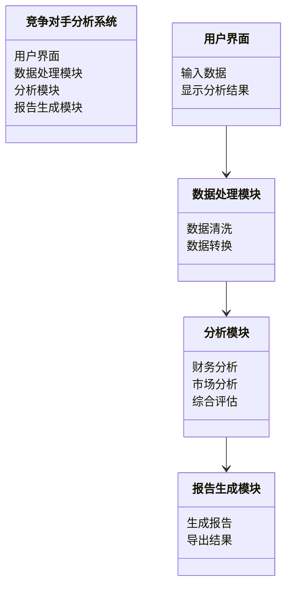

                 


# 费雪的竞争对手分析方法

## 关键词：竞争对手分析，投资决策，费雪分析法，系统架构，项目实战

## 摘要：  
费雪的竞争对手分析方法是一种系统化的企业分析策略，通过深入研究竞争对手的财务状况、市场策略和运营模式，帮助企业制定更有效的市场策略和投资决策。本文将从背景介绍、核心概念、算法原理、系统架构、项目实战和最佳实践等多个方面，详细分析费雪的竞争对手分析方法，并通过具体案例展示其实际应用。

---

## 第一部分：背景介绍

### 第1章：竞争对手分析的定义与重要性

#### 1.1 什么是竞争对手分析  
竞争对手分析是对企业在市场中的竞争对手进行系统性研究的过程。通过分析竞争对手的财务状况、市场策略、产品特点、竞争优势和劣势，企业可以更好地了解市场环境，制定更具竞争力的战略。

#### 1.2 费雪的竞争对手分析方法  
费雪的竞争对手分析方法是一种基于财务分析和市场研究的系统化方法。它不仅关注竞争对手的财务数据，还结合市场动态和行业趋势，帮助企业识别竞争对手的核心竞争力和潜在弱点。

#### 1.3 竞争对手分析的重要性  
在现代商业环境中，竞争对手分析是企业制定战略决策的重要工具。通过分析竞争对手，企业可以识别市场机会，优化产品定位，制定更具竞争力的价格策略，并提前预判竞争对手的可能动作。

#### 1.4 分析竞争对手与分析自身企业的区别  
竞争对手分析与企业自身分析有显著区别。竞争对手分析侧重于外部市场环境，而企业自身分析侧重于内部资源和能力。两者的结合能够帮助企业全面了解市场环境和自身定位。

---

## 第二部分：核心概念与联系

### 第2章：费雪分析法的核心原理

#### 2.1 费雪分析法的原理  
费雪分析法的核心在于通过财务数据和市场信息的综合分析，识别竞争对手的核心竞争力和潜在问题。其分析步骤包括数据收集、财务分析、市场分析和综合评估。

#### 2.2 核心概念对比  
以下是费雪分析法与其他竞争对手分析方法的对比：

| 方法         | 分析重点                     | 数据来源                     | 适用场景                     |
|--------------|------------------------------|------------------------------|------------------------------|
| 费雪分析法   | 财务数据与市场动态           | 财务报表、行业报告             | 投资决策与企业战略           |
| SWOT分析     | 优势、劣势、机会、威胁       | 内部资源与外部环境             | 战略规划                     |
| PEST分析     | 政治、经济、社会、技术因素     | 宏观环境                     | 行业分析                     |

#### 2.3 实体关系图（ER图）  
以下是费雪分析法的ER图：

```mermaid
erDiagram
    competitor[竞争对手] {
        competitor_id : integer
        competitor_name : string
        industry : string
        market_share : float
        revenue : float
        profit_margin : float
        financial_health : string
    }
    market[市场] {
        market_id : integer
        market_size : float
        growth_rate : float
        key_metrics : string
    }
    analysis[分析结果] {
        analysis_id : integer
        competitor_id : integer
        market_id : integer
        conclusion : string
        recommendation : string
    }
    competitor --> market : 受影响于
    competitor --> analysis : 分析结果
```

---

## 第三部分：算法原理

### 第3章：费雪分析法的算法流程

#### 3.1 数据收集与预处理  
数据收集是费雪分析法的第一步，主要收集竞争对手的财务报表、行业报告、市场数据等。数据预处理包括数据清洗、标准化和特征提取。

#### 3.2 财务指标分析  
通过分析竞争对手的财务指标，如净利润率、毛利率、资产负债率等，评估其财务健康状况。

#### 3.3 市场地位评估  
通过市场份额、品牌影响力、客户满意度等指标，评估竞争对手在市场中的地位。

---

## 第四部分：系统分析与架构设计

### 第4章：竞争对手分析系统架构

#### 4.1 系统功能设计  
以下是竞争对手分析系统的功能模块：



---

## 第五部分：项目实战

### 第5章：费雪分析法的实际应用

#### 5.1 环境安装与配置  
安装必要的工具，如Python、Pandas、Matplotlib等，配置数据源。

#### 5.2 核心代码实现  
以下是Python代码实现：

```python
import pandas as pd
import matplotlib.pyplot as plt

# 数据加载
df = pd.read_csv('competitors.csv')

# 数据预处理
df['revenue'] = df['revenue'].fillna(0)

# 财务指标计算
df['profit_margin'] = df['net_profit'] / df['revenue']

# 可视化
df.plot(kind='bar', x='competitor', y='profit_margin')
plt.title('竞争对手利润率分析')
plt.show()
```

#### 5.3 案例分析  
以某行业为例，分析竞争对手的市场份额、财务状况和市场策略，制定相应的竞争策略。

---

## 第六部分：最佳实践与总结

### 第6章：费雪分析法的优化与应用

#### 6.1 最佳实践  
- 数据来源的可靠性  
- 分析模型的可解释性  
- 结果的及时更新  

#### 6.2 分析结果解读  
通过分析竞争对手的财务状况和市场策略，企业可以制定更具竞争力的市场策略。

#### 6.3 总结  
费雪的竞争对手分析方法是一种有效的工具，能够帮助企业更好地了解市场环境，制定更明智的投资决策。

---

作者：AI天才研究院 & 禅与计算机程序设计艺术

