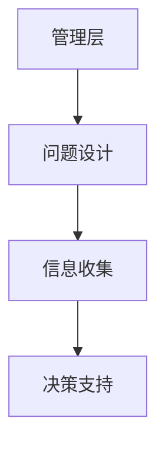
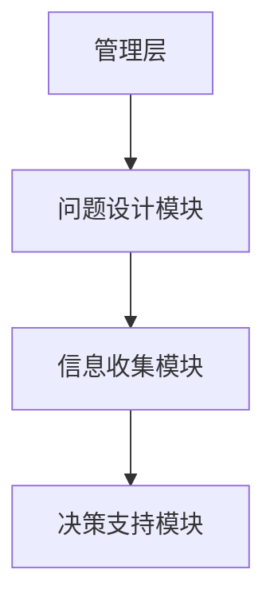

                 


# 费雪的管理层访谈技巧

## 关键词：管理层访谈，费雪技巧，问题设计，系统化方法，数学模型，架构设计

## 摘要：本文深入探讨了费雪的管理层访谈技巧，从核心概念、系统化方法、数学模型到系统架构，结合实际案例分析，详细讲解了如何在管理实践中有效应用这些技巧。

---

# 目录大纲：《费雪的管理层访谈技巧》

## 第一部分：背景介绍

### 第1章：管理层访谈的定义与重要性

#### 1.1 管理层访谈的定义
- 什么是管理层访谈？
- 访谈在管理中的作用
- 费雪访谈技巧的核心概念

#### 1.2 访谈的重要性
- 信息收集与决策的关系
- 访谈在管理中的独特价值
- 费雪访谈技巧的背景与演变

#### 1.3 费雪访谈技巧的特点
- 以问题为导向
- 结构化与灵活性结合
- 深度与广度并重

---

## 第二部分：核心概念与联系

### 第2章：费雪访谈技巧的核心要素

#### 2.1 核心概念原理
- 费雪访谈的理论基础
- 问题设计的科学性
- 访谈过程的系统性

#### 2.2 核心概念对比表
- 对比传统访谈与费雪技巧
- 问题设计的差异
- 结果分析的不同方法

#### 2.3 实体关系图


---

## 第三部分：系统分析与架构设计

### 第3章：费雪访谈技巧的系统化方法

#### 3.1 问题场景分析
- 访谈目标设定
- 信息需求分析
- 访谈对象选择

#### 3.2 系统功能设计
- 问题设计模块
- 信息收集模块
- 决策支持模块

#### 3.3 系统架构设计


#### 3.4 接口与交互设计
- 模块间接口定义
- 用户与系统的交互流程
- 信息处理与输出机制

---

## 第四部分：项目实战

### 第4章：费雪访谈技巧的系统实现

#### 4.1 环境安装与准备
- 必要工具与环境配置
- 数据收集与预处理

#### 4.2 核心代码实现
```python
# 示例代码：问题设计模块
class Interviewer:
    def __init__(self, questions):
        self.questions = questions

    def ask_questions(self):
        for q in self.questions:
            print(q)
            input("请输入你的回答：")
```

#### 4.3 系统实现细节
- 问题设计的算法流程
- 信息收集的处理逻辑
- 决策支持的数学模型

---

## 第五部分：最佳实践与总结

### 第5章：总结与注意事项

#### 5.1 最佳实践
- 系统化问题设计的重要性
- 灵活性与结构化的平衡
- 持续优化与反馈机制

#### 5.2 注意事项
- 避免过度依赖模型
- 保持访谈的自然流畅
- 定期更新与维护系统

---

## 作者：AI天才研究院/AI Genius Institute & 禅与计算机程序设计艺术 /Zen And The Art of Computer Programming

---

通过以上目录大纲，我们可以看到文章从背景介绍到系统实现，再到最佳实践，全面而深入地探讨了费雪的管理层访谈技巧，结合理论与实践，帮助读者掌握这一重要的管理技能。

