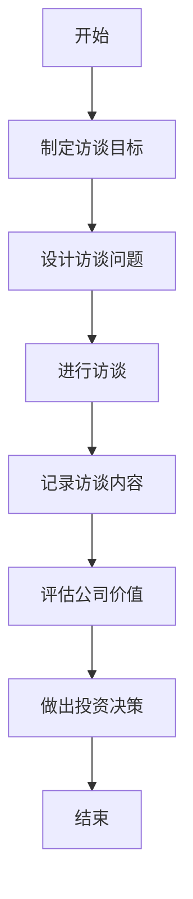

                 


# 费雪的管理层访谈技巧：深入了解公司

## 关键词：费雪，管理层访谈，投资技巧，公司分析，价值投资

## 摘要：本文深入探讨了菲利普·费雪的管理层访谈技巧，分析了其在投资决策中的应用和优势，通过详细讲解访谈的核心概念、算法原理、系统架构及实战案例，为投资者提供了深入理解公司价值的有效方法。

---

# 第一部分: 费雪的管理层访谈技巧概述

## 第1章: 费雪投资理念与管理层访谈的背景

### 1.1 费雪投资理念的核心思想

#### 1.1.1 费雪的价值投资理论概述
菲利普·费雪（Philip Fisher）是价值投资的重要倡导者，他提出了“成长股投资”的理念。他认为，投资的成功不仅仅依赖于对财务数据的分析，更在于对管理层的深入了解。通过与管理层的访谈，投资者可以获取公司内部信息，评估管理层的决策能力、战略规划以及对公司未来发展的信心。

#### 1.1.2 费雪对管理层访谈的重视
费雪认为，管理层的素质和公司的治理结构是决定公司长期价值的关键因素。他通过与公司高管的深入交流，评估公司的发展潜力、市场定位以及竞争优势。这种方法不仅帮助他筛选出优质企业，还为他的投资决策提供了重要的依据。

#### 1.1.3 管理层访谈在投资决策中的作用
管理层访谈能够帮助投资者：
1. **了解公司战略**：通过与CEO、CFO等高管的交流，掌握公司的发展目标、市场拓展计划和产品策略。
2. **评估管理团队**：判断管理层的能力、诚信和责任感，从而预测公司未来的执行力。
3. **发现潜在风险**：通过与管理层的对话，识别公司可能面临的财务风险、市场风险和管理风险。
4. **获取非公开信息**：管理层可能会透露一些未公开的公司信息，这些信息对投资决策具有重要意义。

---

### 1.2 费雪访谈技巧的背景与演变

#### 1.2.1 投资分析方法的历史演变
传统的投资分析方法主要依赖于财务数据的分析，如市盈率、ROE等指标。然而，这种方法忽视了公司管理、市场定位和竞争优势等非财务因素。费雪的管理层访谈技巧弥补了这一不足，为投资分析提供了更全面的视角。

#### 1.2.2 费雪访谈技巧的创新性
费雪的访谈技巧是一种基于经验的分析方法，它通过与管理层的互动，结合定量和定性分析，评估公司的内在价值。这种方法不仅适用于成熟企业，也适用于成长型企业，为投资者提供了更灵活的投资策略。

#### 1.2.3 管理层访谈在现代投资中的应用
随着金融市场的不断发展，管理层访谈已成为机构投资者的重要工具。通过访谈，投资者可以更深入地了解公司的经营状况，评估管理层的决策能力，从而做出更明智的投资决策。

---

### 1.3 费雪访谈技巧的核心要素

#### 1.3.1 访谈的目标
1. 评估公司的发展潜力。
2. 了解管理层的决策能力和战略规划。
3. 发现公司潜在的风险和机会。

#### 1.3.2 访谈的关键点
1. **问题设计**：设计开放性问题，引导管理层分享更多信息。
2. **倾听技巧**：通过倾听和提问，挖掘管理层的真实想法。
3. **判断能力**：评估管理层的诚信、能力和责任感。

#### 1.3.3 访谈的边界与外延
- **边界**：管理层访谈仅用于评估公司内在价值，不适用于技术分析或其他短期市场预测。
- **外延**：可以通过与公司员工、客户和供应商的访谈，进一步验证管理层的信息。

---

## 第2章: 管理层访谈的核心概念与联系

### 2.1 核心概念

#### 2.1.1 管理层访谈的定义与属性
- **定义**：通过与公司高管的交流，获取公司内部信息，评估公司价值。
- **属性**：
  1. 互动性：通过提问和回答获取信息。
  2. 主观性：依赖于访谈者的判断能力。
  3. 综合性：结合定量和定性分析。

#### 2.1.2 费雪访谈技巧的独特性
- **独特性**：
  1. 强调与管理层的深度交流。
  2. 注重对公司内在价值的评估。
  3. 结合定量和定性分析。

#### 2.1.3 管理层访谈与公司价值的关系
- 管理层访谈能够帮助投资者更全面地评估公司价值，发现潜在的投资机会。

---

### 2.2 核心概念的联系与对比

#### 2.2.1 管理层访谈与其他投资分析方法的对比
| 方法         | 焦点                     | 优点                       | 缺点                       |
|--------------|--------------------------|----------------------------|----------------------------|
| 财务分析     | 财务数据                 | 客观、量化                 | 忽略非财务因素             |
| 市场分析     | 行业趋势和市场环境       | 了解市场机会               | 无法预测公司内部风险       |
| 管理层访谈   | 管理层决策和公司战略     | 全面了解公司价值            | 主观性强，依赖访谈技巧       |

#### 2.2.2 费雪访谈技巧与其他投资策略的联系
费雪的访谈技巧可以与基本面分析、技术分析等方法结合使用，形成更全面的投资策略。

#### 2.2.3 管理层访谈在不同行业中的应用差异
- **技术行业**：关注技术创新和研发能力。
- **消费行业**：关注市场需求和品牌影响力。
- **金融行业**：关注风险管理能力和资本运作能力。

---

## 第3章: 费雪访谈技巧的算法原理

### 3.1 访谈评分模型

#### 3.1.1 模型概述
$$
\text{公司价值} = \sum_{i=1}^{n} w_i \cdot s_i
$$
其中，\( w_i \) 是问题 \( i \) 的权重，\( s_i \) 是问题 \( i \) 的评分。

#### 3.1.2 模型实现
1. **确定访谈目标**：明确访谈的目的和重点。
2. **设计访谈问题**：根据公司特点设计开放性问题。
3. **进行访谈**：与管理层进行深入交流，获取信息。
4. **分析访谈结果**：根据评分模型评估公司价值。
5. **得出投资结论**：基于评估结果做出投资决策。

---

### 3.2 算法实现与代码示例

#### 3.2.1 访谈评分模型的Python实现
```python
def fisher_interview_score(questions, answers, weights):
    scores = []
    for i in range(len(questions)):
        question = questions[i]
        answer = answers[i]
        weight = weights[i]
        # 根据回答评分，假设评分范围为1-5
        score = 5 if answer == "优秀" else 3
        scores.append(score)
    total_score = sum(scores[i] * weights[i] for i in range(len(scores)))
    return total_score

# 示例使用
questions = ["公司未来三年的计划是什么？", "公司的竞争优势是什么？"]
answers = ["公司计划在未来三年内扩大市场份额", "公司的竞争优势在于技术创新"]
weights = [0.4, 0.6]

score = fisher_interview_score(questions, answers, weights)
print("公司价值评分：", score)
```

---

### 3.3 算法实现的注意事项

#### 3.3.1 模型的局限性
- 评分模型依赖于主观判断，可能受到访谈者经验的影响。
- 模型无法预测公司外部环境的变化。

#### 3.3.2 模型的优化方向
- 引入更多的指标，如管理层的历史业绩、行业趋势等。
- 结合其他分析方法，如财务分析和技术分析。

---

## 第4章: 管理层访谈的系统分析与架构设计

### 4.1 问题场景介绍

#### 4.1.1 系统功能需求
1. **访谈计划**：制定访谈目标和问题列表。
2. **访谈实施**：与管理层进行深度访谈，记录访谈内容。
3. **数据分析**：根据访谈结果评估公司价值。
4. **投资决策**：基于评估结果做出投资决策。

#### 4.1.2 系统架构设计
- **前端**：用户界面，用于输入访谈目标和问题。
- **后端**：处理访谈数据，计算公司价值评分。
- **数据库**：存储访谈记录和评分数据。

---

### 4.2 系统架构设计

#### 4.2.1 系统功能模块
1. **访谈计划模块**：制定访谈目标和问题。
2. **访谈实施模块**：与管理层进行访谈，记录内容。
3. **数据分析模块**：根据评分模型计算公司价值。
4. **投资决策模块**：基于评估结果做出投资决策。

#### 4.2.2 系统架构图


---

## 第5章: 管理层访谈的项目实战

### 5.1 项目介绍

#### 5.1.1 项目目标
通过与某公司高管的访谈，评估其内在价值，为投资决策提供依据。

#### 5.1.2 项目实施步骤
1. **制定访谈计划**：明确访谈目标和问题。
2. **进行访谈**：与公司高管进行深度交流。
3. **分析访谈结果**：根据评分模型计算公司价值。
4. **做出投资决策**：基于评估结果制定投资策略。

---

### 5.2 项目核心实现

#### 5.2.1 访谈问题设计
- **战略规划**：公司未来三年的发展目标是什么？
- **竞争优势**：公司在行业中的竞争优势是什么？
- **财务状况**：公司最近三年的财务状况如何？

#### 5.2.2 访谈记录与分析
根据访谈内容，记录管理层的回答，并结合评分模型进行评估。

---

### 5.3 项目小结

#### 5.3.1 项目总结
通过与管理层的访谈，投资者可以更全面地评估公司价值，发现潜在的投资机会。

#### 5.3.2 项目经验
- 访谈前需充分准备，明确访谈目标和问题。
- 访谈中需耐心倾听，挖掘管理层的真实想法。
- 访谈后需及时分析，结合定量和定性分析做出投资决策。

---

## 第6章: 费雪访谈技巧的最佳实践

### 6.1 小结

#### 6.1.1 费雪访谈技巧的核心价值
通过与管理层的深入交流，评估公司内在价值，为投资决策提供依据。

#### 6.1.2 费雪访谈技巧的适用场景
适用于成长型企业，尤其是那些具有强大管理层和良好市场前景的公司。

#### 6.1.3 费雪访谈技巧的未来发展
随着金融市场的不断发展，管理层访谈将成为机构投资者的重要工具，尤其是在评估成长型企业时。

---

## 第7章: 注意事项与拓展阅读

### 7.1 注意事项

#### 7.1.1 访谈前的准备
- 明确访谈目标和问题。
- 收集公司背景资料，制定详细的访谈计划。

#### 7.1.2 访谈中的技巧
- 保持耐心，认真倾听。
- 通过提问引导管理层分享更多信息。

#### 7.1.3 访谈后的分析
- 及时记录访谈内容。
- 结合定量和定性分析，评估公司价值。

---

## 第8章: 总结与展望

### 8.1 总结

#### 8.1.1 费雪访谈技巧的核心思想
通过与管理层的深入交流，评估公司内在价值，为投资决策提供依据。

#### 8.1.2 费雪访谈技巧的应用价值
帮助投资者更全面地评估公司价值，发现潜在的投资机会。

---

## 作者：AI天才研究院/AI Genius Institute & 禅与计算机程序设计艺术/Zen And The Art of Computer Programming

