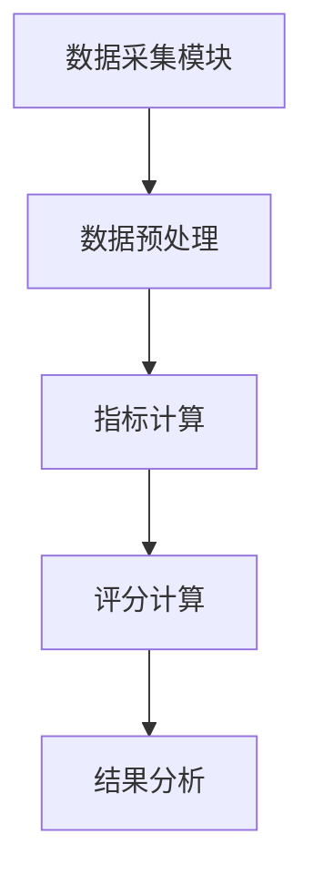
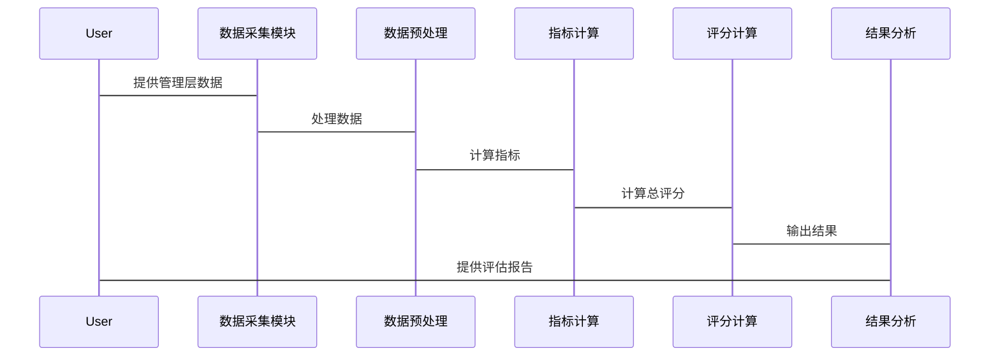

                 


# 费雪的管理层评估：优秀的公司需要优秀的领导

> 关键词：费雪、管理层评估、公司价值、领导力、战略决策

> 摘要：本文探讨了费雪的管理层评估方法，分析了优秀领导对公司价值的影响，通过数学模型和实际案例，展示了如何通过评估管理层来判断公司的潜在价值。

---

# 第一部分：费雪的管理层评估基础

## 第1章：管理层评估的背景与意义

### 1.1 费雪的管理层评估理论概述

#### 1.1.1 费雪的管理层评估理论背景

菲德勒（Philip Fisher）是投资界的重要人物，他提出的管理层评估理论强调，一家公司的成功不仅仅取决于其财务状况，更重要的是其管理层的能力和决策。费雪认为，优秀的管理层能够带领公司克服困难，抓住机遇，从而实现长期的利润增长。

#### 1.1.2 管理层评估的核心概念

管理层评估的核心在于分析管理层的能力、决策质量和战略眼光。通过评估这些因素，投资者可以判断一家公司是否具备持续发展的潜力。

#### 1.1.3 费雪理论的现实意义

在现代商业环境中，管理层的素质直接影响公司的业绩。通过费雪的理论，投资者可以更科学地评估公司的潜在价值，从而做出更明智的投资决策。

### 1.2 优秀公司与优秀领导的关系

#### 1.2.1 优秀公司的定义与特征

优秀公司通常具备清晰的愿景、强大的执行力和持续的创新能力。这些特征与管理层的领导力密切相关。

#### 1.2.2 优秀领导的特质与能力

优秀领导具备以下特质：愿景设定能力、决策能力、激励团队的能力和适应变化的能力。这些特质决定了公司能否在竞争中脱颖而出。

#### 1.2.3 管理层评估与公司价值的关系

管理层评估是连接公司内在价值与市场价值的桥梁。优秀的管理层能够提升公司价值，而低效的管理层可能导致公司价值下降。

### 1.3 费雪理论的适用范围与边界

#### 1.3.1 费雪理论的适用场景

费雪理论适用于长期投资分析，尤其适合那些希望投资于具备长期增长潜力的公司。

#### 1.3.2 理论的局限性与不足

费雪理论主要关注管理层的能力，而忽视了外部市场环境和行业周期的影响。因此，在实际应用中需要结合其他因素进行综合评估。

#### 1.3.3 边界与外延

尽管费雪理论主要用于评估公司管理层，但其核心思想也可以应用于团队管理和其他组织形式。

## 1.4 本章小结

本章介绍了费雪的管理层评估理论，分析了优秀领导与公司价值的关系，并讨论了理论的适用范围和局限性。

---

# 第二部分：费雪理论的核心概念与联系

## 第2章：管理层评估的核心要素

### 2.1 管理层评估的核心要素

#### 2.1.1 领导力

领导力是管理层的核心能力，包括愿景设定、决策和激励团队的能力。

#### 2.1.2 战略决策能力

战略决策能力决定了公司能否抓住市场机会，应对挑战。

#### 2.1.3 执行能力

执行能力是将战略转化为实际成果的关键因素。

### 2.2 费雪理论的核心公式

#### 2.2.1 核心公式解析

费雪的管理层评估公式如下：

$$
\text{公司价值} = \sum_{i=1}^{n} w_i \times f_i
$$

其中，\( w_i \) 是第 \( i \) 个因素的权重，\( f_i \) 是该因素的评估分数。

#### 2.2.2 公式中的关键变量

- 领导力（权重：0.4）
- 战略决策能力（权重：0.3）
- 执行能力（权重：0.3）

#### 2.2.3 公式的应用场景

该公式适用于对公司的整体价值进行评估，尤其适用于长期投资分析。

### 2.3 管理层评估与公司价值的关系

#### 2.3.1 评估指标与公司价值的关联

管理层评估指标与公司价值高度相关，优秀的管理层能够显著提升公司价值。

#### 2.3.2 评估结果对投资者的启示

投资者应关注管理层的能力，选择具备优秀领导团队的公司进行投资。

#### 2.3.3 评估的动态变化

公司管理层的评估结果会随时间和环境变化而调整，投资者需持续关注管理层的表现。

## 2.4 本章小结

本章分析了管理层评估的核心要素，并通过公式展示了评估与公司价值的关系。

---

# 第三部分：管理层评估的算法原理

## 第3章：费雪评分模型的数学模型

### 3.1 费雪评分模型的公式推导

#### 3.1.1 模型的假设条件

- 管理层的三个核心能力：领导力、战略决策能力和执行能力。
- 每个能力的权重已知。

#### 3.1.2 模型的数学推导

$$
\text{总评分} = 0.4 \times L + 0.3 \times S + 0.3 \times E
$$

其中，\( L \) 是领导力评分，\( S \) 是战略决策能力评分，\( E \) 是执行能力评分。

#### 3.1.3 模型的简化与优化

通过权重调整，模型可以适应不同的行业和市场环境。

### 3.2 模型的实现步骤

#### 3.2.1 数据收集与预处理

- 收集管理层的相关信息。
- 标准化数据，确保评分的客观性。

#### 3.2.2 指标权重的确定

- 根据行业特点调整权重。

#### 3.2.3 评分计算与结果分析

- 计算总评分，分析公司的潜在价值。

### 3.3 模型的优缺点分析

#### 3.3.1 模型的优点

- 简单易懂，计算效率高。
- 可结合行业特点进行调整。

#### 3.3.2 模型的缺点

- 忽略了外部环境的影响。
- 评分主观性强，可能影响结果的准确性。

#### 3.3.3 改进建议

- 结合外部环境因素，建立更全面的评估模型。

## 3.4 本章小结

本章详细推导了费雪评分模型的公式，并分析了其优缺点。

---

# 第四部分：系统分析与架构设计

## 第4章：管理层评估系统的架构设计

### 4.1 系统功能需求

#### 4.1.1 数据采集模块

- 收集管理层的相关数据。
- 数据预处理，确保数据的准确性。

#### 4.1.2 指标计算

- 计算领导力、战略决策能力和执行能力的评分。
- 根据公式计算总评分。

### 4.2 系统架构设计



### 4.3 系统接口设计

- 数据接口：接收管理层数据。
- 结果接口：输出评分结果。

### 4.4 系统交互设计



## 4.5 本章小结

本章设计了一个管理层评估系统的架构，并通过图表展示了系统的交互过程。

---

# 第五部分：项目实战与总结

## 第5章：费雪评分模型的实现与应用

### 5.1 项目环境安装

```bash
pip install numpy pandas scikit-learn
```

### 5.2 核心代码实现

```python
import numpy as np
import pandas as pd

def fisher_management_score(leadership, strategy, execution):
    return 0.4 * leadership + 0.3 * strategy + 0.3 * execution

# 示例数据
leadership = 85
strategy = 80
execution = 75

score = fisher_management_score(leadership, strategy, execution)
print(f"总评分：{score}")
```

### 5.3 实际案例分析

以苹果公司为例，假设其管理层的领导力得分为85，战略决策能力得分为80，执行能力得分为75，总评分为：

$$
0.4 \times 85 + 0.3 \times 80 + 0.3 \times 75 = 85.5
$$

高评分表明苹果管理层表现出色，公司具备较高的投资价值。

## 5.4 本章小结

本章通过代码实现费雪评分模型，并通过案例分析展示了其应用。

---

# 第六章：总结与展望

## 6.1 本篇总结

本文详细介绍了费雪的管理层评估方法，通过数学模型和实际案例展示了其应用。管理层的素质直接影响公司价值，投资者应关注管理层的能力和决策质量。

## 6.2 未来研究方向

未来的研究可以结合更多因素，如行业环境和市场趋势，建立更全面的评估模型。

---

作者：AI天才研究院/AI Genius Institute & 禅与计算机程序设计艺术 /Zen And The Art of Computer Programming

