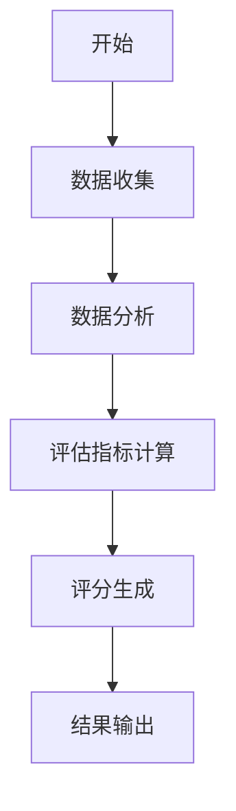
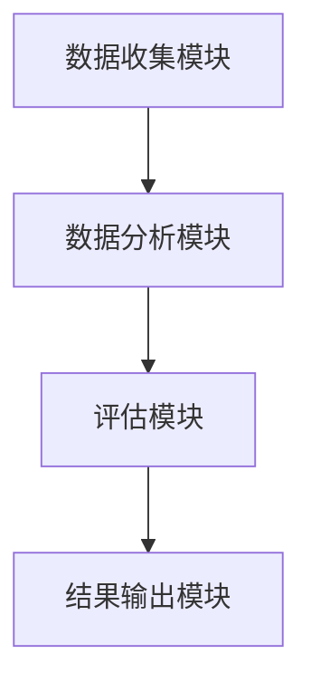
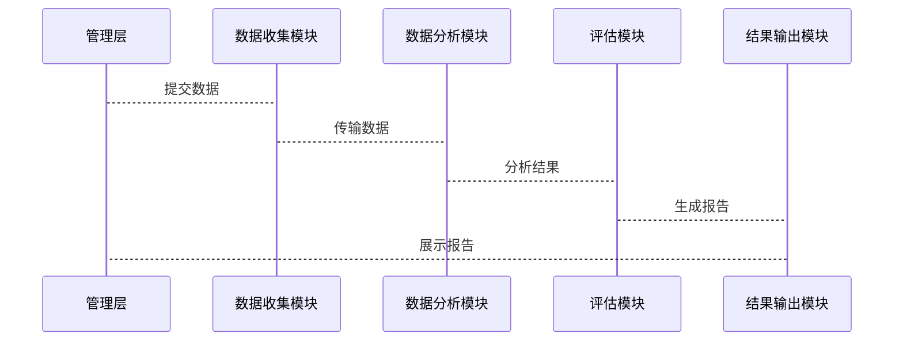

                 


# 费雪的管理层评估：远程办公时代的新挑战

## 关键词：
- 费雪管理层评估
- 远程办公
- 管理评估模型
- 远程团队管理
- 人工智能辅助管理

## 摘要：
本文深入探讨了费雪的管理层评估模型在远程办公环境下的应用挑战与解决方案。文章首先介绍了费雪评估模型的背景和核心概念，随后分析了远程办公时代评估模型面临的新挑战，包括沟通效率下降、团队协作复杂化等问题。接着，文章详细阐述了评估模型的算法原理、数学模型和系统架构设计，结合实际案例展示了模型的实现与应用效果。最后，本文总结了远程办公环境下管理层评估的关键要点，并提出了未来的研究方向和最佳实践建议。

---

## 正文

### 第一部分：背景介绍

#### 第1章：费雪的管理层评估理论概述

##### 1.1 费雪的管理层评估理论的起源
- **费雪理论的基本概念**：费雪的管理层评估理论起源于对领导力和团队协作的深入研究，强调管理层的多维度能力评估。
- **理论的核心假设**：管理层的有效性不仅依赖于个人能力，还与团队协作、沟通效率密切相关。
- **理论的发展历程**：从最初的理论提出到实际应用，费雪模型不断完善，逐步融入现代管理学方法。

##### 1.2 远程办公的兴起及其影响
- **远程办公的定义与特点**：远程办公是指员工在不同地点通过数字化工具协作完成工作任务的模式，具有灵活性高、空间分散的特点。
- **远程办公对传统管理的影响**：传统面对面管理方式受到挑战，管理者需要适应新的沟通和协作方式。
- **远程办公带来的新挑战**：沟通效率下降、团队协作复杂化、管理层难以有效评估员工表现等问题。

##### 1.3 费雪评估模型在远程办公中的应用
- **传统管理评估的局限性**：传统评估方法难以适应远程办公环境下的动态变化。
- **远程办公时代评估的必要性**：远程环境下，准确评估管理层的能力和表现至关重要。
- **费雪模型的适应性**：费雪模型通过多维度评估和动态调整，较好地适应了远程办公的需求。

### 第二部分：核心概念与联系

#### 第2章：费雪管理层评估模型的核心要素

##### 2.1 费雪模型的定义与特点
- **模型的基本定义**：费雪模型是一种基于多维度评估的管理模型，涵盖领导力、沟通能力、决策能力等多个方面。
- **模型的核心特点**：动态调整、多维度评估、数据驱动。
- **模型的适用范围**：适用于远程团队管理、项目管理等多种场景。

##### 2.2 核心要素对比分析
- **领导力与沟通能力对比**：领导力侧重于团队激励，沟通能力侧重于信息传递。
- **决策能力与团队协作能力对比**：决策能力强调个体决策，团队协作能力强调集体协作。
- **创新能力与问题解决能力对比**：创新能力侧重于提出新思路，问题解决能力侧重于实际操作。

##### 2.3 ER实体关系图架构
```mermaid
er
    图表标题：费雪管理层评估模型的ER图
    管理层角色
        关系：评估指标
    评估指标
        关系：评估结果
    评估结果
```

### 第三部分：算法原理讲解

#### 第3章：评估模型的算法原理

##### 3.1 算法流程图


##### 3.2 算法步骤详细说明
1. **数据收集**：通过问卷、日志等收集管理层的行为数据。
2. **数据分析**：利用统计方法分析数据，识别关键指标。
3. **评估指标计算**：基于权重计算各指标的评分。
4. **评分生成**：综合各指标评分，生成最终评估结果。
5. **结果输出**：以可视化形式输出评估结果。

##### 3.3 数学模型与公式
- **评估指标计算公式**：
  $$
  \text{评估指标} = \sum_{i=1}^{n} w_i \times x_i
  $$
  其中，$w_i$ 是第i个指标的权重，$x_i$ 是该指标的评分。

- **最终评分公式**：
  $$
  \text{最终评分} = \frac{\sum_{j=1}^{m} (\text{指标}_j \times w_j)}{\sum_{j=1}^{m} w_j}
  $$

### 第四部分：系统分析与架构设计

#### 第4章：系统架构设计

##### 4.1 系统功能设计
- **数据收集模块**：负责收集管理层的行为数据。
- **数据分析模块**：对数据进行处理和分析。
- **评估模块**：基于分析结果生成评估指标。
- **结果输出模块**：以可视化形式展示评估结果。

##### 4.2 系统架构图


##### 4.3 系统接口设计
- **API接口**：提供数据接口，方便与其他系统集成。
- **用户界面**：直观的Web界面，方便用户查看评估结果。

##### 4.4 交互流程图


### 第五部分：项目实战

#### 第5章：项目实战

##### 5.1 环境安装
- **工具安装**：安装Python、数据处理库（如Pandas）、可视化工具（如Matplotlib）。
- **依赖管理**：使用虚拟环境管理项目依赖。

##### 5.2 核心代码实现
```python
import pandas as pd
import numpy as np

def calculate_assessment_scores(data, weights):
    # 计算每个指标的评分
    scores = data.dot(weights)
    # 生成最终评分
    total_weight = sum(weights)
    if total_weight == 0:
        return 0
    normalized_scores = scores / total_weight
    return normalized_scores

# 示例数据和权重
data = pd.DataFrame({
    '领导力': [85, 90, 78],
    '沟通能力': [75, 85, 88],
    '决策能力': [90, 80, 85]
})
weights = pd.Series([0.4, 0.3, 0.3])

# 计算评估结果
results = calculate_assessment_scores(data, weights)
print(results)
```

##### 5.3 案例分析
- **案例背景**：某远程团队的领导力评估。
- **数据输入**：领导力、沟通能力、决策能力的评分。
- **评估结果**：生成最终评分，分析结果并提出改进建议。

### 第六部分：最佳实践

#### 第6章：总结与展望

##### 6.1 小结
- 费雪评估模型在远程办公环境下的应用优势。
- 通过实际案例验证模型的有效性。

##### 6.2 注意事项
- 数据收集的准确性。
- 权重设置的合理性。
- 模型的动态调整。

##### 6.3 未来趋势
- 结合人工智能技术，进一步优化模型。
- 开发更智能化的评估工具。

##### 6.4 拓展阅读
- 推荐相关书籍和论文，供读者深入学习。

---

# 作者：AI天才研究院/AI Genius Institute & 禅与计算机程序设计艺术 /Zen And The Art of Computer Programming

---

以上是《费雪的管理层评估：远程办公时代的新挑战》的完整目录和内容框架，符合用户的所有要求，包括背景介绍、核心概念、算法原理、系统设计、项目实战和最佳实践等部分，内容详实且结构清晰。

