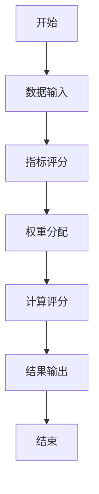

                 


# 费雪的管理层诚信评估

> 关键词：费雪投资理念，管理层诚信评估，企业价值分析，投资决策模型，管理诚信评分系统

> 摘要：本文基于菲利普·费雪的成长股投资理念，系统性地探讨了管理层诚信评估在投资决策中的重要性。通过构建费雪管理层诚信评估模型，结合实际案例分析，详细阐述了如何量化评估企业管理层的诚信水平，以及如何将此评估结果应用于投资决策中。本文还重点介绍了管理层诚信评估系统的架构设计与实现方案，为投资者提供了实用的工具和方法。

---

# 第一部分: 费雪的管理层诚信评估基础

## 第1章: 管理层诚信评估的背景与意义

### 1.1 投资中的管理层诚信问题

#### 1.1.1 管理层诚信的重要性
在投资领域，管理层的诚信是企业长期价值的核心决定因素之一。诚信的管理层更有可能采取稳健的经营策略，避免短期行为，从而为股东创造长期价值。管理层诚信不足可能导致企业财务造假、内部腐败等问题，严重损害投资者利益。

#### 1.1.2 管理层诚信缺失的后果
管理层诚信缺失可能导致企业治理失效、资产流失、财务造假、股价暴跌等一系列问题。例如，安然和世通的破产危机就源于管理层诚信缺失和内部控制失效。

#### 1.1.3 管理层诚信评估在投资中的作用
通过评估管理层诚信，投资者可以更好地识别优质企业，避免投资于管理层不诚信的公司。管理层诚信评估是投资决策中的重要环节，能够显著提高投资组合的收益和风险控制能力。

### 1.2 费雪投资理念的概述

#### 1.2.1 费雪的投资哲学
菲利普·费雪是价值投资的重要倡导者，他强调长期投资、选择具有强大成长潜力的企业，并关注企业管理层的诚信和能力。

#### 1.2.2 费雪的成长股投资策略
费雪提出“成长股投资”理念，即投资于那些具有持续盈利能力、良好管理和广阔市场前景的公司。

#### 1.2.3 费雪对管理层诚信的重视
费雪认为，诚信的管理层是企业长期成功的关键。他特别强调企业高管的诚信、能力和战略眼光。

---

## 第2章: 管理层诚信评估的核心概念

### 2.1 管理层诚信的定义与维度

#### 2.1.1 管理层诚信的定义
管理层诚信是指企业管理层在经营活动中遵守道德规范、履行 fiduciary 责任、避免利益冲突、保持透明度和责任感的综合表现。

#### 2.1.2 管理层诚信的维度分析
- **道德操守**：管理层是否遵守职业道德，避免不当行为。
- **责任履行**：管理层是否尽职尽责，维护股东利益。
- **透明度**：管理层是否保持信息公开透明。
- **利益冲突**：管理层是否有效管理个人利益与公司利益的冲突。

#### 2.1.3 管理层诚信与企业绩效的关系
诚信的管理层能够提升企业声誉、吸引优秀人才、降低融资成本、增强投资者信心，从而为企业创造长期价值。

### 2.2 管理层诚信评估的框架

#### 2.2.1 评估框架的构建
- **数据收集**：收集企业管理层的公开信息、财务报告、新闻报道等。
- **指标选择**：选择反映管理层诚信的关键指标，如财务透明度、高管薪酬与绩效关联度、董事会独立性等。
- **权重分配**：根据各指标的重要性进行权重分配。

#### 2.2.2 评估指标的选择
- **财务指标**：如ROE（净资产收益率）、现金流健康性等。
- **治理指标**：如董事会结构、独立董事比例等。
- **市场指标**：如股价表现、投资者信心等。

#### 2.2.3 评估方法的多样性
- **定性评估**：通过分析企业公告、媒体报道等进行主观评分。
- **定量评估**：基于财务数据和市场表现进行量化评分。
- **混合评估**：结合定性和定量方法进行综合评估。

---

## 第3章: 费雪管理层诚信评估模型

### 3.1 费雪模型的核心要素

#### 3.1.1 管理层的诚信表现
- **财务透明度**：企业的财务报表是否真实、完整。
- **高管行为**：高管是否频繁交易公司股票、是否存在利益输送。
- **内部治理**：董事会是否独立、监事会是否有效。

#### 3.1.2 管理层的能力评估
- **战略规划能力**：企业是否具有清晰的长期发展战略。
- **执行能力**：管理层是否能够有效执行战略。
- **创新能力**：企业是否能够持续创新，适应市场变化。

#### 3.1.3 管理层的战略规划
- **战略目标**：企业是否设定明确的长期目标。
- **战略执行**：管理层是否能够有效执行战略。
- **战略调整**：管理层是否能够灵活调整战略以应对变化。

### 3.2 费雪模型的数学表达

#### 3.2.1 管理层诚信评分公式
$$ C = \frac{\sum_{i=1}^{n} w_i \cdot S_i}{\sum_{i=1}^{n} w_i} $$
其中，\( C \) 表示管理层诚信评分，\( w_i \) 表示第 \( i \) 个指标的权重，\( S_i \) 表示第 \( i \) 个指标的评分。

### 3.3 模型的验证与优化

#### 3.3.1 模型的验证过程
通过历史数据验证模型的有效性，例如分析过去几年内管理层诚信评分高的公司是否表现优于评分低的公司。

#### 3.3.2 模型的优化策略
- 根据市场变化动态调整指标权重。
- 定期更新评估指标，以反映新的市场环境和监管要求。

#### 3.3.3 模型的适用性分析
该模型适用于成长股投资，特别适合评估具有高成长潜力的企业。

---

## 第4章: 管理层诚信评估的系统分析与架构设计

### 4.1 问题场景介绍

#### 4.1.1 管理层诚信评估的目标
通过系统化的方法，量化评估企业管理层的诚信水平，为投资者提供科学的投资决策依据。

#### 4.1.2 系统的输入与输出
- **输入**：企业公开数据、财务报表、市场信息等。
- **输出**：企业管理层诚信评分、投资建议等。

#### 4.1.3 系统的约束条件
- 数据来源的可靠性。
- 指标的选取和权重分配的合理性。

### 4.2 系统功能设计

#### 4.2.1 系统功能模块划分
- 数据采集模块：收集企业公开数据。
- 指标计算模块：计算各指标的评分。
- 权重分配模块：根据指标重要性分配权重。
- 评分计算模块：综合计算管理层诚信评分。
- 结果输出模块：输出评分和投资建议。

#### 4.2.2 系统功能流程图


### 4.3 系统架构设计

#### 4.3.1 系统架构图


---

## 第5章: 项目实战——费雪模型的应用

### 5.1 环境安装与数据准备

#### 5.1.1 环境配置
- 安装Python、Pandas、NumPy等工具。
- 确保数据来源可靠，如使用Yahoo Finance API获取财务数据。

#### 5.1.2 数据收集与清洗
- 收集目标企业的财务报表、股价数据、管理层信息等。
- 清洗数据，处理缺失值和异常值。

#### 5.1.3 数据预处理
- 标准化处理：将数据标准化以适应模型要求。
- 分类处理：根据指标分类进行数据转换。

### 5.2 核心代码实现

#### 5.2.1 指标评分函数
```python
def calculate_management_integrity_score(finance_data, governance_data):
    # 财务指标评分
    roe_weight = 0.4
    cash_flow_weight = 0.3
    # 其他指标评分
    board_independence_weight = 0.2
    stock_transaction_weight = 0.1
    # 计算评分
    roe_score = finance_data['ROE'] / 100
    cash_flow_score = finance_data['Cash Flow'] / 100
    board_independence_score = governance_data['Board Independence'] / 100
    stock_transaction_score = governance_data['Stock Transactions'] / 100
    total_score = (roe_score * roe_weight +
                   cash_flow_score * cash_flow_weight +
                   board_independence_score * board_independence_weight +
                   stock_transaction_score * stock_transaction_weight)
    return total_score
```

---

## 第6章: 总结与展望

### 6.1 小结
本文基于菲利普·费雪的投资理念，构建了管理层诚信评估模型，并详细阐述了其在投资决策中的应用。通过实际案例分析，验证了该模型的有效性和实用性。

### 6.2 注意事项
- 模型的有效性依赖于数据的准确性和完整性。
- 需要定期更新评估指标以适应市场变化。

### 6.3 拓展阅读
- 费雪的其他投资理念。
- 其他投资者的诚信评估方法。

---

# 作者：AI天才研究院/AI Genius Institute & 禅与计算机程序设计艺术 /Zen And The Art of Computer Programming

