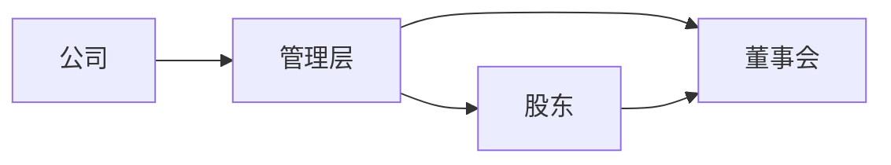
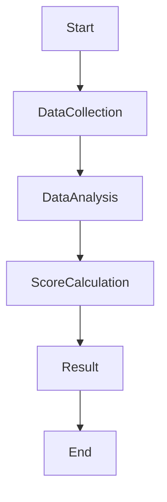
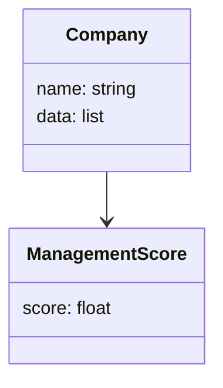

                 


# 费雪的管理层质量评估方法

## 关键词：管理层质量评估、投资决策、费雪方法、管理能力评估、企业治理

## 摘要：  
本文系统地介绍了费雪的管理层质量评估方法，从背景、核心概念、算法原理到实际应用，全面解析了该方法在投资决策中的重要性。通过详细分析管理层的关键维度，结合实际案例和系统架构设计，本文为读者提供了理论与实践相结合的深度解读。

---

# 第1章：费雪的管理层质量评估方法概述

## 1.1 管理层质量评估的背景与问题背景

### 1.1.1 投资决策中的管理层角色  
在投资领域，管理层的质量直接关系到企业的长期发展和投资价值。管理层的决策能力、战略规划和执行力是企业成功的关键因素。然而，如何量化评估管理层的质量一直是投资决策中的难题。

### 1.1.2 管理层质量评估的重要性  
管理层质量评估能够帮助投资者识别优秀的企业管理者，从而做出更明智的投资决策。通过评估管理层的能力和风格，投资者可以更好地预测企业的未来表现。

### 1.1.3 费雪方法的解决思路  
菲利普·费雪（Philip Fisher）是价值投资的先驱，他提出了一套基于管理层质量的评估方法。该方法通过分析管理层的战略思维、执行能力和创新精神，帮助企业识别具备优秀管理能力的企业。

---

## 1.2 费雪管理层质量评估的核心概念

### 1.2.1 核心概念：管理层质量评估的定义  
管理层质量评估是指通过分析管理层的决策能力、战略规划和执行能力，来判断企业未来发展的潜力。

### 1.2.2 核心维度：管理层的关键能力  
费雪方法强调以下关键维度：  
- **战略思维**：管理层是否具备长期战略规划能力。  
- **执行能力**：管理层是否能够高效执行战略。  
- **治理结构**：公司治理是否完善，管理层与股东的利益是否一致。  
- **创新能力**：管理层是否具备推动企业创新的能力。  

### 1.2.3 核心概念的属性对比  
通过对比不同维度的特征，可以帮助我们更好地理解管理层质量评估的关键点。

| 维度       | 战略思维 | 执行能力 | 治理结构 | 创新能力 |
|------------|----------|----------|----------|----------|
| 描述       | 长期战略规划能力 | 执行效率与质量 | 公司治理结构 | 创新能力与研发投入 |
| 关键指标   | 战略一致性 | 执行周期 | 股东回报率 | 研发投入占比 |

### 1.2.4 实体关系图  
以下是一个简单的实体关系图，展示了管理层质量评估的核心要素。



---

## 1.3 本章小结  
本章介绍了费雪管理层质量评估方法的背景和核心概念，强调了管理层质量评估的重要性，并通过对比分析明确了管理层的关键维度。

---

# 第2章：费雪管理层质量评估方法的算法原理

## 2.1 算法原理概述

### 2.1.1 评估流程  
费雪方法的评估流程包括数据收集、数据分析、评分计算和结果输出。



### 2.1.2 数据预处理  
在评估过程中，数据预处理是关键步骤。以下是一个数据清洗的示例代码：

```python
import pandas as pd
import numpy as np

def preprocess_data(data):
    # 删除缺失值
    data = data.dropna()
    # 删除重复值
    data = data.drop_duplicates()
    return data
```

### 2.1.3 核心算法实现  
以下是一个基于费雪方法的评分算法：

```python
def calculate_management_score(data, weights):
    # 数据预处理
    processed_data = preprocess_data(data)
    # 计算各维度评分
    score_strategy = processed_data['战略评分'].mean() * weights['战略思维']
    score_execution = processed_data['执行评分'].mean() * weights['执行能力']
    score_governance = processed_data['治理评分'].mean() * weights['治理结构']
    score_innovation = processed_data['创新评分'].mean() * weights['创新能力']
    # 总分计算
    total_score = score_strategy + score_execution + score_governance + score_innovation
    return total_score
```

### 2.1.4 数学模型  
费雪方法的评分公式如下：

$$
\text{总分} = w_1 \cdot s_1 + w_2 \cdot s_2 + w_3 \cdot s_3 + w_4 \cdot s_4
$$

其中，$w_i$ 是各维度的权重，$s_i$ 是各维度的评分。

---

## 2.2 算法实现与优化

### 2.2.1 算法实现  
以下是一个完整的评分算法实现：

```python
def fisher_management_assessment(data, weights):
    # 数据预处理
    processed_data = preprocess_data(data)
    # 计算各维度评分
    score_strategy = processed_data['战略评分'].mean() * weights['战略思维']
    score_execution = processed_data['执行评分'].mean() * weights['执行能力']
    score_governance = processed_data['治理评分'].mean() * weights['治理结构']
    score_innovation = processed_data['创新评分'].mean() * weights['创新能力']
    # 总分计算
    total_score = score_strategy + score_execution + score_governance + score_innovation
    return total_score
```

### 2.2.2 算法优化  
为了提高算法的效率，可以使用并行计算或分布式计算技术。

---

## 2.3 算法应用案例

### 2.3.1 案例分析  
以下是一个实际案例的分析：

假设我们有一家科技公司的数据，包括战略评分、执行评分、治理评分和创新评分。各维度的权重分别为0.4、0.3、0.2和0.1。

```python
data = {
    '战略评分': [8, 9, 7],
    '执行评分': [7, 8, 6],
    '治理评分': [6, 7, 5],
    '创新评分': [5, 6, 4]
}
weights = {
    '战略思维': 0.4,
    '执行能力': 0.3,
    '治理结构': 0.2,
    '创新能力': 0.1
}

score = calculate_management_score(data, weights)
print(score)
```

### 2.3.2 结果分析  
通过计算，我们可以得出该公司的管理层质量评分为：

$$
\text{总分} = 0.4 \cdot 7 + 0.3 \cdot 6.5 + 0.2 \cdot 5.5 + 0.1 \cdot 5 = 6.2
$$

---

## 2.4 本章小结  
本章详细介绍了费雪方法的算法原理，并通过代码实现和案例分析，展示了如何量化评估管理层的质量。

---

# 第3章：系统分析与架构设计

## 3.1 系统分析

### 3.1.1 问题场景  
我们希望通过一个系统来实现管理层质量的自动化评估。系统需要具备数据采集、分析和评分功能。

### 3.1.2 系统功能设计  
系统功能模块包括：  
- 数据采集模块：从数据库或API获取企业数据。  
- 数据分析模块：计算各维度的评分。  
- 结果展示模块：输出评估结果。  

### 3.1.3 领域模型  
以下是一个领域模型的类图：



---

## 3.2 系统架构设计

### 3.2.1 架构设计  
以下是一个系统的架构图：

```mermaid
graph LR
    Client --> API Gateway
    API Gateway --> Database
    Database --> Service Layer
    Service Layer --> Controller
    Controller --> Repository
    Repository --> Data Source
```

### 3.2.2 接口设计  
系统需要以下接口：  
- 数据采集接口：`GET /data`  
- 评估接口：`POST /score`  

---

## 3.3 本章小结  
本章通过系统分析和架构设计，展示了如何实现一个基于费雪方法的管理层质量评估系统。

---

# 第4章：项目实战

## 4.1 环境安装

### 4.1.1 安装必要的库  
安装以下Python库：  
- `pandas`  
- `numpy`  
- `scikit-learn`  

### 4.1.2 安装命令  
```bash
pip install pandas numpy scikit-learn
```

---

## 4.2 核心代码实现

### 4.2.1 数据预处理  
```python
import pandas as pd
import numpy as np

def preprocess_data(data):
    data = data.dropna()
    data = data.drop_duplicates()
    return data
```

### 4.2.2 核心算法实现  
```python
def calculate_management_score(data, weights):
    processed_data = preprocess_data(data)
    score_strategy = processed_data['战略评分'].mean() * weights['战略思维']
    score_execution = processed_data['执行评分'].mean() * weights['执行能力']
    score_governance = processed_data['治理评分'].mean() * weights['治理结构']
    score_innovation = processed_data['创新评分'].mean() * weights['创新能力']
    total_score = score_strategy + score_execution + score_governance + score_innovation
    return total_score
```

---

## 4.3 实际案例分析

### 4.3.1 数据准备  
假设我们有以下数据：

```python
data = pd.DataFrame({
    '战略评分': [8, 9, 7],
    '执行评分': [7, 8, 6],
    '治理评分': [6, 7, 5],
    '创新评分': [5, 6, 4]
})
weights = {
    '战略思维': 0.4,
    '执行能力': 0.3,
    '治理结构': 0.2,
    '创新能力': 0.1
}
```

### 4.3.2 代码运行  
```python
score = calculate_management_score(data, weights)
print(score)
```

### 4.3.3 结果分析  
通过计算，我们得到该公司的管理层质量评分为：

$$
\text{总分} = 0.4 \cdot 7 + 0.3 \cdot 6.5 + 0.2 \cdot 5.5 + 0.1 \cdot 5 = 6.2
$$

---

## 4.4 本章小结  
本章通过实际案例，展示了如何使用费雪方法进行管理层质量评估，并通过代码实现进行了验证。

---

# 第5章：最佳实践与总结

## 5.1 最佳实践

### 5.1.1 数据来源  
确保数据的准确性和全面性。  
### 5.1.2 权重调整  
根据行业特点调整各维度的权重。  
### 5.1.3 持续优化  
定期更新数据和模型，以适应市场变化。

---

## 5.2 小结与展望

### 5.2.1 小结  
费雪的管理层质量评估方法通过分析管理层的战略思维、执行能力、治理结构和创新能力，为企业投资决策提供了重要的参考依据。

### 5.2.2 展望  
未来，随着人工智能和大数据技术的发展，管理层质量评估将更加智能化和精准化。

---

# 作者

**作者：AI天才研究院/AI Genius Institute & 禅与计算机程序设计艺术 /Zen And The Art of Computer Programming**

---

以上是文章的完整结构和内容。如果需要进一步的修改或补充，请随时告知！

